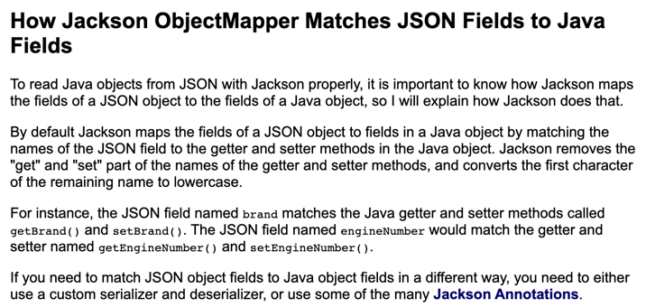

`@RequestParam`, `@RequestBody`, `@ModelAndAttribute` 세가지 annotation은 모두 request의 데이터를 받아오기 위해 사용됩니다.

# @RequestParam

공식 문서를 보면 RequestParam은 다음과 같이 설명합니다.

> For access to the Servlet request parameters(that is, query parameters or form data), including multipart files. Parameter values are converted to the declared method argument type.
>

이를 해석해보면 `RequestParam`은 Query Parameter나 form data 형식의 데이터들을 컨트롤러의 method argument로 변환을 해주는 어노테이션임을 알 수 있다.

해당 어노테이션은 어떻게 사용할까? RequestParam는 아래와 같이 컨트롤러 메서드의 파라미터에 붙여주면 파라미터 이름에 해당하는 Query Parameter의 값을 매핑해준다. 즉, 아래의 예시 코드는 `~/pet?petId=14` 로 요청이 왔을 때 컨트롤러 petId argument에 14라는 값이 매핑되게 된다.

```java
@Controller
@RequestMapping("/pets")
public class EditPetForm {

    // ...

    @GetMapping
    public String setupForm(@RequestParam("petId") int petId, Model model) {
        Pet pet = this.clinic.loadPet(petId);
        model.addAttribute("pet", pet);
        return "petForm";
    }

    // ...
}
```

- RqeustParam은 기본적으로 required의 default값이 true라서 반드시 값이 전송되어야 한다. 만약 해당 값이 없다면 400 error가 발생하기에 필수가 아니도록 설정하려면 required값을 false로 설정하여야 한다.
- defaultValue옵션을 통해 값이 들어오지 않았을 때에 대한 default값도 설정 가능하다.
- argument의 타입을 array나 list로 선언하면 동일한 매개변수 이름에 대한 여러 값들이 저장된다.
- @RequestParam 이 붙은 매개변수에 특정한 이름이 없이 Map<String, String>, MultiValueMap<String, String> 으로 선언이 된다면, 넘어오는 값들로 해당 map이 채워진다.
- @RequestParam은 생략 가능하다.

  공식 문서에는 다음과 같이 나와있다.

  > Note that use of `@RequestParam` is optional (for example, to set its attributes). By default, any argument that is a simple value type (as determined by [BeanUtils#isSimpleProperty](https://docs.spring.io/spring-framework/docs/5.3.19/javadoc-api/org/springframework/beans/BeanUtils.html#isSimpleProperty-java.lang.Class-)) and is not resolved by any other argument resolver, is treated as if it were annotated with `@RequestParam`
  >

  이를 해석해보자면 기본적으로 [BeanUtils#isSimpleProperty](https://docs.spring.io/spring-framework/docs/5.3.19/javadoc-api/org/springframework/beans/BeanUtils.html#isSimpleProperty-java.lang.Class-) 에게 결정되는 단순한 값 유형들은 다른 argument resolver(즉, 다른 api 메서드)에게 해석되지 않으면 해당 파라미터는 `@RequestParam`이 붙은 것처럼 다뤄지게 된다.


## @RequestBody

먼저 RequestBody도 공식 문서를 살펴보면 다음과 같이 설명한다.

> You can use the `@RequestBody`annotation to have the request body read and deserialized into an `Object` through an HttpMessageConverter.
>

이를 해석해보면 어노테이션의 이름대로 request body의 값을 읽어오기 위해 사용되는데 이를 `HttpMessageConverter`를 통해 객체로 역직렬화해주는 것을 알 수 있다.

@RequestBody는 request의 body에 있는 Json(application/json)형태의 데이터를 Java 객체로 변환시켜준다. 아래의 예시 코드와 Http Request를 보도록 하자.

```java
public class SignUpRequestDto {

    private String email;
    private String name;
    private String password;

    public SignUpRequest() {
    }

    public String getEmail() {
        return email;
    }

    public String getName() {
        return name;
    }

    public String getPassword() {
        return password;
    }
}

@RestController
@RequestMapping("/api/members")
public class MemberController {
		@PostMapping
    @ResponseStatus(HttpStatus.CREATED)
    public void signUp(@RequestBody SignUpRequestDto request) {
        memberService.signUp(request.toServiceRequest());
    }
}
```

controller의 @RequestBody가 붙은 객체의 필드와  보면 email, name, password가 있는 것을 볼 수 있다.  여기에 아래의 요청이 간다면 해당 객체의 필드에 값들이 정상적으로 매핑된다

```powershell
Request method:	POST
...
Content-Type=application/json
...
Body:
{
    "email": "rex@wooteco.com",
    "name": "렉스",
    "password": "Rex1!"
}
```

### DTO에는 어떤 메서드, 생성자가 필요하며 어떻게 매핑되는걸까?

RequestBody에 사용되는 DTO에는 기본 생성자와 getter메서드만 존재하여도 올바르게 매핑이 된다. 필드를 할당해주는 생성자나 setter가 없어도 이와 같이 매핑을 할 수 있는 이유는 @RequestBody가 JSON 데이터를 객체로 반환할 때 Spring에 등록되어있는 Jackson라이브러리의 `MappingJackson2HttpMessageConverter`를 사용하여 역직렬화를 하기 때문이다. 해당 메서드는 내부적으로 ObjectMapper를 사용해 생성자를 거치지 않고 Reflection을 이용해 값을 할당하기에 DTO에는 필드를 주입시켜주는 생성자와 setter가 없어도 되는 것이다.

📌 다만 해당 DTO에는 객체를 생성해줄 기본 생성자를 만들어줘야 한다. 그렇지 않을 경우 바인딩에 실패한다.



변수 이름은 위의 문서에 나와있듯이 Jackson라이브러리가 내부적으로 Getter나 Setter, @JsonInclude 등을 통해 필드에 있는 변수들의 이름을 찾아준다.

(getter는?)

### 추가적인 내용

- Body의 값이 필요하기에 Body가 없는 HTTP Get메서드의 경우 RequestBody를 사용하면 에러가 발생한다.
- 내부 값에 대한 검증은 `javax.validation.Valid` 또는 스프링의 `@Validated` 를 통해 할 수 있다.
  - 검증에서 예외가 발생한다면 `MethodArgumentNotValidException` 와 함께 400 BadRequest 응답이 반환된다.
## @ModelAttrubute

- For access to an existing attribute in the model (instantiated if not present) with data binding and validation applied.
- request body에 있는 multipart/form-data 형태의 내용과 HTTP 파라미터의 값들을 생성자나 setter를 통해 1대1로 주입해준다. (변환이 아닌 주입!!!!)
  - 📌 RequestBody와 다르게 **데이터 주입을 위한 생성자와 Setter가 필요하다.**
  - 값을 주입해주는 생성자나 setter함수가 없다면 매핑을 시키지 못하고 null값을 갖게 된다.
  - 인수 이름이 일치하는지에 대한 판단은 JavaBeans `@ConstructorProperties` 나 런타임에 유지되는 매개변수 이름을 통해 결정된다.
  - request body와 http parameter의 값들을 1:1로 바인딩 시켜서 아래와 같이 request body에 일부 데이터를 넣고, parameter로 다른 값을 넣어줘도 값이 올바르게 주입된다.

- 매핑시키는 파라미터의 타입이 객체의 타입과 일치하는지와 같은 다양한 검증이 추가적으로 진행된다.
  - ex) 게시물의 번호를 저장하는 int형 index 변수에 "1번" 이라는 String형을 넣으려고 한다면, BindException이 발생하게 된다.
  - 검증 - 먼저 해당 필드를 인자로 받는 생성자가 있는지 검사 후, 생성자가 있으면 해당 생성자를 이용하고 없다면 setter를 이용해 값을 할당해준다.
- 특정 parameter만을 받아올 수도 있다.
