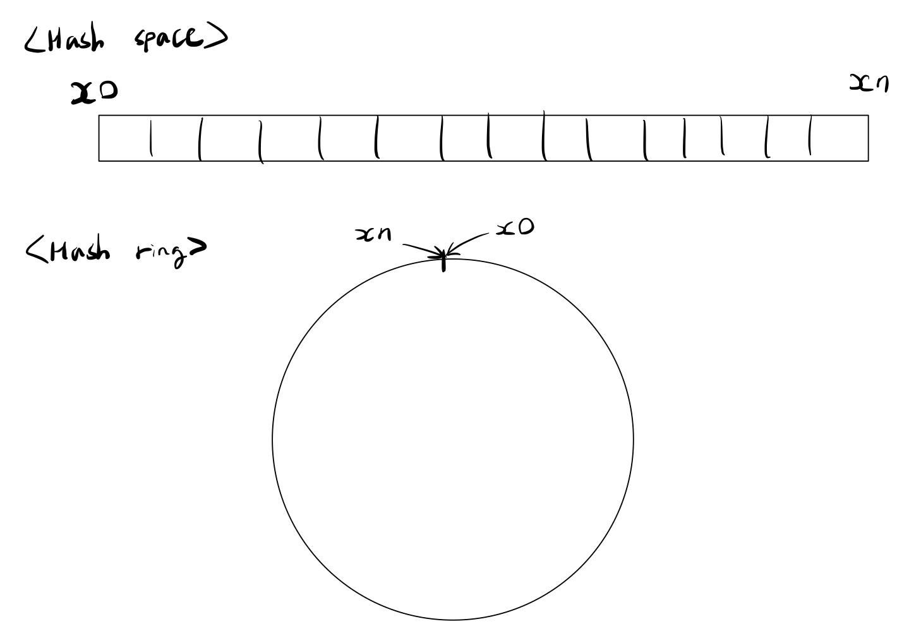
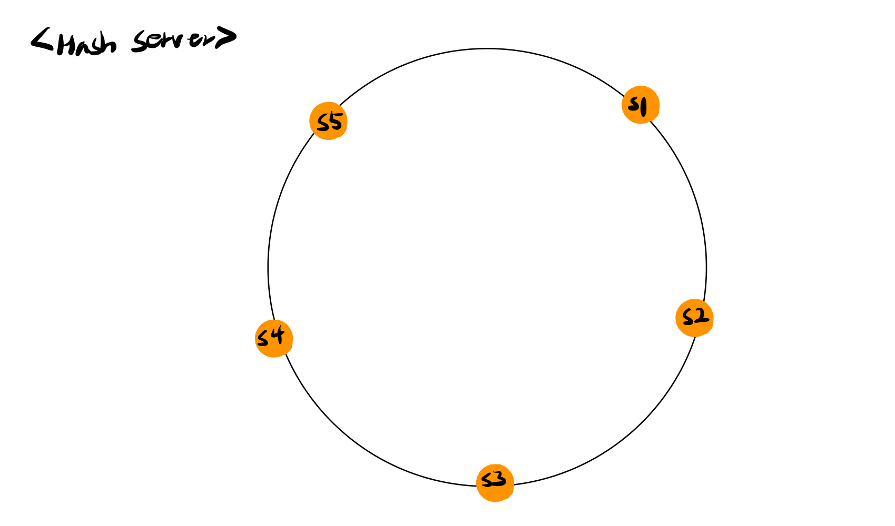
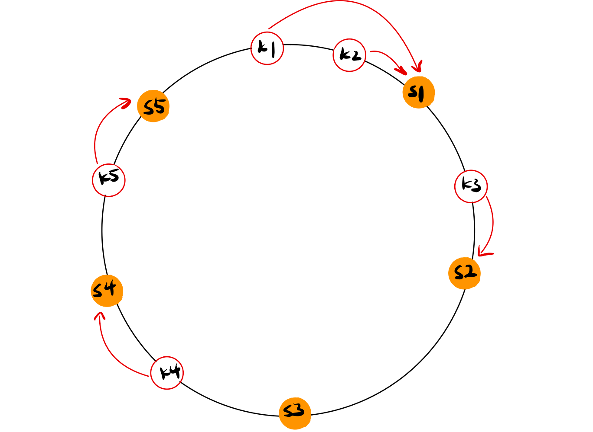
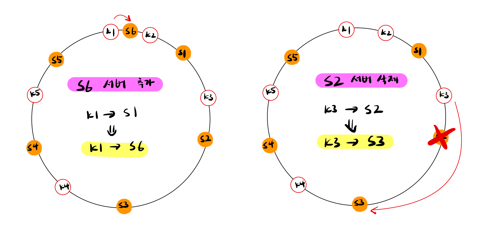

Scale out을 하기 위해서는 요청 또는 데이터를 N개의 서버에 균등하게 나누는 것이 중요하다. 안정해시는 균등한 분배를 달성하기 위해 보편적으로 사용하는 기술이다.

# 해시 키 재배치(refresh) 문제

N개의 서버에 부하를 균등하게 나누는 보편적인 방법은 `serverIndex = hash(key) % 서버의 개수 N` 해시 함수를 사용하는 것이다.

해당 방법은 서버 풀(Server pool)의 크기가 고정되어 있을 때와 데이터 분포가 균등할 때 잘 동작한다. 하지만 서버가 추가되거나 삭제되면 키의 재분배가 필요해진다. 키의 재분배로 기존에 접속하던 서버와 다른 서버에 접속한다는 것은 대규모의 캐시 미스(cache miss)가 발생하게 된다.

# 안정 해시

안정 해시는 키의 재배치 문재를 효과적으로 해결하는 기술이다.

전통적인 해시 테이블은 슬롯의 수가 바뀌면 대부분의 키를 재배치하는 반면에 안정 해시(consistent hash)는 해시 테이블 크기가 조정될 때 평균적으로 오직 k/n개의 키만 재배치하는 해시 기술이다. (k는 키의 개수, n은 슬롯의 개수)

### 해시 공간과 해시 링

해시를 사용하게 된다면 사용하는 해시 함수에 따라 만들어질 수 있는 범위가 만들어진다. 이를 **해시 공간(hash space)** 이라고 한다. 안정해시는 이러한 해시 공간을 원처럼 말아서 Circular Queue와 같은 형태로 링을 만들어 사용한다. 이를 **해시 링(hash ring)** 이라고 한다.

### 해시 서버

해시 서버는 서버들을 해시 함수에 서버의 IP나 이름을 대입해 링 위에 위치시킨 결과를 의미한다.

### 해시 키 & 서버

안정 해시에서 사용하는 해시 함수는 나머지(modular)연산을 사용하지 않으며 키는 링 위에 어느 지점이던지 배치할 수 있다.

키가 저장되는 서버는 키의 위치로부터 시계 방향으로 링을 탐색해서 만나는 첫 번째 서버에 저장되게 된다.

### 서버 추가 및 제거

위와 같이 키가 시계 방향으로 이동하며 만나는 첫번째 서버로 배치되는 구조는 서버의 추가 및 제거가 될 때, 전체가 아닌 일부 키들에만 영향을 주게 된다.

### 기본 구현법의 문제

- 서버와 키를 균등 배포 해시 함수를 사용해 해시 링에 배치한다.
- 키의 위치에서 링을 시계 방향으로 탐색하여 처음 만나는 서버에 키를 저장한다.

안정 해시 알고리즘이 처음 제안된 기본 절차는 위와 같다. 하지만 해당 방법에는 서버가 추가되거나 삭제되는 상황을 고려했을 때 **파티션(partition)의 크기를 균등하게 유지하는게 불가능하다**는 문제가 있다. 자세히 설명하면 초기에 서버를 균등하게 위치시켰다 하더라도 중간에 서버를 추가하거나 삭제를 하면 특정 서버들은 할당받을 수 있는 키의 범위(해시 공간)이 다른 서버들과 비교하였을 때, 작거나 많아질 수 있는 문제가 발생하는 것이다.

또한 **키의 균등 분포를 달성하기가 어렵다**는 문제도 존재한다. `해시 키 & 서버` 에서 보였던 사진만 살펴봐도 S3서버는 어떠한 키도 분배받지 못한 반면에 S1서버는 2개의 키를 저장하고 있는 것을 확인할 수 있다.

### 가상 노드

가상 노드(virtual node)는 기본 구현법의 문제를 해결하기 위해 제안된 방법이다.

가상 노드는 실제 노드 또는 서버를 가리키는 노드로 하나의 서버는 링 위에 여러 개의 가상 노드를 가질 수 있다. 이와 같이 각각의 서버들은 여러 개의 가상 노드를 갖고 각각의 가상 노드가 갖는 여러개의 파티션들을 관리하게 된다.

가상 노드의 개수를 늘리면 늘릴 수록 표준 편차가 작아져서 키의 분포는 점점 더 균등해진다. 하지만 가상 노드 데이터를 저장할 공간이 점점 더 많이 필요해진다는 tradeoff한 문제가 있어 시스템 요구사항에 맞게 적절한 개수를 정해야 한다.

## 안정 해시의 이점

- 서버가 추가되거나 삭제될 때 재배치되는 키의 수가 최소화된다.
- 데이터가 보다 균등하게 분포하게 되어 수평적 규모 확장성을 달성하기 쉽다.
- 핫스팟(Hotspot)키 문제를 줄여준다. 특정한 샤드(shard)에 대한 접근이 지나치게 빈번하면 서버 과부하 문제가 생길 수 있다. 안정 해시는 데이터를 좀 더 균등하게 분배하므로 이런 문제가 생길 가능성을 줄인다.

## 안정 해시를 사용하는 대표적인 예

- 아마존 다이나모 데이터베이스(DynamoDB)ㅋ의 파티셔닝 관련 컴포넌트
- Apach Cassandra 클러스터에서의 데이터 파티셔닝
- Discord 채팅 어플리케이션
- Akamai CDN
- Meglev 네트워크 부하 분산기
