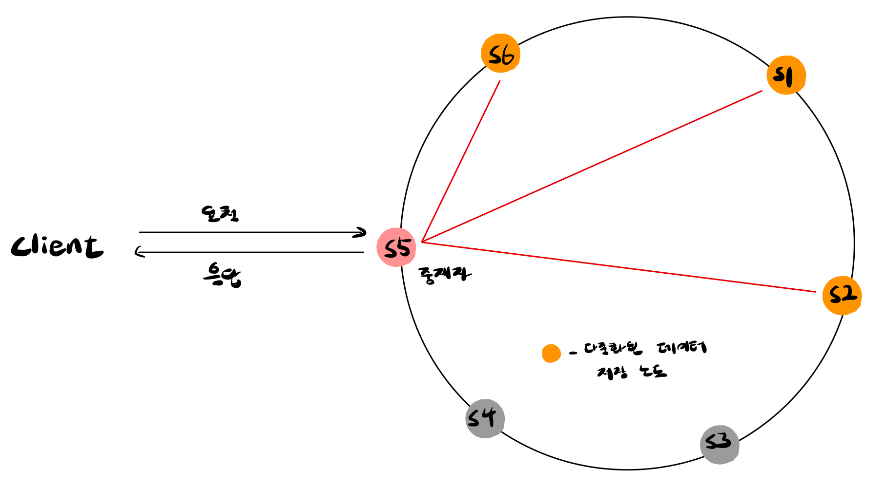

키-값 저장소는 키-값 데이터베이스라고도 불리는 비 관계형 데이터베이스이다.

키-값 저장소에서는 값은 키와 쌍(pair)을 이루고 있으며 키는 고유 식별자여야 한다. 또한 값은 어떤 데이터가 오던지 상관 없다.

대표적으로는 아마존 다이나모, memcached, Redis 같은 것들이 있다.

# 문제 이해 및 설계 범위 확정

> 해당 책에서는 시스템을 설계하기 앞서 요구사항을 정리한다. 아래의 요구사항은 해당 시스템을 만들기 위해 항상 필요한 요구사항이 아닌 예시임을 참고하자.
>
- 키-값 싸으이 크기는 10KB 이하이다.
- 큰 데이터를 저장할 수 있어야 한다.
- 높은 가용성을 제공해야 한다. → 장애가 발생하여도 빨리 응답해야 한다.
- 높은 규모 확장성을 제공해야 한다. → 트래픽 양에 따라 자동적으로 서버의 증설/삭제가 이루어져야 한다.
- 데이터 일관성 수준은 조정이 가능해야 한다.
- 응답 지연시간이 짧아야 한다.

# 단일 서버 키-값 저장소

가장 쉬운 설계 방법이며 빠른 속도를 보장한다. 하지만 모든 데이터를 메모리안에 두는 것이 불가능할 수도 있다는 단점을 갖고 있다.

메모리 부족의 문제의 해결법으로는 **데이터 압축**과 **자주 쓰이는 데이터만 메모리에 올리고 다른 데이터는 디스크에 저장**하는 방법이 있다.

해당 방법을 사용해도 부족하다면 분산 키-값 저장소를 만들어야 한다.

# 분산 키-값 저장소

분산 키-값 저장소는 분산 해시 테이블이라고도 불린다. 분산된 저장소에서는 CAP정리에 따라 모든 요구사항을 만족할 수는 없고 상황에 따라 한 가지 요구사항은 희생하여야 한다.

> **CAP 정리**
>
>
> CAP 정리는 아래의 3가지 요구사항을 동시에 만드는 분산 시스템을 설계하는 것은 불가능하다는 정리이다.
>
> - **Consistency(일관성)** : 클라이언트는 어떤 노드에 접속하던간에 같은 데이터를 받아야 한다.
> - **Availability(가용성)** : 일부 노드에 장애가 발생하더라도 클라이언트는 항상 응답을 받을 수 있어야 한다.
> - **Partition Tolerance(파티션 감내)** : 노드 사이에 통신 장애가 발생한 파티션이 발생하여도 시스템은 계속 동작해야 한다.

# 시스템 컴포넌트

키-값 저장소 구현에는 아래의 핵심 컴포넌트들이 사용된다.

### 데이터 파티션

- 대규모 서비스에서는 전체 데이터를 한 개의 서버에 넣는건 무리가 있어서 작은 파티션으로 나누어 여러 서배에 분할하여 저장한다.
- 데이터를 파티션으로 나눌 때는 데이터를 고르게 분산시키는 점과 노드의 추가, 삭제시 발생하는 데이터 이동 문제를 고려해야하는데 이는 **안정 해시(consistent hash)** 를 통해 해결할 수 있다.

### 데이터 다중화 (Replication)

- 높은 가용성과 안정성을 확보하기 위해서는 데이터를 N개의 서버에 비동기적으로 다중화를 해둬야 한다.
- 서버 선정 방법: 키를 해시 링 위에 배치한 후, 시계방향으로 순회하며 만나는 N개의 물리 서버에 저장한다.

### 일관성 (Consistency)

- 데이터들은 여러 노드에 다중화가 되어 있어 동기화를 하여야 한다. 동기화는 **정족수 합의(Quorum Consensus) 프로토콜**을 사용하면 읽기/쓰기 연산에 모두 일관성을 보장할 수 있다.
- 정족수 합의에서는 응답 지연시간과 데이터 일관성의 타협점을 찾아 W, R, N의 값을 설정하여 진행한다. W와 R은 1보다 클 경우 일관성의 수준은 향상되지만 응답 속도는 줄어들 것이다. 이에 시스템에 맞는 적절한 값을 정하는 것이 좋다. 일반적으로 `W + R > N` 인 경우, 강한 일관성(Strong Consistency)이 보장된다.
- N = 사본의 개수
- W = 쓰기 연산에 대한 정족수로 쓰기 연산이 성공하려면 중재자가 W개 이상의 서버로부터 성공했다는 응답을 받아야 한다.
- R = 읽기 연산에 대한 정족수로 읽기 연산이 성공하려면 중재자가 R개 이상의 서버로부터 응답을 받아야 한다.

### 일관성 불일치 해소 (Inconsistency Resolution)

- 일관성 모델에는 클라이언트가 항상 최신의 결과를 반환받는 **강한 일관성(Strong Consistency)**, 항상 최신의 결과를 반환받지 못할 수 있는 **약한 일관성(Weak Consistency)**, 그리고 약한 일관성의 한 형태로 갱신 결과가 최종적으로는 모든 사본에 동기화되는 것을 보장하는 **최종 일관성(Eventual Consistency)** 모델이 있다.
- 다이나모, 카산드라의 경우 최종 일관성 모델을 채택하고 있다.
- 최종 일관성 모델의 경우 쓰기 연산이 병렬적으로 발생하면 일관성이 꺠질 수 있는데 이는 클라이언트가 해결해야 한다. 해결 방법 중에서는 **데이터 버저닝(Data Versioning)** 와 **벡터 시계(Vector Clock)** 를 통해 해결할 수 있다.
    - 데이터 버저닝 : 데이터를 변경할 때마다 해당 데이터의 새로운 버전을 만드는 것을 의미한다.
    - 벡터 시계 :  [서버, 버전]의 순서쌍을 데이터에 매단 것으로 어떤 버전이 선행 버전인지 후행버전인지, 그리고 버전의 충돌이 있는지 판별하는데 사용된다.
        - 문제점 1: 충돌 감지 및 해소 로직이 클라이언트에 들어가야 하여 클라이언트 구현이 복잡해진다.
        - 문제점 2: [서버:버전]의 순서쌍 개수가 굉장히 빨리 늘어난다.

### 장애 처리

- 분산 시스템에서는 특정 노드에 장애가 발생하였을 때, 2개 이상의 서버가 보고해야 장애가 발생했다고 간주한다.
- 장애 감지는 분산형 장애감지 솔루션인 **가십 프로토콜(gossip protocol)** 을 사용하는 것이 효율적이다.
    - 각 노드는 멤버 ID와 Heartbeat counter쌍을 가진 멤버십 목록을 유지한다.
    - 각 노드는 주기적으로 자신의 박동 카운터를 증가시키고 무작위로 선정된 노드들에게 주기적으로 자신의 박동 카운터 목록을 보낸다.
    - 박동 카운터 목록을 받은 노드는 멤버십 목록으 최신 값으로 갱신한다.
    - 하지만 어떤 멤버의 박동 카운터 값이 지정된 시간 동안 갱신되지 않았다면 해당 멤버는 장애인 것으로 판단한다.
- 장애 처리는 일시적 장애 처리와 영구적 장애 처리가 존재한다.
    - 일시적 장애 처리 - **느슨한 정족수(Sloppy quorum)** 프로토콜을 사용하고 **단서 후 임시 위탁(hinted handoff) 기법**에 따라 네트워크나 서버 문제로 장애 상태인 서버로 가는 요청은 다른 서버가 잠시 맡아서 처리를 하게 된다. 그리고 해당 서버가 복구된다면 일괄 반영하여 일관성을 보존하게 된다.
    - 영구 장애 처리 - **반 엔트로피(anti-entropy) 프로토콜**을 구현하여 사본들을 동기화한다. 반 엔트로피 프로토콜은 **Merkle트리(aka.Hash tree)** 를 사용하여 탐색과 전송 데이터의 양을 줄인다.

### 시스템 아키택처 다이어그램

- 클라이언트는 키-값 저장소가 제공하는 get(key), put(key, value) API를 제공한다.
- 중재자는 클라이언트에게 키-값 저장소에 대한 Proxy역할을 하는 노드이다.
- 노드는 안정해시의 해시링에 분포한다.
- 노드를 자동으로 추가 또는 삭제할 수 있도록 시스템은 완전히 분산된다.
- 데이터는 여러 노드에 다중화된다.

### 쓰기 경로

> 카산드라의 예시

1. 쓰기 요청이 Commit log 파일에 기록된다.
2. 데이터가 메모리 캐시에 기록된다.
3. 메모리 캐시가 가득차거나 사전에 정의된 임계치에 도달하면 데이터는 디스크에 있는 SSTable에 기록된다. (SSTable(Sorted-String Table)은 <키, 값>의 순서쌍을 정렬된 리스트 형태로 관리하는 테이블이다.)

### 읽기 경로

데이터를 읽을 때는 어떤 SSTable에 키가 있는지 알아내기 위해 일반적으로 **블룸 필터(Bloom Filter)** 를 흔히 사용한다.

1. 데이터가 메모리에 있는지 검사한다. 없으면 2로 간다.
2. 데이터가 메모리에 없으므로 블룸 필터를 검사한다.
3. 블룸 필터를 통해 어떤 SSTable에 키가 보관되어 있는지 알아낸다.
4. SSTable에서 데이터를 가져온다.
5. 해당 데이터를 클라이언트에게 반환한다.
