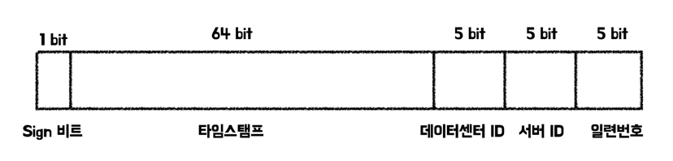

데이터베이스 서버 한 개를 사용할 경우, `auto_increment`를 통한 기본키를 사용하여도 문제가 없다. 하지만 분산 환경에서는 사용하기가 어렵다.

# 문제 이해 및 설계 범위 확정

> 해당 책에서는 시스템을 설계하기 앞서 요구사항을 정리한다. 아래의 요구사항은 해당 시스템을 만들기 위해 항상 필요한 요구사항이 아닌 예시임을 참고하자.
>
- ID는 유일해야 한다.
- ID는 숫자로만 구성되어야 한다.
- ID는 64비트로 표현될 수 있는 값이어야 한다.
- ID는 발급 날짜에 따라 정렬 가능해야 한다.
- 초당 10,000개의 ID를 만들 수 있어야 한다.

# 분산시스템에서 유일성이 보장되는 ID를 만드는 법

## 방법 1 - 다중 마스터 복제

다중 마스터 복제 (Multi-master replication)는 데이터베이스의 `auto_increment`를 활용하는 방법이다. 다만 ID의 값을 구할 때 1만큼 증가시키는 것이 아니라 데이터베이스 서버 수인 K만큼 증가시키며 ID의 중복을 막는다.

하지만 해당 방법은 아래의 단점이 존재한다.

- 여러 데이터 센터에 걸쳐 규모를 늘리기 어렵다.
- ID의 유일성은 보장되지만 시간 흐름에 따라 맞추어 커지도록 보장할 수는 없다.
- 서버를 추가하거나 삭제할 때도 잘 동작하도록 만들기 어렵다.

## 방법 2 - UUID

UUID (Universary Unique Identifier)는 컴퓨터 시스템에 저장되는 정보를 유일하게 식별하기 위한 128비트짜리 수이다. UUID는 중복된 숫자가 발생할 확률이 희박하다.

UUID를 통한 ID 설정은 각각의 웹 서버에서 별도의 ID 생성기를 사용해 독립적으로 만들게 된다. 이에 따른 장단점은 아래와 같다.

**장점**

- 서버 사이의 조율과 동기화 이슈가 없어 단순하다.
- 각 서버별로 ID 생성기를 두어 규모 확장이 쉽다.

**단점**

- ID가 128비트로 길다.
- 시간순으로 정렬할 수 없다.
- 숫자가 아닌 값이 포함될 수 있다.

## 방법 3 - 티켓 서버

티켓 서버 (Ticket Server)는 auto_increment 기능을 갖춘 데이터베이스 티켓 서버를 중앙 집중형으로 하나만 사용하며 요청이 오면 ID를 웹 서버들에게 제공해주는 방법이다. 해당 방법은 중소 규모의 애플리케이션에 적합하다.

장점

- 유일성이 보장되고 오직 숫자로만 구성된 ID를 쉽게 만들 수 있다.
- 구현하기 쉽다.

단점

- 티켓 서버가 SPOF가 된다.
  - SPOF를 해결하기 위해 티켓 서버를 여러대 준비하면 데이터 동기화 문제가 발생하게 된다.

## 방법 4 - 트위터 스노플레이크(twitter snowflake) 접근법

총 64비트의 ID의 구조를 사인 비트, 타임스탬프, 데이터센터 Id, 서버 ID, 일련번호의 구성으로 여러 절로 분할하여 생성한다.

- **사인(Sign) 비트**
  - 1비트를 할당한다.
- **타임스탬프(timestamp)**
  - 41비트를 할당한다.
  - epoch이후로 몇 밀리초가 경과했는지 나타내는 값이다.
  - 타임스템프 덕분에 시간 순으로 정렬이 가능해진다.
- **데이터센터 ID**
  - 5비트를 할당한다. (2^5개의 데이터 센터를 지원할 수 있다.)
- **서버 ID**
  - 5비트를 할당한다. (데이터센터당 2^5개의 서버를 지원할 수 있다.)
- **일련번호**
  - 12비트를 할당한다.
  - 각 서버에서는 ID를 생성할 때마다 일련번호를 1씩 증가하며 1밀리초가 경과할 때마다 0으로 초기화한다.
