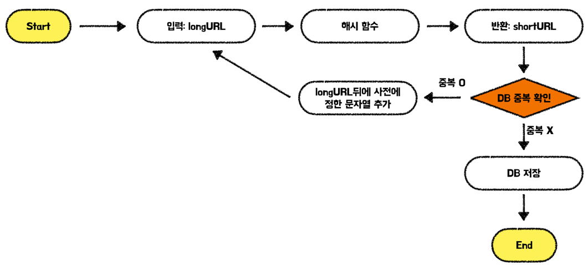

# 문제 이해 및 설계 범위 확정

> 해당 책에서는 시스템을 설계하기 앞서 요구사항을 정리한다. 아래의 요구사항은 해당 시스템을 만들기 위해 항상 필요한 요구사항이 아닌 예시임을 참고하자.
>
- 쓰기 연산: 매일 1억 개의 단축 URL 생성
- 초당 쓰기 연산 : 1억(100million)/24/3600=1160
- 읽기 연산: 읽기 연산과 쓰기 연산의 비율은 10:1이라 가정하면 읽기 연산은 초당 11600회 발생
- URL 단축 서비스를 10년간 운영하였다고 가정하면 1억*365*10=3650억 개의 레코드를 보관
- 축약 전 URL의 평균 길이는 100

→ 10년간 필요한 저장 용량은 3650억*100바이트=36.5TB

# API 엔드 포인트

URL 단축키를 생성하게 된다면 서버는 아래의 두 API를 제공해야하며, 사용자는 해당 API들로 서버와 통신을 한다.

1. URL 단축용 엔드포인트
  - 새 URL을 생성하고자 하는 클라이언트는 해당 엔드포인트에 단축할 URL을 실어서 POST요청을 보낸다.

    ```xml
    POST /api/v1/data/shorten
    인자: {longUrl: longURLString}
    반환: 단축 URL
    ```

2. URL Redirection용 엔드포인트
  - 단축 URL에 대하여 HTTP 요청이 오면 원래 URL로 보내주기 위한 용도의 엔드포인트

    ```xml
    GET /api/v1/shortUrl
    반환: HTTP Redirection 목적지가 될 원본 URL
    ```

  - 원본 URL은 301응답과 함께 location헤더 필드에 주소를 넣어서 반환한다.

> 📌 **Http Status Code 301과 302의 차이**
>
>
> 301과 302는 모두 Redirection에 사용되는 코드이지만 차이가 있다.
>
> - **301 Permanently Moved** : 해당 URL에 대한 HTTP 요청의 처리 책임이 **영구적으로** Location 헤더에 반환된 URL로 이전되었다는 응답이다. 영구적이기에 브라우저는 해당 응답의 Location 데이터를 캐싱하여 다음 요청부터는 캐싱된 URL로 요청을 보낸다.
> - **302 Found** : URL로의 요청이 **일시적으로** Location 헤더에 반환된 URL에 의해 처리되어야 한다는 응답이다.
>
> 만약 서버의 부하를 줄이는 것이 중요하다면 301 응답을 사용하는 것이 좋다. 하지만 트래픽 분석이 중요할 때는 302를 쓰는 것이 클릭 발생률이나 발생 위치를 추적하는데 조금 더 유리하다.
>

# URL 단축

URL Redirection을 구현하는 직관적인 방법은 해시 테이블을 사용하는 것이다. 이때 해시 함수는 아래의 요구사항을 만족해야 한다.

- 입력으로 주어지는 URL이 다른 값이면 해시 값도 달라야 한다.
- 계산된 해시 값은 원래 입력으로 주어졌던 긴 URL로 복원될 수 있어야 한다.

하지만 메모리는 한정적이어서 실세 서비스에서 사용하기에는 적합하지 않아 데이터베이스에 저장하는 것이 좋다.

## 데이터 모델

데이터베이스에 id, shortURL, LongURL 컬럼으로 이루어진 테이블을 만들어 데이터를 저장 및 조회한다.

## 해시 함수

해시 함수에 쓰일 기술로는 **해시 후 충돌 해소 방법**과 **base-62 변환** 법이 있다.

### 해시 함수 1 - 해시 충돌 해소 방법

해시 함수는 CRC32, MD5, SHA-1과 같은 대표적인 함수를 이용해도 된다. 하지만 해당 함수들을 이용하면 만들어진 키의 길이가 매우 길어진다. 만들어진 모든 값을 사용해도 되지만, 시스템 설계를 하다보면 저장해야할 URL의 개수와 디스크 용량의 크기를 고려하면 모든 문자열을 다 사용할 수 없고 특정 자리수만 사용해야 한다.

> 앞서 말한 요구사항을 고려하여 계산해보면 아래와 같다.
>
>
> 해시 값의 각 자리는 [A-Z, a-z, 0-9]의 문자들로 각각 62개의 값이 위치할 수 있다. 따라서 해시 값의 최대 길이는 저장 용량을 통해 고려해봤을 때 `62^n ≥ 3650억` 에서 n의 최솟값인 7이 된다. 즉, 글 초반에 언급한 조건에서의 해시 값의 길이는 7로 하는 것이 적합하다.
>

모든 값이 아닌 해시 값의 특정 Prefix만 사용하면 충돌이 발생할 것이다. 충돌이 발생할 때는 충돌이 해소될 때까지 사전에 정한 문자열을 해시 값에 덧붙이면서 충돌되지 않는 값을 찾으면 된다.



해당 방법은 충돌을 해소할 수 있으나 단축 URL을 생성할 때 DB에 한번 이상 쿼리를 날려야하여 오버헤드가 크다. 이는 DB대신 어떤 집합에 특정 원소가 검사할 수 있도록 하는 **블룸 필터**를 사용하면 성능을 높일 수 있다.

### 해시 함수 2 - base-62 변환

진법 변환(base conversion)은 URL 단축기를 구현할 때 흔히 사용되는 접근법 중 하나이다. 해당 방법은 수의 표현 방식이 다른 두 시스템이 같은 수를 공유해야 하는 경우에 유용하다.

> 62진법을 사용한 이유는 해시 값에 [A-Z, a-z, 0-9]의 문자들로 각각 62개의 값이 위치할 수 있기 때문이다.
>
>
> 0-9는 숫자 0-9로, 10-35는 a-z로, 36-61은 A-Z로 대응시켜 표현하게 된다.
>

### 두 방법 비교

| 해시 후 충돌 해소 전략 | base-62 변환 |
| --- | --- |
| 단축 URL의 길이가 고정됨 | 단축 URL의 길이가 가변적이고 ID의 값이 커지면 같이 길어진다. |
| 유일성이 보장되는 ID 생성기가 필요치 않다 | 유일성이 보장되는 ID 생성기가 필요하다. |
| 충돌이 가능해서 해소 전략이 필요하다. | ID의 유일성이 보장된 후에야 적용 가능한 전략이라 충돌이 아예 불가능하다. |
| ID로부터 단축 URL을 계산하는 방식이 아니라 다음에 쓸 URL을 알아내는 것이 불가능하다. | ID가 1씩 증가하는 값이라 가정하면 다음에 쓸 수 있는 단축 URL이 무엇인지 쉽게 알아낼 수 있어 보안상 문제가 될 수 있다. |

# URL 단축용 엔드포인트 상세 과정

> Base-62를 통해 동작하는 과정입니다.
>
1. 입력으로 긴 URL을 받는다.
2. 데이터베이스에 해당 URL이 있는지 검사한다.
3. 데이터베이스에 있다면 해당 URL에 대한 단축 URL을 만든 적이 있는거라 데이터를 가져와서 Location헤더 필드에 값을 담아서 반환한다.
4. 데이터베이스에 없는 경우, ID 생성기를 통해 데이터베이스의 기본 키로 사용할 새로운 ID를 생성한다. (ID는 Global Unique가 보장되어야 한다.)
5. 62진법 변환을 적용해 ID를 단축 URL로 만든다.
6. {ID, 단축 URL, 원래 URL}의 데이터를 데이터베이스에 저장한다.
7. 단축 URL을 Location 헤더 필드에 담아서 반환한다.

# URL Redirection용 엔드포인트 상세 과정

1. 사용자가 단축 URL을 클릭한다.
2. 로드밸런서가 해당 클릭으로 발생한 요청을 웹서버에 전달한다.
3. 단축 URL에 대한 정보가 캐시에 있을 경우 바로 URL을 반환한다.
4. 캐시에 단축 URL이 없는 경우 데이터베이스에서 조회한다. (데이터베이스에 값이 없다면 단축 URL이 잘못된 것이다.)
5. 데이터베이스에서 조회한 URL을 캐시에 넣은 후 사용자에게 반환한다.
