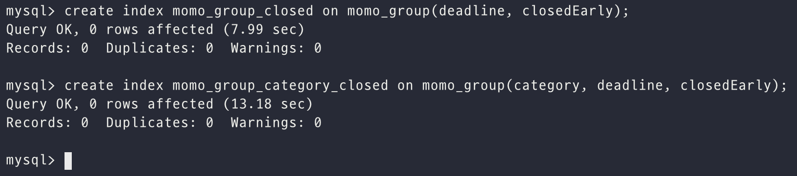
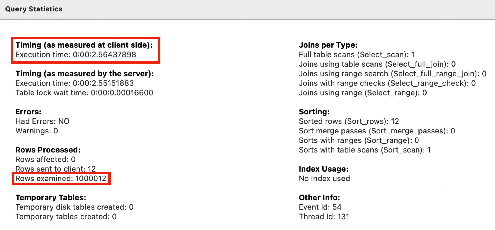
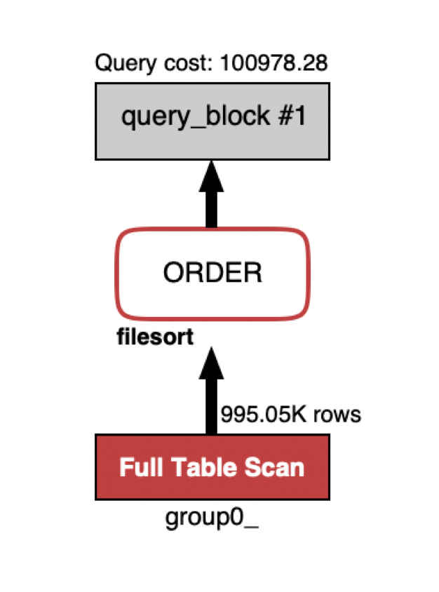
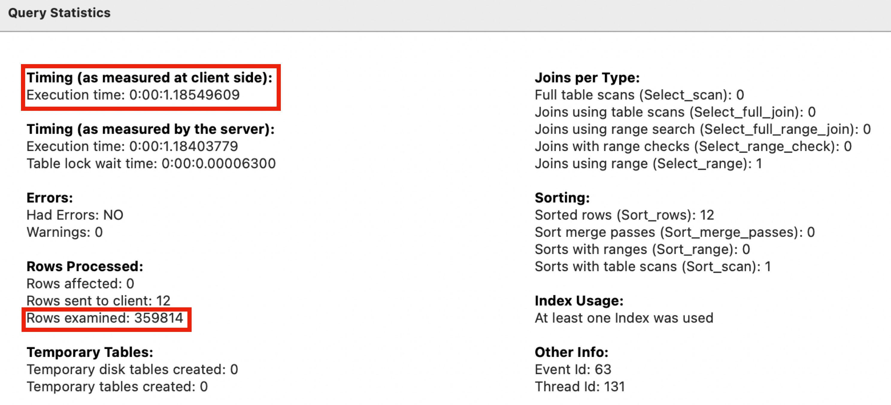
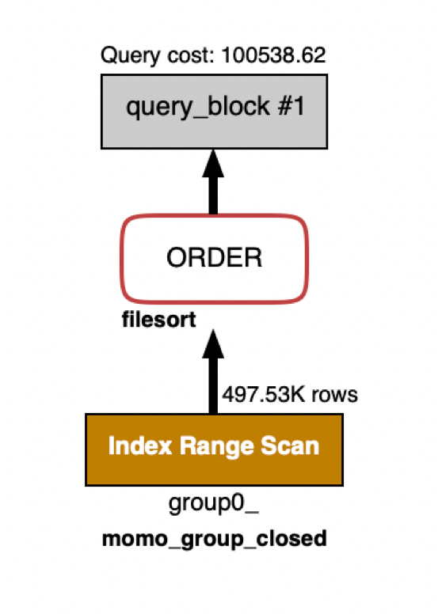
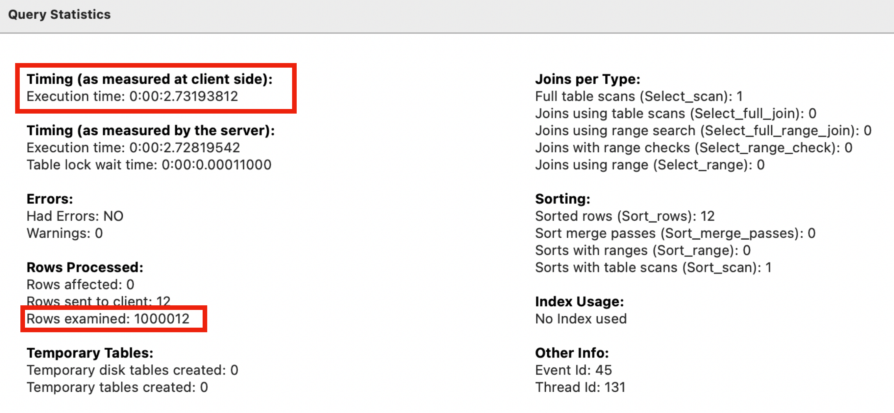
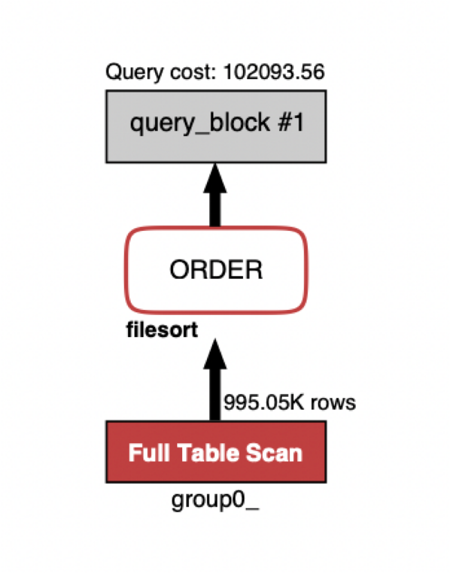
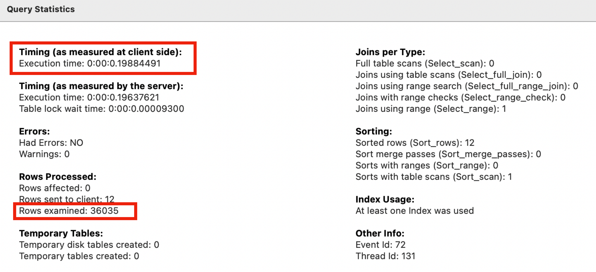
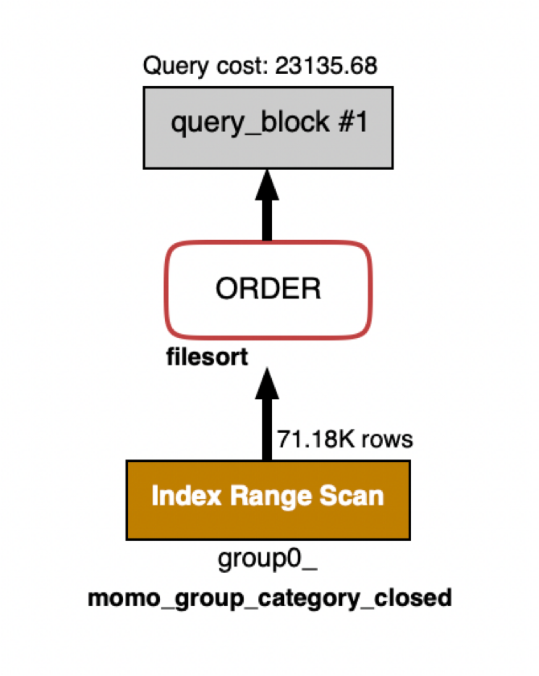

서비스의 조회 성능을 향상시키는 방법으로 애플리케이션의 로직 개선을 통해 데이터베이스에 보내는 쿼리의 양을 줄이고 읽어오는 데이터를 줄이는 방법과 인덱스를 통해 데이터베이스 내에서 조회 성능을 향상시키는 방법이 존재한다. 이번 게시글에서는 데이터베이스의 조회 성능을 향상시키는 인덱스를 적용해보고자 한다.

> 데이터베이스는 MySQL이며 스토리지 엔진으로는 InnoDB를 사용하였다.

> 모모팀의 애플리케이션의 개선작업을 통해 데이터베이스의 부하를 줄이며 서비스 성능을 향상시키는 작업에 대해 알고싶다면 아래의 게시글을 참고해주시기 바랍니다.
>
> [모모팀 서비스 성능 개선기2 (조회 쿼리 개선)](https://seongwon.dev/Spring-MVC/20221014-모모팀-서비스성능-개선기2/)


# 발생하는 쿼리 분석

인덱스를 설정하기 위해 먼저 모모팀의 서비스에서 데이터베이스에 요청하는 쿼리들을 분석해봤다.

그 결과 서비스에 Spring Data JPA를 사용하다보니 많은 요청들이 `findById` 를 통해 조회되거나 객체의 그래프 탐색을 통해 조회되는 것을 확인했다. 해당 쿼리들은 엔티티에 정의된 ID(PK)를 통해 조회되기에 이미 클러스터링 인덱스로 조회되어 별다른 인덱스를 추가할 필요가 없었다.

그 외의 몇 개의 쿼리들을 더 살펴보겠다.

먼저 `MemberRepository`의 `findByUserId`, `findByUserIdAndPassword` 조회 메서드이다. 해당 메서드들은 아래의 쿼리를 살펴보면 알 수 있듯이 where문에 userId를 기반으로 조회되는 것을 확인할 수 있다. userId에 인덱스를 건다면 조회 성능을 향상시킬 수 있을 것이다. 하지만 userId는 회원의 아이디를 뜻하는 필드로 서비스에 중복된 아이디를 가진 유저가 저장될 수 없기에 사전에 유니크 제약조건을 추가했었다. 즉, 이미 유니크 키(UK)를 통한 인덱스가 걸려있어 부가적인 인덱스를 걸지 않아도 된다.

```sql
select
    member0_.id as id1_1_,
    member0_.deleted as deleted2_1_,
    member0_.password as password3_1_,
    member0_.user_id as user_id4_1_,
    member0_.name as name5_1_ 
from
    momo_member member0_ 
where
    member0_.user_id=?
    and member0_.password=?

select
    member0_.id as id1_1_,
    member0_.deleted as deleted2_1_,
    member0_.password as password3_1_,
    member0_.user_id as user_id4_1_,
    member0_.name as name5_1_ 
from
    momo_member member0_ 
where
    member0_.user_id=?
```

다음으로 `TokenRepository`를 살펴보겠다. 해당 레포지토리에서 토큰 데이터를 조회하는 메서드로는 `findByMemberId`가 존재한다. 쿼리는 아래와 같다.

```sql
select
    token0_.id as id1_4_,
    token0_.member_id as member_i3_4_,
    token0_.refreshToken as refresht2_4_ 
from
    momo_token token0_ 
left outer join
    momo_member member1_ 
        on token0_.member_id=member1_.id 
where
    member1_.id=?
```

위의 쿼리도 memberId에 인덱스를 걸면 쿼리의 성능이 향상될 수 있다. 하지만 memberId는 Member테이블과 조인을 하는데 사용되는 외래키(FK, Foreign key)로 앞서 살펴봤던 userId와 같이 이미 인덱스가 형성되어 있기에 추가적인 인덱스 설정을 할 필요가 없다.

다른 대부분의 쿼리를 살펴봐도 위와 같이 PK, FK, UK를 통한 조회를 하게 되어 이미 인덱스가 적용되어 있었다.

그럼 이제 인덱스를 걸어야 할 쿼리들을 살펴보겠다. 모모팀의 서비스는 모임을 마감완료 여부, 카테고리, 키워드 등의 여러 필터링 조건을 걸어 모임 목록을 조회할 수 있다. 해당 조회로 요청되는 쿼리를 살펴보겠다.

```sql
select
    group0_.id as col_0_0_ 
from
    momo_group group0_ 
where
    group0_.category=? 
    and group0_.deadline>? 
    and group0_.closedEarly=? 
    and (
        group0_.name like ? escape '!' 
        or group0_.description like ? escape '!'
    ) 
order by
    group0_.deadline asc,
    group0_.id desc limit ?
```

위의 조회 조건에 있는 조건 중 Keyword를 통한 Like문은 `%{keyword}%`와 같은 형태이기에 인덱스를 걸 수가 없다. 그 외로 조건들을 살펴보면 크게 카테고리와 모임 마감여부의 확인을 위한 조건문으로 분류됨을 확인할 수 있다.

# 인덱스 설정하기

모임 마감 여부는 모임의 마감기한(deadline), 조기마감 여부(closeEarly)를 복합적으로 확인하여야 결과를 도출할 수 있다. 우리는 해당 컬럼들에 복합 인덱스를 걸어 마감 여부를 확인하는 조회 성능을 향상시키려 한다.

또한 카테고리를 통해 조회되는 요청의 성능도 향상시키기 위해 카테고리와 종료유무 로직에 대한 복합 인덱스를 추가하려 한다.

먼저 **종료유무 체크 로직에 대한 index**을 설정하겠다.

모임 종료유무에 대해서는 앞서 이야기하였듯이 마감기한(deadline), 조기마감 여부(closeEarly) 컬럼이 항상 묶여서 where문이 나가기 때문에 묶이는 컬럼에 대한 인덱스를 설정했다.

```sql
create index momo_group_closed on momo_group(deadline, closedEarly);
```

다음으로 **카테고리 + 종료유무 로직에 대한 index**이다.

```sql
create index momo_group_category_closed on momo_group(category, deadline, closedEarly);
```

카테고리를 통한 조회 성능을 향상시키기 위해 category에만 인덱스를 설정하는것 보다는 category + 종료유무 체크 로직을 묶어서 인덱스로 등록하는 것이 `category`, `category + 종료유무 체크` 로직을 인덱스로 사용하기에 적합하기에 종료 유무 체크로직과 복합 인덱스로 설정하였다.



# 인덱스 적용 결과 테스트

인덱스 적용으로 성능 향상이 있었는지 확인하기 위해 데이터베이스에 아래와 같이 데이터들을 추가하였다.

- member 테이블 → 100만
- group 테이블 → 100만
- participate 테이블 → 400만
- 각 group에는 5명의 참가자가 존재한다.
- 조회 로직에서 사용되는 데이터값은 랜덤하게 설정하였다.

이제 결과를 확인해보겠다.

실제 프로덕션에서 조건에 맞는 모임 id리스트를 가져오는 쿼리를 실행해보도록 하겠다.

먼저 종료유무 조건을 조회하는 `momo_group_closed` 인덱스의 결과를 확인해보겠다. 종료된 모임을 필터링하여 모임 목록을 조회하는 쿼리는 아래와 같다.

```sql
select
    group0_.id as col_0_0_ 
from
    momo_group group0_ 
where
    group0_.deadline > NOW() 
    and group0_.closedEarly = 0
order by
    group0_.deadline asc,
    group0_.id desc limit 12
```

인덱스를 추가하지 않은 상태로 쿼리를 실행한 결과 아래와 같이 Full table Scan으로 100만개의 데이터를 탐색하게되며 2.56초의 탐색 시간이 걸리게 되었다.





그럼 인덱스가 추가된 이후는 어떠할까? 인덱스를 추가한 후 실행 결과는 Index Ranged Scan으로 약 36만개의 데이터들만 탐색하며 1.18초의 시간이 걸리게 되었다.





즉, 같은 조건으로 검색을 하였을 때, Full Table Scan이 Index Range Scan으로 변경되어 2.56초에서 1.18초로 탐색시간이 단축되었다.

다음으로 카테고리와 종료유무를 확인하는 `momo_group_category_closed` 인덱스의 결과를 확인해보겠다. 두 조건이 걸려있는 탐색 요청이 왔을 때, 실행되는 쿼리는 아래와 같다.

```sql
select
    group0_.id as col_0_0_ 
from
    momo_group group0_ 
where
    group0_.category = 'CAFE'
    and group0_.deadline > NOW() 
    and group0_.closedEarly = 0
order by
    group0_.deadline asc,
    group0_.id desc limit 12
```

먼저 인덱스가 걸리기 이전의 실행 결과를 살펴보겠다. 앞서 살펴본 결과와 같이 인덱스가 걸리기 전에는 Full Table Scan으로 100만개의 데이터를 모두 탐색하여 2.73초라는 실행시간이 걸렸다.





인덱스를 추가한 경우는 어떠할까?? 인덱스를 추가한 결과를 확인하면 역시나 Index Range Scan으로 조건에 맞는 3만 6천개의 데이터만을 탐색하여 0.19초의 실행시간이 걸리게 되었다.





즉, 2.7초의 실행시간에서 0.19초의 실행시간으로 대폭 줄어들게 되었다.

# 마무리
이번 포스트에서는 모모팀 서비스의 쿼리를 분석하고 조회쿼리의 성능 향상을 위해 인덱스를 걸었다. 대부분의 조회 로직은 PK, FK, UK를 통해 조회되어 인덱스는 모임 목록조회시 사용되는 컬럼들에만 걸게 되었다.

인덱스의 적용 결과는 성공적이었다. 100만개의 모임 데이터를 기준으로 테스트를 진행하였을 때, 마감된 모임을 필터링하여 조회하였을 때는 2.56초에서 1.18초로 탐색시간이 단축되었다. 또한 카테고리와 마감된 모임을 필터링하여 조회하였을 때는 2.7초에서 0.19초로 탐색시간이 대폭 단축되는 성공적인 결과를 얻을 수 있었다.

> 마감된 모임의 경우 탐색시간이 여전히 1.18초로 오랜 탐색시간이 걸린다 생각할 수 있다. 하지만 이는 더미 데이터를 추가할 때, 마감 되지 않은 모임이 전체의 3분의 1 이상이어서 오랜 시간이 걸렸다. 실제 서비스를 장기간 운영하게 된다면 모임 데이터의 배부분은 마감된 모임일 것이기에 실제 탐색 속도는 더욱 줄을 것이라 생각된다.


# 📚 Reference
- Real MySQL 8.0
