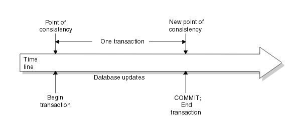
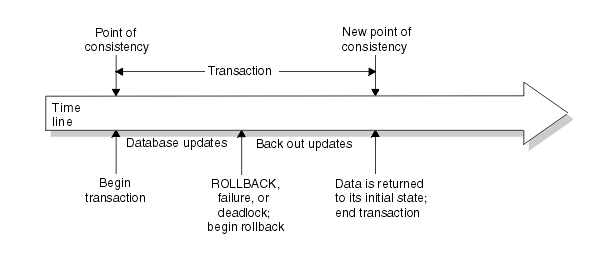

# 트랜잭션이란?
- 트렌잭션이란 데이터베이스의 상태를 변화시키기 위해 수행하는 작업의 단위 또는 한꺼번에 모두 수행되어야 할 일련의 연산들을 뜻한다.
- 트랜잭션은 데이터의 정합성을 보장하기 위해 고안되었으며 데이터베이스 시스템에서 병행제어 및 회복 작업을 할 시 처리되는 작업의 논리적인 단위가 된다.
- DB의 연산은 SQL문으로 표현되므로 트랜잭션을 작업수행에 필요한 SQL문들의 모임으로 봐도 된다.
- 하나의 트랜잭션은 Commit되거나 Rollback된다는 특징이 있다.
- 트랜잭션은 데이터베이스에 장애가 발생하였을 때 복구작업을 수행하거나, 다수의 사용자가 동시에 사용할 수 있도록 제어 작업을 하는데 중요한 단위로 사용된다.

# 트랜젝션의 특징 (ACID)

## Atomicity(원자성)

- **트랜잭션의 연산은 DB에 모두 반영되거나 아예 반영되지 않아야 한다는 성질이다.**
- 즉 트랜잭션 내의 명령을 수행 중에 문제가 발생하지 않는다면 데이터베이스에 모든 수행 연산을 반영(Commit)하며, 만약 하나의 오류라도 발생한다면 트랜잭션 전체가 취소(Rollback)되게 된다.

## Consistency(일관성)

- **트랜잭션이 성공적으로 작업을 수행한 후에도 데이터베이스는 일관성 있는 상태를 유지해야한다.**
- 시스템이 가지고 있는 고정요소는 트랜잭션 수행 전과 후의 상태가 같아야한다.
- ex) 계좌 이체 진행 시 진행전과 후의 돈의 합이 같아야한다.

## Isolation(독립성)

- 둘 이상의 트렌잭션이 동시에 실행되고 있을 경우 **어떤 트랜잭션이라도 다른 트랜잭션의 연산에 끼어들 수 없다.**
- 수행중인 특정 트랜잭션이 완료될 때까지 해당 트랜잭션의 수행 결과를 참조할 수 없다.

## Durability(지속성, 영속성)

- **성공적으로 수행을 마친 트랜잭션의 결과는 시스템이 고장이 나도 영구적으로 반영되어야한다.**

# 트랜젝션의 Commit, RollBack

## Commit

- 트랜잭션이 성공적으로 수행되었음을 선언하는 것이다.
- Commit연산이 실행된 후에야 트랜잭션의 수행 결과가 데이터베이스에 반영되어 데이터베이스가 일관된 상태를 유지한다.

  

## Rollback

- 트랜잭션이 수행을 실패하여 작업 취소를 하는 것이다.
- Rollback은 트랜잭션의 처리가 비정상적으로 종료되어 데이터베이스의 일관성이 깨졌을 때, 해당 트랜잭션 내의 일부 연산들이 정상적으로 수행을 마쳤더라도 트랜잭션의 성질인 Atomicity(원자성)을 지키기 위해 트랜잭션에서 수행했던 모든 연산을 취소(Undo)하는 연산이다.
- Rollback시에는 해당 트랜잭션을 재시작하거나 폐기한다.

  

# 다수의 트랜젝션이 하나의 자원을 경쟁할 때의 문제들

## Dirty Read

- 트랜잭션이 Commit 되지 않은 상황에서 데이터의 접근을 허용할 경우 발생하는 데이터의 불일치이다.
- 트랜잭션 A가 어떤 값을 1에서 2로 변경하고 커밋을 하지 않은 상태에서 B가 같은 레코드를 읽어오는 경우 B는 2를 읽게 된다. 만일 트랜젝션 B가 2를 조회한 후에 A가 롤백된다면 트랜잭션 B는 잘못된 값을 읽게되는 것이 된다.
- 이는 데이터의 정확성에 문제를 일으킨다.

## Non-Repeatable Read

- 한 트랜잭션에서 같은 조회 쿼리를 두 번 실행했을 때 발생할 수 있는 데이터의 불일치이다.
- 트랜잭션 A가 어떤 값 1을 읽어뒀다. 이후에 A는 같은 쿼리를 실행하여 같은 레코드를 다시 읽어오려 하는데 그 사이에 트랜잭션 B가 1을 2로 변경한 후 커밋해버리면 A가 같은 쿼리를 실행하였음에도 다른 결과를 불러오게 된다.
- Dirty Read에 비해서는 발생할 확률이 적다.

## Phantom Read

- 한 트랜잭션에서 **일정 범위**의 레코드를 두번 이상 읽을 때, 첫 번재 쿼리에서 없던 유령 레코드가 두번째 쿼리에서 나타나는 현상을 말한다
- 트랜잭션 A가 어떠한 쿼리를 사용하여 특정 범위의 값들인 [1,2,3,4]를 읽어왔다. 이후 똑같은 쿼리를 실행하려 하는데 트랜잭션 B가 [5,6,7]을 테이블에 추가하면 A가 같은 쿼리를 실행하였음에도 다른 결과(처음에 없던 데이터들이 생김)를 불러오게 된다.

# 📚Reference

- [https://coding-factory.tistory.com/226](https://coding-factory.tistory.com/226)
- [https://mommoo.tistory.com/62](https://mommoo.tistory.com/62)
- [https://brunch.co.kr/@skeks463/27](https://brunch.co.kr/@skeks463/27)
- [https://goddaehee.tistory.com/167](https://goddaehee.tistory.com/167)
- [https://nesoy.github.io/articles/2019-05/Database-Transaction-isolation](https://nesoy.github.io/articles/2019-05/Database-Transaction-isolation)
