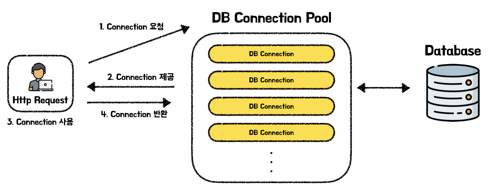
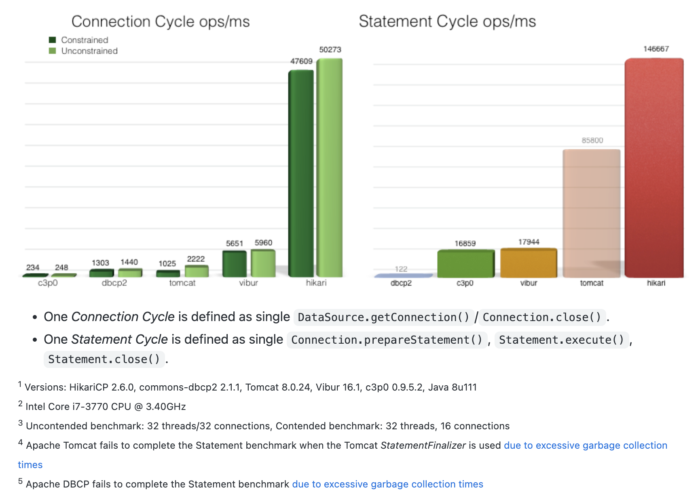
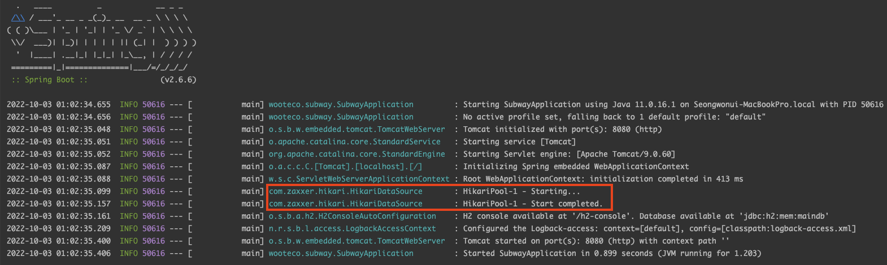
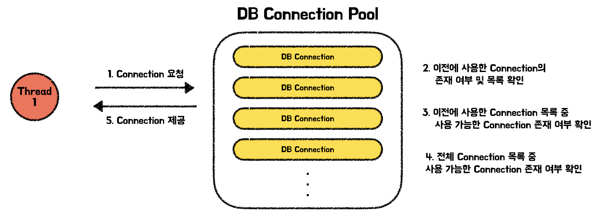
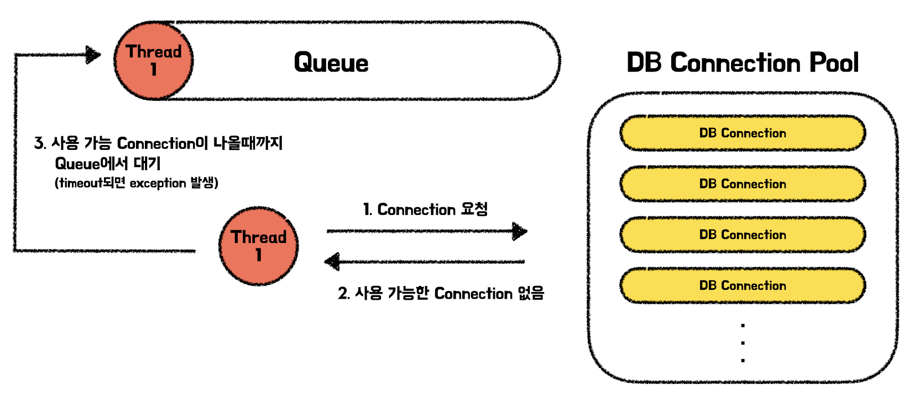
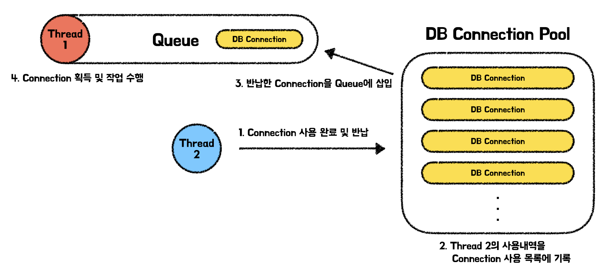

# DB Connection

데이터베이스 커넥션은 DB를 사용하기 위해 DB와 애플리케이션 간 통신을 할 수 있는 수단이다. 우리가 개발을 하는 애플리케이션과 DB는 각기 다른 프로그램이기 때문에 DB 커넥션을 통해 통신을 한다. 이러한 DB 커넥션은 Database Driver와 Database 연결정보를 담은 URL이 필요하다. 자바에서는 JDBC를 제공하고 있어 DB 커넥션을 쉽게 만들 수 있다.

## DB Connection 구조

**2Tier**

- Client ↔  DB Server의 구조로 자바 프로그램이 클라이언트로서 직접 DB 서버에 접근하여 데이터에 접근하는 구조이다. 해당 구조는 트래픽이 많지 않은 경우 자주 사용되는 구조이다.

**3Tier**

- Client ↔  Middleware ↔  DB Server 의 구조로 자바 프로그램과 DB서버 사이에 미들웨어 층을 두고 비느지스 로직 구현부터 트랜잭션 처리, 리소스 관리 등을 전부 맡기는 구조이다. 즉, Client가 갖고 있던 모든 책임을 분산시켜준 것이다. 해당 구조는 2tier 구조보다 무거운 작업을 처리할 때 성능은 좋으나 구조가 더욱 복잡하다.

## DB Connection을 만들 때 관점별로 발생하는 비용

### 네트워크 관점

애플리케이션과 DBMS와의 통신은 TCP/IP 통신으로 이루어진다. 이러한 TCP 통신을 하기 위해서는 DB 측에서는 특정 포트에서 계속 Listen을 하고 있다가 커넥션이 필요할 때마다 연결을 맺는 과정에서 3-way handshaking을 진행하고 연결을 끊는 과정에서 4-way handshaking을 하게 된다. 모든 요청은 실제 물리적인 네트워크 회선을 거쳐 이루어지며 이러한 작업이 반복된다면 매우 비효율적이다.

### DBMS관점

DB Connection을 만들 때 Oracle, MySQL과 같은 DBMS는 매 요청을 처리하기 위해 Process 또는 Thread를 만들게 된다. 특히 Oracle의 경우 연결마다 매번 서버 프로세스를 OS단에서 생성해야하는 등의 많은 오버헤드가 발생하게 된다.

 

이처럼 DB 커넥션을 맺고 커넥션 객체를 생성하는 작업은 많은 부하가 걸리게 된다. 단순히 적은 요청으로 커넥션을 10번, 20번 만드는 일이면 큰 문제가 아니지만, 일반적으로 DB를 사용하는 웹 애플리케이션 같은 경우는 서비스에 따라 초당 수만건 이상의 요청을 처리해야할 수도 있다. 이럴때마다 매번 커넥션을 맺고 객체를 생성하게 된다면 애플리케이션에는 많은 부하가 쌓이게 된다. 이러한 문제를 해결하기 위해 만들어진 것이 바로 DB Connecion Pool이다.

# DB Connection Pool (DBCP)

DB 커넥션 풀은 **DB 커넥션을 여러개 생성하여 풀(Pool)에 저장하였다가 클라이언트의 요청이 올 때 커넥션 객체를 빌려주고 작업이 완료되면 다시 커넥션을 반납하여 풀에 저장하는 프로그래밍 기법**이다. 처음에 일정 개수의 커넥션을 만들어두고 만들어진 커넥션을 계속 재사용하기 때문에 DB커넥션을 맺고 닫는 비용을 줄일 수 있다.

## DBCP의 장점

- DB Connection 객체를 미리 만들어 풀에 등록한 후, 재사용하기 때문에 커넥션의 생성, 삭제와 같은 비용이 큰 작업 없이 빠르게 DB에 접속할 수 있다.
- DB Connection 수를 제한할 수 있어서 과도한 접속으로 인한 서버의 자원 고갈 방지가 가능하다.
- DB 접속 모듈을 공통화하여 DB 서버의 환경이 바뀔 경우 쉬운 유지보수가 가능하다.

 
 

DBCP의 대표적인 프레임워크들은 Tomcat-jdbc-tool, Apache Commom DBCP, Oracle UCP, HikariCP등이 존재한다. 이 중에서 Spring Boot에서 기본적으로 사용될 정도로 가장 많이 사용되고 있는 HikariCP에 대해 자세히 알아보며 DBCP에 대해 더욱 자세히 살펴보겠다.

## HikariCP

HikariCP란 Brett Wooldridge가 2012년에 개발한 JDBC Connection Pool이다. 이는 zero-overhead라고 홍보를 하고 있을 정도로 매우 가볍고, 빠르고 안정적이다. 실제로 JMH 벤치마크를 통해 HirariCP와 다른 Connection Pool들의 성능을 비교한 결과를 살펴보면 HikariCP의 성능이 다른 DBCP와 비교하였을 때 좋은 성능을 보이는 것을 알 수 있다.

> 📌 **JMH Benchmark란?**
>
>
> JMH는 OpenJDK에서 개발한 성능 측정 툴이다. 특정 메소드의 성능을 측정하는 식으로 사용할 수 있고 실제 테스트하기전 워밍업 과정과 실제 측정 과정을 수행하는데 각 과정의 실행 수를 제어할 수 있고, 측정 후 결과로 나오는 시간의 단위를 지정하는 기능도 제공한다.
>
> [https://github.com/melix/jmh-gradle-plugin](https://github.com/melix/jmh-gradle-plugin)
>

### Spring Boot에서의 HikariCP

Spring Boot 2.0부터HikariCP를 기본 데이터 소스로 채택하고 있다. 실제로 Spring Boot애플리케이션을 부팅해보면 HikariPool이 시작되었다는 로그를 확인할 수 있다.

스프링부트는 아래의 순서를 가진 알고리즘을 따라 구현체를 택한다.

1. 성능과 동시성을 위해 HikariCP를 사용할 수 있으면 선택합니다.
2. Tomcat pooling Datasource를 사용할 수 있으면 사용한다.
3. Commons DBCP2를 사용할 수 있는 경우 이를 사용합니다.
4. HikariCP, Tomcat, DBCP2 중 어느 것도 사용할 수 없고 Oracle UCP가 있으면 사용한다.

> `spring-boot-starter-jdbc`, `spring-boot-starter-data-jpa`와 같이 starter의존성을 사용할 경우 자동으로 HikariCP를 사용한다.
>

> 위의 알고리즘을 따르지 않고 특정 connection pool을 사용하려면 `spring.datasource.type` 속성을 통해 설정하면 된다.
>

## DBCP의 동작 원리 (HikariCP)

DBCP는 Thread가 Connection을 요청하면 Connection Pool에서 각자의 Connection 반환 방식에 따라서 현재 사용중이지 않은 Connection을 반환한다. HikariCP의 경우, 아래와 같이 이전에 사용하였던 Connection이 있으면 해당 Connection을 반환하는 것을 우선적으로 진행하고 있다.

만약 Connection을 요청하였을 때, 사용 가능한 Connection이 없을 경우 HandOffQueue에 해당 요청을 넣으며 다른 Thread에서 사용을 마치고 Connection이 반납되기를 기다린다. 만약 Timeout 시간동안 반납된 Connection이 없다면 예외가 던져지게 된다.

다른 Thread로부터 Connection이 반납되면 Connection을 Queue에 넣어 Conneciton을 기다리는 Thread가 Connection을 획득하여 작업을 진행하도록 한다.

## DBCP의 크기

DBCP를 사용할 경우 서비스 이용자 수를 고려하여 Connection Pool의 크기를 정해야 한다. 동시 접속자 수가 많은 애플리케이션의 경우 Connection Pool의 크기가 작으면 사용 가능한 Connection을 기다리는 요청들이 많아질 수 있다. 반대로 Conneciton Pool의 크기가 너무 클 경우 많은 Connection 객체들이 생성되어 많은 메모리를 차지하며 애플리케이션의 성능을 떨어뜨릴 수 있다. 즉, 메모리 사용량과 동시 접속을 처리하는 대기시간은 Trade-off한 관계가 된다. 개발자들은 애플리케이션의 적절한 메모리의 사용과 대기시간을 맞추기 위해 서비스 이용 고객에 맞게 Connection Pool의 크기를 정해야한다.

HikariCP의 공식문서에 의하면 적절한 DBCP의 크기는 ****connections = ((core_count * 2) + effective_spindle_count)****의 개수로 제안하고 있다. 이때 core_count는 CPU 코어 수를 effective_spindle_count는 DB서버가 관리할 수 있는 동시 I/O 요청 수이다.

> core_count에 2를 곱하는 이유는  CPU에서 Context Switching으로 인한 오버헤드를 고려하더라도 데이터베이스에서 Disk I/O(혹은 DRAM이 처리하는 속도)보다 CPU 속도가 월등히 빠르기 때문이다. 그러므로, Thread가 Disk와 같은 작업에서 블로킹되는 시간에 다른 Thread의 작업을 처리할 수 있는 여유가 생기고, 여유 정도에 따라 멀티 스레드 작업을 수행할 수 있게 된다. Hikari CP가 제시한 공식에서는 계수를 2로 선정하여 Thread 개수를 지정하였다.
>

> [About Pool Sizing · brettwooldridge/HikariCP Wiki](https://github.com/brettwooldridge/HikariCP/wiki/About-Pool-Sizing#the-formula)

# 📚 Reference
- [A Simple Guide to Connection Pooling in Java](https://www.baeldung.com/java-connection-pooling)
- [Spring Boot Reference Documentation](https://docs.spring.io/spring-boot/docs/current/reference/htmlsingle/#data.sql.datasource.connection-pool)
- [https://github.com/brettwooldridge/HikariCP](https://github.com/brettwooldridge/HikariCP)
- [[데이터베이스] Connection Pool이란?](https://steady-coding.tistory.com/564)
- [DB Connection Pool을 사용해야하는 이유는?](https://devkly.com/db/db-connection-pool/)
- [데이터베이스 커넥션 풀 (Connection Pool)과 HikariCP](https://hudi.blog/dbcp-and-hikaricp/)
- [2Tier와 3Tier란?](https://mkil.tistory.com/53)
- [2-tier란?](https://jocoma.tistory.com/entry/2-tier-%EC%9B%B9%EC%84%9C%EB%B2%84-DB-%EC%97%B0%EA%B2%B0%EB%90%9C-%ED%98%95%ED%83%9C)
- [HikariCP Dead lock에서 벗어나기 (이론편) | 우아한형제들 기술블로그](https://techblog.woowahan.com/2664/)
