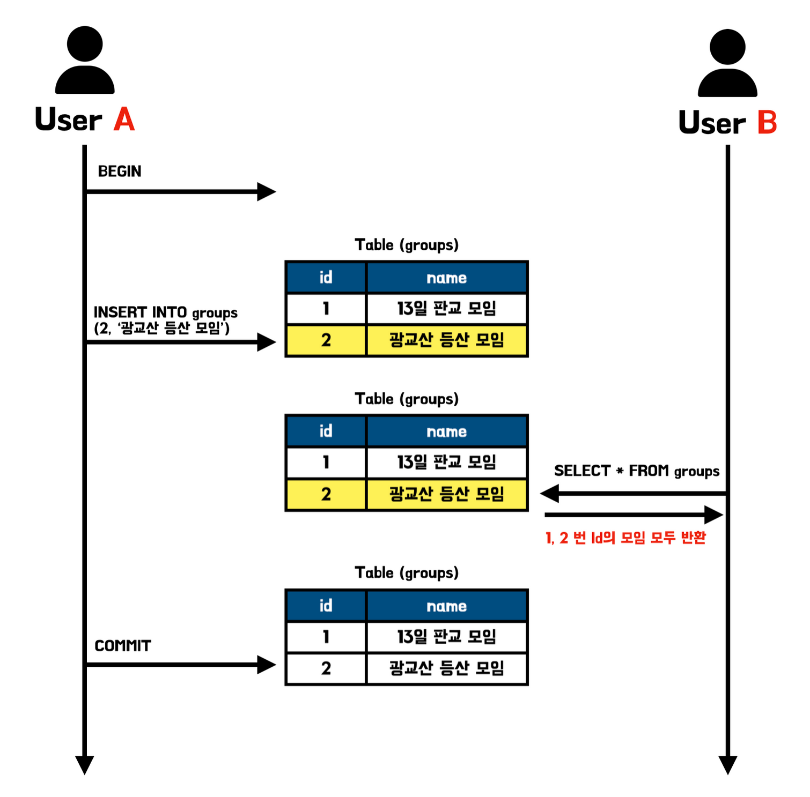
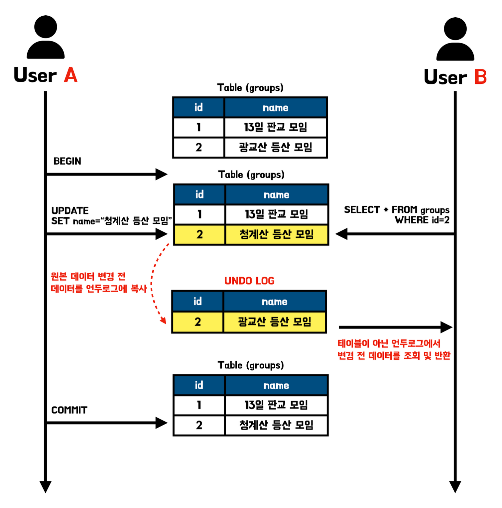
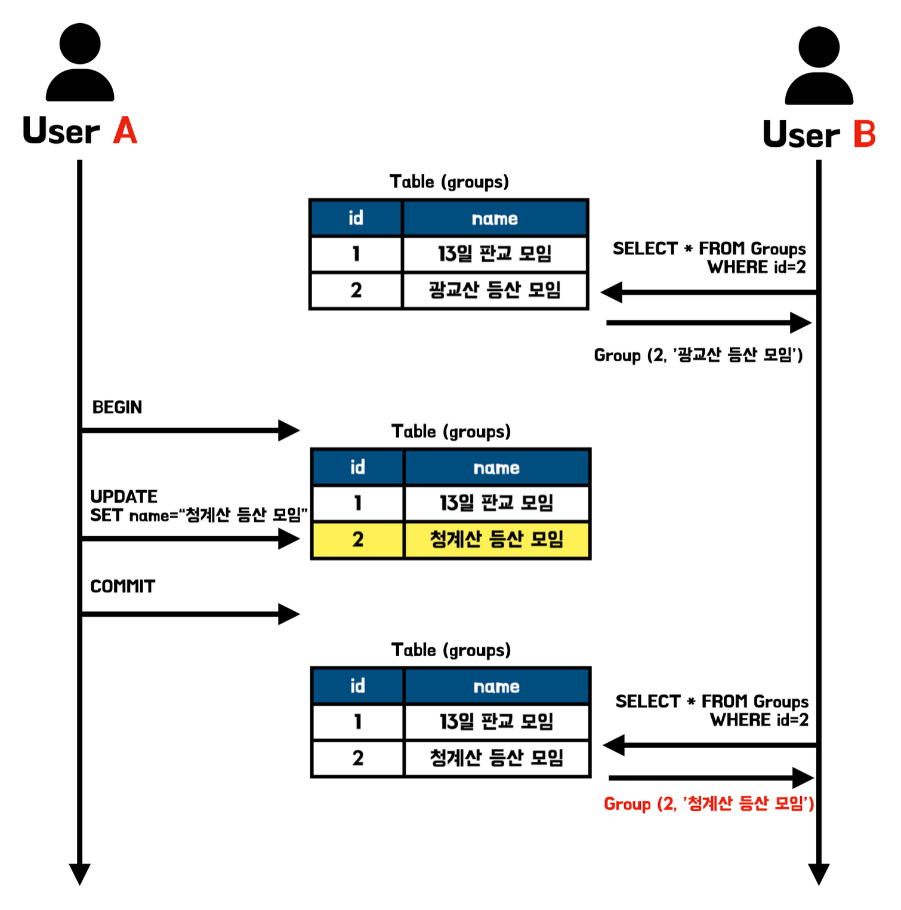
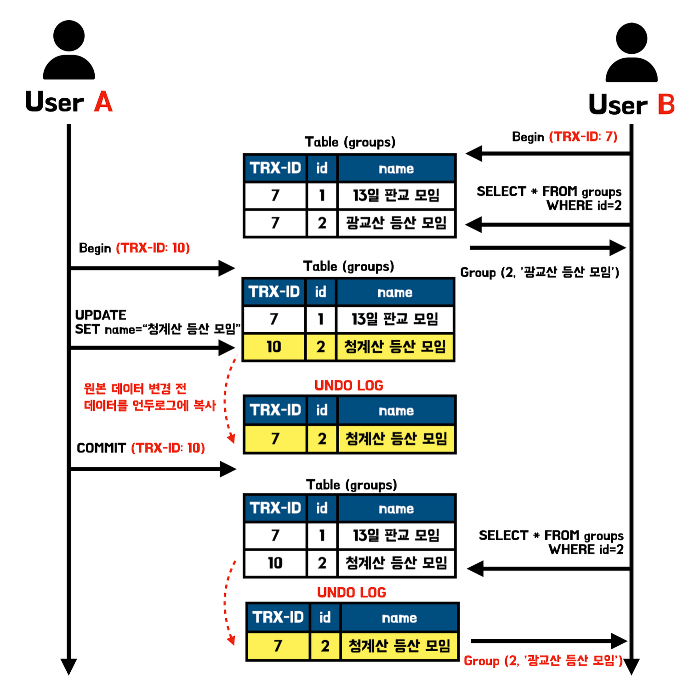
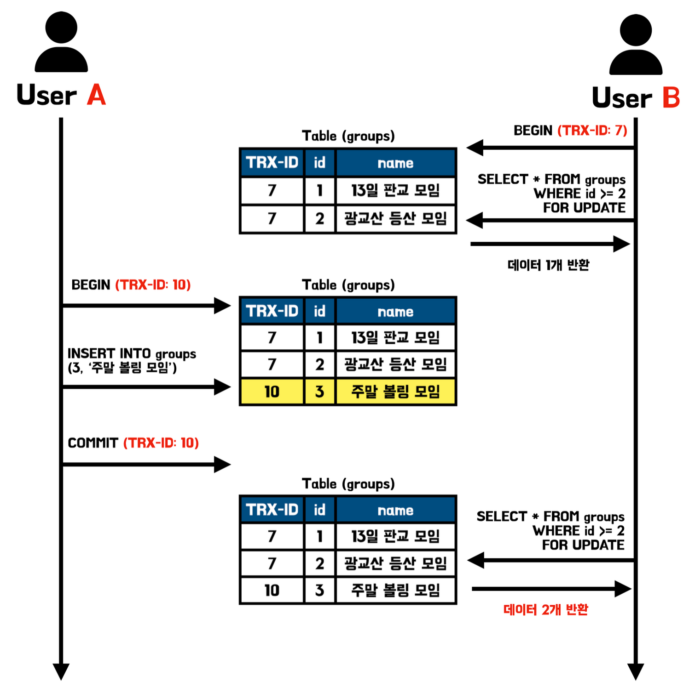

# 트랜잭션의 격리수준이란?

트랜잭션의 격리 수준이란 여러 트랜잭션이 동시에 처리될 때 특정 트랜잭션이 다른 트랜잭션에서 변경하거나 조회하는 데이터를 볼 수 있게 허용할지 말지를 결정하는 것이다. 트랜잭션의 격리 수준은 매우 중요한 개념이다. 격리 수준을 어떻게 설정하느냐에 따라 데이터의 부정합 문제가 발생할 수도 있고 성능이 영향을 줄 수 있다.

격리 수준에는 `READ UNCOMMITTED` (Level0), `READ COMMITTED` (Level1), `REPEATABLE READ` (Level2), `SERIALIZABLE` (Level3)이 존재하며 레벨이 오를수록 트랜잭션간의 격리 수준이 높아져서 처리 성능이 떨어진다. 반대로 격리 수준이 낮아질수록 동시 처리 성능은 향상되지만 각각 새로운 데이터 부정합 문제들이 발생한다.

> 격리 수준이 올라갈수록 처리 성능의 저하는 존재하지만 `SERIALIZABLE` 격리 수준이 아니면 크게 성능 차이가 발생하지는 않는다. 이러한 이유 때문에 `SERIALIZABLE`은 동시성이 중요한 데이터베이스에서는 거의 사용되지 않는다.
>

# 데이터 부정합 문제

앞서 트랜잭션의 격리 수준이 낮아질수록 새로운 데이터 부정합 문제들이 존재한다고 언급하였다. 데이터 부정합 문제는 Dirty Read, Non-Repeatable Read, Phantom Read가 존재하며 각각의 격리 수준별 발생 유무는 아래의 표와 같다.

|  | Dirty Read | Non-Repeatable Read | Phantom Read |
| --- | --- | --- | --- |
| READ UNCOMMITTED | O | O | O |
| READ COMMITTED | X | O | O |
| REPEATALE READ | X | X | O (InnoDB는 X) |
| SERIALIZABLE | X | X | X |

SQL표준에 따르면 REPEATABLE READ 격리수준에서는 Phantom Read가 발생한다고 설명한다. 하지만 MySQL의 스토리지 엔진 중 InnoDB의 경우는 REPEATABLE READ 격리수준에서 Phantom Read가 발생하지 않는다. 그 이유는 뒤에서 살펴보겠다. 그럼 지금부터 각각의 격리 수준과 부정합 문제들을 살펴보겠다.

> 데이터 격리 수준별 DB의 동작 과정은 MySQL을 기준으로 하였기에 다른 DBMS는 동작이 조금 다를 수 있는 점을 알아두자.
>

# Level0. READ UNCOMMITTED

READ UNCOMMITTED격리 수준에서는 트랜잭션의 변경 내용을 Commit, Rollback 여부에 상관없이 다른 트랜잭션이 조회할 수 있다. 해당 격리 수준은 읽기에 대해서 다른 트랜잭션과의 격리가 되지 않은 상태이기 때문에 데이터 부정합 문제로 발생할 수 있는 **Dirty Read, Non-Repeatable Read, Phantom Read가 모두 발생할 수 있다.**

Non-Repeatable Read, Phantom Read는 이후의 격리수준에서 차근차근 알아보도록 하고 READ UNCOMMITTED에서만 발생하는 Dirty Read에 대해 자세히 살펴보겠다.

사용자 A가 데이터를 Insert하고 트랜잭션이 Commit되기 전에 사용자 B는 Insert된 데이터를 볼 수 있다. 이 때 사용자 A의 트랜잭션이 정상적으로 Commit되면 문제가 없지만 만약 오류가 발생하여 Rollback이 발생할 경우, Insert된 데이터는 삭제되게 될 것이다. 하지만 사용자 B의 트랜잭션에서는 이미 Insert된 데이터를 읽어갔고 해당 데이터가 정상적인 데이터라고 생각할 것이다. 이와 같이 Uncommitted 결과를 다른 트랜젝션에서 확인하는 현상을 **Dirty Read라고** 한다.

더티 리드 현상을 발생시키는 READ UNCOMMITTED 격리 수준은 RDMBS 표준에서 트랜잭션의 격리 수준으로 인정하지 않을 정도로 정합성에 문제가 많기에 해당 격리 수준은 이상을 사용할 것을 권장한다. 실제로 Oracle DB에서도 해당 격리수준은 지원하지 않는다.

# Level 1. READ COMMITTED

READ COMMITTED격리수준은 특정 트랜잭션에서 데이터를 변경하였더라도 Commit이 완료된 데이터만 다른 트랜잭션에서 조회할 수 있다. 덕분에 앞서 READ UNCOMMITTED에서 발생하였던 더티 리드가 발생하지 않는다.

해당 격리수준에서는 언두로그를 이용해 특정 트랜잭션에서 데이터를 변경하고 Commit이 되기 전에 다른 트랜잭션에서 해당 데이터를 조회할 때 변경 이전의 데이터를 조회하도록 하고 있다. 데이터의 변경이 발생하면 변경 이전 데이터를 언두(Undo)로그에 복사하고 조회 요청이 오면 언두로그의 데이터를 반환하는 구조로 동작하여 다른 트랜잭션들에게는 변경 이전의 데이터를 보여주는 구조로 동작하고 있다. 아래의 그림을 참조하면 이해가 빠를 것이다.

READ COMMITTED는 언두로그를 활용하여 더티 리드를 해결하였다. 하지만 해당 격리수준은 변경 데이터의 커밋이 되기 이전에는 언두 로그의 데이터를 반환하고 커밋이 된 이후에는 원본 데이터를 반환하는 구조로 동작하기 때문에 여전히 **Non-Repeatable Read, Phantom Read 문제가 존재**한다. Non-Repeatable Read가 무엇인지에 대해서는 아래의 그림을 살펴보겠다.

사용자 B 트랜잭션은 트랜잭션이 시작하고 2번 id를 가진 모임을 조회하는 조회 쿼리를 실행하였을 때 “광교산 등산 모임” 데이터가 조회되었다. 하지만 두번째 조회를 하기 이전에 사용자 A의 트랜잭션에서 해당 모임의 이름을 변경하고 커밋과정까지 모두 이루어져 사용자 B의 두 번째 쿼리에서는 첫 번째와 다른 데이터가 조회되는 상황이 이루어졌다.

즉, 하나의 트랜잭션에서 같은 데이터를 두 번 조회하였을 때 같은 결과를 가져와야 한다는 REPEATABLE READ정합성에 어긋나게 된다. 이러한 데이터 부정합 문제를 **Non Repeatable Read**라고 한다.

> 📌 READ COMMITTED는 Oracle DBMS에서 기본으로 사용하는 격리 수준이며 온라인 서비스에서 가장 많이 사용되는 격리 수준이다.
>

# Level2. REPEATABLE READ

이전 격리 수준인 READ COMMITTED에서는 트랜잭션 내에서 실행되는 Select쿼리와 트랜잭션 없이 실행되는 Select쿼리의 차이가 별로 없다. 그 결과 **Non Repeatable Read**가 발생하기도 하였다. REPEATABLE READ 격리 수준에서는 Select 쿼리도 하나의 트랜잭션 안에서 수행하여 다른 트랜잭션에서 특정 값을 변경하더라도 같은 조회 쿼리에 대해서는 항상 동일한 결과를 반환해준다.

MySQL의 InnoDB는 MVCC(Multi Version Concurrency Control) 방식으로 트랜잭션이 Rollback될 가능성을 대비해 변경 전 데이터들을 언두로그에 백업한 후에 데이터 변경을 진행한다. READ COMMITTED는 이러한 MVCC를 위해 언두 영역에 백업해둔 데이터를 이용해 하나의 트랜잭션에서 발생하는 같은 조회 쿼리에 대해서는 동일한 결과를 보장하고 있다. 즉, **Non Repeatable Read**를 발생시키지 않는 것이다.

> 앞서 READ COMMITTED에서도 언두로그를 사용한다고 언급한 바 있다. READ COMMITTED에서는 **Non Repeatable Read**가 발생하고, REPEATABLE READ에서 발생하지 않는 이유는 두 격리 수준에서 언두 영역을 몇 번째 이전까지 찾아가는지에 대한 차이가 있기 때문이다.
>

그럼 REPEATABLE READ의 동작 과정을 살펴보며 어떻게 Non Repeatable Read가 발생하지 않는지 알아보겠다.

사용자A, B는 각각 ID가 7, 10인 트랜잭션 내에서 동작하고 있다. 사용자 B에서 Select조회를 하였는데 이때 REPEATABLE READ는 자신이 부여받은 트랜잭션 ID보다 더 작은 트랜잭션에서 변경한 데이터만 볼 수 있어서 7번 ID에서 마지막으로 커밋된 결과를 조회하였다. 그 이후에 사용자 A의 트랜잭션인 10번이 시작되고 데이터를 변경 및 커밋하였다. 하지만 사용자 B의 트랜잭션은 본인보다 작은 ID의 트랜잭션만 조회할 수 있기에 10번 트랜잭션에서 변경된 값이 아닌 여전히 7번 트랜잭션의 데이터를 조회하여 Non Repeatable Read가 발생하지 않았다.

하지만 REPEATABLE READ 격리수준에서도 **Phantom read가 발생할 수 있다.** Phantom Read는 한 트랜잭션 안에서 일정 범위의 레코드를 두 번 이상 읽었을 때, 첫번째 쿼리에서 없던 레코드가 두번째 쿼리에서 나타나는 현상이다. 글로만 봤을 때는 이해가 어려우니 아래의 그림을 통해자세히 살펴보겠다.

그림을 살펴보면 사용자 B가 첫번째 `SELECT FOR UPDATE` 쿼리를 날렸을 때는 1개의 데이터를 반환받았다. 하지만 두번째 쿼리를 날리기 전에 사용자 A가 새로운 데이터를 추가하는 동작이 있었고 그 결과 사용자 B에서 `SELECT FOR UPDATE` 쿼리의 결과는 2개의 데이터를 반환받게 되었다. 즉, Phantom Read가 발생한 것이다.

> 🤔 REPEATABLE READ에서 일반적인 `SELECT` 절의 경우 하나의 트랜잭션에서는 같은 결과값을 반환한다고 하였는데 어째서 이러한 일이 발생한 것일까??  `SELECT~ FOR UPDATE` 또는 `SELECT ~ LOCK IN SHARE MODE`로 데이터를 조회하는 경우 SELECT하는 데이터에 쓰기 잠금을 걸어야 하는데 언두 데이터에는 잠금을 걸 수 없다. 그 결과 해당 쿼리들은 언두 영역에서 데이터를 가져오는 것이 아닌 현재 데이터를 가져오게 되어 아래와 같이 하나의 트랜잭션 내에서 기존에 존재하지 않던 새로운 데이터가 조회되는 Phantom Read현상이 발생하게 된다.
>

> 📌 REPEATABLE READ은 MySQL의 InnoDB 스토리지 엔진에서 기본적으로 사용하는 격리 수준이다.
>

> InnoDB는 넥스트 키 락 덕분에 REPEATABLE READ에서도 Phantom Read가 발생하지 않는다.
>

### InnoDB의 REPEATABLE READ에서 Phantom Read가 발생하지 않는 이유

InnoDB 스토리지 엔진에서는 **레코드 락** 뿐만 아니라 레코드와 레코드 사이의 간격을 잡그는 **갭(GAP)락**이 존재한다.

> **레코드(Record) 락**이란?
>
> - 레코드 락이란 레코드 자체만을 잠그는 것을 의미한다. InnoDB 스토리지 엔진은 레코드 자체가 아니라 인덱스의 레코드를 잠그는 방식으로 동작한다.

> **갭(GAP) 락**이란?
>
> - 갭 락은 레코드 자체가 아니라 레코드와 바로 인접한 레코드 사이의 간격을 잠그는 것을 의미한다. 갭 락의 역할은 레코드와 레코드 사이의 간격에 새로운 레코드가 생성되는 것을 제어한다.

이러한 레코드 락과 갭 락을 합쳐 놓은 형태를 넥스트 키 락이라고 한다. 그럼 **넥스트 키 락(Next key lock)**이 어떻게 동작하길래 Phantom Read가 발생하지 않을까?

예시를 들어보면 groups테이블에 PK가 12, 15인 데이터가 있다고 가정해보겠다. 이때 `SELECT * FROM groups WHERE id BETWEEN 10 AND 20 FOR UPDATE` 쿼리가 실행된다면 id가 12, 15인 데이터는 레코드 락이 걸리게 된다. 그리고 10 ≤ id ≤ 11, 13 ≤ id ≤ 14, 16 ≤ id ≤ 20인 id에 대해서는 갭락이 걸리게 된다. 즉, 두 가지 락이 걸려 지정된 범위는 모두 락이 걸리게 된다.

이러한 방식을 통해 InnoDB 스토리지 엔진은 넥스트 키 락을 통해 REPEATABLE READ에서도 Phantom Read가 발생하지 않는다.

# Level 3. SERIALIZABLE

SERIALIZABLE은 한 트랜잭션에서 읽기, 쓰기 등의 모든 데이터들은 다른 트랜잭션이 접근할 수 없게 한다. 모든 동작이 직렬화하게 작동하여 완벽한 읽기 일관성 모드를 제공한다. 데이터에 접근하는 것 만으로도 다른 트랜잭션은 해당 데이터에 접근할 수 없기에 REPEATABLE READ에서 발생하는 Phantom Read는 발생하지 않는다.

해당 격리 수준은 가장 단순하면서 엄격한 격리 수준으로, 한 트랜잭션에서 접근한 데이터는 항상 lock을 걸게 되어 동시 처리 성능이 다른 격리수준보다 떨어지는 편이다. 그래서 데이터의 안정성이 매우 중요한 특수한 상황이 아니면 거의 사용하지 않는 편이다.

# 마치며

오늘은 트랜잭션의 격리 수준에 대해 학습해봤다. 트랜잭션 간의 일관성이 100% 같으면 좋긴 하나 모든 트랜잭션간의 일관성을 맞추려면 하나의 트랜잭션이 DB에 접근할 때 다른 트랜잭션이 접근하지 못하도록 Lock을 걸어둬야 하여 성능상의 손해를 보게 된다.

격리 수준의 경우 데이터의 부정합, 성능의 큰 영향을 주는 설정이기에 상황에 맞는 적절한 격리 수준을 설정하여야 한다.

> 최근 구구와 오리가 데이터베이스 Lock에 대해 이야기하는 것을 들었는데, 구구가 말하길 실무에서는 데이터베이스 Lock은 성능상의 저하를 발생시켜 걸지 않는편이라고 하셨다.
>

# 📚 Reference
- [Real MySQL 8.0 (1권)](https://search.shopping.naver.com/book/catalog/32443973624?cat_id=50010586&frm=PBOKPRO&query=Real+MySQL&NaPm=ct%3Dl9jmw3ww%7Cci%3D919378d99905f247dd892d6e762d6de24fc0090e%7Ctr%3Dboknx%7Csn%3D95694%7Chk%3D947baef41da176108f3c36f2fb35dfd629b8f698)
- [[데이터베이스] MySQL 트랜잭션 격리 수준](https://steady-coding.tistory.com/562)
