# 1. 모두모여라의 기존 인프라

모임 플랫폼인 모두모여라 서비스는 여러 개선작업을 진행하며 아래와 같은 인프라 구조를 형성하게 되었다.

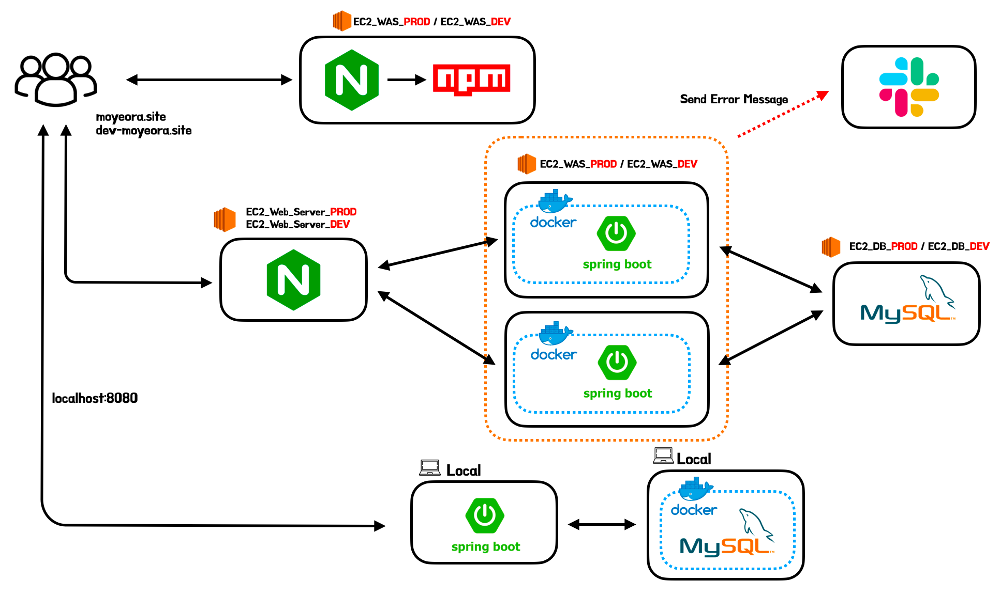

> 과거에는 우아한형제들에서 제공하는 AWS의 EC2를 활용하여 인스턴스를 구축하였으나, 우테코를 수료함과 동시에 인스턴스의 제공이 끊겨 현재는 AWS 프리티어로 최소한의 서버만을 운영하고 있다. 이후 진행할 테스트는 AWS에 배포된 서비스와는 무관하게 GCP(Google Cloud Platform)의 VM머신을 통해 서버를 올리고 진행하였음을 인지해주길 바란다. 그리고 인스턴스 환경의 변화로 인해 과거 다른 게시글에서 진행했던 테스트 결과와는 수치가 상이할 수 있음을 인지해줬으면 한다.
>

다운타임 제거를 위해 무중단배포를 도입하였으며, 로드밸런싱을 도입하며 자원의 효율적인 사용과 WAS 레벨에서의 SPOF를 제거할 수 있었다. 하지만 모두모여라의 인프라에는 아직 성능에 대한 문제를 해결하지 못 했었다.

서비스에 로드밸런싱을 구축하였음에도 모두모여라 서비스는 한 개의 MySQL 서버를 사용하여 많은 요청이 발생하면 DB레벨에서 병목현상이 발생하여 HikariCP에서 Connection Timeout이 발생하고 최종적으로 많은 요청이 실패하게 되는 문제가 존재하였다. 이를 해결할 수 있는 방법으로는 DB를 Scale-up하는 방법, 데이터베이스 이중화, 캐싱을 통해 데이터베이스의 접근을 줄이는 방법이 존재한다. 이 중에서 DB의 Scale-up은 프로젝트를 진행할 당시 우리가 사용할 수 있는 인스턴스는 AWS의 t4g.micro만을 사용 가능하였기에 진행할 수 없는 방법이었기에 고려사항에서 제거하였다. 그럼 남은 캐싱 방법과 데이터베이스 이중화 방법에 대해 고민을 해보며 개선을 진행해보겠다.

# 2. 캐싱 VS 데이터베이스 이중화

**캐싱**

- 자주 사용되는 요청에 대해서는 캐싱하고 캐싱된 데이터를 반환하며 DB까지의 요청을 줄인다.
- 글로벌 캐시로 Redis를 사용할 경우, 앞서 [분산락을 학습하며 고민했던 모모팀의 동시성 문제](https://seongwon.dev/MSA/20230503-Redis%EB%A5%BC_%ED%86%B5%ED%95%9C_%EB%B6%84%EC%82%B0%EB%9D%BD%EC%9C%BC%EB%A1%9C_%EB%8F%99%EC%8B%9C%EC%84%B1_%EB%AC%B8%EC%A0%9C_%EC%A0%9C%EC%96%B4%ED%95%98%EA%B8%B0/#%EB%B6%84%EC%82%B0-%EB%9D%BD-vs-%EB%82%99%EA%B4%80%EC%A0%81-%EB%9D%BD%EB%B9%84%EA%B4%80%EC%A0%81-%EB%9D%BD)를 분산락으로 변경하여 비관적락의 문제점을 해결할 수 있다.

**DB Replication**

- 데이터베이스를 이중화하여 Master-Slave구조를 형성하고 N개의 Slave DB를 운영하며 데이터베이스가 많은 부하를 버티도록 한다.
- 데이터베이스 레벨에서의 SPOF를 제거할 수 있다.

두 방법을 모두 도입하며 각각의 이점을 취하면 좋지만, 우리 서비스의 특성상 캐시로도 충분히 문제를 해결할 수 있을 것이라 판단하여 캐시를 먼저 도입하게 되었다.

모임 플랫폼 서비스에 쌓이는 요청들의 특성을 생각하면 아래의 메인 페이지에서 진행되는 **모임 목록 조회 요청**이 누적 요청의 대부분을 차지할 것이다. 모임 목록 요청들은 같은 조건으로 조회를 할 경우, 모든 사용자들이 동일한 목록을 반환받게 된다. 또한 한 명의 사용자가 모임을 조회하고 다시 메인페이지로 이동할 경우에도 과거 요청했던 동일한 요청을 하게되는 낭비도 발생하게 된다. 이러한 특성을 고려하며 모임 조회에 대한 캐시 전략을 세우면 데이터베이스의 부하를 크게 줄일 수 있을 것이라 판단했다.

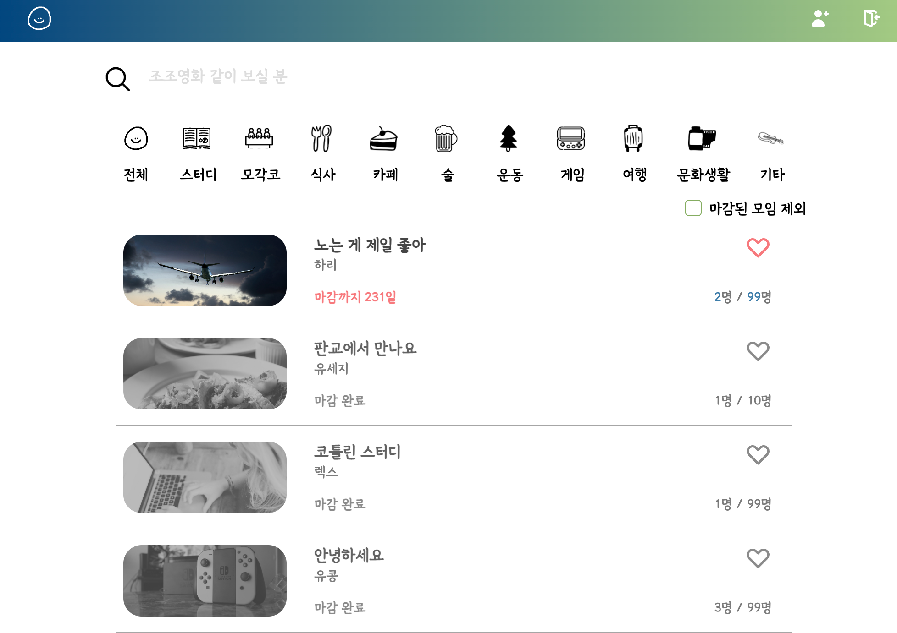

# 3. 모모팀의 캐시 전략

## 3.1. Global 캐싱? vs Local 캐싱?

캐시 전략은 각각의 서버 로컬에 저장하는 로컬 캐싱과 Redis와 같은 외부 저장소를 활용해 진행하는 글로벌 캐시로 분류할 수 있다. 각각의 특징은 아래와 같다.

**Local Caching**

- 서버마다 캐시를 따로 저장
- 서버 내에서 작동하기에 속도가 빠르다
- 로컬 서버의 Memory, Disk와 같은 Resource를 사용한다.
- **캐시에 데이터가 변경되는 경우 다른 서버로 변경 사항을 전달하기 어렵다.**

**Global Caching**

- 별도의 캐시 서버를 활용하여 여러 서버에서 접근할 수 있다.
- 네트워크 트래픽을 사용해야해서 로컬캐시보다는 느리다.
- 데이터를 분산하여 저장할 수 있다. (Replication, Sharding)
- 캐시에 데이터가 변경되어도 추가적인 작업이 필요하지 않다.

모모팀은 로드밸런싱을 사용하여 2개의 WAS 서버를 가진 인프라 구조이기에 Local 캐시를 사용하면 캐시 데이터의 정합성을 맞추기가 어렵다 생각하여 Global 캐시 전략을 사용하기로 결정하였다.

## 3.2. 어디에 적용할까?

적용 위치를 정하기 위해서는 서비스의 특성을 잘 파악해야한다.

우리의 서비스는 모임 서비스라 대부분의 조회 요청은 모임 목록과 단건 조회일 것이다. 데이터베이스로부터의 접근을 최소화 하려면 두 요청을 처리하며 수행되는 데이터베이스의 접근을 줄여주면 될 것이라 생각된다.

모임 목록 조회의 경우 필터링 기능과 내가 참여한 모임, 내가 찜한 모임, 내가 주최한 모임 등의 개인을 기준으로 조회하는 요청으로 분류된다. 이때 모든 요청에 대한 데이터를 캐시를 한다면 캐시 서버에는 조회가 별로 없는 많은 데이터들이 쌓이며 성능 저하가 발생할 수 있다. 그렇기에 개인을 기준으로 조회하는 데이터는 캐시를 하지 않고 여러 유저들이 공통으로 요청할 수 있는 조회에 대해서만 캐싱을 진행하기로 하였다.

최종적으로 정해진 캐싱 데이터는 아래와 같다.

- 모임 단건 조회
- 모임 목록 조회
    - 필터링 데이터까지만 허용
    - 개인화된 데이터는 X

## 3.3. TTL

캐시된 데이터를 저장하는 시간을 일단 30분으로 설정하였다. 서비스를 이용하는 유저가 많아 모임의 추가, 업데이트, 삭제에 대한 요청이 많아질 경우 저장 시간을 줄이고 어떻게 해야지 최신의 데이터를 보여주며 Cache Hit을 극대화할 수 있을까?에 대해 고민해보겠지만 현재는 사용 유저가 적은 관계로 모임의 변동이 적어 30분의 TTL을 설정하였다.

> TTL에 대한 설정은 사용자들이 서비스를 사용하는 사용 패턴, 모임 리스트 업데이트 빈도 및 사용자 수 등 여러 가지 요소를 고려해야 한다. 즉, 적절한 캐시 저장 시간을 결정하기 위해서는 데이터 분석 및 사용자 피드백을 종합적으로 고려해야 하는데 현재는 사용자가 거의 존재하지 않는 관계로 30분의 시간을 설정하게 되었다.
>

## 3.4. 캐시 데이터 삭제

그 외에도 모임의 변동사항이 생길 때, 캐시된 데이터를 삭제하는 것에 대해 고민해봐야 한다. 캐시 데이터 삭제에 대한 고민은 사용자에게 항상 최신의 데이터를 보여주어야 하는가를 가장 우선적으로 고려해봐야 할 것 같다. 이를 고려하며 모임 생성, 삭제, 업데이트, 조기마감 로직에 대해 생각해보겠다.

**모임 생성**

- 생성된 모임은 사용자에게 누락 없이 보여줘야 한다고 생각한다. 모임의 경우 인원 제한이 있어 선착순으로 지원해야하기에 생성과 동시에 모임 목록을 조회하는 사람들에게 보여줘야 한다고 생각한다.
- 또한 모임 생성이 되었는데도 모임 목록조회의 캐시 결과를 반환하며 새로운 모임을 보이지 않을 경우, 모임이 생성하여도 캐시된 데이터의 TTL동안 사용자에게 노출되지 않는 문제가 발생한다.

**모임 업데이트**

- 모임 업데이트는 이름, 일정, 장소, 설명 등 모임에 대한 중요한 데이터가 변경될 수 있기에 해당하는 모임 단건 조회와 목록 조회 캐시 모두 삭제하기로 하였다.

**모임 삭제, 모임 조기마감**

- 모임을 참여하기 위해서는 무조건 단건 모임 조회 페이지에 들어가서 신청을 해야한다.
- 목록 조회 - 모임 목록 조회에 해당하는 캐시 데이터를 삭제하지 않기로 하였다. 모임 정보 업데이트와 다르게 단순 삭제와 조기마감에 대한 것은 목록 상에서는 업데이트가 지연되어도 된다 생각한다. 해당 정보도 항상 최신으로 보여주면 좋긴하지만 모든 변동이 있을 때마다 캐시 데이터를 지우면 Cache Miss의 발생이 크게 늘어 해당 부분에 대해서는 사용자에게 늦은 업데이트로 보여줘도 된다 생각한다.

  > 서비스를 운영하며 모임 목록 조회의 늦은 업데이트에 대한 문제와 불만이 발생할 경우 캐시 데이터를 삭제할 수도 있고 TTL시간을 줄이는 방안을 생각해볼 것 같다.
>
- 단건 조회 - 모임의 단건 조회에 대해서는 신청을 하기 직전이기에 삭제한 데이터나 조기마감과 같은 모임의 변동은 누락되지 않게 보여줘야 한다 생각하여 단건 조회의 캐시는 삭제하여야 한다 생각한다.

# 4. 캐시 적용

SpringBoot는 개발자가 캐시 적용을 쉽게 할 수 있도록 AOP를 기반으로 한 `@Cachable`, `@CacheEvict` 등의 어노테이션들을 제공한다. 해당 기능은 `@EnableCaching`를 설정 클래스에 붙여주면 활성화되어 손쉽게 사용할 수 있다.

우리는 Redis를 기반으로 글로벌 캐시를 진행할 것이기에 설정 클래스에  `CacheManager`로  `RedisCacheManager`를 사용할 수 있도록 빈을 먼저 등록하겠다.

```java
@EnableCaching
@Configuration
public class RedisConfiguration {

    @Value("${spring.cache.redis.host}")
    private String host;

    @Value("${spring.cache.redis.port}")
    private int port;

    @Bean
    public RedisConnectionFactory redisConnectionFactory() {
        return new LettuceConnectionFactory(host, port);
    }

    @Bean
    public CacheManager cacheManager(RedisConnectionFactory redisConnectionFactory) {
        RedisCacheConfiguration redisCacheConfiguration = RedisCacheConfiguration.defaultCacheConfig()
                .serializeValuesWith(SerializationPair.fromSerializer(new GenericJackson2JsonRedisSerializer()))
                .prefixCacheNameWith("Momo - ") // Key Prefix로 "Momo - "를 앞에 붙여 저장
                .entryTtl(Duration.ofMinutes(30)); // 캐시 수명 30분

        return RedisCacheManager.RedisCacheManagerBuilder
                .fromConnectionFactory(redisConnectionFactory)
                .cacheDefaults(redisCacheConfiguration)
                .build();
    }
}
```

위의 클래스에서 몇가지 내용을 살펴보겠다. 먼저 `.serializeValuesWith(SerializationPair.fromSerializer(new GenericJackson2JsonRedisSerializer()))` 를 살펴보겠다. 기본적으로 Redis는 데이터 타입으로 String, Lists, Sets, Hashes, Sorted Sets 등의 자료구조를 지원하고 있다. 하지만 지원 타입 중에 Object 타입이나 JSON타입은 없기에 Redis에 데이터를 넣기 위해서는 Object를 직렬화 과정을 통해 String으로 변환 후에 넣어줘야 한다. JSON 포맷 지원은 **Jackson2JsonRedisSerializer** 또는 **GenericJackson2JsonRedisSerializer**로 Serializer를 변경하여 해결할 수 있다. 우리는 일단 `GenericJackson2JsonRedisSerializer`를 사용하였다.

그 외에도 설정으로 Key앞에 Prefix설정을 하는 `.prefixCacheNameWith("Momo - ")`와 TTL을 설정해주는 `.entryTtl(Duration.ofMinutes(30));`를 설정해주었다.

이제 캐시를 적용해보겠다. 캐시 적용은 `@Cacheable` 을 통해 간단하게 적용할 수 있다. @Cachable을 통해 Redis에 저장하였을 때, key값은 value와 key 속성을 통해 정해진다. key 값을 지정하지 않았을 때는 매개변수들을 toString()한 값으로 지정되어 아래의 설정대로 캐싱을 하였을 때는 `"Momo - Groups::SimpleKey [SearchCondition{category=null, keyword='null', excludeFinished=false, orderByDeadline=false},Page request [number: 0, size 12, sort: UNSORTED]]”` 와 같은 키 값이 나오게 된다.

```java
@Repository
public class GroupSearchRepositoryImpl implements GroupSearchRepositoryCustom {

    private final JPAQueryFactory queryFactory;
    private final ConditionFilter conditionFilter;

    public GroupSearchRepositoryImpl(EntityManager entityManager) {
        this.queryFactory = new JPAQueryFactory(entityManager);
        this.conditionFilter = new ConditionFilter();
    }

    @Override
    @Cacheable(value = "Groups", cacheManager = "cacheManager")
    public GroupSummaryRepositoryResponses findGroups(SearchCondition condition, Pageable pageable) {
        ...
    }
    ...
}
```

캐시된 데이터는 앞서 CacheManager를 빈으로 등록하며 30분간 저장이 유지되도록 설정하였다. 하지만 그 사이에 모임의 데이터가 변동되었을 때, 어떻게 대응할 것인지도 정해야한다. 일단 모임의 생성, 업데이트시 캐시된 모임 목록 데이터를 삭제하도록 하였다. 삭제 또한 `@CacheEvict` 이라는 어노테이션을 통해 간편하게 할 수 있다.

```java
@RequiredArgsConstructor
@Transactional(readOnly = true)
@Service
public class GroupModifyService {

    ...

    @CacheEvict(value = "Groups", cacheManager = "cacheManager", allEntries = true)
    @Transactional
    public GroupIdResponse create(Long memberId, GroupRequest request) {
        ...
    }

    @CacheEvict(value = "Groups", cacheManager = "cacheManager", allEntries = true)
    @Transactional
    public void update(Long hostId, Long groupId, GroupRequest request) {
        ...
    }
}
```

이제 결과를 확인해보겠다. 아래의 이미지를 보면 초기에는 Redis에 캐시된 데이터가 없어서 `keys *` 명령어를 입력했을 때 아무런 empty arrays라는 결과값이 나오는 것을 확인할 수 있다. 그 후, 페이지 조회 요청을 하였더니 캐시의 key가 저장된 것을 확인할 수 있었다. 또한 해당 값을 `get` 을 통해 확인해본 결과 모임 목록 결과가 직렬화되어 Sting값으로 저장된 것을 볼 수 있었다.

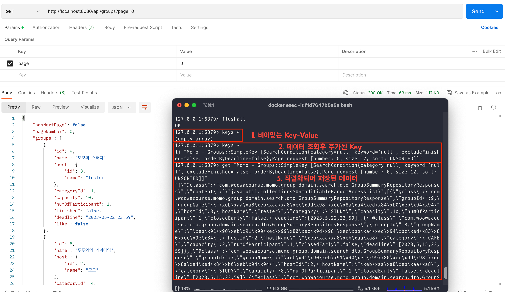

캐시된 데이터의 삭제는 어떨까? @CacheEvict이 붙은 메서드가 실행되도록 모임 생성 요청을 보내봤다. 그랬더니 모임 생성 전에는 캐시된 데이터가 존재하였는데, 모임 생성 후에는 캐시된 데이터들이 삭제된 것을 확인할 수 있었다.

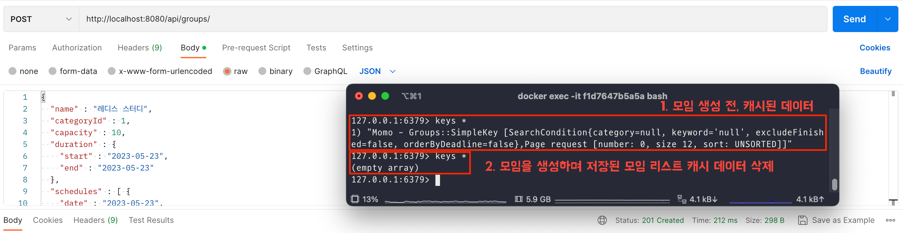

# 5. 부하테스트 결과

캐시의 적용은 완료되어 이제 모임 조회에 대한 부하테스트를 진행해보겠다.

### 캐싱 전

캐싱 전에는 150명의 유저가 100번씩 모임 목록 조회 요청을 하였을 때, 아래와 같이 DB의 병목 현상이 발생하기 전까지는 응답이 수월하게 잘 오다가 DB 연결부분에서 병목 현상이 생긴 후에는 Connectoin Timeout으로 인해 많은 요청들이 실패한 것을 확인할 수 있었다.

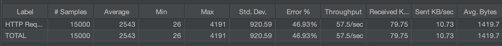

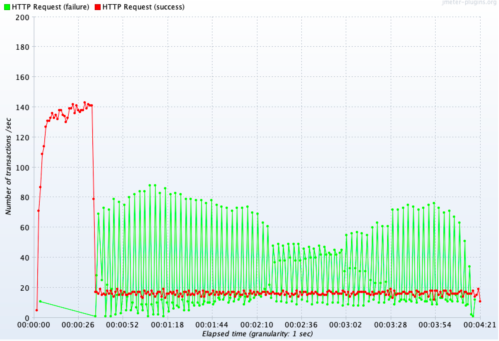

**Spring이 올라간 WAS 모니터링 결과**

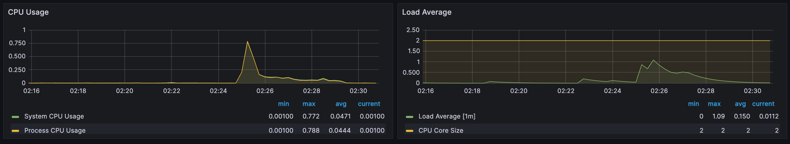

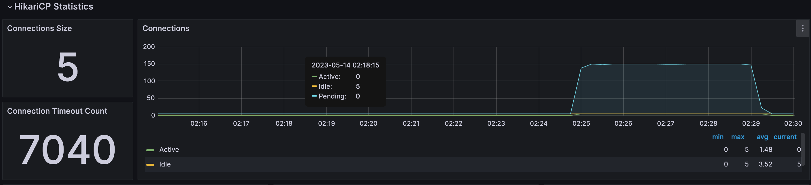

### 캐싱 후

캐시를 적용한 후에는 어떻게 변했을까? 동일한 부하를 준 결과는 큰 개선이 된 것을 확인할 수 있었다. 초반에 캐시된 데이터가 존재하지 않아 약간의 에러가 발생하긴 하였으나, 이후에는 캐시된 데이터를 통해 데이터베이스에 접근하지 않아 Connection Timeout으로 인한 에러 반환률도 낮아졌고 처리량(Throughput) 또한 57.5/sec에서 793.1/sec으로 크게 향상된 것을 확인할 수 있었다.

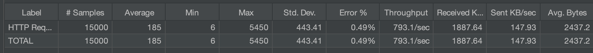

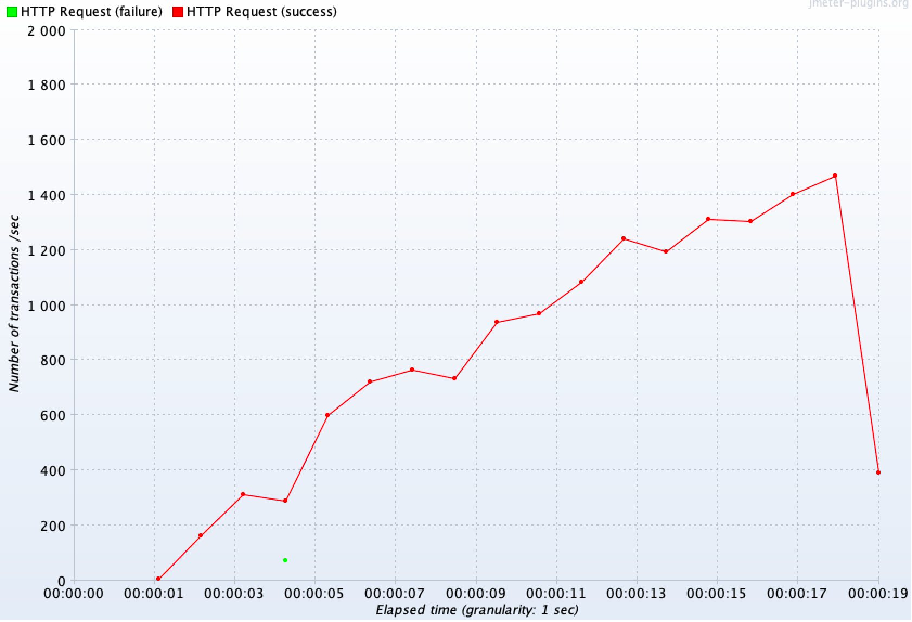

**Spring이 올라간 WAS 모니터링 결과**

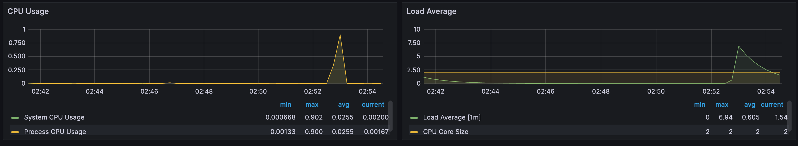

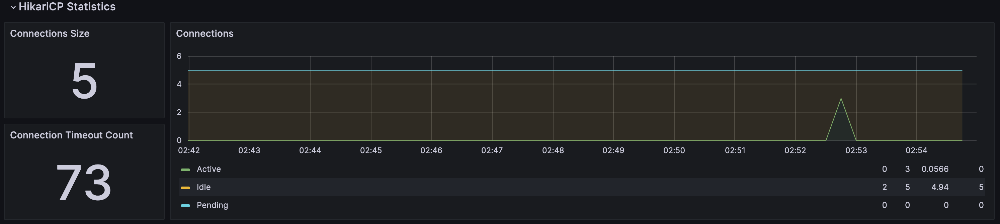

**Redis 인스턴스의 트래픽 모니터링 결과**

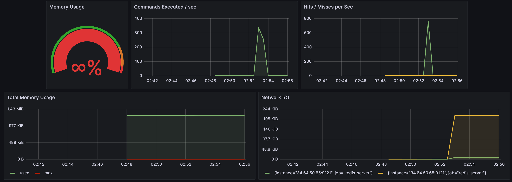

**MySQL 인스턴스의 CPU 사용률과 네트워크 트래픽 비교**

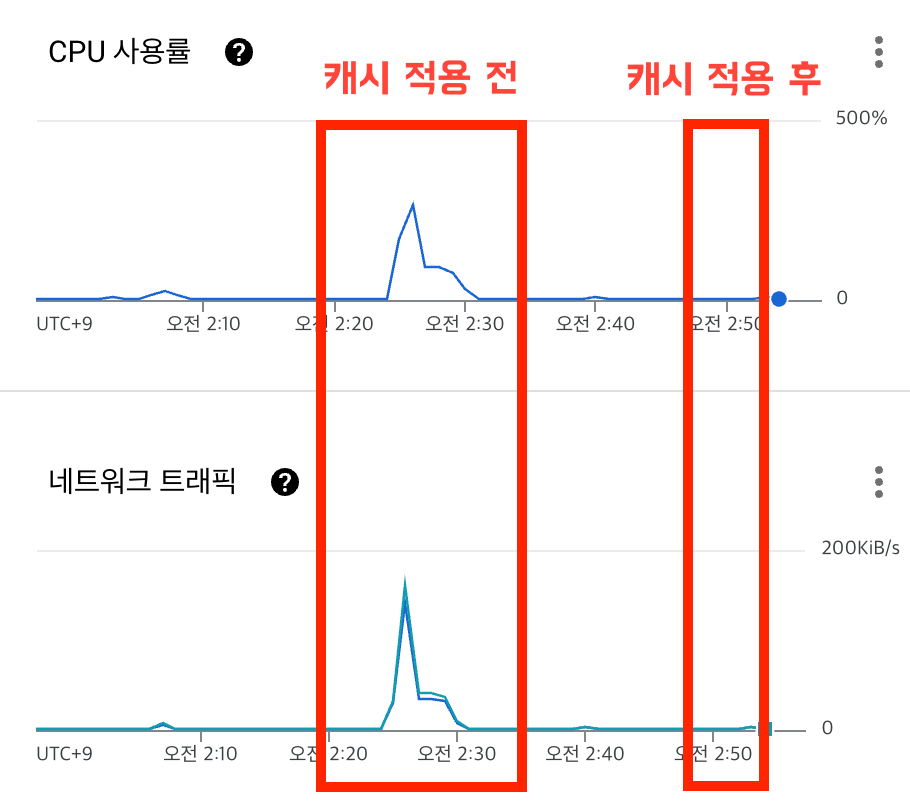

# 6. 앞으로 더 생각해봐야 할 것

- 데이터베이스와 캐시 서버의 SPOF
- 데이터베이스와 캐시 서버의 안정성

캐시를 도입하며 조회 성능에 대한 문제는 일차적으로 해결되었지만 Cache서버에 발생할 수 있는 부하를 생각해봐야 한다. 현재의 테스트에서는 큰 문제가 발생하지 않았지만 더 많은 캐시 데이터가 저장되고 Redis에 더 많은 요청이 보내질 경우 Redis 서버 또한 부하를 견디지 못하고 다운될 수 있다. 그리고 데이터베이스도 캐시를 통해 부하를 줄여주긴했지만 Cache Miss가 발생하는 요청들만 쌓일 경우, 이전과 동일하게 부하를 견디지 못하고 Connection Timeout 에러가 발생할 것이다. 마지막으로 캐시와 데이터베이스 레이어 모두 SPOF가 형성되었다. 단일 서버로 운영되기에 해당 서버들이 다운되면 서비스 전체에 문제가 발생하게 된다.

이를 해결하기 위해서는 Redis서버를 클러스터링하고 MySQL 서버도 이중화를 하여야 할 것으로 생각된다. 해당 작업은 많은 학습이 필요하기에 추후 학습을 진행해보며 진행해보고자 한다.

# 📚 Reference
- [Redis - Documentation](https://redis.io/docs/)
- [SpringBoot에서 Redis 캐시를 사용하기](https://www.wool-dev.com/backend-engineering/spring/springboot-redis-cache)
- [[JAVA Spring Boot] Rest API + 레디스 캐시 (Redis Cache) 적용 및 샘플 예제](https://kim-oriental.tistory.com/28)
- [Spring Data Redis](https://docs.spring.io/spring-data/data-redis/docs/current/reference/html/)
- [[Redis] SpringBoot +  Redis 연동하기](https://developerbee.tistory.com/246)
