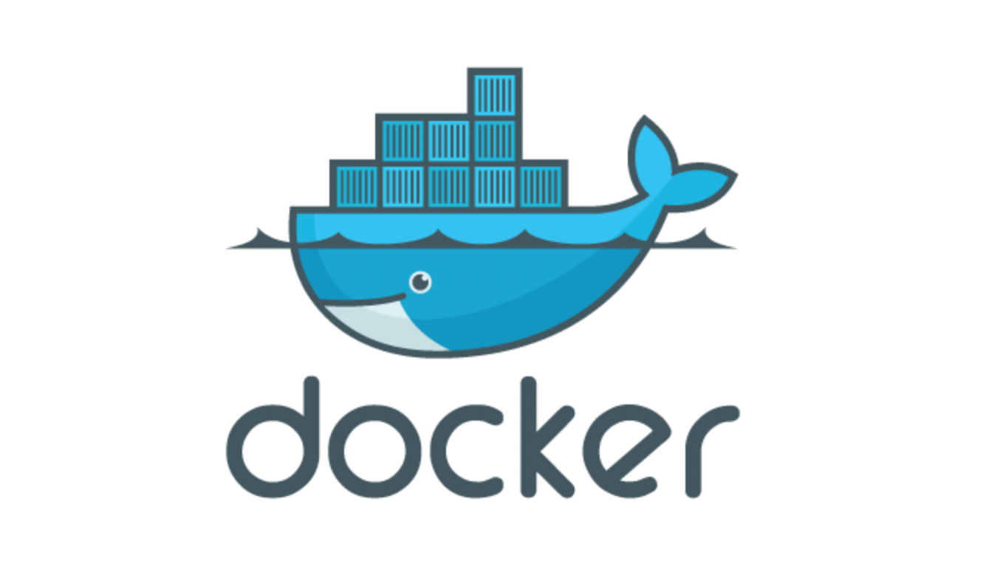
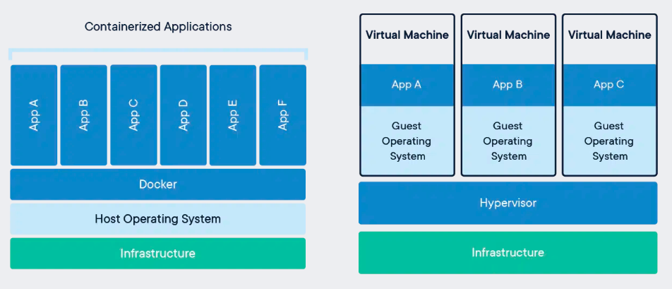
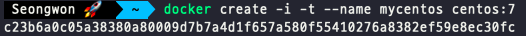
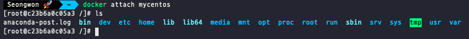
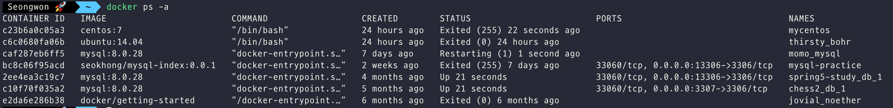

# 1. 도커(Docker)란?

도커란 가상화의 한 종류인 컨테이너를 이용하여 프로세스를 격리시켜주는 오픈소스 프로젝트로 2013년 3월에  솔로몬 하익스에 의해 첫 릴리즈가 되었다. 도커는 라이브러리, 시스템 도구, 코드 등 소프트웨어 실행에 필요한 모든 것들을 포함한 것을 컨테이너라는 표준화된 유닛으로 패키징하여 사용한다. 도커를 사용하면 개발 환경을 쉽게 구축할 수 있고 독립적인 환경에서 동작할 수 있는 등의 많은 장점이 존재하여 요즘은 대부분의 기업들에서 이용하고 있다.

도커의 장점에 대한 내요은 이후에 자세히 살펴보고 먼저 도커의 핵심 개념인 이미지와 컨테이너에 대해 알아보겠다.

# 2. 컨테이너란

컨테이너란 가상화의 한 종류로 애플리케이션이 격리된 공간에서 빠르고 안정적으로 실행될 수 있도록 코드와 모든 종속성을 패키징하는 소프트웨어의 표준 기술이자 프로세스가 동작하는 기술이다.

가상화를 생각하면 가장 대표적으로 떠오르는 것은 가상머신(VM)일 것이다. 컨테이너와 도커가 나오기 전까지는 하나의 PC에서 다른 환경을 구축하고자 하면 하이퍼바이저(Hypervisor)를 이용해 하나의 호스트에서 여러개의 Guest OS를 사용해 사용하였다. 이때 각각의 게스트OS는 다른 게스트 OS와 독립된 공간과 시스템 자원을 할당받아 사용한다. 하지만 이러한 가상머신의 방식은 아래와 같은 단점이 존재하였다.

### 기존 가상머신 방식의 단점

- 각종 시스템 자원을 가상화하고 독립된 공간을 생성하는 작업은 하이퍼바이저를 거쳐야해서 성능의 손실이 발생한다.
- 가상 머신은 게스트 OS를 사용하기 위한 라이브러리, 커널 등을 전부 포함하기 때문에 가상 머신을 배포하기 위한 이미지로 만들었을 때, 이미지 크기가 커진다.

→ 가상 머신은 완벽한 OS를 만들 수는 있지만 일반 호스트에 비해 성능 손실이 있고, 용량이 커서 가상머신 이미지를 애플리케이션으로 배포하기에는 부담스럽다.

컨테이너는 가상머신과 다르게 하드웨어를 가상화하는 것이 아닌 운영체제를 가상화하여 프로세스 실행 공간을 분리한다. 기존 가상 머신의 경우 하이퍼바이저 위에서 메모리와 같은 하드웨어 자원들을 가상화하였지만 컨테이너는 도커와 같은 플랫폼 위에서 프로세스를 격리한다. 덕분에 호스트, 게스트 OS를 따로 만들어 프로세스를 격리하는 오버헤드도 줄일 수 있었고, OS위에 OS를 실행시키는 작업도 진행할 필요가 없어져 가볍게 실행시킬 수 있다.

> 도커 컨테이너는 가상화된 공간을 생성하기 위해 리눅스의 자체 기능인 chroot, namespace, cgroup을 사용함으로써 프로세스 단위의 격리 환경을 만들기 때문에 손실이 거의 없다.
>
> - 컨테이너에 필요한 커널은 호스트 OS를 공유하여 사용하고 컨테이너에는 애플리케이션을 구동하는데 필요한 라이브러리 및 실행 파일만 존재하기 때문에 이미지 용량이 작다



# 3. 도커를 사용하는 이유

컨테이너를 사용하는 기술로는 **OpenVZ**, **LXC**, **cri-o** 등의 여러가지 기술이 존재하지만 사실상 도커가 표준이 되어 많은 사람들이 사용하고 있다. 이러한 현상에는 이유가 있다.

- **애플리케이션의 개발과 배포가 편해진다.**
    - 도커 컨테이너는 호스트 OS 위에서 실행되는 격리된 공간이라 컨테이너에 특별한 권한을 주지 않으면 컨테이너 내부에서 여러 작업을 하여도 호스트 OS에는 영향을 끼치지 않는다. 즉, 독립된 개발 환경을 보장 받을 수 있다.
    - 컨테이너 내부에서 작업을 마친 뒤 배포를 하려면 도커 이미지를 만들어 운영서버에만 전달하면 되는 듯이 편리하다. 이때 운영 서버에는 새롭게 패키지, 라이브러리 설치 등을 할 필요가 없으며 도커 이미지만을 설치 및 실행하는 것으로도 동일한 환경 구축을 편리하게 할 수 있다. → 개발/운영 환경의 통합이 가능해진다.
    - 도커 이미지는 커널을 포함하고 있지 않아서 이미지의 크기가 크지 않다.
    - 도커는 이미지 내용을 레이어 단위로 구성하며 중복되는 레이어를 재사용할 수 있어서 애플리케이션의 배포 속도가 빨라진다는 장점이 있다.
- **여러 애플리케이션의 독립성과 확장성이 높아진다.**
    - 서비스의 규모가 커질수록 모놀리스(Monolith)가 아닌 마이크로서비스(Microservices)구조가 선호된다. 컨테이너는 수 초 내로 생성, 시작이 가능하고 독립된 환경을 동시에 제공할 수 있어서 마이크로서비스 구조에 많이 사용되고 있다.

      > 모놀리스 구조는 여러 모듈이 상호작용하는 로직을 하나의 프로그램에서 구동하여서 확장성과 유연성이 줄어든다.
      >

      > 마이크로 서비스 구조는 여러 모듈을 독립적인 형태로 구성하여 언어에 종속되지 않고 변화에 빠르게 대응할 수 있으며, 각 모듈의 관리가 쉬워진다는 장점이 있다.
>

# 4. 도커 명령어 알아보기

- **도커 설치정보 보기**

    ```bash
    $ docker info
    ```

- **도커 버전 보기**

    ```bash
    $ docker -v
    ```

- **도커 이미지 Pull**

    ```bash
    $ docker pull centos:7
    ```

  > 도커에서 사용하는 이미지의 이름은 `[저장소 이름]/[이미지 이름]:[태그]`의 형태로 구성된다.
  >
  > - ex) seongwon97/ubuntu:14.04  or ubuntu:latest
  > - **저장소 이름**은 이미지가 저장된 장소를 의미한다. **저장소가 명시되지 않은 이미지는** 도커에서 기본적으로 제공하는 이미지 저장소인 **도커 허브의 공식 이미지**를 뜻한다.
  > - **이미지 이름**은 해당 이미지가 어떤 역할을 하는지 나타낸다. 이미지 이름은 생략할 수 없어 반드시 설정해야 한다.
  > - **태그**는 이미지 버전 관리, 혹은 리비전(revision) 관리에 사용한다. 태그를 생략하면 도커 엔진은 이미지 태그를 `latest`로 인식한다.
- **도커 이미지 목록 보기**

    ```bash
    $ docker images
    ```

- **컨테이너 생성**

    ```bash
    $ docker create -i -t --name mycentos centos:7
    ```

  > 다음과 같이 컨테이너를 생성하면 아래와 같이 이상한 값이 나올 것이다.
  >
  >
  > 
  >
  > 해당 숫자는 컨테이너의 고유 ID를 의미하는 16진수의 해시값으로 일반적으로는 너무 길어서 12자리만 사용한다.
  >
  > 📌 컨테이너의 해시 값은 `docker inspect` 명령어로 컨테이너의 id를 다시 확인할 수 있다. (컨테이너 정보 자체를 확인)
  >
  > 📌  모든 명령어는 컨테이너 이름뿐만 아니라 컨테이너의 id를 통해서도 실행 가능하다. 이름이 너무 긴 경우 앞의 2~3자만 입력해도 된다. (Git commit log와 유사)
>
- **컨테이너 정보 확인**

    ```bash
    $ docker inspect mycentos
    // 컨테이너 ID확인
    $ docker inspect mycentos | grep Id
    ```

- **컨테이너 실행**

    ```bash
    $ docker start mycentos
    ```

- **run을 통한 도커 컨테이너 생성 및 실행** (이미지가 없으면 자동 다운 및 실행)
    - `run`은 `pull`, `create`, `start` 명령어를 일괄적으로 실행한 후 attach가 가능한 컨테이너면 내부까지 들어가준다.

    ```bash
    $ docker run -i -t ubuntu:latest
    ```

    - `run`의 다양한 옵션들


        | 옵션 | 설명 |
        | --- | --- |
        | -d | detatched 모드로 컨테이너를 실행시켜 컨테이너를 백그라운드에서 동작하는 애플리케이션으로 실행하도록 설정한다. |
        | -p | 호스트 포트와 컨테이너 내부의 포트를 바인드한다. |
        | -v | 도커 볼륨에 대한 설정이다. 컨테이너 내부의 디렉토리를 호스트로 마운트 (연결) 한다. |
        | -e | 컨테이너 내부 OS의 환경변수를 설정한다. |
        | --name | 컨테이너의 이름을 설정한다. |
        | --rm | 컨테이너가 종료될 경우 컨테이너 자체를 삭제한다. |
        | -it | 터미널 입력을 위한 옵션. -i옵션과 -t옵션은 주로 함께 사용된다. (-i 옵션은 컨테이너 내부로 진입하도록 attach가 가능한 상태로 설정하여 컨테이너와 상호 입출력을 가능하게 하며 , -t옵션은 tty를 활성화하여 bash shell을 사용하도록 한다. ) |
        | -w | WORKDIR 를 설정한다. |
- **컨테이너 내부로 접속**

    ```bash
    $ docker attach mycentos
    ```

  

  > 접속한 컨테이너를 나가는 방법
  >
  > - `exit`, `ctrl + D` : 해당 방법은 bash shell과 컨테이너를 나가면서 컨테이너를 정지시키기까지 한다.
  > - `ctrl + P, Q` : 단순히 컨테이너의 shell에서만 빠져나온다.
- **컨테이너 목록 확인**

    ```bash
    // 정지되지 않은 컨테이너만 출력
    $ docker ps
    
    // 모든 컨테이너를 출력
    $ docker ps -a 
    
    // 모든 컨테이너의 id 출력
    // -q 옵션은 컨테이너의 ID만 출력한다.
    $ docker ps -a -q
    ```

  

    - `docker ps -a`에 나오는 정보들
        - **CONTAINER ID**: 컨테이너에게 자동으로 할당되는 고유한 ID이다.
            - 출력값에는 ID의 일부가 나와있고 전체 ID는 `docker inspect mycentos | grep Id` 명령어를 통해 확인할 수 있다.
        - **COMMAND**: 컨테이너가 시작될 떄 실행될 명령어이다. 대부분의 커멘드는 이미지에 미리 내장되어 있어서 별도로 설정할 필요가 없다.
        - **CREATED**: 컨테이너가 생성되고 난 뒤 흐른 시간을 나타낸다.
        - **STATUS**: 컨테이너의 상태를 나타낸다.
            - **UP**: 커네이너가 실행중이다.
            - **Exited**: 종료된 상태이다.
            - **Pause**: 일시 중지된 상태이다.
        - PORTS: 컨테이너가 개방한 포트와 호스트에 연결한 포트를 나열한다.
        - NAMES: 컨테이너의 고유한 이름이다.
            - `--name` 옵션으로 이름을 설정하지 않으면 도커 엔진이 임의로 형용사와 명사를 무작위로 조합해 이름을 설정한다.
            - 컨테이너 이름도 ID와 같이 중복된 이름으로 생성이 불가능하다.
            - 이름 변경은 `docker rename {컨테이너의 이전 이름} {새로운 이름}` 을 통해 변경할 수 있다.
- **컨테이너 삭제**

    ```bash
    // 특정 이미지 제거 (실행된 것은 삭제 불가)
    $ docker rm {이미지 이름 or Id}
    // 실행중인 것도 제거 가능
    $ docker rm -f {이미지 이름 or Id}
    // 모든 컨테이너 삭제
    $ docker container prune
    ```

- **detached 모드의 컨테이너 접근**
    - detathed 모드로 만들어진 container는 `docker attach` 명령어로 내부 터미널에 접근할 수 없다. 이런 경우 docker exec명령어를 사용하면 접근할 수 있다.

    ```bash
    docker exec -i -t {컨테이너 이름} /bin/bash
    ```


📌 docker stop, start, restart 등의 명령어를 사용할 때는 여러개의 컨테이너 이름을 순차적으로 입력하여 동시에 수행할 수도 있다.

# 📚Reference
- [시작하세요! 도커/쿠버네티스](https://search.shopping.naver.com/book/catalog/32482667222?cat_id=50005561&frm=PBOKPRO&query=%EC%8B%9C%EC%9E%91%ED%95%98%EC%84%B8%EC%9A%94%EB%8F%84%EC%BB%A4%EC%BF%A0%EB%B2%84%EB%84%A4%ED%8B%B0%EC%8A%A4&NaPm=ct%3Dl9njj5z4%7Cci%3D96d7a842b6f9e81ebe408af29d459b4065c09bfb%7Ctr%3Dboknx%7Csn%3D95694%7Chk%3Dd8098dbfb988ff443b3170642f344c2d8d805f10)
- [What is a Container? - Docker](https://www.docker.com/resources/what-container/)
- [docker 이해하기](https://tecoble.techcourse.co.kr/post/2021-08-14-docker/)

