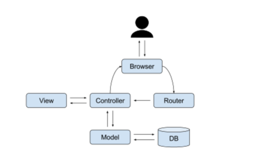
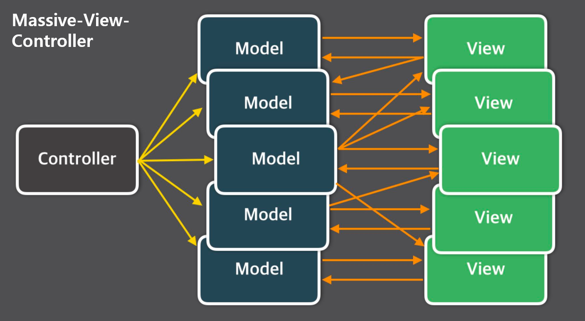

우테코 프리패스 과정을 진행하며 보다 나은 코드와 코드의 구조를 만들고자 다른 지원자들의 코드 리뷰를 하며 제가 작성한 코드와 비교를 해봤습니다.
다른 지원자들의 제출 코드들을 보니 많은 지원자들이 MVC패턴을 적용하여 과제를 진행한 것을 확인할 수 있었습니다.
MVC패턴은 이전에 스프링 프레임워크 학습을 하며 사용을 하였으나 스프링 프로젝트 외의 다른 프로젝트들에 적용을 할 생각을 하지 못하였습니다. 그래서 **이번 기회에 MVC패턴의 개념과 구조를 확실히 익히고 다음주 프리코스 과제부터 MVC패턴을 적용해보고자 합니다!!**

# MVC 패턴이란?

> 모델-뷰-컨트롤러(model–view–controller, MVC)는 소프트웨어 공학에서 사용되는 소프트웨어 디자인 패턴이다. 이 패턴을 성공적으로 사용하면, 사용자 인터페이스로부터 비즈니스 로직을 분리하여 애플리케이션의 시각적 요소나 그 이면에서 실행되는 비즈니스 로직을 서로 영향 없이 쉽게 고칠 수 있는 애플리케이션을 만들 수 있다. MVC에서 모델은 애플리케이션의 정보(데이터)를 나타내며, 뷰는 텍스트, 체크박스 항목 등과 같은 사용자 인터페이스 요소를 나타내고, 컨트롤러는 데이터와 비즈니스 로직 사이의 상호동작을 관리한다.
>  
> 출처: [MVC - wikipedia](https://ko.wikipedia.org/wiki/%EB%AA%A8%EB%8D%B8-%EB%B7%B0-%EC%BB%A8%ED%8A%B8%EB%A1%A4%EB%9F%AC)

여기서의 핵심은 MVC 패턴을 사용하면 사용자 인터페이스로부터 비즈니스 로직을 분리하여 비즈니스 로직을 쉽게 고칠 수 있는 애플리케이션이 된다는 것이라 생각됩니다.

그리고 과거에는 View에 모든 비즈니스 로직까지 넣어 코드의 길이가 길어지고 유지보수가 힘들었으나 최근에는 MVC모델은 코드를 3가지 형태로 나누어 개발을 하는 MVC가 기본적인 디자인패턴이 되어 사용되고 있다고 합니다.

## Model, View, Controller

### Model

- Model은 **Data**와 애플리케이션이 **무엇**을 할 것인지를 정의하는 부분으로 **내부 비즈니스 로직을 처리하기 위한 역할**을 합니다.
- 즉, 모델은 컨트롤러가 호출을 하면 DB와 연동하여 사용자의 입출력 데이터를 다루는 일과 같은 데이터와 연관된 비즈니스 로직을 처리하는 역할을 합니다.
- 데이터 추출, 저장, 삭제, 업데이트 등의 역할을 수행합니다.

Model은 다음과 같은 규칙을 갖고 있습니다.

- 사용자가 편집하기를 원하는 모든 데이터를 가지고 있어야 합니다.
- View나 Controller에 대헤서 어떤 정보도 알지 말아야 한다.
- 변경이 일어나면, 변경 통지에 대한 처리방법을 구현해야만 한다.

### View

- View는 사용자에게 보여주는 **화면(UI)**이 해당됩니다.
- 사용자와 상호작용을 하며 컨트롤러로부터 받은 모델의 결과값을 사용자에게 화면으로 출력하는 일을 합니다.
- MVC에서는 여러개의 View가 존재할 수 있습니다.
- Model에서 받은 데이터는 별도로 저장하지 않습니다.

View는 다음과 같은 규칙을 갖고 있습니다.

- Model이 가지고 있는 정보를 따로 저장해서는 안됩니다.
- Model이나 Controller와 같이 다른 구성요소들을 몰라야 합니다.
- 변경이 일어나면 변경 통지에 대한 처리방법을 구현해야만 합니다.

📌 Model과 View는 서로의 존재를 몰라야 합니다.

### Controller

- Controller는 **Model과 View 사이를 이어주는 인터페이스 역할**을 합니다.
- 즉, **Model이 데이터를 어떻게 처리할지 알려주는 역할**을 합니다.
- 사용자로부터 View에 요청이 있으면 Controller는 해당 업무를 수행하는 Model을 호출하고 Model이 업무를 모두 수행하면 다시 결과를 View에 전달하는 역할을 합니다.

Controller는 다음과 같은 규칙을 갖고 있습니다.

- Model이나 View에 대해서 알고 있어야 합니다.
- Model이나 View의 변경을 모니터링 해야 합니다.

## MVC 구동 원리

MVC패턴은 Spring프레임워크와 JSP를 사용하는 웹 애플리케이션 개발에 많이 사용되고 있습니다. 이 때의 웹 애플리케이션에서의 MVC의 구동 원리는 다음과 같습니다.

1. 웹 브라우저가 웹 서버에 웹 애플리케이션 실행을 요청한다. (MVC 구조가 WAS라고 보면 된다.)
2. 웹 서버는 들어온 요청을 처리할 수 있는 서블릿을 찾아서 요청을 전달한다. (Matching)
3. 서블릿은 모델 자바 객체의 메서드를 호출한다.
4. 데이터를 가공하여 값 객체를 생성하거나, JDBC를 사용하여 데이터베이스와의 인터랙션을 통해 값 객체를 생성한다.
5. 업무 수행을 마친 결과값을 컨트롤러에게 반환한다.
6. 컨트롤러는 모델로부터 받은 결과값을 View에게 전달한다.
7. JSP는 전달받은 값을 참조하여 출력할 결과 화면을 만들고 컨트롤러에게 전달한다.
8. 뷰로부터 받은 화면을 웹 서버에게 전달한다.
9. 웹 브라우저는 웹 서버로부터 요청한 결과값을 응답받으면 그 값을 화면에 출력한다.

출처: https://osy0907.tistory.com/63

## MVC의 장점

- 기능별로 코드를 분리하여 하나의 파일에 코드가 모이는 것을 방지하여 가독성과 코드의 재사용이 증가한다.
- 각 구성요소들을 독립시켜 협업을 할 때 맡은 부분의 개발에만 집중할 수 있어 개발의 효율성을 높여준다. <- 분업을 가능하게 해준다!!!
- 개발 후에도 유지보수성과 확장성이 보장된다.

## MVC의 한계

Model과 View는 서로의 정보를 갖고 있지 않는 독립적인 상태라고 하지만 Model과 View사이에는 Controller를 통해 소통을 이루기에 의존성이 완전히 분리될 수 없습니다. 그래서 복잡한 대규모 프로그램의 경우 다수의 View와 Model이 Controller를 통해 연결되기 때문에 컨트롤러가 불필요하게 커지는 현상이 발생하기도 합니다. 이러한 현상을 **Massive-View-Controller**현상이라고 하며 이를 보완하기 위해 MVP, MVVM, Flux, Redux등의 다양한 패턴들이 생겨났습니다.

# Reference

- https://ko.wikipedia.org/wiki/%EB%AA%A8%EB%8D%B8-%EB%B7%B0-%EC%BB%A8%ED%8A%B8%EB%A1%A4%EB%9F%AC
- https://medium.com/@jang.wangsu/%EB%94%94%EC%9E%90%EC%9D%B8%ED%8C%A8%ED%84%B4-mvc-%ED%8C%A8%ED%84%B4%EC%9D%B4%EB%9E%80-1d74fac6e256
- https://osy0907.tistory.com/63
- https://junhyunny.github.io/information/design-pattern/mvc-pattern/
- https://tecoble.techcourse.co.kr/post/2021-04-26-mvc/
- https://ninetynine-2026.tistory.com/138
- https://wooaoe.tistory.com/15
- https://m.blog.naver.com/tlstjd436/222010976665
- https://scshim.tistory.com/407
