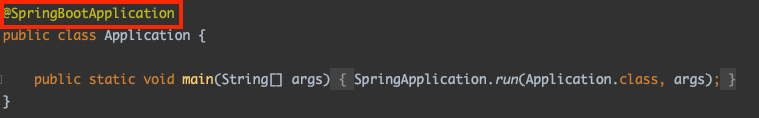

프레임워크와 라이브러리는 개발자라면 많이 들어본 단어일 것이다. 하지만 둘의 차이를 설명해달라하면 유창하게 설명하지 못하는 개발자들이 많이 존재할 것이라 생각된다.

이번 포스트에서는 Framework와 Library의 개념과 둘의 차이에 대해 정리해보고자 한다.

# Framework

> 컴퓨터 프로그래밍에서, **소프트웨어 프레임워크**(software framework)는 복잡한 문제를 해결하거나 서술하는 데 사용되는 기본 개념 구조이다. 간단히 **뼈대**, **골조**, **프레임워크**(framework)라고도 한다.

위키 백과에 프레임워크를 검색하면 다음과 같이 정의를 하고 있다. 즉 프레임워크는 소프트웨어의 뼈대, 구조를 의미한다. 프레임워크는 제어의 역전 개념이 적용되어 있는 대표적인 기술이다.

> 제어의 역전의 개념에 대한 지식이 부족하다면 해당 게시글을 참조하길 바란다.
>
> - [DI/IOC란 무엇일까?](https://seongwon97.github.io/posts/%EC%8A%A4%ED%94%84%EB%A7%81-DI-IoC/)

소프트웨어에서의 프레임워크는 '소프트웨어의 특정 문제를 해결하기 위해서 상호 협력하는 클래스와 인터페이스의 집합' 이라 할 수 있으며, 완성된 어플리케이션이 아닌 프로그래머가 완성시키는 작업을 해야한다.객체 지향 개발을 하게 되면서 통합성, 일관성의 부족이 발생되는 문제를 해결할 방법중 하나라고 할 수 있다.

프레임워크의 특징

- 특정 개념들의 추상화를 제공하는 여러 클래스나 컴포넌트로 구성되어 있다.
- 추상적인 개념들이 문제를 해결하기 위해 같이 작업하는 방법을 정의한다.
- 컴포넌트들은 재사용이 가능하다.
- 높은 수준에서 패턴들을 조작화 할 수 있다.

# Library

> **라이브러리**(library)는 주로 소프트웨어를 개발할 때 컴퓨터 프로그램이 사용하는 비휘발성 자원의 모임이다. 여기에는 구성 데이터, 문서, 도움말 자료, 메시지 틀, [미리 작성된 코드](https://ko.wikipedia.org/wiki/%EC%BD%94%EB%93%9C_%EC%9E%AC%EC%82%AC%EC%9A%A9), [서브루틴](https://ko.wikipedia.org/wiki/%EC%84%9C%EB%B8%8C%EB%A3%A8%ED%8B%B4)(함수), [클래스](<https://ko.wikipedia.org/wiki/%ED%81%B4%EB%9E%98%EC%8A%A4_(%EC%BB%B4%ED%93%A8%ED%84%B0_%EA%B3%BC%ED%95%99)>), [값](<https://ko.wikipedia.org/wiki/%EA%B0%92_(%EC%BB%B4%ED%93%A8%ED%84%B0_%EA%B3%BC%ED%95%99)>), [자료형](https://ko.wikipedia.org/wiki/%EC%9E%90%EB%A3%8C%ED%98%95) 사양을 포함할 수 있다.

위키 백과에서는 라이브러리를 다음과 같이 정의하고 있다. 즉, 라이브러리는 단순 활용가능한 도구들의 집합을 말한다. 라이브러리는 개발자가 만든 클래스에서 호출하여 사용, 클래스들의 나열로 필요한 클래스를 불러서 사용하는 방식을 취하고 있다.

# Framework와 Library의 차이

프레임워크와 라이브러리는 제어의 흐름을 누가 관리하는지에 차이가 있다. 즉, 애플리케이션의 흐름을 누가 갖고 있는지에서 차이점이 있는 것이다.

라이브러리의 경우 애플리케이션이 동작 중에 필요한 기능이 있으면 능동적으로 라이브러리를 호출하여 사용하며 전체적인 흐름을 애플리케이션이 제어를 한다. 반면에 프레임워크는 애플리케이션 코드가 프레임워크에게 호출을 당하며 애플리케이션의 전반적인 흐름을 애플리케이션이 아닌 프레임워크가 관리를 하게 된다.

프레임워크와 라이브러리 차이의 논리적인 이해를 돕기 위해 아래의 글을 가져와봤다.

> 라이브러리는 톱, 망치, 삽같은 연장입니다.사람이 들고 썰고, 바꿔들고 내려치고, 다시 바꿔들고 땅을 파는 겁니다.프레임워크는 차, 비행기, 배같은 탈 것입니다.사람이 타서 엔진 켜고, 기어 넣고, 핸들 돌리고, 운전하거나, 조종하거나 해야합니다.도구를 쓸 때, 급하면 썰어야 할 곳에 망치를 쳐도 됩니다. 땅 파야할 때 톱으로 땅을 긁어내도 됩니다.사람은 도구를 선택하는 입장이기 때문에, 어떤 도구를 사용하든 원하는 것을 만들어낼 수 만 있으면 됩니다.
> 반면에, 탈것은 정해진 곳으로만 다녀야 합니다.차를 타고 하늘을 날거나, 배를 타고 땅으로 갈 수는 없습니다.하지만, 그 목적에 맞게 만들어져 있기 때문에, 톱이나 망치를 들고 먼저 탈것을 만들어야 할 필요가 없습니다.그저 정해진 규칙에 맞춰서 엔진, 기어, 핸들만 잘 돌리면 되는 것입니다.
>  출처: [https://webclub.tistory.com/458](https://webclub.tistory.com/458)

# 정리

라이브러리는 단순히 활용 가능한 도구들의 집합으로 애플리케이션에서 제어를 하며 단순히 가져다 쓰는 것이다. 하지만 프레임워크는 특정 디자인 패턴, 전/후처리에 필요한 동작, 기능들을 제공하며 프레임워크가 사용자의 코드를 불러와 사용을 하게되어 제어의 권한이 프레임워크에 있게 된다.

# 우리는 프레임워크를 왜 사용할까?

우리가 프레임워크와 라이브러리를 사용하는 이유는 작업의 효율성 때문이다. 물론 혼자서 처음부터 프레임워크가 제공하는 기능들을 직접 개발하여 사용할 수 있을 것이다. 하지만 이와 같이 직접 개발을 하게 된다면 시간도 오래 걸릴뿐더러 버그가 없고, 성능이 좋을 것이라는 보장도 없을 것이다. 또한 회사 입장에서는 품질에 개인이 미치는 영양을 최소화 할 수 있어 일정한 품질을 보장할 수 있다는 장점이 있어 프레임워크를 우리는 사용하고 있다.

# Reference

- [프레임워크와 라이브러리의 차이점](https://webclub.tistory.com/458)
