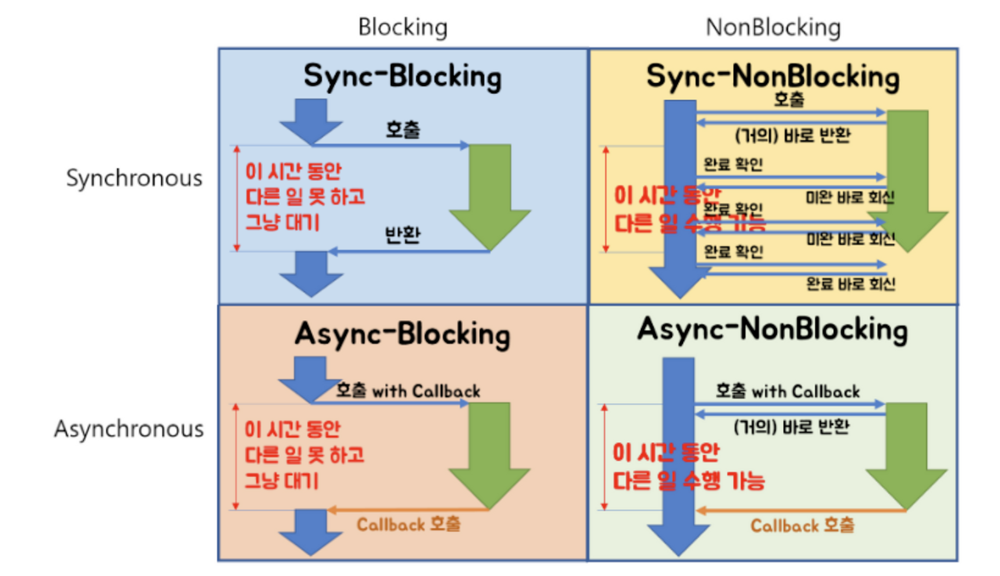

# Blocking/Non-blocking

Block과 Non-blocking은 `호출된 함수`가 `호출한 함수`에게 제어권을 바로 넘겨주는지의 유무 차이가 있다.

### Blocking

호출된 함수가 본인의 작업을 마칠때까지 제어권을 갖고 있는다. 호출한 함수 입장에서는 호출된 함수가 종료될 때까지 아무런 작업을 하지 못한채로 기다려야한다.

### Non-Blocking

호출된 함수가 본인의 작업이 끝나지 않았더라도 호출한 함수에게 제어권을 바로 넘겨준다. 그래서 호출한 함수의 경우 Blocking과 다르게 호출된 함수의 작업이 끝나는 것을 기다리며 다른 작업들을 수행할 수 있다.

# Synchronous/Asynchronous

Synchronous과 Asynchronous는 함수를 호출하여 일을 동시에 일을 수행할 때, 호출된 함수의 작업 완료 여부를 누가 신경쓰는지가 관심사이다.

### Synchronous

호출하는 함수가 호출되는 함수의 작업 완료 후 리턴을 기다리거나, 또는 호출되는 함수로부터 바로 리턴 받더라도 작업 완료 여부를 호출하는 함수 스스로 계속 확인하며 신경쓰는 것이다.

### Asynchronous

호출되는 함수에게 callback을 전달해서, 호출되는 함수의 작업이 완료되면 호출되는 함수가 전달받은 callback을 실행하고, 호출하는 함수는 작업 완료 여부를 신경쓰지 않는 것이다.

# 두 개념의 조합

### Blocking-Sync

- 호출되는 함수는 제어권을 함수가 종료될 때까지 갖고 있고 호출하는 함수는 호출된 함수의 완료 여부를 물어보며 기다린다.

### NonBlocking-Async

- 호출되는 함수는 제어권을 바로 반환하고 호출하는 함수는 호출된 함수의 완료 여부를 신경쓰지 않아 다른 작업을 수행할 수 있다.
- 성능과 자원의 효율적 사용 관점에서 가장 유리하다.

### NonBlocking-Sync

- 호출되는 함수는 제어권을 바로 반환하고, 호출하는 함수는 작업 완료 여부를 물어본다.
- 즉, 함수를 호출 후 바로 제어권을 반환받아 다른 작업을 할 수는 있지만, 함수의 작업이 종료된 것은 아니라 호출부에서 호출받은 함수의 작업 완료 여부를 계속 확인한다.

### Blocking-Async

- 호출되는 함수가 바로 제어권을 반환하지 않고, 호출하는 함수는 작업의 완료 여부를 신경쓰지 않는다.
- Blocking-Async는 별로 이점이 없어 해당 방법을 사용할 필요가 없기는 하지만 개발자가 NonBlocking-Async를 의도하였으나 의도한바와 다르게 Blocking-Async로 동작하는 경우가 있다고 한다.
  - NonBlocking-Async방식을 쓰는데 그 과정 중에 하나라도 Blocking으로 동작하는 작업이 포함되어 있다면 의도하지 않게 Blocking-Async로 동작할 수 있다.
