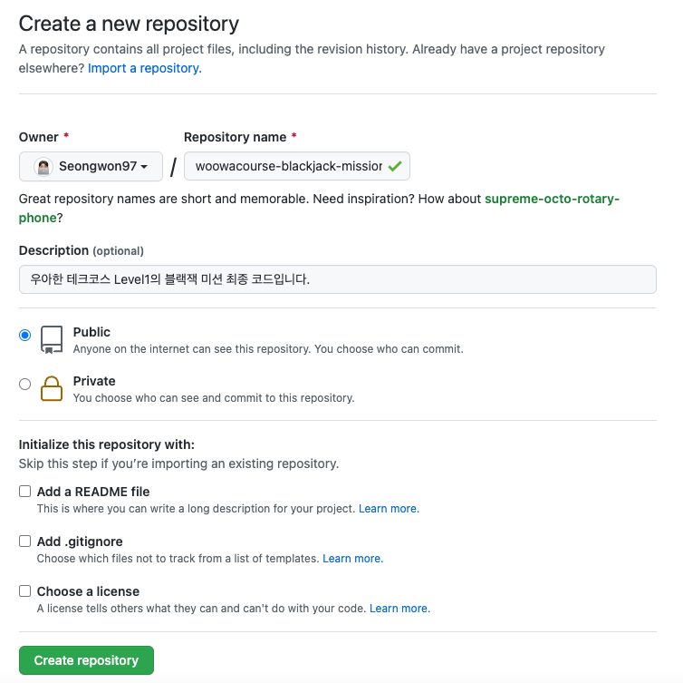
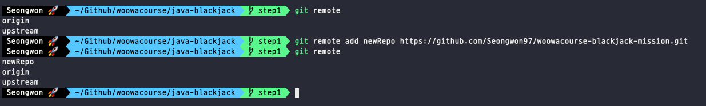
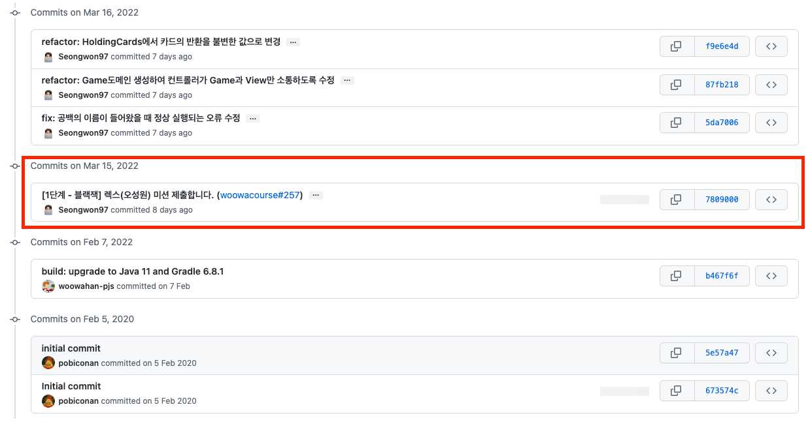
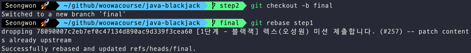
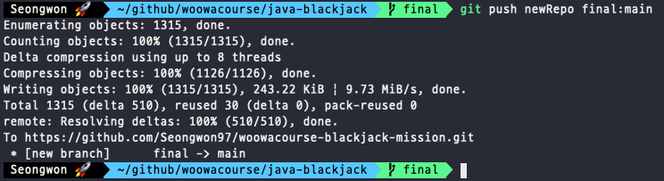
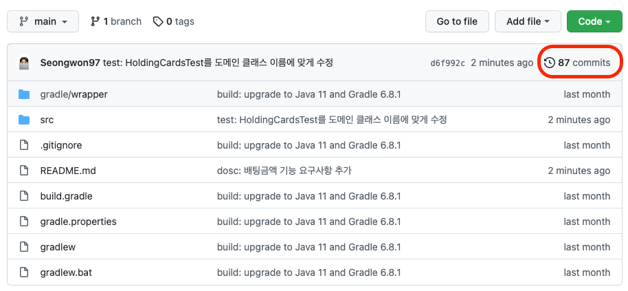
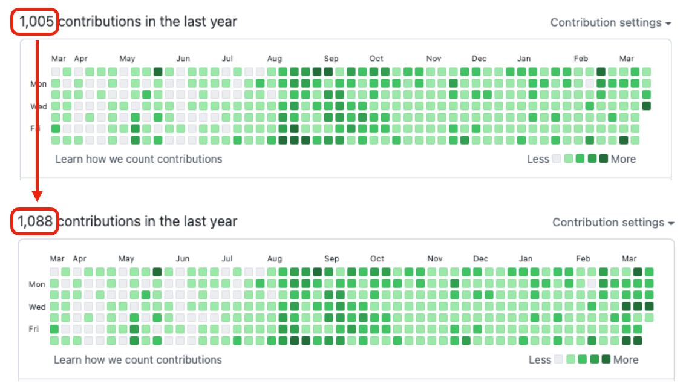

우아한 테크코스 미션을 하다보면 각각 단계별로 적게는 수십개, 많게는 100개가 넘는 커밋 기록들이 쌓이게 됩니다.
하지만 이러한 커밋 기록들은 `master(main)`브랜치에 `merge`가 되어야만 우리의 깃허브에 잔디로 남게 됩니다.

저는 개인적으로 깃허브의 잔디는 내가 이 날 이만큼 개발 공부를 했다는 것을 표현할 수 있는 수단이라고 생각합니다.
그런데 하루종일 미션을 하며 커밋을 셀 수도 없이 많이 하였는데...남는 잔디가 없다..???
잔디에 진심인 저는..이러한 점에서 현타가 왔습니다.


그러던중 우리가 진행한 미션 코드를 잔디로 남기는 법을 알게 되어 글을 쓰게 됐습니다.

# 미션 코드로 잔디심기

## 1. 새로운 repository 생성하기

미션 코드를 담아둘 새로운 repository를 생성해줍니다.



> README와 gitignore를 추가할 경우 conflict가 발생할 수 있기에 추가하지 않고 repository를 생성합니다.

## 2. 미션 코드 위치에서 새로운 remote 추가하기

미션 코드가 위치한 디렉터리에서 앞서 만든 새로운 repository의 주소를 추가해줍니다.

```
git remote add [remote name] [repository url]

# 적용 예시
git remote add newRepo https://github.com/Seongwon97/woowacourse-blackjack-mission.git
```

remote name의 경우 사용자 마음대로 지어도 됩니다.



## 3. commit기록 합치기

우리가 미션을 진행하며 1단계 미션을 마치고 `PR merge`후에 미션 가이드대로 `rebase`를 하고 미션을 진행하면 미션 1의 커밋 기록이 하나의 squash커밋으로 묶인 것을 확인할 수 있습니다.



1단계 commit기록들이 모두 squash commit으로 변하였기에 rebase를 사용하여 step1, step2의 commit기록들이 합쳐진 branch를 만들어줍니다.

```
git checkout -b [newBranch]
git rebase [step1]

# 적용 예시
git checkout step2
git checkout -b final
git rebase step1
```



다음과 같은 순서를 거치게 된다면 final 브랜치는 step1과 step2의 commit기록을 모두 가진 branch가 됩니다.

## 4. commit기록 새로운 repository에 불러오기

이제 final브랜치의 내용들을 우리가 만든 repository에 불러올 차례입니다.

```
git push [remote name] [src branch]:[dest branch]

# 적용 예시
git push newRepo step1:main
```



위의 과정을 거치면 아래와 같이 우리가 만든 repository에 미션 commit기록들이 옮겨진 것을 확인할 수 있습니다.

## 6. 결과





# 출처

- [[10분x3 테코톡] 👨‍🏫안돌의 Git branches](https://www.youtube.com/watch?v=MIGliPrUMGE&t=1130s)
