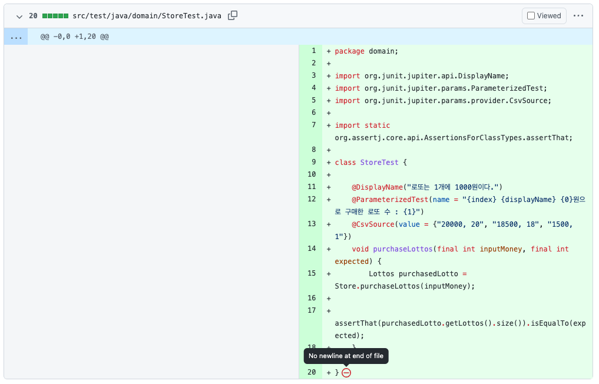
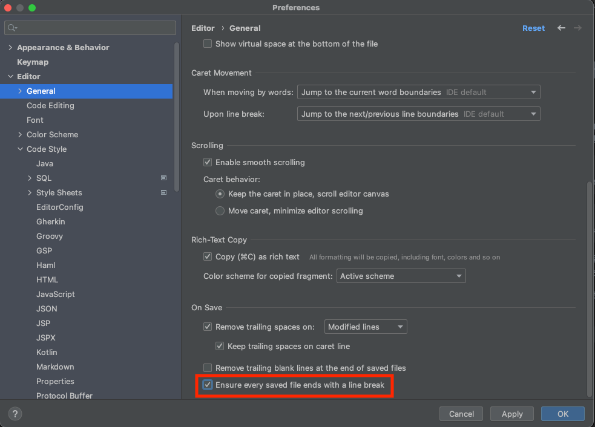

개발을 하다보면 Github에서 다음과 같은 "No newline at end of file"이라는 메시지를 볼 때가 있습니다.

로컬에서 개발을 하고 애플리케이션을 구동하였을 때는 아무 문제가 없었는데 왜 이러한 오류표시가 나오고 해당 오류는 도대체 어떤 오류일까요?

간단하게 설명을 하자면 UNIX의 표준으로는 파일 마지막에 개행이 있어야하는데 작성 파일에는 개행이 없어 잠재적인 문제가 될 수 있기에 오류를 알려준 것입니다.

# 그렇다면 파일 끝에는 왜 개행을 추가해야하고 누가 만든 규칙일까요?

파일 끝에 개행을 추가하는 것은 `IEEE`가 책정한 `POSTFIX` 에서의 하나의 행을 정의하는 표준 때문입니다.
여기서 하나의 행을 정의하는 표준이란 무엇을까요? IEEE에서 정의한 UNIX의 표준의 행 단위는 개행을 기준으로 만들어집니다.

> [3.206 Line](https://pubs.opengroup.org/onlinepubs/9699919799/basedefs/V1_chap03.html#tag_03_206)  
> A sequence of zero or more non- <newline> characters plus a terminating <newline> character.

> [3.195 Incomplete Line](https://pubs.opengroup.org/onlinepubs/9699919799/basedefs/V1_chap03.html#tag_03_195)  
> A sequence of one or more non- <newline> characters at the end of the file.

위의 두 표준 설명을 보면 행(Line)이란 0 또는 개행문자가 아닌 문자들이 나오다가 개행문자로 끝나는 시퀀스를 의미하며,
불완전한 행은 개행문자가 없이 하나 이상의 문자들이 있는 시퀀스를 의미합니다.

즉, 개행이 있으면 행이고 개행이 없으면 행이 끝난 것으로 보지 않는다! 는 것을 알 수 있습니다.

# 개행이 없으면 왜 Warning??

C 컴파일러인 `gcc`는 POSTFIX에 근거해서 동작하며 소스코드를 한줄씩(line by line)으로 읽습니다.
그리하여 파일이 끝났더라도 개행문자가 없으면 한 줄이 끝나지 않은 것으로 인식해서 정상적으로 동작하지 않는 문제가 발생할 수 있습니다.

Github에서는 이러한 잠재적인 오류를 예방하고자 파일 끝에 개행이 없을 시 warning메시지를 띄워주는 것입니다.

# IntelliJ에서 파일 끝 자동 개행 추가하기

1. 메뉴 -> preference -> editor -> general경로로 이동합니다.
2. 파일이 저장될 때 자동으로 new line으로 끝나도록 정하는 `Ensure every saved file ends with a line break` 옵션을 켜줍니다.

# Reference

- https://stackoverflow.com/questions/5813311/whats-the-significance-of-the-no-newline-at-end-of-file-log
- https://minz.dev/19
- https://velog.io/@doondoony/posix-eol
- https://velog.io/@d-h-k/intellij-%ED%8C%8C%EC%9D%BC%EB%81%9D%EC%97%90-%EA%B0%9C%ED%96%89%EC%9D%84-%EC%9E%90%EB%8F%99%EC%9C%BC%EB%A1%9C-%EC%B6%94%EA%B0%80%ED%95%98%EB%8A%94-%EB%B0%A9%EB%B2%95
