# Git Branch 전략이란?

혼자 개발을 할 경우, git의 브랜를 아래와 같이 특정 작업을 할 때 새로운 브랜치를 새로 만들어 사용하거나 하나의 브랜치만을 사용하며 개발을 할 것입니다.
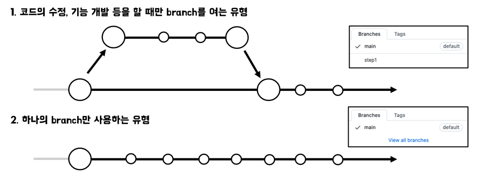

브랜치를 별다른 전략 없이 사용할 경우 혼자 개발을 할 때는 문제가 생겨도 나 자신만을 탓하면 끝이지만 팀 단위로 개발을 할 때는 다릅니다.

팀 단위로 개발을 할 경우에는 각각의 브랜치가 누가 만든 것인지, 브랜치의 용도가 무엇인지, 사용이 끝난 브랜치인지 등의 여러 문제들이 생길 수 있습니다.
특히 실제로 배포중인 서비스의 경우 프로덕션 코드에 문제가 발생하였을 때, 최근 작업한 브랜치가 무엇인지, 무엇이 잘못되었는지 확인하는데 어려움이 생길 수도 있습니다.

이러한 문제점들을 해결하기위해 나온 것이 바로 **Branch전략**입니다.

Git Branch을 한 문장으로 표현하자면 여러명의 개발자가 1개의 저장소를 사용하는 환경에서 효과적으로 사용하기 위해 나온 개념이라 할 수 있습니다.
대표적인 Branch전략으로는 Github flow, Git flow, Gitlab Flow가 존재하며 거의 모든 기업들에서 자신들에게 맞는 전략을 사용하고 있습니다.

# Github Flow란?

- Github flow전략은 Github에서 만든 단순한 구조의 브랜치 전략입니다.
- 이는 마스터 브랜치를 중심으로 운영되며, 기능 개발, 버그 수정 등의 작업용 브랜치를 구분하지 않고 사용하는 단순한 구조를 사용하고 있습니다.
- Github Flow는 단순한 구조를 사용하여 수시로 배포가 일어나는 프로젝트에 유용합니다.

## Github flow단계

### 1. 브랜치 생성

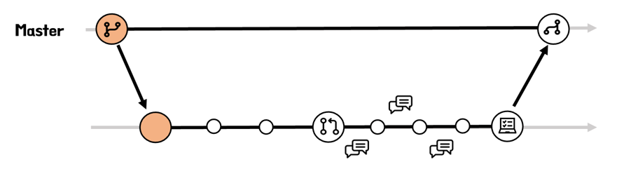

- 개발을 하며 기능 추가, 버그 수정과 같은 작업을 할 때는 master 브랜치로부터 새로운 브랜치를 생성하여 사용합니다.
- 이 때 브랜치 이름은 github flow가 브랜치를 작업별로 구분하지 않는 만큼 정확하고 간결하게 작성해야합니다.

### 2. 기능 개발

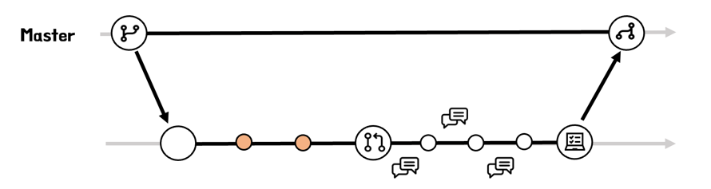

- 생성한 브랜치 내에서는 각각의 목적에 맞는 작업을 수행합니다.
- 이 떄 기능별로하는 commit들은 서버의 동일한 브랜치에 push해줘야 합니다.
  - 뒤에 나올 Git branch전략과의 차이점 중 하나입니다.
  - commit기록들은 지속적으로 서버에 올리는 것이 아니라, 개발중이나 완료 후에라도 server에 올리라는 뜻이다.

### 3. Pull Request생성

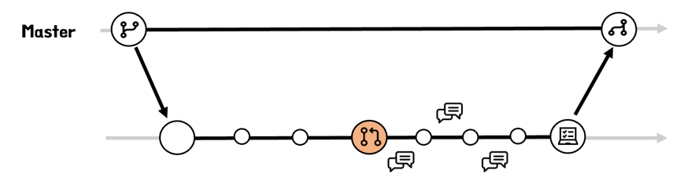

기능 개발 또는 오류 수정 등의 작업이 끝났으면 master브랜치로 PR을 보냅니다.

### 4. 리뷰와 논의

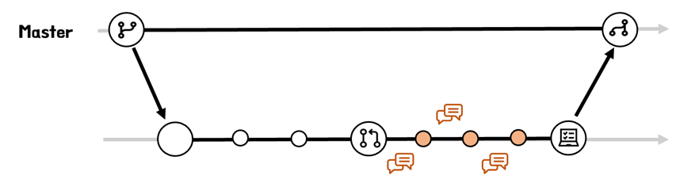

요청이 올라온 PR을 통해 팀원들은 작성한 코드에 대한 리뷰와 논의를 진행합니다.

### 5. 공개 및 테스트

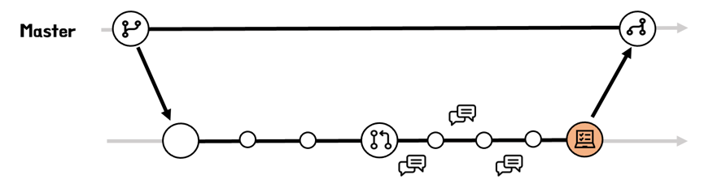

- 리뷰와 논의가 끝난 후에는 master에 merge할 일만 남았습니다.
- Github에서는 master와 합치기 전에 브랜치 내에서 코드를 배포 할 수 있는 장점이 있습니다.
- 이러한 기능을 활용하여 merge이전에 먼저 배포를 하여 사용을 해보며, 해당 branch에 문제가 발생할 시에는 안정적인 기존의 master브랜치를 다시 배포하고 branch코드는 다시 수정한 후 다시 배포할 수 있습니다.

### 6. 합치기(Merge)

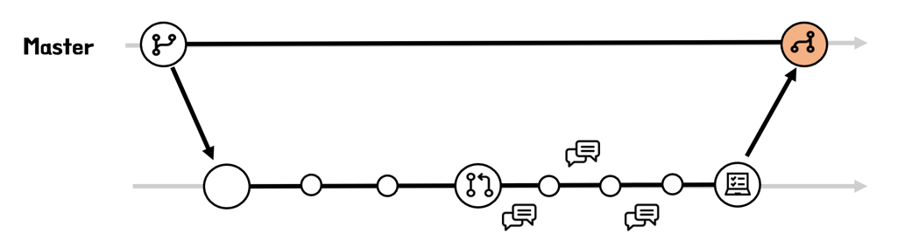

- 개발 branch가 안전하다는 검증이 완료된다면 메인 브랜치에 합침으로써 github flow의 branch의 생명주기가 끝나게 됩니다.

> master 브랜치란?
> master브랜치는 어떤 때든 배포가 가능한 코드들이 위치한 브랜치로, 항상 최신 상태여야한다.

# Git Flow란?

- Git flow는 [**Vincent Driessen**가 제안한 Branch model](https://nvie.com/posts/a-successful-git-branching-model/) 을 기반으로 만들어졌으며 현재는 많은 기업에서 표준으로 사용하는 브랜치 전략이다.
- Github flow와는 다르게 크게 5개의 브랜치를 운영하며 관리를 한다.
  - 메인 브랜치 : master, develop
  - 보조 브랜치 : feature, release, hotfix
- 체계적이고 많은 브랜치를 이용하는 만큼 배포 주기가 길고 팀의 여력이 있는 경우 적합하다.

git branch전략을 설명할 수 있는 대표적인 사진은 다음과 같습니다.

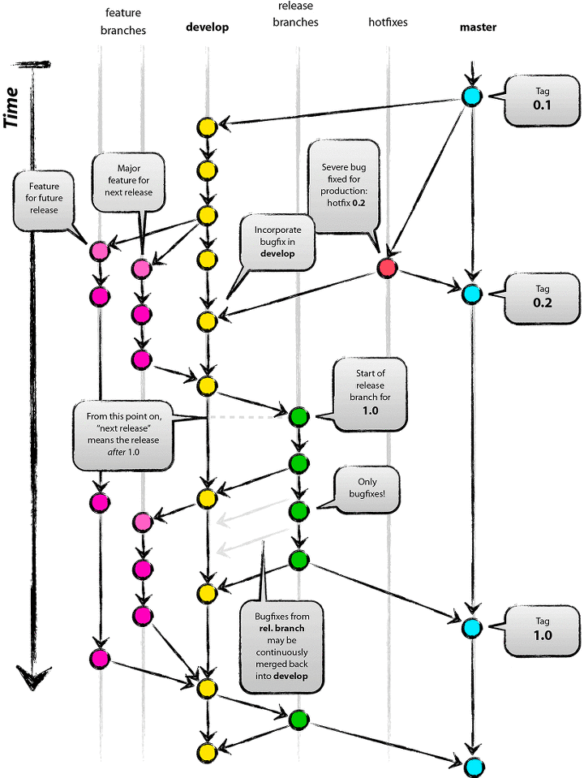

브랜치는 사진과 같이 총 5가지 종류의 브랜치가 존재합니다.
이는 크게 항상 유지되는 메인 브렌치(`master`, `develop`)와 일정 기간 유지되는 보조 브랜치(`feature`, `release`, `hotfix`)로 나눌 수 있습니다.

- **Master** : 제품으로 출시될 수 있는 브랜치
- **Develop** : 다음 출시 버전을 개발하는 브랜치
- **Feature** : 기능을 개발하는 브랜치
- **Release** : 다음 출시 버전을 준비하는 브랜치로 develop 브랜치에서 개발을 완료 후 release로 옮겨 QA 테스트를 진행 후 master로 합칩니다.
- **Hotfix** : 출시 버전(master)에서 발생한 버그를 수정하는 브랜치

## Git flow의 브랜치들

### master & develop

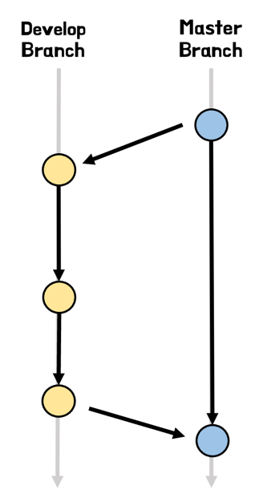

메인 브랜치로는 항상 유지되는 브랜치들로 master와 develop이 있습니다.
여기서 master 브랜치는 현재 배포할 수 있는 코드들이 위치한 브랜치로 현재 필드위에 나가있는 production의 코드들이 위치하게 되며, Develop브랜치는 개발자들이 다음 버전을 위해 사용하고 있는 브랜치입니다.

Develop브랜치는 처음에 master로부터 분기를 하는 것으로 시작되며 다음 버전의 구현이 완료되어 배포를 하고 싶을 때 Master로 합치는 방식으로 운영됩니다.

### feature

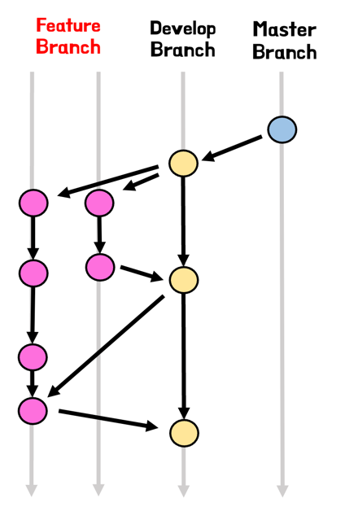

feature 브랜치는 추가적인 기능 개발을 위해 생성을 하는 브랜치로 develop 브랜치로부터 생성을 하여
개발을 완료한 후에는 다시 develop으로 merge하는 방식으로 운영됩니다.

이 때 feature 브랜치는 origin에는 반영하지 않고 개발자의 repo에서만 존재하도록 합니다.

또한 merge를 할 때 `--no-ff`옵션을 이용하여 브랜치에서 merge가 되었음을 git 기록에 남겨두도록 해야한다.

- 이름 지정은 master, develop, release-*, hotfix-*를 제외한 모든 이름이 가능합니다.

### release

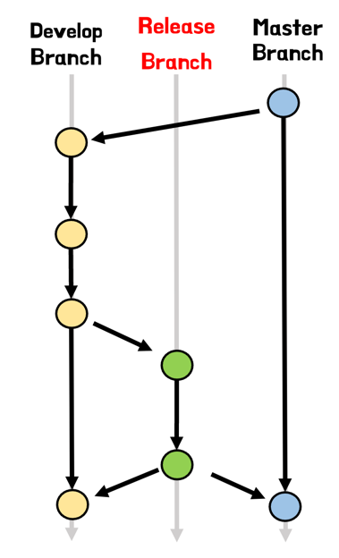

release 브랜치는 Production의 다음 출시 버전을 위한 브랜치로 develop브랜치에서 개발을 완료한 후,
release 브랜치로 옮겨 release 브랜치에서 QA를 진행합니다.

QA를 진행하며 release 브랜치에서는 버그 픽스에 대한 부분만 커밋하고 배포를 할 준비가 되었다고 판단되면 master 브랜치로 merge합니다.

이때도 --no-ff 옵션을 이용하여 머지 기록을 남겨줍니다.

> master로 머지 후 tag 명령을 이용하여 릴리즈 버전에 대해 명시를 하고, -s 나 -u <key> 옵션을 이용하여 머지한 사람의 정보를 남겨두도록 한다.
> 그런 뒤 develop 브런치로 머지하여, release 브런치에서 수정된 내용이 develop 브런치에 반영한다.

- 이름 지정은 release-\*와 같이 지정합니다.

### hotfix

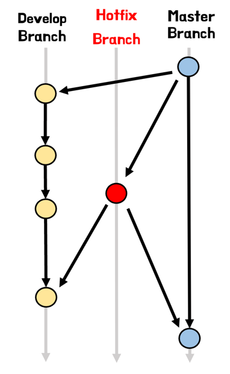

master로부터 버그가 발생하면 hotfix 브랜치를 생성하여 해당 버그를 빠르게 수정합니다.
버그를 수정한 후에는 develop, master브랜치에 반영을 합니다. 이 떄 release브랜치가 존재한다면 release브랜치에도 merge해줍니다.

> master에 반영할 때는 master에 tag를 추가해준다.

- 이름 지정은 hotfix-\*과 같이 합니다.

전반적인 git flow 전략을 소스코드는 다음 이미지와 같이 관리를 하게 됩니다.

## Git Flow 전략의 전반적인 관리 순서

관리를 하는 순서를 정리하자면 다음과 같습니다.

1. repository를 생성하면 master브랜치에 위치할 것입니다.
2. 개발을 할 때는 develop 브랜치를 만들어 해당 브랜치에서 개발을 한다.
3. develop브랜치에서도 특정 기능을 개발할 때는 feature브랜치를 생성하여 개발을 한다.
4. feature브랜치의 개발이 끝나면 develop브랜치로 pull request를 보낸다.
5. develop브랜치의 개발 리더 또는 동료 직원들이 해당 request를 확인하고 문제가 없다면 merge를 한다.
   5.1. merge이후에는 feature브랜치가 필요가 없어 삭제를 해준다.
6. develop브랜치에서 어느정도 개발이 완료된다면 release브랜치를 생성하여 QA를 진행한다.
   6.1. release브랜치에서 발생한 버그들은 release브랜치에서 수정을 한다.
7. QA를 통과하여 제품이 출시될 수 있다면 master와 develop브랜치로 merge한다.
8. 마지막 master 브랜치에 버전 태그를 추가한다.

> 만약 이미 출시되어 master로 관리되고 있는 버전에서 버그가 발생하여 빠르게 수정을 해야하는 상황이 발생한다면 master브랜치에서 hostfix브랜치를 생성하고 오류를 수정하고 master와 현재 개발중인 develop브랜치에 반영을 해준다.

> 팀이 지속적으로 소프트웨어를 배포하는 경우 Git flow보다는 더 간단한 Github branch

# Reference

- https://nvie.com/posts/a-successful-git-branching-model/
- https://www.youtube.com/watch?v=MIGliPrUMGE
- https://www.youtube.com/watch?v=-27WScuoKQs
- https://techblog.woowahan.com/2553/
- https://ujuc.github.io/2015/12/16/git-flow-github-flow-gitlab-flow/
- https://soonyoung.medium.com/%EA%B9%83-%ED%97%88%EB%B8%8C-%ED%94%8C%EB%A1%9C%EC%9A%B0-github-flow-%EC%9D%B4%ED%95%B4-%ED%95%98%EA%B8%B0-a9db7b7718a1
- https://hellowoori.tistory.com/56
- http://scottchacon.com/2011/08/31/github-flow.html
- https://nvie.com/posts/a-successful-git-branching-model/
- https://hyeon9mak.github.io/git-branch-strategy/
- https://agal.tistory.com/137
- https://velog.io/@jinuku/Git-%ED%98%91%EC%97%85-%EA%B0%80%EC%9D%B4%EB%93%9C
- https://www.gitkraken.com/learn/git/best-practices/git-branch-strategy
- https://lucamezzalira.com/2014/03/10/git-flow-vs-github-flow/
