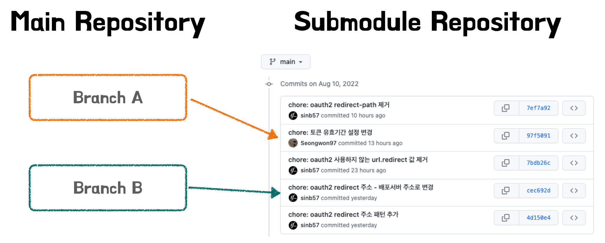
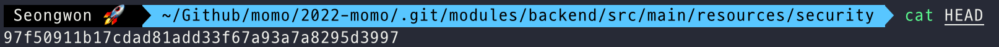
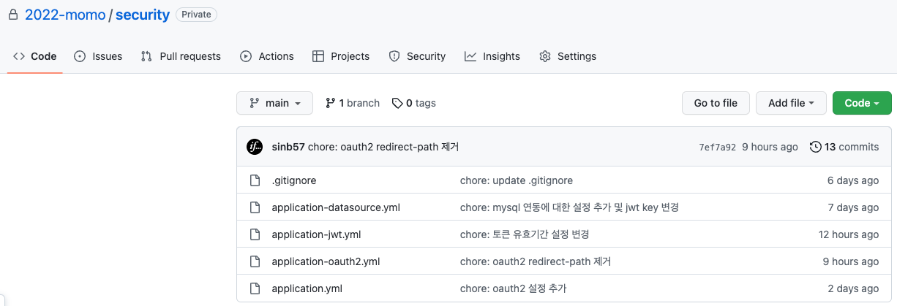
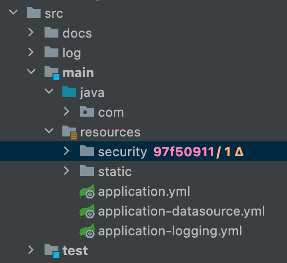
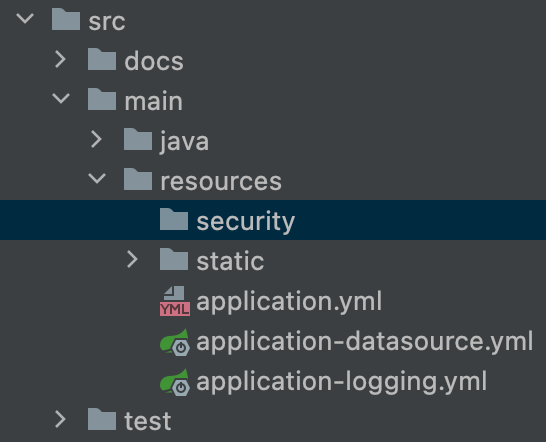
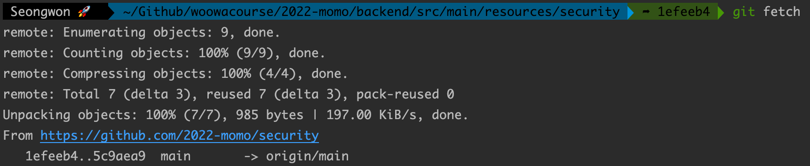
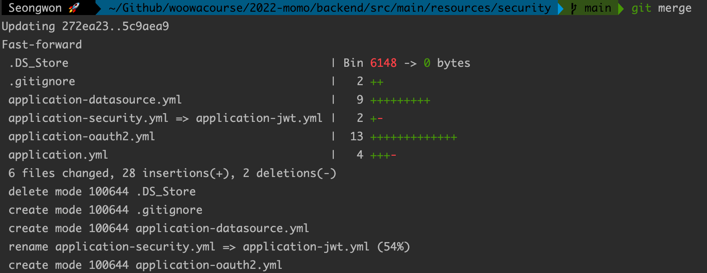

# 학습 계기

프로젝트를 진행하다보면 보안상의 문제로 Git에 올리지 못하는 데이터들이 존재한다. 필자의 경우 배포된 DB 인스턴스의 정보, Google OAuth 인증키, JWT 토큰의 Secret key등이 존재하였다. 서비스 배포를 할 때, 이러한 데이터들은 배포 서버의 환경변수로 설정하는 방법 또는 스크립트를 통해 직접 값을 변경하는 방법 등으로 해당 값들을 세팅해줄 수 있다. 하지만 이러한 방법들은 설정 값들에 변경이 있을 때마다 AWS에 접근을 하여 직접 변경을 해줘야하는 번거로움이 있다. 또한 여러개의 동일한 서버를 두는 경우 동일환 환경변수 세팅을 여러개의 EC2에 해줘야 한다는 불편함도 있다. 필자는 보안상 외부에 노출되면 안되는 정보들을 서브 모듈을 통해 관리를 함으로써 보다 편하게 관리를 하고있다. 오늘은 이러한 서브 모듈에 대해 정리해보려 한다.

# 서브모듈이란?

프로젝트를 수행할 때 외부에서 개발한 라이브러리라던가 내부 여러 프로잭트에서 공통으로 사용하는 라이브러리와 같은 다른 프로젝트를 사용해야하는 경우가 있다. Git Submodule은 Git 저장소 안에 다른 Git 저장소를 디렉토리로 분리해 넣으며 이러한 문제를 해결해준다. 즉, 메인(부모) 레포지토리 하위에 공통으로 사용하는 프로젝트를 자식 레포지토리를 두고 관리하며 문제를 해결하는 방법이다.

필자는 앞서 말했듯이 서브모듈을 공통으로 사용하는 라이브러리를 관리하기 위해 사용한 것이 아닌 외부에 노출되면 안되는 데이터들을 관리하기 위해 사용하였다.

# 알아둬야 할 부모-자식간의 관계

서브모듈은 앞서 부모 레포지토리 하위에 자식 레포지토리(서브모듈)를 둬서 관리하는 것이라 말하였다. 여기서 주의해야할 점이 있다. 부모와 자식의 관계라 생각하면 부모가 자식의 관리까지 모두 할 것이라 생각할 수 있는데 이러한 생각은 잘못된 접근을 유발할 수 있다. 서브모듈에서의 부모-자식 관계는 둘 사이의 연결있을뿐 부모가 자식의 값을 변경한다거나 자식이 변경되면 부모가 변경을 바로 알아차리는 등의 개념을 생각하면 안된다.

둘은 별개의 프로젝트로 관리가 되어 따로 버전 관리가 된다. 그래서 부모 레포지토리에서 서브모듈의 내용을 직접 변경할 수도 없다. 만약 서브 모듈의 파일들을 수정하고 싶다면 서브모듈 레포지토리에 직접 들어가서 수정을 해줘야 한다. 반대로 서브모듈의 값이 변경이 되어도 부모 레포지토리에서는 서브모듈의 변경을 알지 못한다. 이것은 개발자가 직접 최신화된 서브모듈로 업데이트를 해줘야 한다.

마지막으로 한가지 더 알아야 할 것이 있다. 설명을 하기 앞서 먼저 이미지 한장을 살펴보겠다.



위의 이미지를 보면 Branch A는 `chore: 토큰 유효기간 설정 변경`을 Branch B는 `chore: oauth2 redirect 주소 - 배포서버 주소로 변경`라는 커밋 로그를 각각 가르키는 것을 확인할 수 있다. 이와 같이 각각의 브랜치들이 가르키는 커밋 로그가 다른 이유는 무엇일까? 그것은 부모-자식간의 레포지토리의 연결은 커밋 로그를 기반으로 연결이 되기 때문이다. 즉, 메인 레포지토리의 각각의 브랜치들은 서브모듈의 커밋 로그를 “체크포인팅”하여서 해당 정보를 통해 서브 모듈의 데이터를 가져와 사용하게 된다. 이러한 동작 원리 때문에 서브모듈의 변경이 있어도 메인 레포디토리에서 변경 내용이 적용되지 않게 되는 것이다.

> 메인 레포지토리에서 참조하는 서브모듈의 커밋 주소는 `.git/modules` 하위의 서브 모듈 디렉터리로 이동한 후 HEAD 파일을 통해 확인할 수 있다.
>
> 

이제 이론에 대한 이야기는 멈추고 서브 모듈을 적용하는 방법에 대해 알아보겠다.

# 서브모듈 적용

## 준비

서브모듈을 적용하기 위해 먼저 private 레포지토리를 하나 생성한다. 필자의 경우 팀원들과 Project를 진행하는 중이며 현재 팀의 Organization이 있기에 Organization안에 security라는 이름의 Private 레포지토리를 만들었다. 레포지토를 private로 만든 이유는 외부에 노출되면 안되는 데이터들을 저장할 것이기에 서브모듈에 사용할 레포지토리를 private으로 생성하였다.

```bash
2022-momo          // 팀의 Organization
				⌙ security // 서브모듈에 사용할 레포지토리
```

이제 해당 레포지토리 안에 우리가 서브모듈로 관리를 하고 싶은 정보들을 추가한다. 필자는 yml파일을 분리하여 관리를 하다보니 `application-datasource.yml`, `application-jwt.yml`, `application-oauth2.yml`, `application.yml` 파일들을 위치시켰다.



## 서브모듈 추가

이제 앞서 만든 레포지토리를 서브모듈로 추가해보겠다. 서브 모듈 추가 명령어는 아래와 같다.

> 서브모듈 추가 명령어: `git submodule add {추가할 저장소의 url}`

서브모듈을 추가하면 아래의 사진과 같이 추가한 프로젝트 저장소의 이름으로 디렉토리가 생성된다.



Git은 앞서 생긴 디렉토리를 서브모듈로 취급하여 디렉터리 내부의 파일 수정사항을 추적하지 않는다. 또한 서브디렉토리와 하위 프로젝트 URL의 매핑 정보를 담은 설정파일인 `.gitmodules` 파일도 만들어진다.

`.gitmodules` 파일 내부는 아래와 같다. 해당 파일은 `.gitignore` 파일처럼 git을 통해 버전 관리를 하여서 프로젝트를 같이 진행하는 사람들은 `.gitmodules` 파일을 보고 해당 프로젝트에서 어떠한 서브모듈 프로젝트를 사용하는지 알 수 있다.

```bash
[submodule "backend/src/main/resources/security"]
		path = backend/src/main/resources/security
		url = https://github.com/2022-momo/security.git
		branch = main
```

## 서브모듈 포함한 프로젝트 클론

서브모듈을 포함하는 프로젝트를 clone하면 기본적으로 서브모듈 디렉터리는 존재하지만 디렉토리는 아래와 같이 비어있다.



서브모듈 레포지토리의 내용도 clone을 완전하게 하려면 2개의 명령어를 더 입력해야한다.

```bash
git submodule init // 서브모듈 정보를 기반으로 로컬 환경설정 파일 준비
git submodule update // 메인 레포지토리가 기억하는 submodule의 특정 커밋 시점으로 업데이트
```

위의 명령어를 통해 서브모듈의 환경을 준비하고 서브모듈의 데이터들을 가져올 수 있다. 결과는 아래와 같다.


만약 부모 레포지토리를 클론할 때 서브모듈까지 한번에 가져오고 싶다면 `git clone --recurse-submodules {저장소 URL}` 명령어를 통해 한번에 가져올 수도 있다.

## 서브모듈 업데이트

서브모듈 프로젝트를 최신으로 업데이트하려면 서브모듈 디렉토리로 이동하여 git fetch 명령을 실행하고 그 후에 git merge 명령을 통해 upstream의 브랜치를 merge해주면 된다.

```bash
git fetch // 서브모듈 레포지토리를 최신 버전으로 패치
git merge // 서브모듈 최신 버전을 현재 버전에 머지
```





또는 `git submodule update --remote` 명령어를 통해 Git이 알아서 서브모듈을 fetch하고 업데이트 하도록 할 수도 있다.

> 해당 명령어는 서브모듈로 등록된 모든 서브모듈을 업데이트하는 것이다. 특정 서브모듈만 업데이트 하고 싶다면 이름을 지정해주고 명령을 실행하면 된다.

# Reference

- [Git - 서브모듈](https://git-scm.com/book/ko/v2/Git-%EB%8F%84%EA%B5%AC-%EC%84%9C%EB%B8%8C%EB%AA%A8%EB%93%88)
- [Git 의 서브모듈(Submodule)](https://sgc109.github.io/2020/07/16/git-submodule/)
- [git submodule로 중요한 정보 관리하기](https://tecoble.techcourse.co.kr/post/2021-07-31-git-submodule/)
