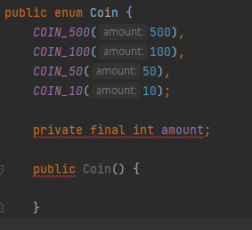
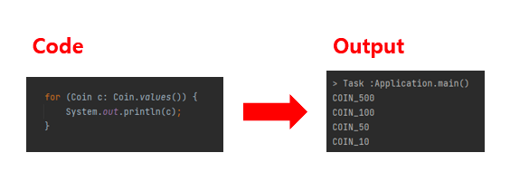

우테코 프리코스 3주차 과제의 요구사항 중 아래의 enum코드를 사용하라는 조건을 접하게 되었습니다.

```java
public enum Coin {
    COIN_500(500),
    COIN_100(100),
    COIN_50(50),
    COIN_10(10);

    private final int amount;

    Coin(final int amount) {
        this.amount = amount;
    }

    // 추가 기능 구현
}
```

기존까지는 enum을 사용을 크게 하지 않고 간단하게 보기 항목을 정의할 때만 사용을 하여 조건으로 주어진 코드는 새롭기도 하고 이해하기도 어려웠습니다. 코드를 한참 찾아보고 다른 지원자의 코드를 봐도 처음에 이해가 어려웠어서 enum을 이번 기회에 새롭게 공부를 하며 나만의 지식으로 만들기 위해 정리를 해보고자 합니다.

# enum class란?
enum은 Enumeration의 줄임말로 **서로 연관된 상수들의 집합**이라는 의미를 갖습니다. 우리가 일반적으로 상수(constant)를 정의할 때는 `static final`을 사용하여 정의합니다. 하지만 이러한 기존의 상수는 클래스 내에서 선언하는 부분은 네이밍이 겹칠 수 있고 불필요하게 상수가 많아진다는 단점이 발생합니다. 자바 1.5버전 부터는 `Enum`이 새로 생겨 `static final`로 만들어질 수 있는 단점들을 보완할 수 있게 되었습니다.


## enum의 이점
1. 코드가 단순해지며, 가독성이 좋아진다.
2. 인스턴스 생성과 상속을 방지하여 상수의 타입 안정성이 보장됩니다.
3. enum class를 사용해 새로운 상수들의 타입을 정의함으로정의한 타입 이외의 타입을 가진 테이터 값을 컴파일시 체크한다.
4. 키워드 enum을 사용하기 때문에 구현의 의도가 열거임을 분명하게 알 수 있다.

> 출처 : https://limkydev.tistory.com/50

## enum의 특징
#### 1. 클래스를 상수처럼 사용할 수 있다.
```java
public enum Coin {
    COIN_500(500),
    COIN_100(100),
    COIN_50(50),
    COIN_10(10);

    private final int amount;

    Coin(final int amount) {
        this.amount = amount;
    }
}
```
우테코 프리코스의 코드를 보면 `default`생성자는 `private`으로 되어 있는 것을 확인할 수 있습니다. 그리고 이를 `public`으로 변경하는 경우 컴파일 에러가 발생합니다.



이는 다른 상수들이 클래스 로드 시점에 생성되는 것처럼 enum 또한 생성자가 존재하지만 클래스가 로드되는 시점에서 생성되기에 임의로 생성해서 사용할 수 없는 것입니다.

사용을 할 때는 `Coin.COIN_500`과 같이 사용하면 됩니다.


#### 2. Enum 클래스를 구현하는 경우 상수 값과 같이 유일하게 하나의 인스턴스가 생성되어 사용된다.
- enum은 `싱글톤`형태로 하나의 애플리케이션 안에서 하개의 인스턴스로 생성되어 사용됩니다. 그래서 enum에 인스턴스 변수를 추가하는 것은 위험할 수 있습니다.

#### 3. 서로 관련 있는 상수 값들을 모아 enum으로 구현하는 경우가 유용하다.
- 저는 해당 내용이 enum을 사용을 하는 가장 큰 이유라고 생각됩니다.

#### 4. 클래스와 같은 문법 체계를 따른다.
- 클래스의 형태를 보이고 있어 관련 로직들을 enum클래스 내에서 관리할 수 있습니다.

#### 5. 상속을 지원하지 않는다.
- enum은 `java.lang.enum`의 상속을 받기 때문에 다른 상속을 지원하지 않는다.

## Enum의 API들
### 1. values()



- `values()`는 Enum 클래스가 갖고 있는 인스턴스가 담긴 배열을 반환하는 작업을 합니다.
  위의 코드를 보면 해당 enum이 가진 모든 인스턴스 값들을 반환하여 출력되는 것을 확인할 수 있습니다.


### 2. valueOf()
- `valueOf()`는 string의 입력을 받아 일치하는 인스턴스의 이름이 존재한다면 해당 인스턴스를 반환해줍니다.


### 3. toString()
- enum에서 `toString()`은 인스턴스의 이름을 리턴합니다.

### 4. name()
- 해당 메서드 또한 인스턴스의 이름을 리턴해줍니다.

## 프리코스 3주차에서의 Enum활용
우테코 프리코스 3주차 자판기 미션을 활용하면서 저는 enum클래스를 다음과 같이 작성하였습니다. 코드를 살펴보면 앞서 말한 enum의 특징인 enum은 클래스와 같은 문법 체계를 따르고 관련있는 상수들을 모아서 관리를 한 것을 확인하실 수 있습니다.
```java
public enum Coin {
    COIN_500(500),
    COIN_100(100),
    COIN_50(50),
    COIN_10(10);

    private final int amount;


    Coin(final int amount) {
        this.amount = amount;
    }

    public static List<Coin> getCoinList() {
        return Arrays.stream(Coin.values())
                .sequential()
                .collect(Collectors.toList());
    }

    public static List<Integer> getCoinValueList() {
        return Arrays.stream(Coin.values())
                .map(Coin::getAmount)
                .sequential()
                .collect(Collectors.toList());
    }

    public static List<Integer> getAvailableCoinValueList(int remainMoney) {
        return Arrays.stream(Coin.values())
                .filter(coin -> coin.getAmount() <= remainMoney)
                .map(Coin::getAmount)
                .sequential()
                .collect(Collectors.toList());
    }

    public int getAmount() {
        return amount;
    }

    public static Coin getEnumCoin(int amount) {
        return Arrays.stream(Coin.values())
                .filter(coin -> coin.getAmount() == amount)
                .sequential().collect(Collectors.toList()).get(0);
    }
}
```

**getAvailableCoinValueList(int remainMoney)**은 enum 클래스의 인스턴스 중에서 파라미터로 넘어온 값보다 작거나 같은 값들의 인스턴스들을 list로 반환하는 메서드 입니다.
```java
    public static List<Integer> getAvailableCoinValueList(int remainMoney) {
        return Arrays.stream(Coin.values())
                .filter(coin -> coin.getAmount() <= remainMoney)
                .map(Coin::getAmount)
                .sequential()
                .collect(Collectors.toList());
    }
```

**getCoinList(), getCoinValueList()**는 enum의 기본 API인 `values()`는 enum 인스턴스의 배열을 return 해주는데 이를 stream을 사용하여 각각 coin 인스턴스와 인스턴스의 값을 list로 반환하도록 커스텀한 메서드 입니다.
```java
    public static List<Coin> getCoinList() {
        return Arrays.stream(Coin.values())
                .sequential()
                .collect(Collectors.toList());
    }

    public static List<Integer> getCoinValueList() {
        return Arrays.stream(Coin.values())
                .map(Coin::getAmount)
                .sequential()
                .collect(Collectors.toList());
    }
```

**getEnumCoin(int amount)**메서드는 인스턴스의 값에 해당하는 인스턴스를 return하도록 커스텀한 메서드 입니다.
```java
    public static Coin getEnumCoin(int amount) {
        return Arrays.stream(Coin.values())
                .filter(coin -> coin.getAmount() == amount)
                .sequential().collect(Collectors.toList()).get(0);
    }
    // ex) 500을 대입하면 COIN_500을 return
```

## 정리
enum은 연관된 상수들을 관리하는 집합으로 이를 사용하면 코드의 가독성, 안정성 등이 올라갑니다. 또한 enum은 클래스와 같은 문법 체계를 사용하여 enum의 기본 사용법만 알고 있다면 Java프로그래밍을 하는 누구나 쉽게 사용할 수 있을 것입니다.

enum은 이전까지 프로그래밍을 하여 사용 빈도가 적었던 것은 사실입니다. 하지만 이번 기회에 enum의 기본적인 형태와 사용법을 알게 되었고 앞으로는 이를 활용하여 더욱 가독성 좋은 코드를 작성하도록 노력해보고자 합니다.

> ※ 해당 post는 [카일님](https://velog.io/@kyle/%EC%9E%90%EB%B0%94-Enum-%EA%B8%B0%EB%B3%B8-%EB%B0%8F-%ED%99%9C%EC%9A%A9) 의 포스트를 참조하며 작성하였습니다.


# Reference
- https://velog.io/@kyle/%EC%9E%90%EB%B0%94-Enum-%EA%B8%B0%EB%B3%B8-%EB%B0%8F-%ED%99%9C%EC%9A%A9
- https://limkydev.tistory.com/50
