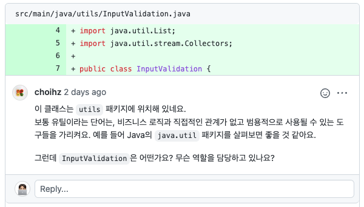

# Utils의 이해

우아한테크코스의 로또 미션을 진행하던중 다음과 같은 피드백을 받았습니다.



정리를 해보면 `utils에는 비즈니스 로직과 직접적인 관계가 없고 범용적으로 사용할 수 있는 도구들이 있어야한다.`는 피드백입니다.
하지만 제가 `utils` 디렉터리에 작성한 `InputValidation.java` 파일에서는 어떤 작업들을 하였을까요?

해당 파일에 위치한 메서드들은 다음과 같습니다.

- 입력 값이 정수가 아닐경우 예외상황 throw
- 입력 금액이 1000원 이하일 경우 예외상황 throw
- 당첨번호의 입력값이 6개 이하일 경우 예외상황 throw
- 각각의 입력값을 integer 또는 Set<Integer>으로 변경하여 값을 반환

해당 메서드의 작업 내용을 보면 `입력 금액이 1000원 이하일 경우 예외상황 throw`, `당첨번호의 입력값이 6개 이하일 경우 예외상황 throw`의 경우는
확실히 비즈니스 로직과 직접적인 관계를 갖고 있는 것을 알 수 있습니다.
또한 `각각의 입력값을 integer 또는 Set<Integer>으로 변경하여 값을 반환`도 어떻게 보면 view에서 입력을 받는 작업 뿐만 아니라
비즈니스 로직에서 실제로 사용할 값들을 가공하는 일을 하고있다고 볼 수 있습니다.

이러한 내용들은 Utils가 아닌 각각의 domain에 위치시키는 것이 맞습니다. 즉, `입력 금액이 1000원 이하일 경우 예외상황 throw`의 경우는
실질적으로 금액을 사용하는 `Store`클래스에, `당첨번호의 입력값이 6개 이하일 경우 예외상황 throw`은 실질적으로 당첨번호를 입력받아 저장을 하는 `WinningNumbers`에 위치하여야합니다.

> 📌 utils에는 비즈니스 로직과 직접적인 관계가 없고 범용적으로 사용할 수 있는 도구들이 있어야한다.

# 제너릭 인터페이스를 활용한 예외처리
앞서 소개한 utils에 위치하였던 `InputValidation.java`의 메서드들을 각각의 domain에 분리를 하다보니,
InputView에서 예외를 잡고 다시 입력을 받아주는 메서드를 호출하는데 사용했던 `try-catch`가 컨트롤러로 이동하게 되었습니다.

컨트롤러에서 각각의 입력에 따라 생성되는 `try-catch`문들을 controller코드를 더욱 복잡해보이게 한다는 생각이 들었습니다.

```java
    public static int inputPrice() {
        try {
            System.out.println(INPUT_PRICE);
            return InputValidation.validatePrice(scanner.nextLine());
        } catch (IllegalArgumentException e) {
            System.out.println(e.getMessage());
            return inputPrice();
        }
    }

    public static Set<Integer> inputWinningLottoNumbers() {
        try {
            System.out.println(INPUT_WINNING_LOTTO_NUMBERS);
            return InputValidation.validateWinningNumber(scanner.nextLine());
        } catch (IllegalArgumentException e) {
            System.out.println(e.getMessage());
            return inputWinningLottoNumbers();
        }
    }

    public static int inputBonus() {
        try {
            System.out.println(INPUT_BONUS_NUMBER);
            return InputValidation.validateBonusNumber(scanner.nextLine());
        } catch (IllegalArgumentException e) {
            System.out.println(e.getMessage());
            return inputBonus();
        }
    }
```

해당 코드를 줄여보고자 다른 크루들은 어떠한 방법으로 해당 로직을 작성하였는가 크루들의 코드를 구경하던중
제너릭 인터페이스를 활용하여 반복된 `try-catch`문을 줄인 [필즈의 미션 코드](https://github.com/progress0407/java-lotto/tree/step1) 를 봤습니다.

필즈의 코드를 보고 저의 코드에도 반영을 해보며 `try-catch`의 반복을 줄여봤습니다.

```java
public class InputView {
  ...

    public interface IndividualInput<T> {
        T get();
    }

    public static <T> T commonInputProcess(IndividualInput<T> individualInputs) {
        try {
            return individualInputs.get();
        } catch (IllegalArgumentException e) {
            System.out.println(e.getMessage());
            return commonInputProcess(individualInputs);
        }
    }
  ...
}

public class LottoGameController {
    public void run() {
        final Lottos purchasedLotto = InputView.commonInputProcess(
                () -> Store.purchaseLottos(InputView.inputPrice()));
      ...
    }
}
```
코드는 위와 같이 InputView에 제너릭 인터페이스와 `try-catch`를 처리해주는 제너릭 메서드를 추가해주면
해당 메서드를 통해 반복된 `try-catch`문을 제거할 수 있었습니다.

> 자세한 코드는 [렉스의 로또 미션](https://github.com/Seongwon97/java-lotto/tree/step2) 에서 확인하실 수 있습니다.
