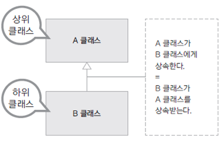

# 자바의 상속
상속 기능을 사용하면 이미 구현되어있는 class를 이용하여 속성이나 기능들을 확장하여 새로운 class를 만들 수 있다.
이를 이용해 A,B 클래스에 중복된 코드가 있을 경우 중복된 코드를 갖는 부모 클래스 C를 생성하고 상속을 시켜 코드의 중복을 줄일 수 있다.

상속은 일반적으로 기존 클래스보다 더 구체적이고 새로운 기능을 가진 클래스를 구현해야할 때 상속을 한다.



> 상속하는 클래스 : 상위 클래스, parent class, base class, super class
> 상속받는 클래스 : 하위 클래스, child class, derived class, subclass

- 클래스 상속은 `class B extends A {}`와 같이 진행을 하며, A의 위치에는 단 하나의 클래스만 올 수 있다.
  - Java는 단일 상속만을 지원한다.
  - `extends`는 부모 클래스의 모든 필드와 메서드를 자식 클래스가 상속하도록 지원하는 Keyword이다.
  - 상속을 할 경우 멤버 필드와 메서드를 하위 클래스에서 그대로 상속하게 된다.

## 🧑🏻‍💻 사용 예제
```java
// Customer.java
public class Customer {

  protected int customerId;
  protected String customerName;
  protected String customerGrade;

  public Customer(int customerId, String customerName) {
    this.customerId = customerId;
    this.customerName = customerName;
    customerGrade = "SILVER";

    System.out.println("Customer() called");
  }

  public String showCustomerInfo() {
    return customerName + "님의 등급은 " + customerGrade + "입니다.";
  }
}

// VIPCustomer.java (Customer를 상속받는 클래스)
public class VIPCustomer extends Customer {

  private double saleRatio;

  public VIPCustomer(int customerId, String customerName) {
    super(customerId, customerName);
    customerGrade = "VIP";
    saleRatio = 0.1;

    System.out.println("VIP Customer() called");
  }
}

// Application.java
public class Application {

  public static void main(String[] args) {
    // TODO Auto-generated method stub
    Customer customer1 = new Customer(10010, "Rex");
    System.out.println(customer1.showCustomerInfo());

    VIPCustomer customer2 = new VIPCustomer(10020, "Mac");
    System.out.println(customer2.showCustomerInfo());
  }
}
```

> - `protected`는 하위 class는 접근 가능하나 그 외에는 접근하지 못하는 접근 제어자이다.
> - `private` 멤버 변수였으면 하위 클래스에서도 접근이 불가하다.


## 하위 class (child class)
- 하위 class를 생성한다면 상위 클래스가 먼저 생성된다. 위의 예제에서는 생성자에 매개변수를 넣어 `VIPCustomer()`생성자에 같은 매개변수를 받고 `super()`를 사용해했다.
하지만 매개변수가 없는 기본 생성자의 경우 `new VIPCustomer()`을 호출하면 `Customer`의 생성자가 자동으로 먼저 호출된다.
- 하위 class는 `super`키워드를 통하여 상위 클래스에 대해 참조값을 얻으며 `super`를 통해 상위 클래스의 매서드나 멤버 변수에 접근한다.
- 상속 받은 클래스에서는 부모 클래스의 필드에 있는 변수, 메서드를 바로 사용할 수 있다. 하지만 이러한 것들에는 모두 `supaer`가 생략된 것이다.
- `super()`는 상위 클래스의 기본 생성자를 호출하며 하위클래스에서 상위클래스를 따로 호출하지 않는다면 자동으로 `super()`이 호출된다. (상위 클래스의 기본 생성자가 반드시 존재해야한다.)
- 상위 클래스의 기본 생성자가 없고 다른 생성자가 있는 경우 하위 클래스에서는 `super`를 이용하여 직접 상위 클래스의 생성자를 호출해야한다.

## 추상화 & 추상 클래스
- 추상 매서드(Abstract method) : interface와 같이 구현 코드 없이 매서드의 선언만 있는 것을 의미한다.
  ex) `int add(int x, int y);`
- 추상 매서드를 가진 클래스를 추상 클래스라고 하며 추상 매서드는 하위 클래스가 상속하여 구현한다.
- 추상 매서드를 가진 클래스는 무조건 추상 클래스로 만들어야한다.
- 추상 클래스를 상속받은 하위 클래스는 상위 클래스와 같게 추상 클래스로 만들던가, 상위 클래스의 추상 매서드를 재정의(Overriding)하던가 해야한다.
  (상위 클래스에 2개의 추상 매서드가 있는데 하위 클래스에서 1개의 매서드만 재정의하고 싶다면 하위 클래스도 추상 클래스로 만들어야한다.)
  즉, 모든 상위 클래스의 추상 매서드를 재정의할 것이 아니라면 하위 클래스도 추상 클래스로 만들어야한다.
- 상위 클래스의 추상 매서드를 다 재정의 하였어도 해당 하위클래스를 추상 클래스로 지정할 수도 있다.
- 추상 클래스는 `new`를 통해 새로운 인스턴스를 생성할 수 없다.
- 추상 클래스는 상속만을 하기 위해 만드는 클래스이다.
- 무조건 추상화를 한다고 좋은건 아니다, 확장성은 늘어나지만 복잡해질 수 있다.
- 사용순서
  - 공통으로 들어갈 부분 분리부터 생각하며 구현을 하는 것이 아니라, 구현을 먼저 한 후에 공통된 부분이 있으면 해당 부분을 추상화 하는 것이 좋다

```java
// Computer.java
public abstract class Computer {

    public abstract void display();
    public abstract void typing();

    public void turnOn() {
        System.out.println("전원을 켭니다.");
    }

    public void turnOff() {
        System.out.println("전원을 끕니다.");
    }
}

// Desktop.java (Computer클래스를 상속)
public class Desktop extends Computer {

  @Override
  public void display() {
    System.out.println("Desktop display");
  }

  @Override
  public void typing() {
    System.out.println("Desktop typing");
  }
}

// Application.java
public class Application {

  public static void main(String[] args) {
    //Computer desktop = new Computer();
    // 추상 class는 new를 통해 새로운 instance를 만들 수 없다.
    Computer desktop = new Desktop();
    desktop.display(); // Desktop display
    desktop.typing(); // Desktop typing
    desktop.turnOn(); // 전원을 켭니다.
    desktop.turnOff(); // 전원을 끕니다.
  }
}
```


## 업캐스팅, 형 변환 (Upcasting)
- 하위 클래스를 생성하면 상위 클래스도 생성됨으로 하위 클래스는 상위 클래스의 타입을 모두 내포하고 있어서 형 변환이 가능하다.
- 상속 관계에 있어서 모든 하위 클래스는 상위 클래스로 형변환이 되며 반대로는 성립하지 않는다.
- `List<Integer> integers = new ArrayList<>();`가 대표적인 예시이다.

```java
Customer customer = new VIPCustomer();
```

## 다운캐스팅 (Downcasting)
- 업 케스팅된 클래스를 다시 원래의 타입으로 형변환 하는 것을 의미한다.
- 업 케스팅된 인스턴스 변수에서 하위 클래스의 메서드를 사용하기 위해서는 다운캐스팅을 해야한다.
- 업 케스팅의 경우는 자동으로 됐으나 다운 캐스팅의 경우는 명시적으로 해야한다.
- 다운 캐스팅의 경우 강제 형변환과, `cast()`를 통한 변환이 가능하다.  두가지 방법 중에서는 `cast()`를 통한 변환이 더 좋습니다.
- 다운 캐스팅을 하는 경우, 해당 인스턴스를 올바른 클래스로 캐스팅 하려는 것인지에 대해서는  컴파일러가 에러를 잡아주지 못하여 `instanceof`를 통해 타입을 체크하고 해줘야한다.

```java
if (vipCustomer instanceof Customer) {
  // 강제 형변환
  Customer customer = (Customer) vipCustomer;
  // cast()를 통한 변환, 위보다는 아래를 더 추천
  Customer.class.cast(vipCustomer);
}
```
