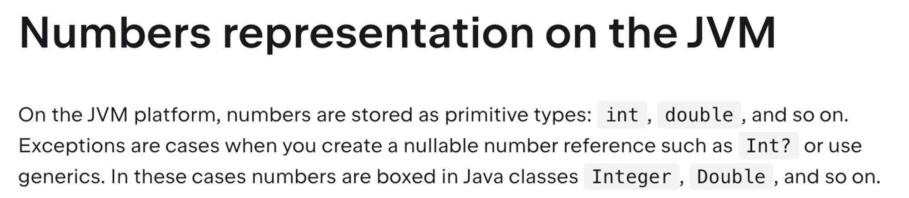
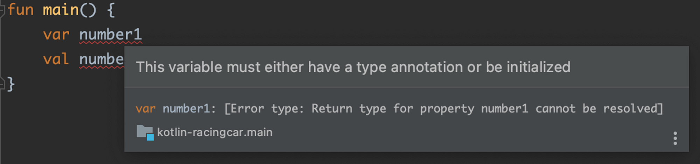
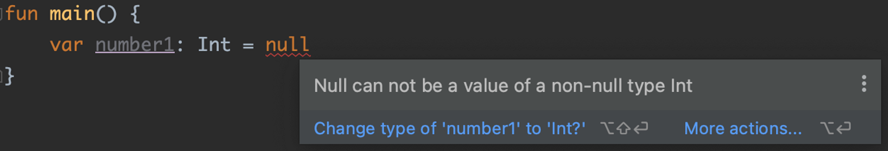

# 변수 타입

## `var`과 `val`

코틀린에서는 모든 변수 앞에 var이나 val을 붙여줘야 한다.

```kotlin
fun main() {
   var x = 10 // 재할당 가능
   x = 12 // 재할당 가능

   val y = 10 // 재할당 불가능, java의 final이 붙은 변수와 동일
   y = 12 // 컴파일 에러가 발생
}
```

`var`은 variable의 약자로 가변 변수를 뜻하며, `val`은 Value의 약자로 불변 변수를 뜻한다.

즉, val은 Java에서 `final` 키워드를 붙인 변수와 같다.

> Java에서 `final` 키워드가 붙은 Collection 타입의 변수에 Element는 `add()`, `remove()` 할 수 있는 것처럼 val키워드도 동일하게 Element의 추가, 삭제가 가능하다.
>

## 타입 지정

코틀린은 기본적으로 var과 val을 통해 변수를 타입추론으로 사용한다. 하지만 명시적으로 타입을 제한하고 싶다면 Int, String, Double과 같이 자바의 Warpper Class처럼 첫 문자가 대분자로 타입 이름을 `var i: Int = 10` 와 같이 붙여주면 된다.

```kotlin
fun main() {
    var x = 10
    var i: Int = 10
    var l: Long = 1L
    var name: String = "성원"
    var point: Double = 3.3
}
```

> 코틀린은 세미콜론(`;`)을 사용하지 않는다.
>

## Primitive type과 Reference Type

자바는 int, long, double, boolean 등의 값들은 Primitive type과 Reference Type를 제공한다. Primitive type와 다르게 Reference Type는 매번 객체를 새로 생성하여 불필요한 사용은 지양하는 것이 좋다.

> `이펙티브자바 아이템6. 불필요한 객체 생성을 피하라.` 의 내용만 살펴봐도 자바가 오토박싱(Auto Boxing)을 지원하더라도 불필요한 객체 생성을 피하기 위해 boxing된 Reference Type의 사용보다는 Primitive type를 사용하라고 한다.
>

하지만 코들린의 타입 지정 값을 보면 Long, Double 등 자바의 Wapper Class의 형태로 타입을 지정하고 있다.

```kotlin
fun main() {
    var x = 10
    var i: Int = 10
    var l: Long = 1L
    var name: String = "성원"
    var point: Double = 3.3
}
```

코틀린은 둘의 구분없이 개발자에게 한가지 타입만 제공하여 코딩을 할 때는 Primitive type과 Reference Type를 고려하지 않아도 된다.

코틀린 공식문서를 보면 코틀린은 JVM 플랫폼 위에서 숫자를 기본적으로 primitive type으로 저장하고 `Int?` 와 같은 nullable한 변수를 생성하거나 제너릭을 사용할 때는 Boxing된 Reference Type를 만들어 사용하도록 동작한다고 한다.



## 변수의 초기화

Java는 아래와 같이 변수의 초기화 없이 변수를 만들 수 있다.

```java
public class Main {
    public static void main(String[] args) {
        int number1;
        int number2;
    }
}
```

가변 변수를 사용하는 코틀린은 초기화가 없을 경우, 타입을 추론할 수 없기에 변수를 생성할 때 초기화를 하지 않을 경우 아래와 같이 경고창이 뜬다.



## 코틀린의 Null

코틀린은 기본적으로 변수들에 null이 들어가지 못하게 만들었다. 그렇기에 변수에 앞서 봤듯이 변수를 지정하며 null을 할당하려하면 아래와 같은 에러가 나온다.



기본적인 변수들은 Null이 들어가지 못하기 때문에 변수의 타입을 지정해주었을 때, null을 넣게 된다면 타입 뒤에 `?` 를 붙여줘야 한다.

```kotlin
fun main() {
    val name1: String = null // null을 넣을 수 없다.
    val name2: String? = null // null을 넣을 수 있다.
}
```

코틀린은 `?` 가 붙은 타입과 붙지 않은 타입을 완전히 다른 타입으로 보고 관리한다. 둘을 다른 타입으로 보며 nullable한 타입의 null 체크를 간편하게 하기 위해 아래와 같이 변수명 뒤에 Safe Call(`?.`)를 붙여주면 null체크를 간단하게 해주는 기능을 제공하고 있다.

```kotlin
fun main() {
    var name: String? = "Seongwon"

    val length1 = name.length // null이 가능하기에 if (name != null) 블록으로 묶어야만 실행 가능하다.
    val length2 = name?.length // null이 아니면 length를 호출하게 된다.
}
```

### Elvis 연산자

자바의 경우 nullable 타입의 null에 대한 처리를 할 경우, 아래와 같이 코드를 작성해야 한다.

```kotlin
public String nameSubSeq(String str, int start, int end) {
    if (str == null) {
        // Null일 경우 동작 내용
    }
    return str.substring(start, end);
}
```

Elvis 연산자(`?:`)는 null일 경우 추후 실행될 동작 등을 간편하게 정의할 수 있다.

```kotlin
fun main() {
    val name: String? = null
    
    // name이 null일 경우 name에 Seongwon대입
    val name2 = name?.subSequence(0, 8) ?: "Seongwon"

    // name이 null일 경우 예외 발생
    val name3 = name?.subSequence(0, 8)
        ?: throw IllegalArgumentException("null값 입니다.")
}
```

# 📚Reference
- [자바 개발자를 위한 코틀린 입문(Java to Kotlin Starter Guide) - 인프런 | 강의](https://www.inflearn.com/course/java-to-kotlin/dashboard)
- [Kotlin 공식 문서](https://kotlinlang.org/docs/numbers.html#numbers-representation-on-the-jvm)
