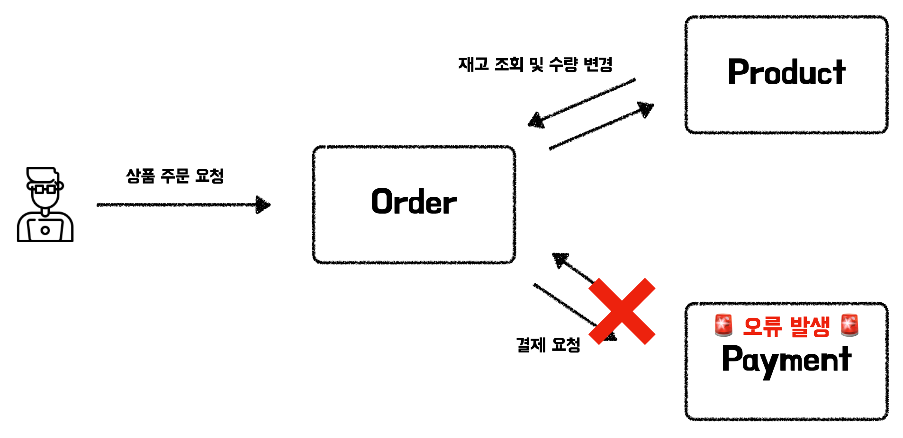
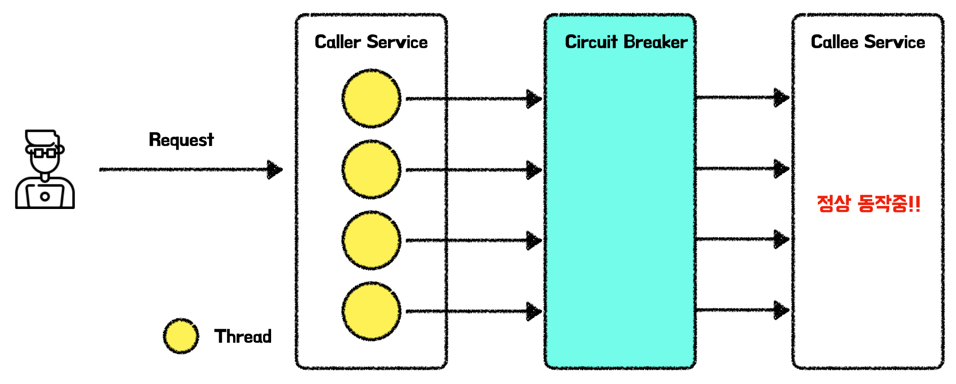
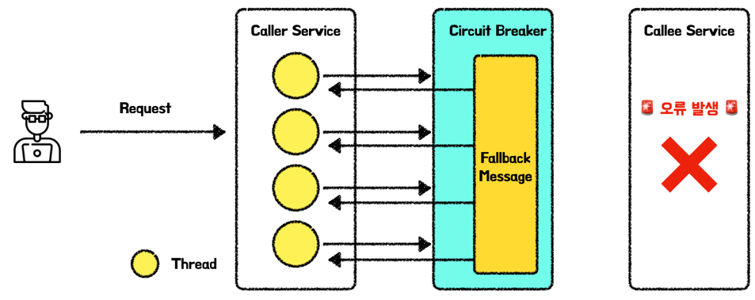
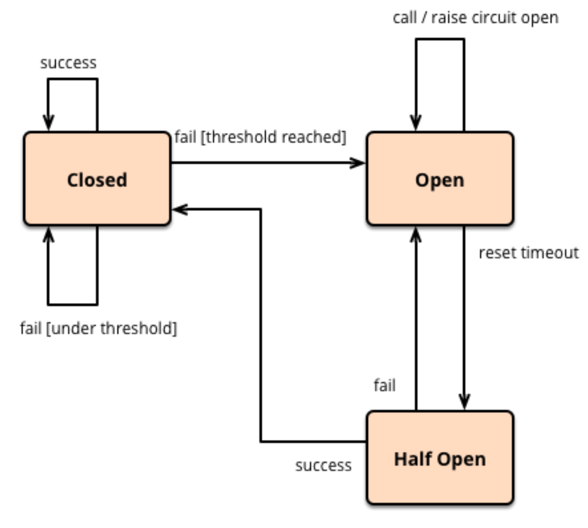
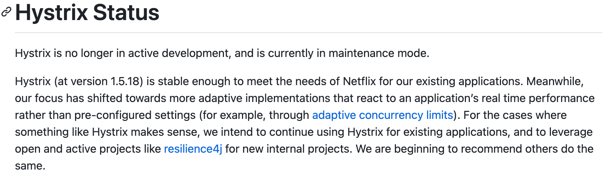

최근에 여러 회사에 입사를 하여 근무를 하고 있는 우테코 크루들을 만나 이야기하던 중 그동안 몰랐던 새로운 키워드들을 많이 얻게 됐다. 앞으로 해당 키워드들을 하나씩 공부하며 정리를 하려한다. 이번 게시글에서는 얻은 키워드 중 하나인 서킷 브레이커 패턴에 대해 다뤄보겠다.

# MSA의 서비스(컴포넌트)간 장애 전파 문제

많은 기업들이 안정적인 서비스를 제공하고자 시스템 구성을 Monolithic한 구조가 아닌 MSA 구조로 구조를 구성하고 있다. 그 결과 클라이언트가 API 호출을 하면 서버는 내부적으로 여러 서비스(컴포넌트)들간 통신을 하며 사용자의 응답을 만들어 반환한다. 이러한 과정속에서 특정 서비스에 오류가 발생하면 어떻게 될까??

위와 그림은 상품 주문 서비스의 예시이다. 정상적인 동작은 다음과 같다.

사용자가 주문을 요청하면 서버에서 내부적으로 상품의 재고 조회 및 수량 변경, 그리고 외부 은행사에 결제를 요청 및 승인 응답을 받으며 사용자의 주문 요청이 성공하게 된다.

하지만 이러한 과정속에서 PG 서비스의 오류 또는 결제사 서비스의 오류가 발생했다고 생각해보자. 사용자가 주문 요청 API를 호출하면 Order서비스에서 요청을 처리하기 위해 한 개의 스레드를 점유하고 있을 것이다. 이때 Order서비스는 Payment서비스의 결제 요청 API를 호출하였는데 해당 서비스에 오류가 발생하여 응답을 받지 못하고 타임아웃이 발생할 때까지 계속 기다리게 된다. 이러한 상황 속에서 Order서비스의 상품 주문 요청이 지속적으로 발생한다면 결국 Order서비스에는 남는 스레드가 없어서 이후의 다른 요청들을 처리할 수 없는 상태가 된다. 즉, Payment서비스의 오류가 Order서비스에도 전파된 것이다. 또한 사용자의 요청이 계속 들어올 경우 Order 서비스는 오류가 발생한 Payment서비스에 지속적으로 결제 요청을 보내어 Payment서비스의 장애 복구를 방해할 수도 있다.

특정 서비스가 느려지거나 장애가 발생하면 해당 서비스를 호출하는 종속된 서비스까지 장애가 전파되는 이러한 문제는 MSA의 흔한 문제점 중 하나이다. 문제는 하나의 서비스의 장애가 전체 서비스의 장애로 커질 수도 있으며 장애 시작점을 파악하기 어려워지게 된다. 이러한 문제를 해결해주는 것이 바로 서킷 브레이커 패턴이다.

# 서킷 브레이커 패턴(Circuit Breaker Pattern)이란?

서킷 브레이커 패턴은 실제 세계에서의 회로 차단기와 같은 역할을 한다. 실생활에서 회로 차단기는 집 안 전자기구에 문제가 발생였을 때, 전류가 지속적으로 흐르면 큰 문제가 발생할 수 있어 이를 방지하기 위해 차단기가 전류를 차단하게 된다. 서킷 브레이커는 회로 차단기과 같이 특정 서비스에 문제가 문제가 발생하였을 경우, 해당 문제가 더 커지지 않게 이를 파악하고 요청을 차단하는 동작을 하게 된다.

이미지를 통해 더 자세히 살펴보겠다. 서킷 브레이커는 Caller 서비스와 Callee 서비스 사이에 설치하며, 서비스가 정상 동작할 때는 요청을 넘겨주게 된다.

하지만 Callee 서비스에 문제가 발생할 경우, 서킷 브레이커가 이를 감지한 후에는 Callee서비스로의 호출을 강제로 끊고 Caller의 스레드들이 요청을 더 이상 기다리지 않고 오류를 반환하게 하며 장애의 전파를 방지한다. 단순히 요청을 끊는 것 뿐만 아니라 Fallback 메시지를 통해 사전에 정의한 룰에 따라 다른 메시지를 응답하게 하여, 이후의 동작을 커스터마이징 할 수 있다.

# 서킷 브레이커의 상태

서킷 브레이커는 Closed, Open, Half Open으로 3가지 상태를 갖고 상태에 따라 요청을 넘겨줄지 요청을 끊고 Fallback 처리를 할지 결정한다.

- **Closed** : 실패율이 임계치보다 낮은 상황으로 요청을 Callee 시스템으로 전달한다.
- **Open** : 실패율이 임계치보다 높은 상황으로 Callee 시스템에 장애가 발생하였다 판단하여 요청을 차단한다.
- **Half Open** : Open상태에서 일정 시간이 지나면 HalfOpen 상태가 된다. 해당 상태에서는 일부 허용된 요청들이 성공할 경우 Closed상태로, 실패인 경우 Open 상태로 변경한다.

장애의 판단 기준은 Show call과 Failure call이 존재한다. 서킷 브레이커에서는 각각 임계치를 정해두고 임계치가 넘어갈 경우 Open상태로 변환하여 요청을 차단한다.

- **Show call** : 기준 시간보다 오래 걸린 요청
- **Failure call** : 실패하거나 오류를 받은 요청

# 서킷 브레이커의 상태에 따른 동작

1. Callee서비스가 정상 동작하는 경우 서킷 브레이커는 Closed 상태로 Caller로부터의 요청을 Callee로 전달한다.
2. Callee에 문제가 발생하여 요청들이 실패 임계치를 넘을 경우 서킷 브레이커는 Open 상태로 변한다.
3. 이후의 요청들은 서킷 브레이커에 의해 차단되어 빠르게 실패 응답을 반환하거나 Fallback으로 설정한 동작을 수행한다.
4. Open상태에서 특정 시간이 지나면 Half Open 상태로 변화한다.
5. Half Open 상태에서 일부 허용된 요청들을 Callee로 통과시켜 요청을 보낸다.
6. Callee로 보낸 요청들이 정상적으로 응답오면 Closed상태로 변경하고, 요청이 실패할 경우 다시 Open상태로 변경한다.

# 서킷 브레이커의 장점

- 장애 감지 및 격리
    - 장애가 발생한 서비스를 지속적으로 호출하면 스레드들은 타임아웃이 발생할 때까지 대기하여 스레드와 메모리, CPU 자원 등을 점유하여 문제를 발생할 수 있다. 서킷 브레이커는 Callee 서비스의 장애를 감지하면 이후의 요청을 보내지 않고 차단 및 빠른 응답을 보내게 해주어 장애의 전파를 막아준다.
- 자동 시스템 복구
    - 서킷 브레이커는 Closed, Open, Half Open 상태로 스스로 변경하여 개발자가 Callee시스템이 복구되었을 때 Caller 서비스의 복구 설정을 따로 설정할 필요가 없다. 이는 서킷 브레이커가 상태 변경을 해가며 자동으로 복구해준다.
- 빠른 실패 및 응답
    - Callee에 에러가 발생할 경우 서킷 브레이커가 빠른 응답을 반환하여 API 응답도 빠르게 받을 수 있다.
- 장애 서비스(Callee)로의 부하 감소
    - 서킷 브레이커가 없을 경우 장애가 발생한 Callee로 지속적인 요청이 보내질 것이다. 서킷 브레이커는 이러한 요청을 차단하여 Callee서비스의 장애 복구 상황을 개선해준다.
- 장애 대응 커스터마이징
    - Fallback message를 통해 미리 설정해둔 방법에 따라 캐시된 데이터를 전달해준다던가, 다른 서비스를 호출하는 등의 장애 대응을 커스터마이징할 수 있다.

# 서킷 브레이커 라이브러리

자바 진영에서의 서킷 브레이커 라이브러리는 넷플릭스에서 개발한 [Hystrix](https://github.com/Netflix/Hystrix)와 [Resilience4J](https://github.com/resilience4j/resilience4j)가 존재한다. 하지만 Hystrix는 현재 추가적인 개발은 진행되지 않고 유지보수만 진행중이라 합니다.

# 📚 Reference
- [martinfowler - CircuitBreaker](https://martinfowler.com/bliki/CircuitBreaker.html)
- [MSA 환경에서 장애 전파를 막기 위한 서킷 브레이커 패턴](https://hudi.blog/circuit-breaker-pattern/)
- [[디자인패턴] 서킷 브레이커 패턴(Circuit Breaker Pattern)의 필요성 및 동작 원리](https://mangkyu.tistory.com/261)
- [Circuit breaker 패턴을 이용한 장애에 강한 MSA 서비스 구현하기 #1 - Circuit breaker와  넷플릭스 Hystrix](https://bcho.tistory.com/1247)
