지난 게시글에서는 MSA에서 특정 컴포넌트에서 발생하는 장애가 전체로 전파되지 않도록 하는 서킷 브레이커 패턴에 대해 알아봤다. 그리고 자바진영에서 제공하는 서킷 브레이커 라이브러리는 [Resilience4J](https://github.com/resilience4j/resilience4j)와 [Hystrix](https://github.com/Netflix/Hystrix)가 존재한다. 이번 게시글에서는 서킷 브레이터 라이브러리중 하나인 Reslience4J에 대해 알아보고자 한다.

> 서킷 브레이커 패턴에 대해 잘 모르시는 분은 아래의 게시글을 참조해주시기 바람니다.
>
>
> [서킷 브레이커 패턴(Circuit Breaker Pattern)이란?](https://seongwon.dev/MSA/20230426-서킷브레이커란/)


# Reslience4J란?

Reslience4J는 MSA와 같이 환경에서 여러 컴포넌트간 원격 통신에 대한 장애 허용(fault tolerance)을 관리하여 더욱 회복력 있는 시스템을 구축하는데 도움을 주는 경량화 라이브러리이다.

> 📌 **Fault tolerance란?**
>
>
> 서비스에 에러가 발생하더라도 정상적인 서비스처럼 가용할 수 있는 능력을 의미한다.
>

Reslience4J는 아래의 6가지 모듈을 제공하고 있다.

- resilience4j-circuitbreaker: Circuit breaking
- resilience4j-ratelimiter: Rate limiting
- resilience4j-bulkhead: Bulkheading
- resilience4j-retry: Automatic retrying (sync and async)
- resilience4j-timelimiter: Timeout handling
- resilience4j-cache: Result caching

많은 모듈을 제공하지만 이번 게시글에서는 CircuitBreaker에 대해 살펴볼 예정이다.

# CircuitBreaker 모듈 살펴보기

Reslience4J의 서킷 브레이커는 CLOSED, OPEN, HALF OPEN 상태 외에도 **DISABLED**와 **FORCE OPEN** 상태가 추가로 존재한다.

동작은 슬라이딩 윈도우를 통해 호출 결과를 저장하고 집계하여 서킷브레이커를 열고 닫는다. 사용할 수 있는 슬라이딩 윈도우에는 가장 최근에 N개의 요청을 집계하는 **횟수 기반 슬라이딩 윈도우(Count-based sliding window)**와 최근 N초 동안 보낸 요청을 집계하는 **시간 기반 슬라이딩 윈도우(Time-based sliding window**)가 존재한다.

서킷 브레이커는 요청의 실패율과 응답이 느린 호출율(Slow call)이 설정한 임계값(threshold)보다 낮으면 CLOSED 상태에서 OPEN상태로 변경된다. 기본적으로 모든 Exception들은 실패로 간주되어 실패로 간주해야하는 예외들이나 무시하고 싶은 예외들이 있다면 따로 목록을 정의하며 설정해두면 된다. 그러면 다른 모든 예외들은 성공한 것으로 간주된다.

서킷 브레이커는 OPEN 상태일 때 요청이 들어오면 `CallNotPermittedException`를 발생시키며 요청을 거절한다. 대기 시간이 경과하여 상태가 OPEN에서 HALF_OPEN으로 변경되었을 경우 설정해둔 일정 수의 호출을 허용하여 요청을 보낼 서버가 정상 동작하는지 확인을 한다. 이때, 보냈던 요청들이 실패율, 느린 호출율의 임계값보다 낮을 경우 상태를 CLOSED 상태로 변경한다.

Reslience4J는 앞서 설명하였듯이 일반적인 서킷 브레이커들 상태와 다르게 항상 모든 요청을 허용하는 **DISABLED**와 모든 요청을 거절하는 **FORCE_OPEN** 상태가 추가로 존재한다. 해당 상태들은 상태 전환을 트리거하거나 서킷 브레이커를 리셋하는 방법으로만 종료할 수 있다.

서킷 브레이커는 아래와 같이 Thread-Safe하다.

- 서킷 브레이커의 상태는 AtomicReference에 저장된다.
- 서킷 브레이커는 atomic 연산을 사용하여 부작용이 없는 함수로 상태를 변경한다.
- 슬라이딩 윈도우에서 요청을 기록하고 스냅샷을 읽는 것은 동기적으로 처리된다.

즉, 원자성이 보장되며 한 시점에 한 스레드만이 상태 또는 슬라이딩 윈도우를 업데이트할 수 있다. 하지만 서킷브레이커는 함수 호출을 동기화하면 성능이 크게 저하되고 병목현상(bottleneck)이 발생할 수 있어 호출을 동기화하지 않는다. 예를 들면 슬라이딩 윈도우가 15이고 CLOSED인 상태에서 20개의 스레드가 동시에 실행 요청을 한다면 모든 스레드는 함수를 호출할 수 있다. 만약 동시 스레드 수를 제한하고 싶다면 Bulkhead를 사용하면 된다.

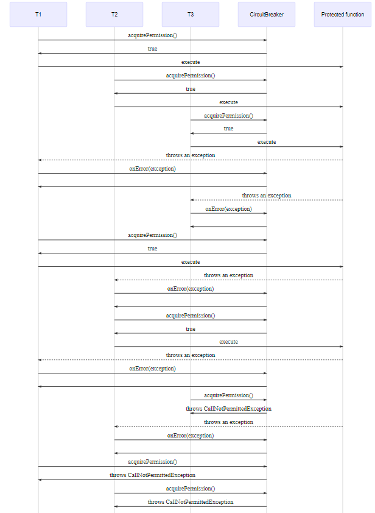

# CircuitBreaker 사용하기

## 의존성 추가

```xml
implementation 'io.github.resilience4j:resilience4j-spring-boot2'
// implementation 'io.github.resilience4j:resilience4j-spring-boot3'

implementation 'org.springframework.boot:spring-boot-starter-aop'
implementation 'org.springframework.boot:spring-boot-starter-actuator'
```

사용중인 Spring Boot 버전에 맞는 resilience4j의존성을 추가해준다.

그리고 `@CircuitBreaker`와 같은 어노테이션 기반의 개발을 하기 위해 `org.springframework.boot:spring-boot-starter-aop`의존성을 추가해주고 서킷블이커의 상태를 확인하기 위해 `org.springframework.boot:spring-boot-starter-actuator` 의존성도 추가해주겠다.

참고로 Spring Cloud를 사용중이라면 starter의존성을 통해 사용하실 수도 있다.

```xml
implementation 'org.springframework.cloud:spring-cloud-starter-circuitbreaker-resilience4j'
```

## CircuitBreaker 모듈의 설정들

서킷브레이커를 사용하기 앞서 먼저 설정 프로퍼티에 대해 살펴보겠다.


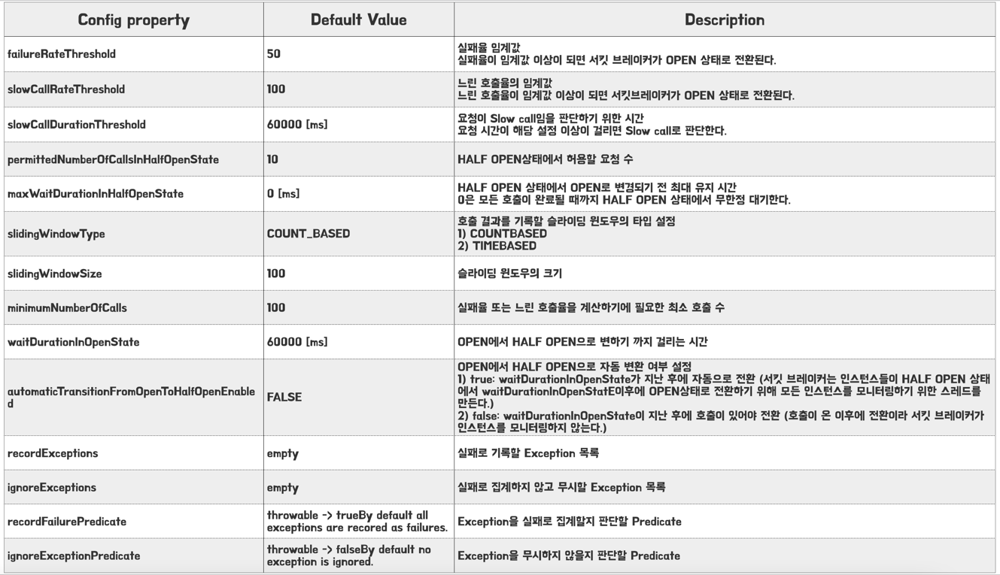

## 테스트 시나리오 및 구성

테스트는 스타벅스 애플리케이션의 메인 페이지에서 개인 맞춤형 메뉴 추천서비스와 같은 시나리오를 구현해보겠다.

상품 정보를 받기 위해 애플리케이션에서는 상품 서비스(ProductService)에 요청을 보낼 것이고 서버에서 내부적으로 상품 서비스는 추천 알고리즘이 올라가있는 추천 서비스(RecommendationService)에 요청을 보내어 사용자별 추천 상품 정보를 받아올 것이다.


이러한 환경에서 서비스 중간에 추천 서비스에 장애가 발생하여 서버가 중단되고 요청에 대한 응답을 받지 못하는 상황에서 서킷브레이커는 어떻게 동작할지 살펴볼 예정이다.

## ProductService 생성

### YML파일 설정

```yaml
resilience4j:
  circuitbreaker:
    instances:
      productsBreaker: # 추후 설정할 서킷브레이커의 이름
        registerHealthIndicator: true
        automaticTransitionFromOpenToHalfOpenEnabled: true # OPEN에서 HALF OPEN으로 자동 변환 여부 설정
        failureRateThreshold: 50 # 실패율 임계값
        minimumNumberOfCalls: 5 # 실패율 또는 느린 호출율을 계산하기에 필요한 최소 호출 수
        permittedNumberOfCallsInHalfOpenState: 3 # HALF OPEN상태에서 허용할 요청 수
        slidingWindowSize: 10 # 슬라이딩 윈도우의 크기
        waitDurationInOpenState: 5000 # OPEN에서 HALF OPEN으로 변하기 까지 걸리는 시간
        slidingWindowType: COUNT_BASED # 호출 결과를 기록할 슬라이딩 윈도우의 타입 설정

# 서킷브레이커의 상태를 확인하기 위한 actuator 설정 추가
management:
  health:
    circuitbreakers:
      enabled: true
  endpoints:
    web:
      exposure:
        include: health
  endpoint:
    health:
      show-details: always
```

위에서 살펴본 설정들을 통해 YML 파일에 서킷브레이커 설정을 추가했다. 서킷브레이커는 `resilience4j.circuitbreaker.instances.` 하위에 생성할 서킷브레이커들의 이름을 정하고 각 서킷브레이커 이름 하위에 해당 서킷브레이커의 설정을 추가하면 된다. 위의 예시에서는 **productsBreaker**라는 이름의 서킷브레이커를 생성하고 실패율이 50% 이하일 경우 서킷브레이커의 상태를 OPEN 상태로 변경하도록 하였다. 또한 OPEN에서 5초 후에 자동으로 HALF OPEN 상태로 변경되도록 설정하였으며 HALF OPEN상태에서는 3개의 요청을 허용하고 해당 요청의 결과를 통해 CLOSE 또는 OPEN 상태로 변경되도록 설정하였다. 그 외의 설정들은 주석을 통해 확인하길 바란다.

### Controller 코드 작성

```java
package com.example.productservice;

import java.util.Arrays;
import java.util.List;

import org.springframework.core.ParameterizedTypeReference;
import org.springframework.http.HttpMethod;
import org.springframework.http.ResponseEntity;
import org.springframework.web.bind.annotation.GetMapping;
import org.springframework.web.bind.annotation.PathVariable;
import org.springframework.web.bind.annotation.RequestMapping;
import org.springframework.web.bind.annotation.RestController;
import org.springframework.web.client.RestTemplate;

import io.github.resilience4j.circuitbreaker.annotation.CircuitBreaker;

@RestController
@RequestMapping("/products")
public class ProductController {

    private final RestTemplate restTemplate = new RestTemplate();

    @GetMapping("/recommendation/{userId}")
    @CircuitBreaker(name = "productsBreaker", fallbackMethod = "productsFallback")
    public ResponseEntity<List<String>> findRecommendationProduct(@PathVariable Long userId) {
        System.out.println("OrderController.findRecommendationProduct() 호출");

        ResponseEntity<List<String>> response = restTemplate.exchange(
                "http://localhost:9090/recommendation/products/" + userId,
                HttpMethod.GET, null, new ParameterizedTypeReference<>() {
                });
        List<String> products = response.getBody();

        return ResponseEntity.ok(products);
    }

    private ResponseEntity<List<String>> productsFallback(Throwable t) {
        List<String> defaultRecommendations = Arrays.asList("아이스아메리카노", "카페 라떼", "카라멜 마끼야또", "아이스 카페 모카", "카푸치노");

        System.out.println("OrderController.productsFallback() 호출");
        System.out.println(t.getMessage());

        return ResponseEntity.ok(defaultRecommendations);
    }
}
```

해당 컨트롤러 메서드는 메뉴 추천 상품을 요청하면 메뉴 추천 알고리즘이 적용된 서비스인 **RecommendationService**로 회원별 메뉴 추천을 받기 위해 `RestTemplate`를 통해 요청을 보낸다. 요청이 정상적으로 오면 `RestTemplate`을 통한 요청의 결과를 반환한다. 하지만 응답이 오지 않으면 에러를 반환하는게 아니라 서킷 브레이커로 사전에 설정한 fallback 메서드인 `productsFallback()`를 호출하여 해당 메서드에서 설정한 기본 추천 음료들을 반환한다.

여기서 눈여겨봐야할 코드는 `@CircuitBreaker(name = "productsBreaker", fallbackMethod = "productsFallback")`이다. resilience4J는 서킷브레이커를 간단히 사용할 수 있도록 `@CircuitBreaker`어노테이션을 제공하고 있다. 해당 어노테이션에는 `name`과 `fallbackMethod` 속성이 있다. 여기서 name 속성에는 앞서 yml파일에서 정하였던 서킷브레이커의 이름을 넣어주면 된다. 그리고 fallbackMethod 속성에는 응답이 실패할 경우, 처리를 해줄 fallback 메서드의 이름을 기재하면 된다.

> 📌 **fallback 메서드 주의사항**
fallback 메서드의 경우는 `@CircuitBreaker`어노테이션이 붙은 메서드가 접근할 수 있는 동일한 패키지에 위치하여야 한다. 또한 어노테이션이 붙은 메서드의 응답값을 대신 반환하는 것이기에 동일한 반환 타입을 갖고 `Throwable`를 인자로 받아야 한다.
>

> `@CircuitBreaker`를 사용하려면 앞서 의존성 설정에서 봤듯이 AOP 의존성을 추가해줘야 한다.
>

## RecommendationService 작성

> 해당 컴포넌트에는 lombok과 spring-boot-web의존성만 추가하였다.
>

### YML파일 설정

```java
server:
  port: 9090
```

ProductServicce와 충돌이 발생하지 않게 9090포트에서 실행시켰다.

### Controller 코드 작성

```java
package com.example.recommendationservice;

import java.util.Arrays;
import java.util.List;

import org.springframework.http.ResponseEntity;
import org.springframework.web.bind.annotation.GetMapping;
import org.springframework.web.bind.annotation.PathVariable;
import org.springframework.web.bind.annotation.RequestMapping;
import org.springframework.web.bind.annotation.RestController;

@RestController
@RequestMapping("/recommendation")
public class ProductController {

    @GetMapping("/products/{userId}")
    public ResponseEntity<List<String>> recommendProduct(@PathVariable Long userId) {
        List<String> products = Arrays.asList("유자민트티", "슈크림 가득 바움쿠헨",
                "아이스 자몽 허니 블랙티", "더블 에스프레소 칩 프라푸치노", "아이스 카페 라떼");

        return ResponseEntity.ok(products);
    }
}
```

고객의 id를 받아 해당 고객의 정보를 통해 메뉴를 추천해주는 API이다. 테스트를 위한 코드인만큼 간단하게 요청이 오면 “유자 민트티”로 시작하는 고정된 리스트를 반환하도록 구현하였다.

## 결과 확인

먼저 두 서비스를 모두 실행시킨 후에 `GET http://localhost:8080/products/recommendation/1` 주소로 **productService**에 요청을 보내보겠다. 그 결과 아래의 이미지와 같이 **RecommendationService**에서 응답받은 결과를 정상적으로 반환한다.

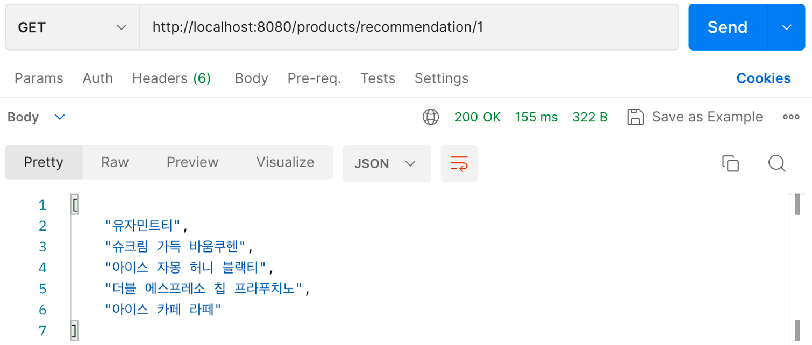

더불어 `http://localhost:8080/actuator/health`에 접근하여 resilience4j의 상태를 확인해보면 요청을 한번 보내어 bufferedCalls이 1로 증가하였고 state가 현재 CLOSED로 서킷브레이커가 동작하지 않음을 확인할 수 있다.

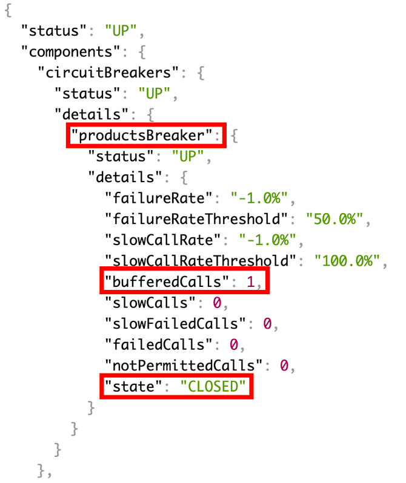

여기서 추가로 성공할 수 있는 3번의 요청을 더 보내고, 추천 서비스(RecommendationService)를 종료해보겠다.

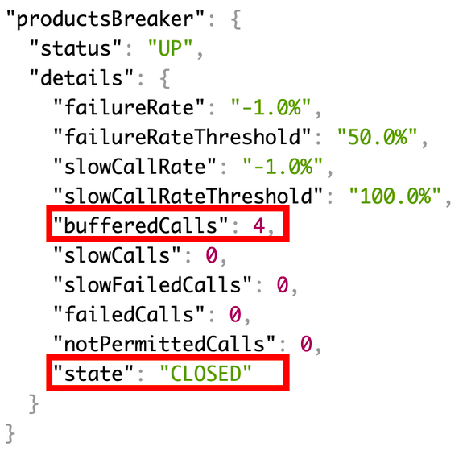

이제 추천 서비스가 종료되어 상품 서비스에서는 추천 서비스에 요청을 하여도 응답을 받지 못하고 실패하게 될 것이다. 요청을 보내보면 실제로 앞서 fallback메서드의 반환값으로 설정해둔 기본 추천 메뉴들이 반환되는 것을 확인할 수 있다.

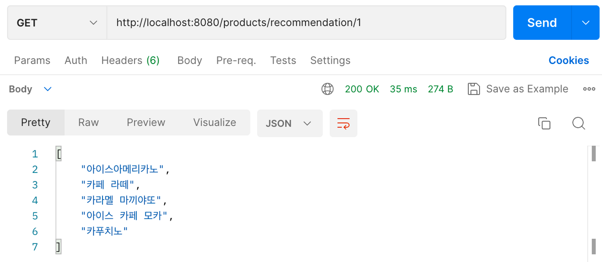

그리고 모니터링을 해본 결과 누적된 총 5개의 요청중 1개의 요청이 실패하여 failedCalls이 1 증가하고 failureRate도 20%로 증가한 것을 확인할 수 있다.

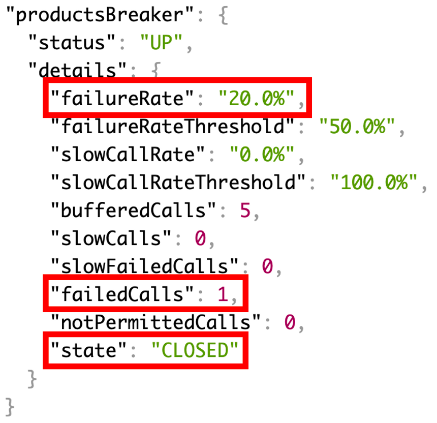

이제 failureRateThreshold가 50퍼센트를 넘기도록 5번의 추가 요청을 보내보겠다.

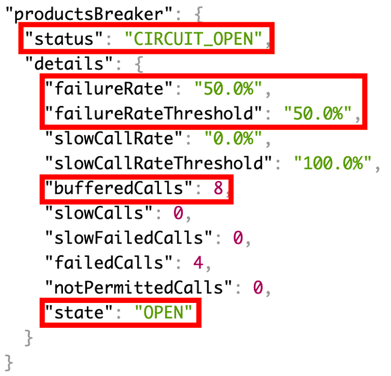

요청을 지속적으로 보낸 결과 실패율은 threshold인 50프로를 채우고 OPEN 상태로 변경되게 된다. 그리고 이전 누적 5번(bufferedCalls)에서 5번의 추가 요청을 하였는데 bufferedCalled의 값은 10이 아닌 8이 되었다. 그 이유는 OPEN 상태에서는 추가적인 호출을 하여도 서킷브레이커는 추천 서비스로 요청을 보내지 않고 바로 fallback하게 되어서이다. 즉 누적 8번째 요청을 보내어 OPEN상태로 변한 이후의 2번의 요청은 bufferedCalls에 누적되지 않게 되어 10이 아닌 8이라는 값이 나오게 된 것이다.

이제 HALF OPEN상태로 변하는 결과를 확인해보겠다. 앞서 설정에서는 OPEN이후 6초가 지난 이후에는 자동으로 HALF OPEN상태로 변하도록 하였다.

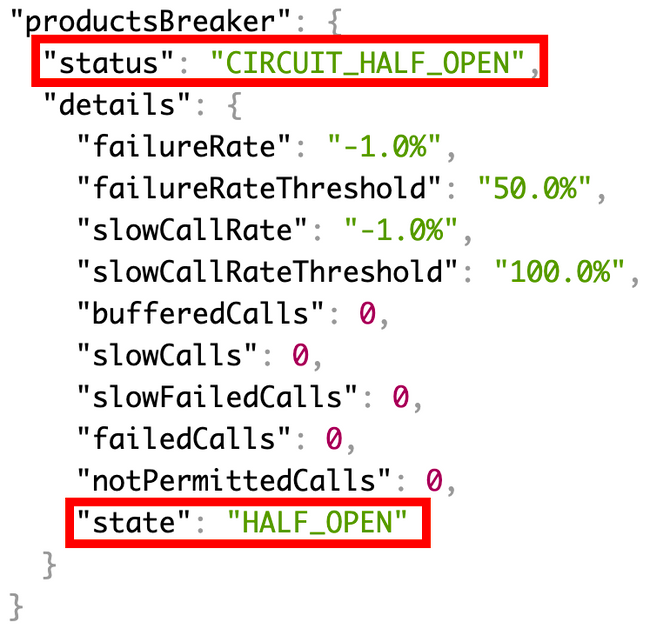

결과를 확인해보면 정상적으로 HALF OPEN상태로 변한 것을 확인할 수 있다. 이제 HALF OPEN 상태에서 허용할 요청의 수인 3 (앞서 `permittedNumberOfCallsInHalfOpenState`를 통해 설정)의 실패 요청을 보내보겠다.

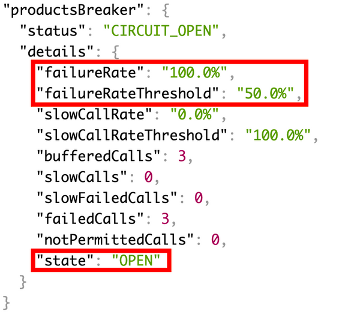

그 결과 3번의 요청의 실패율이 100프로라 임계값을 넘겨 다시 OPEN 상태로 변한 것을 확인할 수 있다. 이제 마지막으로 추천 서비스를 살리고 HALF OPEN상태에서 요청들을 보내보겠다.

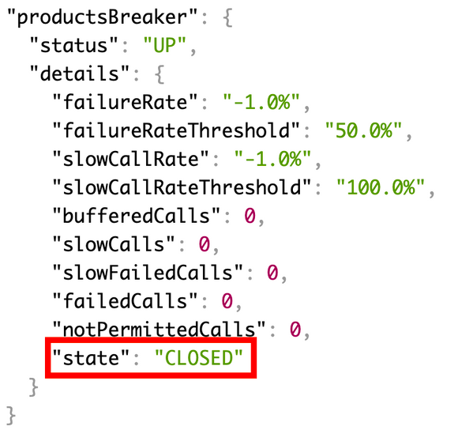

추천 서비스가 살아나 응답을 올바르게 되어 서킷브레이커의 상태가 다시 CLOSED로 변한 것을 확인할 수 있다.

# 코드 살펴보기

상세 구현 코드는 아래의 링크에서 확인하실 수 있습니다.
- [Seongwon97/MSA_study](https://github.com/Seongwon97/MSA_study/tree/main/resilience4j_circuit_breaker_test)

# Reference
- [GitHub - resilience4j/resilience4j](https://github.com/resilience4j/resilience4j)
- [Guide to Resilience4j | Baeldung](https://www.baeldung.com/resilience4j)
- [CircuitBreaker](https://resilience4j.readme.io/docs/circuitbreaker)
- [Spring Boot + Resilience 4J Integration](https://www.youtube.com/watch?v=WL0eIKD8krU)
