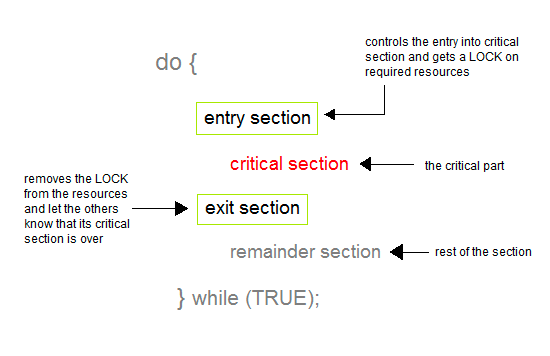
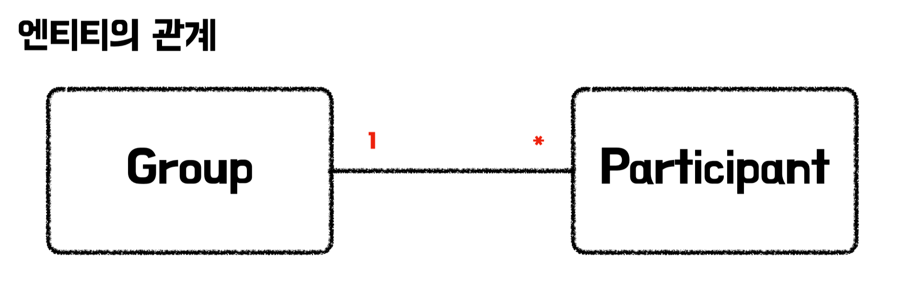
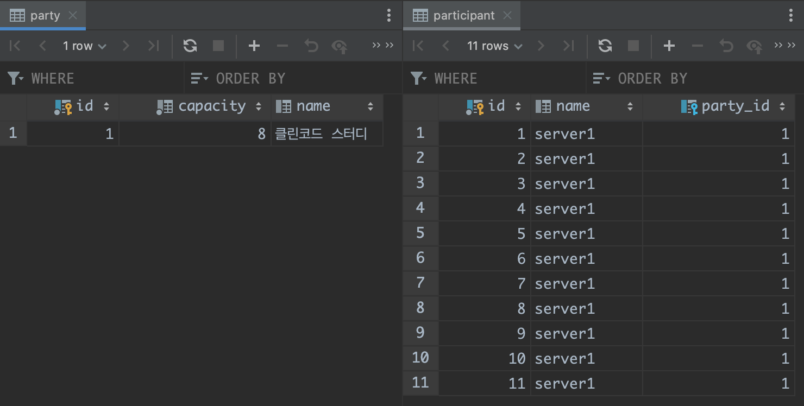
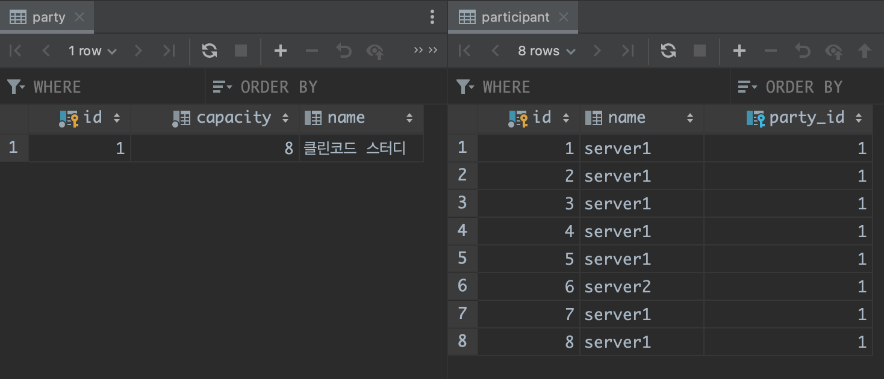
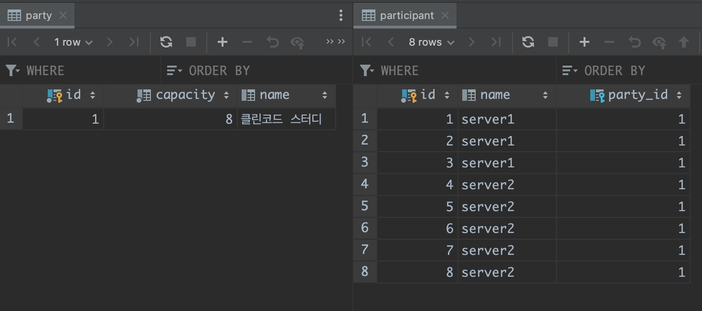

# 분산락(Distribution Lock)이란?

> 분산락은 **여러 프로세스 또는 스레드가 공유하는 리소스에 대한 동시 접근을 제어하기 위한 메커니즘**입니다.
>

[비관적락/낙관적락 게시글](https://seongwon.dev/Spring-MVC/20230430-%EB%B9%84%EA%B4%80%EC%A0%81%EB%9D%BD%EA%B3%BC_%EB%82%99%EA%B4%80%EC%A0%81%EB%9D%BD/)에서 다루었듯이 서비스 개발에서 동시성 문제를 처리하는 것은 중요한 문제이다. 동시성문제는 여러 프로세스 또는 쓰레드가 동일한 자원을 접근하며 경쟁(Race Condition)하는 상황을 뜻한다. 이는 **두 번의 갱신 문제** 등 우리의 계획과는 다른 동작을 유발할 수 있다.

운영체제를 학습하며 배웠듯이 경쟁 상황(Race Condition)을 해결하는 방법으로는 임계 구역(Critical Section)에는 한 개의 스레드만 접근하도록 하는 방법이 존재한다. 자바에서는 아래의 코드와 같이 `synchronized`를 통해 한 번에 한 개의 스레드만이 특정 메서드에 접근할 수 있도록 보장한다.

```java
public synchronized ParticipantResponse participate1(Long partyId, String name) {
    Party party = partyRepository.findById(partyId).orElseThrow();
    if (party.isFull()) {
        throw new IllegalArgumentException("정원이 가득 차있습니다.");
    }

    Participant participant = participantRepository.save(new Participant(name, party));
    return new ParticipantResponse(participant.getId(), participant.getName());
}
```

하지만 해당 방법은 단일 서버에서는 해결법이 될 수 있으나, N개의 서버를 운영하는 분산 환경에서는 각각의 서버에서 1개의 요청씩 동작시킨다 하더라도 전체적인 시스템을 보면 N개의 동일 요청이 실행되어 동시 접근을 제어하지 못하게 된다. 분산락은 이러한 문제를 해결해준다.

분산락은 락에 대한 정보를 Redis, Zookeper, MySQL 등의 외부 저장소에 저장을 하고 동시성 문제가 발생할 수 있는 **임계 구역(Critical Section)에 접근을 할 때 락을 취득할 수 있는지 확인**하며 획득할 수 있다면 접근하게 된다.



즉, 임계 구역(Critical Section)의 Entry Section에서 락에 대한 정보를 갖는 저장소에 락을 얻을 수 있는지에 대한 여부를 묻고 접근 가능하다면 락을 얻고 임계 구역에 접근하게 된다. 그리고 작업이 끝났으면 Exit Section에서 락을 풀어 이후에 다른 요청들이 임계 구역에 접근할 수 있도록 한다.

# 분산 락 vs 낙관적 락/비관적 락

분산 락을 처음 학습하며 낙관적 락/비관적 락으로도 분산 환경에서의 동시성 문제를 해결할 수 있을거라는 생각이 들어 분산 락이 필요한 이유를 이해하지 못 했다. 그 이유는 아래와 같다.

- 분산 서버를 구축하고 데이터베이스를 이중화까지 하더라도 데이터베이스는 보통 1개의 Write DB와 N개의 Read DB를 두기에 여러 분산 서버에서의 쓰기 요청은 결국 1개의 Write DB로 몰리게 된다.
    - 낙관적 락을 걸어둘 경우, 각각의 서버에서는 먼저 변경된 데이터가 있어 데이터의 Version이 업데이트되면 요청 실패 및 재시도를 하게 된다.
    - 비관적 락을 걸어둘 경우, N개의 서버에서 동시 요청을 보내더라도 데이터베이스에서 `SELECT FOR UPDATE`를 통해 데이터를 읽으면서 x-lock을 걸어두면 1개의 서버의 1개의 스레드에서만 데이터 접근이 가능하다.

하지만 역시나 분산 락은 이유 없이 만들어진 것이 아니었다. 이유는 일전에 진행한 모임 플랫폼인 [모두 모여라 프로젝트](https://github.com/woowacourse-teams/2022-momo)의 잘못된 구현을 예시로 설명하겠다. 모두 모여라 프로젝트에서는 모임 참여 기능에서 동시 요청이 발생하면 제한된 인원 이상의 참여자가 발생하는 동시성 문제가 존재했다. 우리 팀은 위의 이유를 바탕으로 분산 환경에서 발생한 해당 문제를 비관적 락으로 해결하였다.

> 📌 낙관적 락과 비관적 락 중에서 비관적 락을 선택한 이유는 선착순 서비스의 경우, 충돌에 대한 잦은 롤백 처리로 인해 성능이 더 안 좋아질 수 있기 때문이었다.
>
> - e.g. 10명만 참여 가능한 모임 서비스에 낙관적 락이 걸려있고 1000명이 동시 요청을 하였다 가정하자. 그러면 최초 커밋 1명은 통과하며 버전을 변경하게 된다. 그리고 이후의 남은 999명은 업데이트 시점에 버전이 변경되었기에 취소되고 애플리케이션에서 오류 처리 로직에 따라 다시 재시도를 요청해야한다. 그리고 다음 한명이 요청을 처리하게되고 남은 998명은 다시 새로운 버전을 읽고 재시도를 해야한다…(반복)

비관적 락을 통해 동시성 문제는 해결할 수 있었으나 참여 기능과 무관한 조회 기능에 영향을 주는 문제가 발생하였다. 상황 이해를 위해 참여하기 로직을 살펴보겠다.



```java
@RequiredArgsConstructor
@Transactional(readOnly = true)
@Service
public class ParticipateService {

    private final MemberFindService memberFindService;
    private final GroupFindService groupFindService;

    @Transactional
    public void participate(Long groupId, Long memberId) {
        // findByIdForUpdate -> SELECT FOR UPDATE를 통한 x-lock 획득
        Group group = groupFindService.findByIdForUpdate(groupId);
        Member member = memberFindService.findMember(memberId);

        // group 객체는 capacity와 참여자의 정보를 얻기 위한 그래프 탐색을 하기 위해 획득
        // group 테이블에는 변경 X, Participants 테이블에만 새로운 참가자 데이터가 추가됨
        group.participate(member);
    }
}
```

위의 로직을 살펴보면 `participate()` 메서드가 실행됨과 동시에 `SELECT FOR UPDATE`를 통해 Group정보를 얻으며 해당 데이터에 x-lock을 걸며 다른 읽기, 쓰기 요청에 대한 모든 접근을 불가하게 한다. 즉, 모임 참여 요청을 처리하는 과정에서 모임 테이블에 변동을 주지 않음에도 불구하고 모임 조회에 대한 접근도 막게 되며 조회 성능에도 영향을 주게 되었다. 분산락은 이러한 문제를 해결해줄 수 있다. 이후 로직으로 살펴보겠지만 간단히 설명하자면 기존 코드처럼 데이터베이스 row에 Lock을 거는 것이 아닌 직접적으로 참여하기 로직을 수행하는 부분(Critical Section)에 걸며 모임 테이블의 조회에는 영향을 주지 않을 수 있다.

문제들을 겪으며 현재 내가 내린 결론은 아래와 같다.

- 한 개의 테이블의 데이터를 조회하고 변경하는 동시성 문제는 낙관적 락/비관적 락으로 해결할 수 있다.
- 위의 상황과 같이 1:N의 관계의 두 테이블에서 1의 데이터에 변동 없이 N의 데이터를 추가하려는 상황에서는 분산락이 적합하다.

> 해당 결론은 주니어 개발자 입장에서 적은 경험을 바탕으로 생각한 내용입니다. 이 점은 참고부탁드립니다!!
>

이제 분산락에 대한 실습을 진행해보겠다. 이번 포스트에서는 먼저 동시성 문제 상황을 가정하고 이후 Redis를 통한 두 가지 방법의 분산락을 구현해보고자 한다.

# 동시성 문제 상황 가정

문제는 앞서 살펴본 인원 제한이 있는 모임에 참여 요청이 동시에 요청이 오며 발생하는 문제를 살펴보려 한다. 먼저 동시성 문제가 발생하는 코드를 작성해보겠다.

> 앞선 프로젝트 예시 코드에서는 모임 이름으로 Group이라는 이름을 사용했는데, 이후 예시 코드에서는 Party라는 이름을 사용한 점은 양해부탁드립니다.
>

**Party, PartyRepository**

```java
@Entity
@Getter
@NoArgsConstructor
public class Party {

    @Id
    @GeneratedValue(strategy = GenerationType.IDENTITY)
    private Long id;

    private String name;
    private int capacity;

    @OneToMany(mappedBy = "party")
    private final List<Participant> participants = new ArrayList<>();

    public Party(String name, int capacity) {
        this.name = name;
        this.capacity = capacity;
    }

    public boolean isFull() {
        return participants.size() >= capacity;
    }
}

public interface PartyRepository extends JpaRepository<Party, Long> {}
```

**Participant, ParticipantRepository**

```java
@Entity
@Getter
@NoArgsConstructor
public class Participant {

    @Id
    @GeneratedValue(strategy = GenerationType.IDENTITY)
    private Long id;
    private String name;

    @ManyToOne(fetch = FetchType.LAZY)
    @JoinColumn(name = "partyId")
    private Party party;

    public Participant(String name, Party party) {
        this.name = name;
        this.party = party;
    }
}

public interface ParticipantRepository extends JpaRepository<Participant, Long> {}
```

**PartyService**

```java
@Service
@RequiredArgsConstructor
public class PartyService {

    private final PartyRepository partyRepository;
    private final ParticipantRepository participantRepository;

    @Transactional
    public PartyResponse create(String partyName, int capacity) {
        Party party = partyRepository.save(new Party(partyName, capacity));
        return new PartyResponse(party.getId(), party.getName(), party.getCapacity());
    }

    @Transactional
    public ParticipantResponse participate(Long partyId, String name) {
        Party party = partyRepository.findById(partyId).orElseThrow();
        if (party.isFull()) {
            throw new IllegalArgumentException("정원이 가득 차있습니다.");
        }

        Participant participant = participantRepository.save(new Participant(name, party));
        return new ParticipantResponse(participant.getId(), participant.getName());
    }
}
```

**PartyController**

```java
@RestController
@RequestMapping("/parties")
@RequiredArgsConstructor
public class PartyController {

    private final PartyService partyService;

    @PostMapping
    public ResponseEntity<PartyResponse> create(@RequestBody PartyRequest request) {
        PartyResponse response = partyService.create(request.getName(), request.getCapacity());

        return ResponseEntity.ok(response);
    }

    @PostMapping("/{partyId}")
    public ResponseEntity<ParticipantResponse> participate(@PathVariable Long partyId,
                                                           @RequestBody ParticipateRequest request) {
        ParticipantResponse response = partyService.participate(partyId, request.getName());

        return ResponseEntity.ok(response);
    }
}
```

코드는 간단하다. 모임(Party)와 참여자(Participant)엔티티는 1:N의 관계를 갖는다. 그리고 모임 참여 요청이 오면 모임에 참여한 사용자 수와 모임의 정원(capacity)를 비교하여 참여할 수 있으면 참여하고 참여가 불가능하면 예외가 발생한다.

위의 코드를 **8080, 9090포트에 각각 서비스를 실행**시키고 참여자가 8명이 정원인 모임(party)에 **JMeter를 통해 각각 서버당 100명씩 총 200개명의 유저가 동시에 모임 참여 요청**을 하는 시나리오를 돌려봤다. 그 결과 정원을 넘어선 11명이 모임에 참여하는 결과를 얻게 되었다.



# Redis를 통한 분산 락 구현

Redis Client로 분산락을 구현하는 방법으로는 Lettuce를 사용하는 방법과 Redisson을 사용하는 방법이 존재한다.

## 방법1. Lettuce를 통한 스핀락

첫 번째 방법은 레디스 클라이언트인 [Lettuce](https://github.com/lettuce-io/lettuce-core)를 통해 스핀 락을 구현하는 방법이다.

> 📌 스핀 락 (Spin Lock)이란?
>
> - 락을 걸지 못하면 무한루프를 돌며 락을 얻으려고 시도하는 동기화 기법이다
> - 락을 얻을때까지 계속 요청을 보내며 대기하여 서버에 부하를 줄 수 있다.

Redis의 “값이 존재하지 않으면 세팅한다”라는 `SETNX` 명령어를 이용하여 레디스에 특정 데이터에 락을 걸었다는 세팅 값이 존재하지 않으면 세팅하고, 세팅 여부를 리턴 값으로 받아 획득을 한다. 즉, 지속적으로 락을 획득할 수 있는지 Redis 서버에 물어보며 임계 구역에 접근 가능할 때 진입하게 되는 방법이다.

이제 테스트를 해보겠다.

### 의존성 추가

```java
implementation 'org.springframework.boot:spring-boot-starter-cache'
```

### 코드 작성

**RedisLockRepository**

```java
@Component
@RequiredArgsConstructor
public class RedisLockRepository {

    private final RedisTemplate<String, String> redisTemplate;

    // setIfAbsent() 를 활용해서 SETNX를 실행한다.
    // key는 Party테이블의 PK이며 Value를 "lock" 으로 설정한다.
    public Boolean lock(long key) {
        return redisTemplate
                .opsForValue()
                .setIfAbsent(String.valueOf(key), "lock", Duration.ofMillis(3_000));
    }

    public Boolean unlock(long key) {
        return redisTemplate.delete(String.valueOf(key));
    }
}
```

RedisLockRepository는 `RedisTemplate`를 통해 서버에 `SETNX` 명령어를 요청하며 락을 획득하는 로직과 데이터를 삭제하며 락을 푸는 로직을 작성한다.

**PartyService**

서비스 로직에는 기존에 참여자를 저장하던 로직을 수행하기 전에 락을 획득하는 로직이 추가되었다. `while`문을 통해 스핀 락을 구현하며 락을 획득할 때까지 계속 요청을 수행하고 락을 획득하게 된 이후에 비즈니스 로직을 수행하게 된다. 그리고 마지막으로 모든 작업이 수행된 이후에는 `finally`문을 통해 락을 해제하게 된다.

이제 동시성 문제가 발생한 상황과 동일하게 2개의 서버에 각각 100개의 요청을 보내며 동시성 상황을 만들어보겠다.



결과는 8명 정원인 모임에 8개의 참여자 데이터만 추가되어 성공적이었다. 하지만 Lettuce를 통한 분산 락 구현은 몇가지 문제점이 존재한다.

### 문제점

1. Lock의 타임아웃이 지정되어있지 않다.

   만약 특정 스레드가 Lock을 얻고 요청을 처리하는 과정에서 오류가 발생해 Lock을 해제하지 못하는 상황이 발생한다면, 이후의 모든 요청들은 영원히 락을 얻지 못하고 대기 상태에 빠지게 된다.

   문제 해결을 위해 expire time을 추가하면 좋은데 SETNX 명령어에서는 지정할 수가 없어 해결이 불가능하다.

2. Redis에 지속적인 요청으로 많은 트래픽이 발생한다.

   해당 방식은 스핀 락 방식이라 lock 을 획득하기 위해 Redis 에 계속해서 요청을 보내 락을 획득하기 위해 많은 트래픽이 발생되고 이는 성능 저하를 일으킬 수 있다.


## 방법2. Redison를 통한 Message Broker

두 번째 방법은 [Redisson](https://github.com/redisson/redisson/)을 통해 Message Broker를 구현하는 방법이다. Redison을 사용하는 방식은 앞서 살펴본 Lettuce를 통한 방식의 문제점들을 해결할 수 있다.

- 락을 획득하는 타임아웃 기능을 제공하여 락이 해제되지 않는 문제를 해결해준다.

    ```java
    public interface RLock extends Lock, RLockAsync {
        public boolean tryLock(long waitTime, long leaseTime, TimeUnit unit) throws InterruptedException
    }
    // 요청을 하면 waitTime만큼 시간이 지나게 되면 false가 반환되며 락 획득 실패
    // 락이 걸리고 leaseTime만큼의 시간이 지나면 락이 만료되어 스스로 해제
    ```

- 스핀락이 아닌 pub/sub 방식으로 동작하며 레디스 서버의 부하 문제를 해결해준다.

  Lock 획득을 원하는 Client들이 Redis 를 구독하고 있다가 Redis 에서 Lock release 가 발생하면 구독하고 있는 Client에게 알림을 준다. 알림을 받은 Client 들은 다시 lock 획득을 시도하는 방식으로 구동된다.


이제 테스트를 진행해보겠다.

### 의존성 추가

```java
implementation 'org.redisson:redisson-spring-boot-starter:3.17.7'
```

**PartyService**

```java
@Service
//@Transactional 트랜잭션을 제거
@RequiredArgsConstructor
public class PartyService {

    private final PartyRepository partyRepository;
    private final ParticipantRepository participantRepository;
    private final RedissonClient redissonClient;

    ...

    public ParticipantResponse participate(Long partyId, String name) {
        RLock lock = redissonClient.getLock(String.valueOf(partyId));
        try {
            if (!lock.tryLock(100, 2, TimeUnit.SECONDS)) {
                throw new RuntimeException("Lock 획득을 실패했습니다");
            }
            // 비즈니스 로직
            Party party = partyRepository.findById(partyId).orElseThrow();
            if (party.isFull()) {
                throw new RuntimeException("정원이 가득 차있습니다.");
            }

            Participant participant = participantRepository.save(new Participant(name, party));
            return new ParticipantResponse(participant.getId(), participant.getName());
        } catch (InterruptedException e) {
            throw new RuntimeException(e);
        } finally {
            lock.unlock();
        }
    }
}
```

로직을 살펴보면 `reddissonClient.getLock()`을 통해 락에 대한 정보를 획득한 후  `lock.tryLock()`을 통해 락을 획득하게 된다. 해당 로직의 장점은 앞서 이야기했던 바와 같이 redis 서버에 락에 대한 여부를 지속적으로 묻는 것이 아니라 pub/sub의 관계로 해당 락에 대한 구독을 하며, redis에서 락이 풀렸다는 알림을 줬을 때만 락의 획득 요청을 하게 된다.

결과는 Lettuce와 마찬가지로 올바른 결과를 내는 것을 확인할 수 있다.



### 🚨 주의할 점 - Redison은 @Transactional과 함께 동작하지 않는다.

Redis는 명령들을 원자적(Atomic)하게 실행되며 여러 명령을 트랜잭션으로 그룹화하고 단일 작업 단위로 실행하는 기능을 제공하지 않는다.

따라서 우리가 평상시에 사용하는 AOP 기반의 선언적 트랜잭션인 `@Transactional`은 사용할 수가 없다. 만약 Redisson과 트랜잭션을 함께 사용하고 싶다면 별도로 TransactionManager를 통해 직접 주입하고 비즈니스 코드 자체에서 commit, rollback, start 등의 로직을 수행해줘야 한다.

# 📚 Reference
- [레디스와 분산 락(1/2) - 레디스를 활용한 분산 락과 안전하고 빠른 락의 구현](https://hyperconnect.github.io/2019/11/15/redis-distributed-lock-1.html)
- [[Redis] 분산락(Distribution Lock) 을 구현해 다중화 서버에서 발생하는 동시성 문제 제어하기](https://velog.io/@msung99/Redis-분산-락을-구현해-race-condition-동시성-이슈-해결하기)
- [Redis로 분산 락을 구현해 동시성 이슈를 해결해보자!](https://hudi.blog/distributed-lock-with-redis/)
- [MySQL을 이용한 분산락으로 여러 서버에 걸친 동시성 관리 | 우아한형제들 기술블로그](https://techblog.woowahan.com/2631/)
- [What is a Java distributed lock? | Redisson](https://redisson.org/glossary/java-distributed-lock.html)
- [6.2 Distributed locking | Redis](https://redis.com/ebook/part-2-core-concepts/chapter-6-application-components-in-redis/6-2-distributed-locking/)
- [[개발자유주제 1편] 데이터 동시성 접근 문제가 발생했을 때 해결 방안 (DB lock, Redis)](https://insanelysimple.tistory.com/396)
- [Introduction to Lettuce - the Java Redis Client | Baeldung](http://baeldung.com/java-redis-lettuce)
- [redis 설치 및 redisson을 이용한 분산락 구현](https://it-hhhj2.tistory.com/102)
