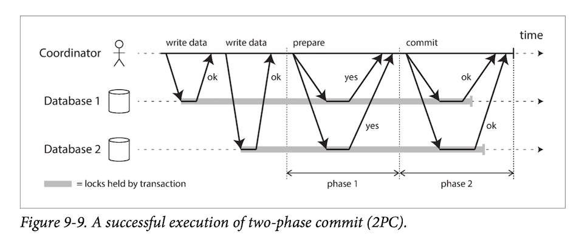
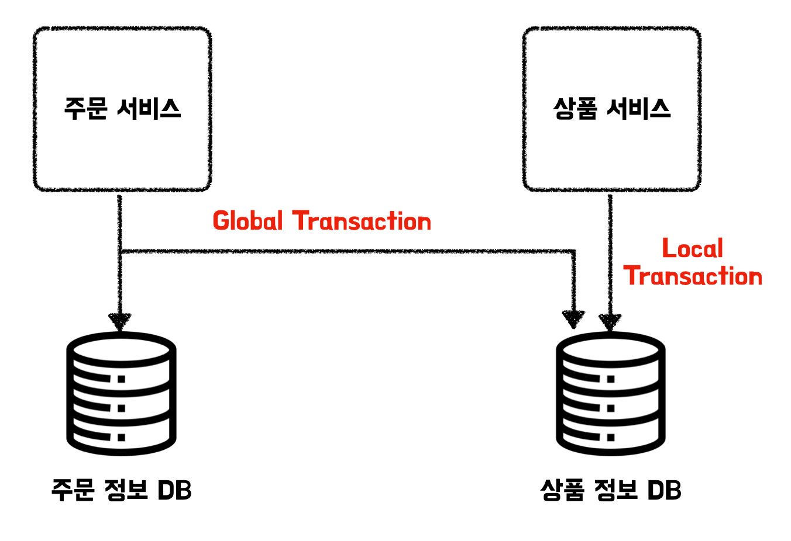
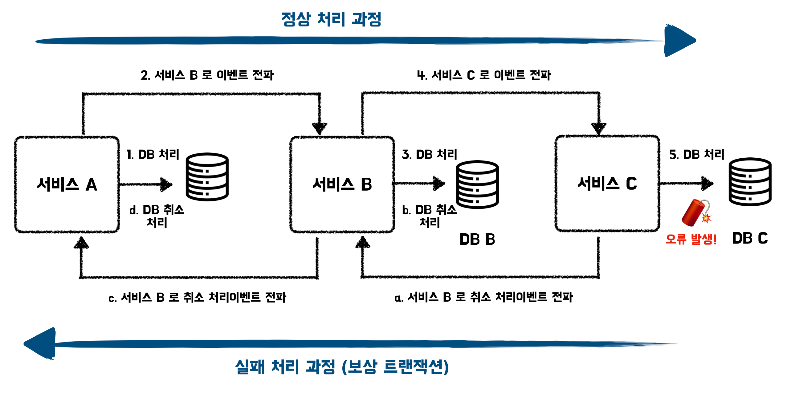
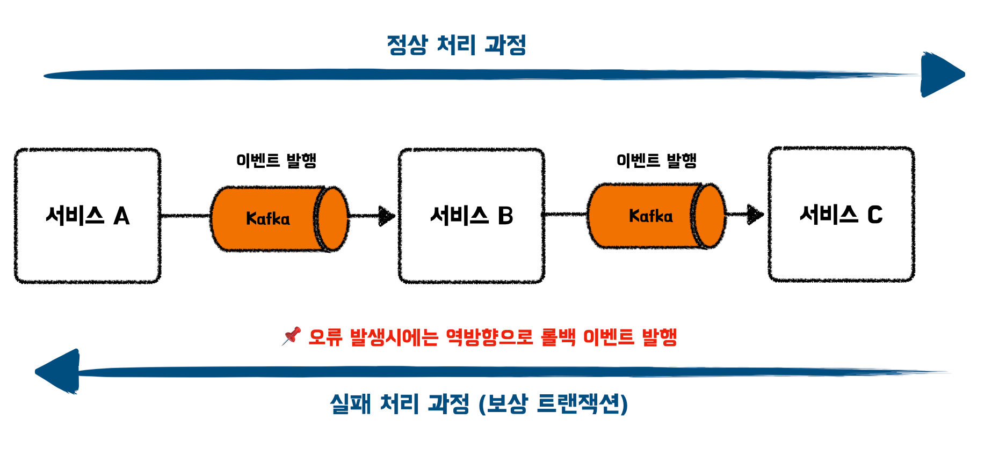
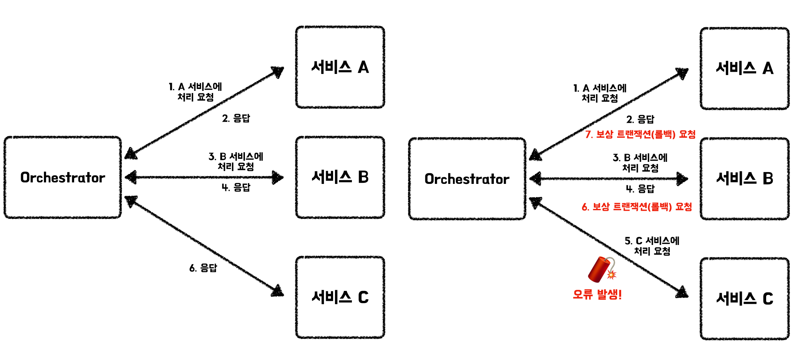

지금까지 나는 프로젝트를 진행하며 한 개의 데이터베이스와 Monolithic한 서비스 구조로 개발을 진행하였다. 하지만 최근 MSA구조를 학습하며 MSA에서는 트랜잭션의 처리와 데이터베이스의 동기화를 위해 기존의 Monolithic한 방법과 다르게 새로운 방법들을 적용하고 고려한다는 것을 알게되어 글로 정리를 하게 되었다.

# 1. 트랜잭션 처리

트랜잭션의 처리는 하나의 데이터베이스만을 이용하는 로컬 트랜잭션과 여러 데이터베이스에 걸쳐서 실행되는 글로벌 트랜잭션으로 분류할 수 있다.

## 1.1. 로컬 트랜잭션(Local Transaction)이란?

하나의 트랜잭션 컨텍스트(begin과 commit으로 설정된 범위)내에서 하나의 데이터베이스만을 처리대상으로 하는 트랜잭션을 의미한다. 즉, 하나의 데이터베이스 커넥션 안에서  사용하는 서비스에서의 트랜잭션은 모두 로컬 트랜잭션이다.

> 📌 MSA에서 각 서비스가 하나의 데이터베이스를 포함하고 트랜잭션 컨텍스트 내에서 해당 데이터베이스만 대상으로 처리하는 경우, 해당 트랜잭션도 로컬 트랜잭션이다.
>

## 1.2. 글로벌 트랜잭션(Global Transaction)이란?

글로벌 트랜잭션은 트랜잭션 컨텍스트 안에서 여러 리소스를 처리하는 트랜잭션을 의미한다. 즉, 하나의 트랜잭션에서 여러 데이터베이스에 접근하여 작업하는 것을 의미한다. 방법으로는 흔히 알려진 2PC(Two-Phase Commit)이 존재한다. 2PC는 코디네이터를 통해 글로벌 트랜잭션을 관리한다.

동작 과정은 위의 그림에서 볼 수 있듯이 phase1(prepare)과 phase2(commit) 단계를 통해 트랜잭션을 원자적으로 처리한다. 과정은 아래와 같다.

1. Database1, 2가 각각 쓰기 수행을 한다.
2. Coordinator가 Database에 커밋을 할 준비가 되었는지 Prepare 요청을 보낸다.
3. 모든 데이터베이스로부터 Prepare 응답을 받으면 커밋을 처리한다.

## 1.3. MSA에서 권장하는 트랜잭션

**마이크로서비스는 지속적인 사용이 가능한 단순함을 추구하여 운영의 어려움이 존재하는 글로벌 트랜잭션은 추천하지 않으며 로컬 트랜잭션을 권장하고 있다. 또한 글로벌 트랜잭션은 컴포넌트의 느슨한 결합을 방해할 수도 있다는 부정적인 인상도 존재한다.**

글로벌트랜잭션을 전제로 한 설계에서는 각 서비스 및 데이터베이스의 운영이나 변경이 암묵적인 제약을 필요로 할 수 있는데 이는 MSA적용의 의미를 반감시킨다. 예를 들면 상품 서비스와 주문 서비스가 분리된 MSA 구조의 이커머스 시스템에서 상품 주문시 재고와 주문 정보의 저장을 글로벌 트랜잭션으로 구현했다고 생각해보겠다.

위의 이미지를 보면 상품정보 DB는 상품 서비스에서도, 주문 서비스에도 모두 접근하며 데이터베이스를 변경 및 조회하고 있다. 한 개의 데이터베이스를 관리하는 주체가 한 개의 서비스가 아닌 여러 서비스가 된 것이다. 복수의 팀(서비스)에서 한개의 데이터베이스를 운영할 때는 DB의 스키마의 변동, 인덱스 관리, 락의 관리 등에 따라 서비스 로직에 오류가 발생할 수도 있으며 성능이 크게 저하될 수도 있다. 이를 예방하기 위해서는 데이터베이스를 같이 사용하는 팀 사이에 사용 규칙들을 만들어야하는데, 이는 MSA의 “유연한 모듈 구조(서비스)로 애플리케이션의 개별 유지/보수를 실현할 수 있다”는 이점을 반감하는 일이 된다.

# 2. 데이터베이스 동기화

MSA 환경에서는 글로벌 트랜잭션이 권장되지 않으며 데이터베이스 간 동기화를 위한 솔루션으로는 사가(Saga)를 권장하고 있다.

**사가란 로컬 트랜잭션, 이벤트, 보상 트랜잭션 등의 기술 및 기법을 사용해서 여러 리소스간 동기화를 취하는 디자인 패턴**으로 구현 방법으로는 코레오그래피와 오케스트레이션 기법을 사용할 수 있다.

> 📌 사가 구현 방법으로는 원칙적으로는 오케스트레이션을 선택하되 소규모 도메인의 프로토타입 같은 국소적이고 일시적 구현에는 코레오그래피를 검토하는 방식으로 접근하면 좋다.
>

하지만 사가패턴은 전체적인 시점으로 바라보면 이벤트를 전파하고 다른 서비스가 이후의 로직을 처리하는 과정에서 데이터베이스의 일관성이 유지되지 않는 시간이 발생하게 된다. 그래서 **사가는 데이터베이스 간 일관성이 항상 유지되어야 할 때는 적합하지 않다.**

- 적합하지 않다고 판단하기 전에 일관성을 해결할 수 있는 방법이 없는지 비즈니스 프로레스를 분석해보는 것이 좋다. (대부분은 수 초 정도의 데이터베이스 동기 지연은 허용할 수 있는 경우가 대부분이다.) → 이는 비즈니스(도메인) 전문가가 판단한다.

## 2.1. 운영 방법과 보상 트랜잭션

사가 패턴은 아래의 그림과 같이 사용자의 요청에 따라 A, B, C 서비스간 데이터 동기화가 필요한 경우 A서비스에서 트랜잭션을 처리하며 B가 서비스를 처리하도록 이벤트를 날리고 B는 C를 위해 이벤트를 날리는 식으로 운영된다. 이때 만약 중간에 오류가 발생하면 트랜잭션 처리 결과를 원래대로 되돌리는 로컬 트랜잭션을 진행한다. 이와 같이 **처리 결과를 되돌리기 위해 반대 방향으로 처리하는 것을 보상 트랜잭션**이라고 한다.

이때 처리를 취소(Rollback)하는 로직은 DBMS에 있는 것이 아닌 Application에 위치한다. 각각의 서비스는 자신들이 관리하는 데이터베이스를 로컬 트랜잭션으로 관리하기에 취소 로직은 애플리케이션에 위치하게 된다.

## 2.2. 코레오그래피 (Choreography)

코레오그래피는 서비스이 직접적으로 통신하지 않고 Kafka, RabbitMQ와 같은 메시징 제품을 통한 이벤트 발생으로 데이터를 동기화하는 방법이다.

운영은 앞서 사가패턴 운영방식에서 설명한바와 같이 서비스가 순차적으로 본인의 작업을 실행 후, 후속처리 이벤트를 발행하여 다른 서비스가 해당 작업을 진행하도록 하는 방식으로 진행되며 오류가 발생시 역방향으로 이벤트를 보내며 보상 트랜잭션을 수행하게 된다.

**장점**

- 메시징 제품을 준비해서 서비스를 개발하면되어 구조가 간단하다.

**단점**

- 각 서비스 내부에 서비스간 흐름 제어 로직이 있어 사가 전체를 파악하기 어렵다.
- 트랜잭션 실행 시, 프로세스의 진행 상태 확인이나 추적이 어렵다. 같은 이유로 인해 통합테스트와 디버깅이 어렵다.
- 각 서비스 내부에는 **비즈니스 로직이**나 **보상 트랜잭션 로직**에 추가로 사가를 성립시기기 위한 **제어로직**도 구현해야 한다. 서비스 안에 사가 제어 로직이 함께 동작하여관 심사 분리 저해된다.

## 2.3. 오케스트레이션 (Orchestration)

코레오그레피와 다르게 오케스트레이션 기법은 Saga 인스턴스(Manager, Orchestrator)가 중심에서 트랜잭션 처리를 조율한다.

트랜잭션에 관여하는 모든 서비스는 오케스트레이터가 점진적으로 서비스들에게 처리를 요청하며 결과를 받고 전달하는 방식으로 진행된다. 이러한 방식으로 마지막 요청까지 정상적으로 끝나면 전반적인 하나의 요청 처리가 완료되는 것이다. 만약 중간에 오류가 발생하게 된다면 오케스트레이터는 이전에 성공한 서비스들에게 보상 트랜잭션을 요청하며 요청 처리를 롤백시키게 된다.

**사가 오케이스테이터 특징**

- 트랜잭션 처리 조율을 담당
- 요청/응답 형식의 비동기 메시지를 통해 비즈니스 로직을 담당하는 도메인 계층 서비스에 데이터 처리를 요청
- 장애시 오류를 감지해서 각 서비스에 보상 트랜잭션 실행을 의뢰

**장점**

- 사가 오케스트레이터가 사가 제어 로직을 담당하고 도메인 계층 서비스는 비즈니스 로직과 데이터 처리에 위임하여 역할을 명확하게 분리할 수 있다!! → 개발팀의 효율성 향상
- 서비스 간 흐름 제어가 사가 오케스트레이터 내에 구현되어 흐름을 파악하기도 쉽다.

**단점**

- 트랜잭션을 관리하는 오케스트레이터를 추가해야 한다.
- 고려할 사항으로는 사가 오케스트레이터가 무거워지지 않도록 역할 분담에 유의하여야하는 점이 있다.

# 📚 Reference
- 그림으로 공부하는 마이크로서비스 구조 - 저자: 다루사와 히로유키,사사키 아츠모리,모리야마 교헤이,마츠이 마나부,이시이 신이치,미야케 쓰요시
- [Saga 패턴 - Azure Design Patterns](https://learn.microsoft.com/ko-kr/azure/architecture/reference-architectures/saga/saga)
- [Two-Phase Commit이란? (2PC)](https://kadensungbincho.tistory.com/125)
- [글로벌 트랜잭션 (feat. JTA, 2PC)](https://hudi.blog/global-transaction/)
