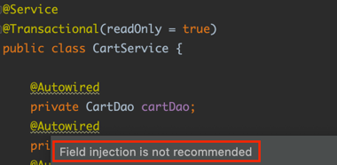

# 1. 의존성 자동주입

## 1.1. 의존성 주입 방법

[이전 포스팅](https://seongwon.dev/Spring-MVC/20220616-스프링-Bean/) 에서 말했듯이 스프링에서 빈을 등록하는 방법에는 `@Component`를 사용하거나 `@Configuration`, `@Bean`을 사용하여야 한다. 여기서 빈들 사이에 의존 관계가 있다면 어떻게 설정을 하여야 할까? 우선 `@Configuration`과  `@Bean`을 사용해 빈을 등록하는 방법에서는 설정 클래스에서 직접 생성자나 setter를 통해 주입을 해주면 될 것이다.

```java
@Configuration
public class AppCtx1 {

    @Bean
    public MemberDao memberDao() {
        return new MemberDao();
    }

    @Bean
    public MemberPrinter memberPrinter() {
        return new MemberPrinter(memberDao());
    }
}
```

하지만 `@Component`를 사용한 방법에서는 어떻게 의존 주입이 될까?? 아무런 설정이 없어도 스프링이 자동으로 의존 주입을 해줄까?? 스프링은 위와 같이 직접 의존 빈을 주입하지 않고 스프링이 자동으로 주입해주는 **자동 주입 기능**을 제공하고 있다.

이러한 자동 주입 기능은 스프링 3, 4 버전에서는 호불호가 갈렸으나 스프링 부트가 나오면서 거의 기본적으로 의존 자동 주입을 사용하는 추세로 바뀌었다.

## 1.2. Autowired

스프링은 자동 주입 기능을 위해 `@Autowired`어노테이션을 제공한다. `@Autowired`은 스프링 빈에 의존하는 다른 빈을 자동으로 주입하고 싶을 때 사용한다. 필드, 생성자, 세터 메서드에 해당 어노테이션을 붙여주면 스프링은 **타입**이 일치하는 빈 객체를 찾아서 주입을 해준다.

생성자를 통해 자동 주입 설정을 하였고, `@Configuration`클래스에서 빈을 등록할 때 setter로 주입하는 빈을 변경하여도 자동 주입 설정이 된 빈이 할당된다. 즉, 자동 주입 설정을 하였으면 setter를 통해 의존성을 재주입하여도 적용되지 않는다.

## 1.2.1. 자동주입 필수 여부 설정

필자는 아직까지 의존하는 빈이 존재하지 않아도 되는 경우를 경험해보지는 못했다. 하지만 추후 개발을 해당 내용을 사용할 상황이 발생할 수 있기에 해당 내용까지 정리를 하였다.

### 1.2.1.1. `@Autowired(required = false)`

자동 주입을 할 때 해당 빈이 존재하지 않는 경우 `NoSuchBeanDefinitionException`이 발생한다. 빈이 존재하지 않아도 예외를 발생하지 않도록 설정하려면 `@Autowired(required = false)`와 같이 옵션값을 변경해주면 된다.

### 1.2.1.2. Optional

스프링 5부터는 required 속성을 false로 하는 대신, 의존 주입 대상에 Optional 을 사용해도 된다. 자동 주입 대상이 Optional인 경우, 일치하는 빈이 존재하지 않으면 값이 없는 Optional을 인자로 전달하고 일치하는 빈이 존재하면 해당 빈을 값으로 갖는 Optional을 전달한다.

```java
    @Autowired
    public void setDateTimeFormatter(Optional<DateTimeFormatter> formatterOpt) {
        if (formatterOpt.isPresent()) {
            this.dateTimeFormatter = formatterOpt.get();
        } else {
            this.dateTimeFormatter = null;
        }
    }
```

### 1.2.1.3. @Nullable

주입 필수 여부를 설정하는 방법에는 `@Autowired(required = false)`와 `Optional`말고 `@Nullable`을 사용하는 방법도 있다. `@Autowired(required = false)`와 다른 점은 `@Autowired(required = false)`는 주입할 빈이 없으면 setter메서드가 호출되지 않아 값 할당 자체를 하지 않는다. 반면에 `@Nullable`은 주입할 빈이 존재하지 않으면 인자로 null을 전달하고 메서드가 호출된다.

```java
    @Autowired(required = false)
    public void setDateTimeFormatter(@Nullable DateTimeFormatter dateTimeFormatter) {
        this.dateTimeFormatter = dateTimeFormatter;
    }
```

# 2. 다양한 의존성 주입 방법

## 2.1. 필드 주입 (Field Injection)

```java
@Service
public class CartService {

    @Autowired
    private CartDao cartDao;
    @Autowired
    private MemberDao memberDao;
    @Autowired
    private ProductDao productDao;
}
```

필드 주입 방법은 위의 코드와 같이 필드에 `@Autowired`를 붙여 바로 의존 관계를 주입하는 방법이다. 이러한 필드 주입 방법은 코드가 간결해져 과거에는 많이 사용하였지만 외부에서 접근이 불가능하여 테스트의 어려움이 있다. 그리고 스프링과 같은 DI를 제공하는 프레임워크에서만 동작하여 프레임워크의 변경이 있을 시 많은 문제를 초래할 수 있다. 그래서 요즘은 필드 주입의 경우 사용을 지양하고 있다. IntelliJ에서도 필드 주입을 한다면 아래와 같이 `Field injection is not remommanded`라는 경고 문구가 나오게 된다.



📌 필드 주입의 실행 시점

- Fields are injected right after construction of a bean, before any config methods are invoked.

  → 필드 주입은 빈의 생성자가 실행된 바로 직후에 실행이 되게 된다.

## 2.2. Setter주입 (Setter Injection)

```java
@Service
public class CartService {

    private CartDao cartDao;
    private MemberDao memberDao;
    private ProductDao productDao;

    @Autowired
    private void setCartDao(CartDao cartDao) {
        this.cartDao = cartDao;
    }

    @Autowired
    private void setMemberDao(MemberDao memberDao) {
        this.memberDao = memberDao;
    }

    @Autowired
    private void setProductDao(ProductDao productDao) {
        this.productDao = productDao;
    }
}
```

Setter 주입은 이름 그대로 setter를 통해 빈의 의존성을 주입하는 방법이다. Setter 주입 방법은 주로 주입 받는 객체가 변경될 가능성이 있는 경우에 사용을 한다. 하지만 실제로 변경이 필요한 경우가 드물어 거의 사용을 하지 않는 것 같다. Setter 주입의 단점으로는 개발자가 실수로 의존 객체를 올바르게 주입하지 않을 경우, 사용 시점에 `NullPointerException`이 발생할 수 있다는 점이다. 또한 setter메서드를 public으로 열어둘 경우 잘못된 사용이 발생할 수도 있다.

📌 setter 주입에서 setter들은 public이 아닌 private 메서드로 설정해도 된다.

## 2.3. 생성자 주입 (Constructor Injection)

```java
@Service
public class CartService {

    private final CartDao cartDao;
    private final MemberDao memberDao;
    private final ProductDao productDao;

    public CartService(CartDao cartDao, MemberDao memberDao, ProductDao productDao) {
        this.cartDao = cartDao;
        this.memberDao = memberDao;
        this.productDao = productDao;
    }
}
```

생성자 주입은 생성자의 호출 시점에 1회 호출된다는 보장이 있다. 덕분에 주입을 받는 객체들이 변하지 않는다는 보장이 되고 필드에 final을 붙일 수 있다는 장점이 있다. 또한 생성자 주입의 경우, 생성자가 1개만 있을 경우 `@Autowired` 어노테이션이 생략 가능하다.

앞서 언급한 여러 주입 방법이 있지만 가장 권장되는 의존성 주입 방법은 생성자 주입이다. 생성자 주입을 사용하면 아래이 이점을 얻을 수 있다.

1. **객체의 불변성 확보 및 final 키워드**

- 생성자 호출 시점에 1회 호출된다는 보장이 있어 의존 관계 변경의 가능성이 사라지고 불변성이 보장된다. 그리고 생성자에서 의존 객체들을 주입하기에 다른 주입 방법에서는 할 수 없었던 final 키워드를 필드에 붙일 수 있다.
- Setter주입의 경우 의존 관계 변경의 가능성을 열어두어 유지보수 측면에서 좋지 않다.

2. **테스트 코드 작성**

- 앞서 말했듯이 필드 주입의 경우 스프링과 같이 DI를 제공하는 프레임워크에서만 동작 가능하다. 그래서 해당 방법을 사용할 경우 테스트 코드를 작성할 때도 순수 자바 코드만을 이용한 테스트가 불가능하고 무조건 프레이워크에 의존하게되는 테스트 코드가 만들어지게 된다. (스프링을 돌리지 않으면 의존 주입이 불가능해 테스트가 불가능하다🤯) 또한 스프링과 같은 프레임워크를 돌리게되면 테스트와 무관한 모든 Bean들이 등록되어 테스트 비용이 증가한다는 문제점이 발생한다.
- 생성자 주입을 사용하면 이와 같은 문제가 해결 가능하다. 우리가 만든 Test전용 객체를 직접 주입할 수도 있고 주입하는 객체가 누락된 경우 컴파일 시점에 오류가 발견되기도 하는 이점을 얻을 수 있다.

3. **Lombok과의 결합으로 코드 간결화**

- final 키워드를 필드에 붙일 수 있어 Lombok의 `@RequiredArgsConstructor`를 사용해 코드를 간결하게 작성할 수 있다.

  ```java
  @Service
  @RequiredArgsConstructor
  public class CartService {

      private final CartDao cartDao;
      private final MemberDao memberDao;
      private final ProductDao productDao;
  }
  ```

4. **순환 참조 에러 방지**

- 스프링 부트 2.6부터는 순환 참조가 허용되지 않는다. 생성자 주입을 사용한다면 어플리케이션 구동 시점에 순환 참조 에러를 예방할 수 있다.

# Reference

- [초보 웹 개발자를 위한 스프링5 프로그래밍 입문 - 챕터 3, 4](https://book.naver.com/bookdb/book_detail.nhn?bid=13786861)
- [[Spring] 다양한 의존성 주입 방법과 생성자 주입을 사용해야 하는 이유 - (2/2) MangKyu's Diary](https://mangkyu.tistory.com/125)
