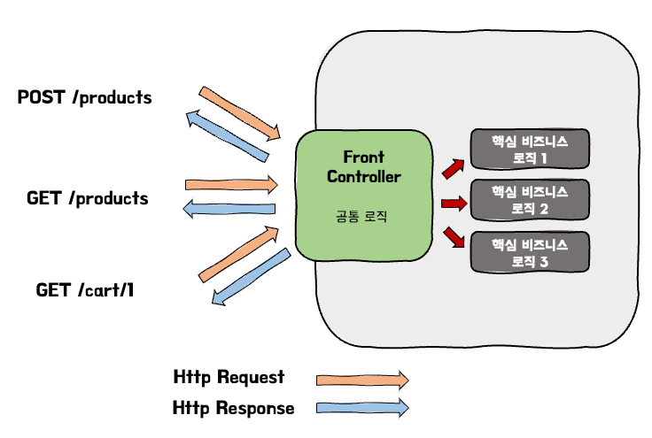
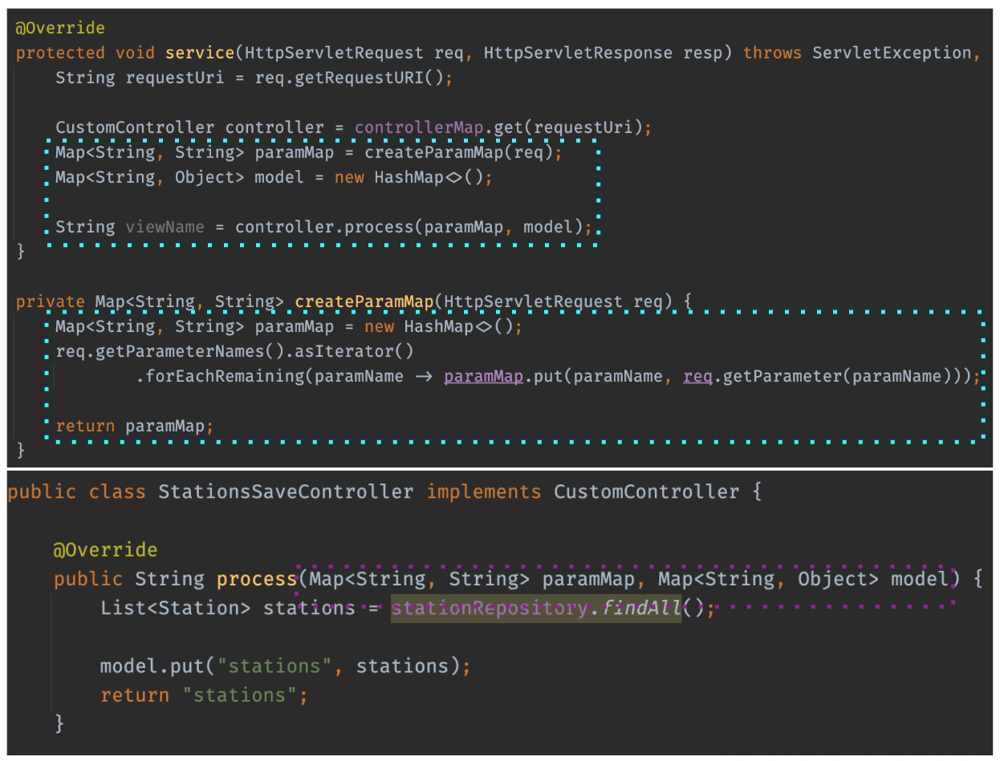
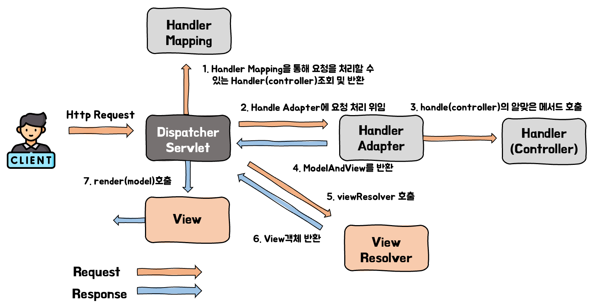
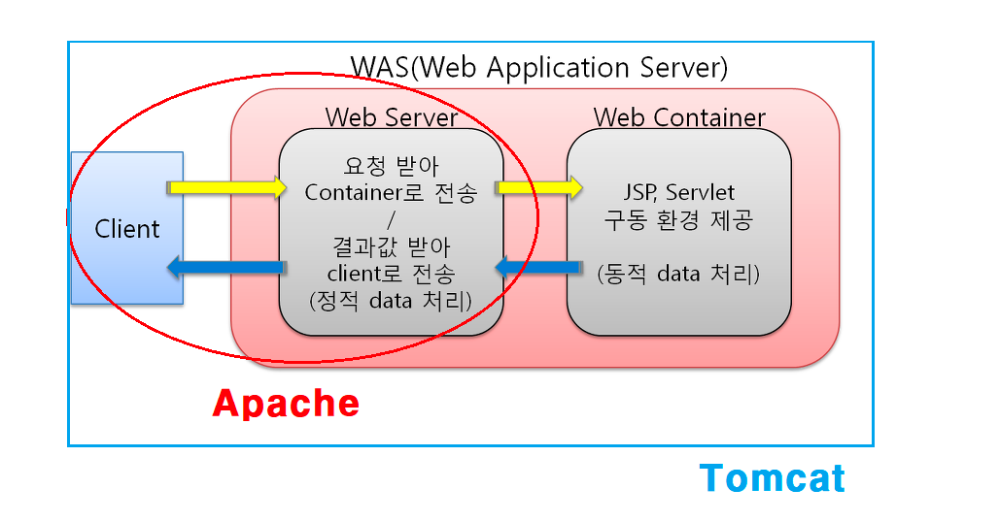
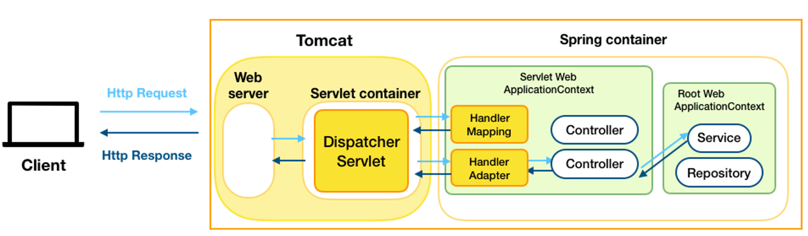

우리는 스프링 프로젝트를 작성하면 Url과 Http Method에 매칭되는 controller 메서드들을 만들 것이다. 이러한 요청들을 처리해주는 메서드들을 한 컨트롤러에 모아둘 수도 있으나 프로젝트의 규모가 커지게 되면 수백, 수천개의 API들을 관리해야하기에 대부분 아래와 같이 API의 기능, URL의 prefix따라 클래스를 분리하여 관리할 것이다.

```java
@RestController
@RequestMapping("/api/members/me/carts")
public class CartController {
    ...
    @PostMapping
    public ResponseEntity<Void> addCartItem(Long memberId, @RequestBody AddCartRequest request) {
        ...
    }

    @GetMapping
    public ResponseEntity<List<CartResponse>> getCartItems(Long memberId) {
        ...
    }

    @DeleteMapping("/{cartId}")
    public ResponseEntity<Void> deleteCartItem(Long memberId, @PathVariable Long cartId) {
        ...
    }
}

@RestController
@RequestMapping("/api/products")
public class ProductController {
    ...
    @PostMapping
    public ResponseEntity<Void> add(@Valid @RequestBody ProductRequest request) {
        ...
    }

    @GetMapping("/{productId}")
    public ResponseEntity<ProductResponse> product(@PathVariable long productId) {
        ...
    }

    @DeleteMapping("/{productId}")
    public ResponseEntity<Void> delete(@PathVariable long productId) {
        ...
    }
}

```

스프링은 여러 요청들을 받으면서 어떻게 알맞는 컨트롤러 메서드로 매핑을 시킬까? 이번 포스트에서는 스프링 프레임워크가 여러 요청들을 알맞게 처리하는 동작 과정에 대해 알아보고자 한다.

# 1. Dispatcher Servlet

스프링 프레임워크의 동작 방식을 알려면 먼저 Dispatcher Servlet의 개념부터 알아야 한다. Dispatcher Servlet의 개념을 알기 위해 Servlet에서 왜 Dispatcher Servlet이 만들어졌는지부터 알아보자

> Servlet에 대해 잘 모른다면 해당 게시글을 참고하길 바란다.
>
> - [Servlet이란?](https://seongwon.dev/Spring-MVC/20220620-Servlet%EC%9D%B4%EB%9E%80/)

## 1.2. Servlet의 단점

이전 [Servlet을 다룬 게시글](https://seongwon.dev/Spring-MVC/20220620-Servlet%EC%9D%B4%EB%9E%80/)을 보면 Servlet은 아래의 문제점들이 있었다.

1. 1대1 매핑 구조를 갖고 있어 공통 로직에 대해 중복 로직이 발생한다.
2. 모든 요청들이 서블릿에 의존적이어서 Servlet에 종속적인 프로그램을 작성하게 된다.

## 1.3. Front Controller Pattern & Dispatcher Servlet

앞의 Servlet의 단점들을 보완하기 위해 생겨난 것이 바로 Front Controller이다. Front Controller Pattern은 클라이언트의 요청을 받는 Servlet Container 앞단에 Front Controller를 만들어 모든 요청들은 Front Controller가 받고 해당 컨트롤러가 요청을 처리하는 로직을 찾아 수행할 수 있도록 하였다.



위와 같이 Front Controller를 만들게 되며 기존에 web.xml을 참조해 요청을 처리해줄 Servlet을 찾는 작업을 Front Controller가 해주게 되었다. 또한 요청에 따라 Servlet을 1대1로 생성하는 구조에서 Front Controller가 올바른 핵심 비즈니스 로직을 수행하게 변하여 생성해야하는 Servlet의 개수가 1개로 줄어들었다.

이로인해 요청의 진입점이 모두 Front Controller가 되어 관리가 수월해졌다. 그리고 공통 로직들을 Front Controller가 갖도록 하다보니 기존 Servlet의 문제점이었던 중복 로직들이 제거되었다.

마지막으로 Servlet 객체가 요청을 처리하는 `service()`의 매개변수로 사용되어 프로그램이 컨트롤러가 자바 객체를 받도록 변경되며 Servlet의 종속적이었던 문제가 해결되었다.



앞서 말한 Front Controller를 스프링에서 구현한 것이 바로 **Dispatcher Servlet**이다.

Dispatcher Servlet이 생겨나며 애플리케이션에 들어오는 처리해주다보니 개발자들은 비즈니스 로직에 더욱 집중을 할 수 있게 되었다.

# 2. Spring MVC(Dispatcher Servlet)의 동작 방식



1. **요청이 들어오면 HadlerMapping을 통해 해당 요청을 처리할 수 있는 컨트롤러 빈을 검색 및 반환한다.**

- 예를 들면 “GET /product/1”이라는 요청이 왔다면 HandlerMapping은 해당 요청을 처리할 수 있는 컨트롤러 빈을 찾아 DispatcherServlet에 해당 빈을 반환해준다.
- HandlerMapping의 구현체인 RequestMappingHandlerMapping은 모든 컨트롤러 빈을 파싱하여 요청 정보, 요청을 처리할 대상을 추출해 HashMap으로 관리한다. 요청이 온다면 HandlerMapping은 요청 정보를 객체로 만들고 해당 객체를 이용해 요청을 처리할 HandlerMethod(컨트롤러 빈) 찾아 HandlerMethodExecutionChain으로 감싸서 반환한다. HandlerMethodExecutionChain으로 감싸는 이유는 인터셉터와 같이 컨트롤러를 실행하기 전에 처리해야하는 정보를 포함하기 위해서이다.

2. **DispatcherServlet은 HandlerMapping에서 찾은 컨트롤러 빈을 실행시키기 위해 HandlerAdaptor에게 요청 처리를 위임한다.**

- DispatcherServlet이 직접 실행하지 않고 HandlerAdapter를 거치는 이유는 공통적인 전/후 처리 과정이 필요하기 때문이다.
  - @RequestParam, @RequestBody 등을 처리하기 위한 ArgumentResolver와 ResponseEntitiy body를 Json으로 직렬화하는 ReturnValueHandler 등이 Adapter를 통해 처리된다.

3. **HandlerAdapter는 컨트롤러의 알맞은 메서드를 호출하여 요청을 처리한다.**

- HandlerAdapter는 컨트롤러의 메서드를 실행하기 전에 먼저 HandlerMethodExecutionChain에 있는 인터셉터들을 모두 실행한다.

4. **HandlerAdapter는 컨트롤러에서 받은 결과를 ModelAndView로 변환 후에 DispatcherServlet에 반환한다.**

- View를 반환하는 것이 아닌 RestController의 경우 ResponseEntity를 반환한다.
  - 이 경우 HandlerAdapter는 컨트롤러에서 받은 응답을 ReturnValueHandler를 통해 body값을 Json으로 직렬화시키고 HttpStatus code를 설정하는 작업을 한다.

5. **DispatcherServlet은 결과로 받은 ModelAndView를 보여줄 View를 찾기위해 스프링 컨테이너에서 ViewResolver 빈 객체를 찾아 호출한다.**
6. **ViewResolver는 뷰 이름에 해당하는 View객체를 찾거나 생성해서 반환한다.**

- JSP를 사용하는 ViewResolver는 매번 새로운 View객체를 생성하여 DispatcherServlet에 반환한다.

7. **ViewResolver가 반환한 View객체에 응답 결과 생성을 요청한다.**

- JSP를 사용하는 경우 View 객체는 JSP를 실행함으로써 웹 브라우저에 전송할 응답 결과를 생성한다.

# 3. 전반적인 스프링 MVC 구조

스프링은 WAS로 Apache Tonmcat을 사용하고 있다.

> 아파치(Apache)는 오픈 소스 소프트웨어 그룹인 아파치 소프트웨어 재단(Apache Software Foundation, ASF)에서 만든 웹서버 프로그램으로 클라이언트 요청이 들어왔을 때만 응답하는 **정적 타입**의 데이터만 처리 가능하다.

> 톰캣 또한 아파치 소프트웨어 재단에서 후원을 하고 있으며 오픈소스로 개발이 되고 있다. JAVA EE 기반으로 만들어졌으며 JSP와 Servlet을 구동하기 위한 서블릿 컨테이너 역할을 수행한다. 아파치서버와는 다르게 DB연결, 다른 응용프로그램과 상호 작용 등 동적인 기능들을 사용할 수 있다.

> 아파치 톰캣은 무엇일까?
> 톰캣이 아파치의 기능 일부를 가져와 제공해주는 형태이기에 합쳐서 아파치 톰캣이라고 부르고 있다.
>
> 

Apache Tomcat을 사용하는 Spring의 구조를 그림으로 표현하면 아래와 같다.



# Reference

- [Spring,io - Web on Servlet Stack](https://docs.spring.io/spring-framework/docs/current/reference/html/web.html#spring-web)
- [초보 웹 개발자를 위한 스프링5 프로그래밍 입문 - 챕터 10](https://book.naver.com/bookdb/book_detail.nhn?bid=13786861)
- [[10분 테코톡] 루키의 Servlet & Spring Web MVC](https://www.youtube.com/watch?v=h0rX720VWCg)
- [[Spring] Dispatcher-Servlet(디스패처 서블릿)이란? 디스패처 서블릿의 개념과 동작 과정 MangKyu's Diary](https://mangkyu.tistory.com/18)
- [2. DispatcherServlet 이란?](https://velog.io/@seculoper235/2.-DispatcherServlet-%EC%9D%B4%EB%9E%80)
- [Servlet(서블릿이란? 그리고, DispatcherServlet이란?)](https://riimy.tistory.com/87)
- [Tomcat, Spring MVC의 동작 과정](https://taes-k.github.io/2020/02/16/servlet-container-spring-container/)
- [[Apache Tomcat] 아파치 톰캣이란 ?](https://byul91oh.tistory.com/65)
