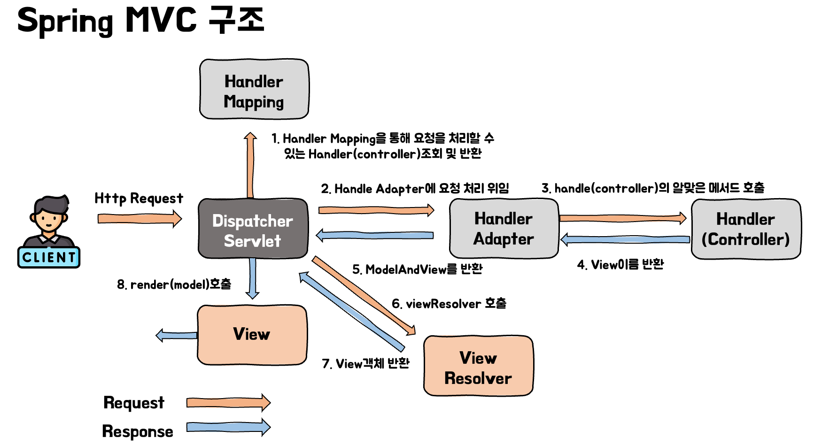
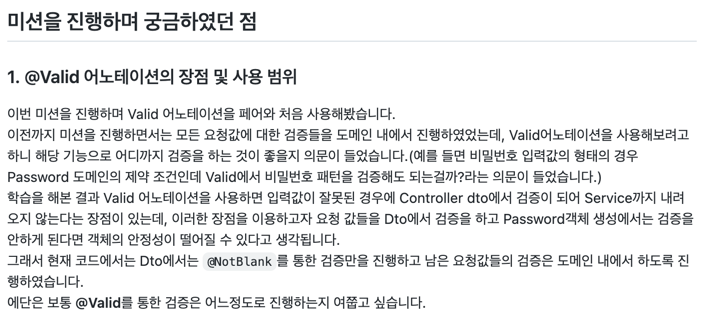

# Java Validation API란?

HTTP request를 통해 Post Request와 같이 데이터를 받는 request를 받을 경우 데이터가 올바른 형식인지, 올바른 값인지 확인을 하고 만약 올바르지 않은 값이 들어온다면 Bad request를 보내야 할 것이다.

```json
{
  "name": "렉스",
  "age": 26,
  "email": "qwewqd",
  "phoneNumber": "0111111"
}
```

예를 들어 위의 Json형식의 데이터가 POST request의 Body로 넘어왔다고 생각해보자. 위의 데이터를 보면 Email형식이 맞지 않고 전화번호의 형식 또한 일반적인 xxx-xxxx-xxxx의 형태가 아닌 것을 확인 할 수 있다.

요청 값들을 검증하는 방법에는 어떤 방법이 있을까?? 먼저 도메인 객체인 User에서 검증을 하는 방법이 존재한다.

```java
public class User {

    private final String name;
    private final int age;
    private final String email;
    private final String phoneNumber;

    public User(String name, int age, String email, String phoneNumber) {
        validateAge(age);
        validateEmailForm(email);
        validatePhoneNumberForm(phoneNumber);
        this.name = name;
				this.age = age;
        this.email = email;
        this.phoneNumber = phoneNumber;
    }
		...
}
```

도메인에서 검증을 할 경우, 도메인 객체 값에 대한 안정성이 보장이 될 것이다. 하지만 잘못된 요청 값을 검증하기까지 Service계층까지 내려와야한다는 단점이 있다.

Service 계층까지 내려가지 않고 Controller단에서 잘못된 값에 이전에 검증을 하게되면 어떻게 될까? 컨트롤러에서 if문을 사용하여 DTO 값의 오류를 체크하고 조건에 만족하지 못하면 bad request를 보내는 식으로 검증을 할 수 있을 것이다.

```java
@RestController
public class MemberController {

    @PostMapping("/user")
    public ResponseEntity user(@RequestBody User user){
        if(isInvalidEmailForm(user.getEmail()))
            return ResponseEntity.status(HttpStatus.BAD_REQUEST).body(user);
        return ResponseEntity.ok(user);
    }
		...
}

```

하지만 이러한 방식은 적은 양의 값에 대해서 조건을 걸면 크게 문제가 없지만 여러 값에 대해 하나씩 조건을 걸기에는 코드의 길이가 길어지고 복잡해질 것이다. 또한 구현에 따라 Service logic과의 분리가 필요하고 코드가 흩어져 있는 경우 어디에서 검증을 하는지 알기 어려우며 재사용의 한계가 있다.

자바에서는 이러한 검증을 편하게 할 수 있도록 **Java Validation API(_Bean Validation, JSR 380_)**를 제공하고 있다. Java Validation API를 사용하면 이러한 Request의 잘못된 데이터를 Service 단으로 내려오기 전에 쉽게 검증할 수 있다.

# 2. Validation API사용 설정

**build.gradle**의 dependencies에 다음과 같이 validation 의존성을 추가해준다.

```java
dependencies {
    implementation 'org.springframework.boot:spring-boot-starter-validation'
}
```

이전에는 javax.validation 을 사용하였으나 SpringBoot가 버전업을 하면서 web 의존성안에 있던 constraints packeage가 모듈로 빠지게 되었다.

# 3. Valication annotation 종류

- `@AssertFalse`
  - 거짓이어야 한다.
  - null은 유효한 것으로 간주한다.
  - 지원되는 타입: boolean, Boolean
- `@AssertTrue`
  - 참이어야 한다.
  - null은 유효한 것으로 간주한다.
  - 지원되는 타입: boolean, Boolean
- `@Email`
  - 이메일 형식이어야 한다.
  - 지원되는 타입: CharSequence
- `@Future`
  - 미래의 날짜, 또는 시간이어야 한다.
  - null은 유효한 것으로 간주한다.
  - 지원되는 타입: Date, Calendar, Instant, LocalDate, LocalDateTime 등
- `@Past`
  - 과거의 순간, 날짜 또는 시간이어야 한다.
  - null은 유효한 것으로 간주한다.
  - 지원되는 타입: Date, Calendar, Instant, LocalDate, LocalDateTime 등
- `@Max(value=)`:
  - value보다 작거나 같아야 한다.
  - null은 유효한 것으로 간주한다.
  - 지원되는 타입: BigDecimal, BigInteger, byte, short, int, long 및 각각의 래퍼 클래스
    - double, float는 지원되지 않는다.
- `@Min(value=)`
  - value보다 크거나 같아야 한다.
  - null은 유효한 것으로 간주한다.
  - 지원되는 타입: BigDecimal, BigInteger, byte, short, int, long 및 각각의 래퍼 클래스
    - double, float는 지원되지 않는다.
- `@NotNull`
  - Null이 아니어야 한다.
  - 지원되는 타입: 모든 타입
- `@NotBlank`
  - Null이 아니어야하며 하나 이상의 공백이 아닌 문자를 포함해야 한다.
  - 지원되는 타입: CharSequence
- `@NotEmpty`:
  - Null이거나 비어있으면 안 된다.
  - 지원되는 타입: CharSequence, Collection, Map, Array
- `@Pattern(regexp=)`
  - 문자열은 regexp에 지정된 정규식과 일치하여야 한다.
  - 지원되는 타입: CharSequence
- `@Size(min=, max=)`
  - 크기가 해당 범위 내에 있어야 한다.
  - null은 유효한 것으로 간주한다.
  - min의 default값은 0, max의 default값은 2147483647이다.
  - 지원되는 타입: CharSequence, Collection, Map, Array

> `@NotNull`, `@NotBlank`, `@NotEmpty`을 통한 검증은 어노테이션이 비슷한 이름을 가져서 헷갈릴 수가 있다.

- `@NotNull`: 값이 반드시 존재해야 한다.
- `@NotEmpty`: null이 아니어야하고 문자열의 크기가 반드시 0보다 커야한다.
- `@NotBlank`: null이 아니어야하고 공백을 제외한 문자열의 길이가 0보다 커야한다. (String str = “ ”; 에서는 공백을 제외하면 길이가 0이라 예외가 발생하게 된다.)

> 더 많은 정보는 [다음 사이트](https://docs.jboss.org/hibernate/beanvalidation/spec/2.0/api/)에서 확인할 수 있습니다.

# 4. Validation API사용하기

```java
public class UserRequest {

    @NotBlank // null값과 공백 문자열을 허용안함
    private String name;
    @Max(value = 90)
    private int age;
    @Email // -> email형식이 아닌 데이터가 들어오면 오류 발생시킨다.
    private String email;
    @Pattern(regexp = "^\\\\d{2,3}-\\\\d{3,4}-\\\\d{4}$", message = "핸드폰 번호의 약식과 맞지 않습니다. xxx-xxxx-xxxx")
    // 받아들이는 문자의 형태를 직접 제한하는 방법 (정규식을 사용)
    // message에는 error가 발생했을 때 출력할 메세지를 적는다.
    private String phoneNumber;
    ...
}

```

Java Validation API을 사용하기 위해서는 DTO객체의 변수 위에 데이터의 검증을 하고싶은 검증 어노테이션을 추가해줘야 한다.

위의 User class를 보면 name의 경우는 null값과 공백 문자열을 제한하기 위해 `@NotBlank`를 추가하였으며, age의 경우 `@Max`값을 90으로 제한하여 90이상의 값이 들어오면 예외를 발생시키는 제한을 하였다.
또한 email의 경우 `@Email`을 통해 email형식이 들어오는지 확인을 해주며, PhoneNumber의 경우는 `@Pattern`과 정규식을 통해 전화번호 형태를 제한하였다. (정규식의 경우 필요에 따라 구글을 통해 찾아보고 사용하면 된다.)

RequestDTO에 검증 어노테이션을 붙인다고 검증이 적용되는 것은 아니다. 해당 어노테이션들을 활성화하려면 해당 DTO를 사용하는 컨트롤러 메서드의 매개변수 앞에 `@Valid`를 붙여줘야 한다.

```java
@RestController
public class MemberController {

    @PostMapping("/user")
    public ResponseEntity user(@Valid @RequestBody UserRequest request){
        return ResponseEntity.ok(request);
    }
}
```

위의 코드를 실행하였을 때 결과를 확인해보자


Validation API가 정상 동작하여 형식이 맞지 않는 data를 전송하였을 때 HTTP status 400을 반환하는 것을 확인할 수 있다.

## 4.1. 예외 메시지 담기

웹에서 사용자의 잘못된 입력 값에 따른 피드백을 주는 것은 중요한 작업이다. 상황별 메시지를 보내기 위해 우리는 비즈니스 로직을 수행하며 발생한 Exception들은 `new IllegalArgumentException(”예외 발생 메시지”);` 와 같이 메시지를 담은 예외를 발생시킨다. Validation API에서도 검증이 실패하였을 때 Exception에 담을 메시지를 설정할 수 있다. 방법은 간단하다. 단순히 annotation의 message옵션 값에 담고 싶은 메시지를 설정해두면 된다.

```java
public class SignUpRequest {

    @NotBlank(message = "이메일은 빈 값일 수 없습니다.")
    @Email(message = "올바르지 않은 형식의 이메일입니다.")
    private String email;
    @NotBlank(message = "이름은 빈 값일 수 없습니다.")
    private String name;
    @NotBlank(message = "비밀번호는 빈 값일 수 없습니다.")
    private String password;
}
```

이와 같이 메시지를 설정해두면 예외를 핸들링할 때 해당 메시지를 통해 사용자에게 피드백을 줄 수 있다.

# 5. @Valid의 검증 시점

스프링 부트는 컨트롤러 메서드 매개변수에서 @Valid 어노테이션을 발견하면 JSR 380 구현체인 Hibernate Validator를 자동으로 실행하고 Arguement를 검증한다. 그러면 실질적인 검증은 어느 시점에 하는 걸까?? 이를 알기 위해서는 먼저 스프링 MVC의 동작 방식을 알아야 한다.

스프링 MVC는 사용자로부터 요청이 왔을 때, 아래와 같은 과정을 거치며 요청을 처리하게 된다.

> 해당 과정을 잘 모르겠다면 다음 게시글을 참고하길 바란다.
> - [스프링 - MVC 동작 방식 이해하기](https://seongwon.dev/Spring-MVC/20220621-%EC%8A%A4%ED%94%84%EB%A7%81MVC-%EB%8F%99%EC%9E%91%EB%B0%A9%EC%8B%9D/)
> - [스프링 - @RestController와 @Controller 비교하기](https://seongwon.dev/Spring-MVC/20220621-Controller%EC%99%80RestController%EC%B0%A8%EC%9D%B4/)



@Valid는 위의 과정 중에서 HandlerAdapter에서 Handler를 호출하는 과정에 동작하게 된다. 정확히 말하면 RequestMappingHandlerAdapter에서 ArgumentResolver를 통해 JSON타입의 데이터를 객체로 변환하는 과정에 동작을 하게 된다. 해당 과정에서 예외가 발생하면 Spring은 `MethodArgumentNotValidException`를 발생시킨다.


검증 어노테이션들은 이와 같이 Handler Adapter 처리 과정중에 동작을 하기에 아래와 같이 단순히 잘못된 값으로 객체를 생성하였을 때는 예외가 발생하지 않게 된다.

```java
@Getter
@NoArgsConstructor
@AllArgsConstructor
public class SignUpRequest {

    @NotBlank(message = "이메일은 빈 값일 수 없습니다.")
    @Email(message = "올바르지 않은 형식의 이메일입니다.")
    private String email;
    @NotBlank(message = "이름은 빈 값일 수 없습니다.")
    private String name;
    @NotBlank(message = "비밀번호는 빈 값일 수 없습니다.")
    private String password;
}
```

```java
class SignUpRequestTest {

    @Test
    void validTest() {
        String email = "wrongEmailForm";
        String name = "";
        String password = "";
        assertThatThrownBy(() -> new SignUpRequest(email, name, password))
                .isInstanceOf(MethodArgumentNotValidException.class);
    }
}
// 예외가 발생하지 않아서 Fail!!!!
```

# 6. @Valid에서 발생하는 Exception Handling

## 6.1. ExceptionHandler 사용

앞서 말했듯이 `@Valid`에서 검증을 하는 도중 잘못된 매개변수 값이 발견된다면 `MethodArgumentNotValidException`이 발생하게 된다. 중복코드 없이 가장 간단하게 예외를 잡는 방법은 `@ControllerAdvice`에서 `@ExceptionHandler`를 통해 예외를 잡는 방법이다.

해당 방법을 코드로 표현하면 다음과 같다.

```java
@RestControllerAdvice
public class GlobalControllerAdvice {

    @ExceptionHandler(MethodArgumentNotValidException.class)
    public ResponseEntity<ErrorResponse> handleMethodArgumentNotValidException(MethodArgumentNotValidException e) {
        StringBuilder message = new StringBuilder();

        for (FieldError error : e.getFieldErrors()) {
            message.append(error.getDefaultMessage()).append(" ");
        }
        return ResponseEntity.badRequest().body(new ErrorResponse(message.toString()));
    }
}
```

일반적으로 ExceptionHandler에서 예외에 담긴 메시지를 꺼낼 때는 `e.getMessage()`를 사용한다. 하지만 위의 코드에서는 `e.getMessage()`를 통해 메시지를 꺼내지 않고 `e.getFieldErrors()`, `e.getDafaultMessage()`를 사용하는 등의 다소 복잡한 로직들이 작성되었다.

이와 같이 메시지를 꺼내는 로직이 복잡한 이유는 아래와 같다.


보통 우리가 `new IllegalArgumentException(”예외 메시지”);`와 같이 예외를 발생시키면 해당 예외 메시지는 defaultMessage에 위치하여 `e.getMessage()`를 통해 추출할 수 있었다. 하지만 validation annotation을 통해 지정한 예외 메시지는 해당 위치가 아닌 errors-defaultMessage에 위치하게 된다. 이 때문에 우리는 에러 메시지를 추출하기 위해서는 `e.getMessage()`가 아닌 `e.getFieldErrors()`를 통해 errors에 접근하고 이를 순회하며 `e.getDafaultMessage()`를 통해 예외 메시지를 출력하는 로직을 작성하여야 한다.

## 6.2. 컨트롤러 메서드에서 잡기

`@ExceptionHandler`가 아닌 컨트롤러의 메서드 내에서도 예외를 바로 잡을 수 있다. `Errors` 또는 `BindingResult`를 매개변수로 두면 따로 예외가 발생하지 않는다. 해당 파라미터에 에러 내용이 담기게 된다. 우리는 `getAllErrors()`, `hasErrors()`와 같은 메서드를 통해 예외에 따른 Response를 만들 수 있다.

```java
@RestController
public class MemberController {

    @PostMapping("/user")
    public ResponseEntity user(@Valid @RequestBody User user, BindingResult bindingResult){

        if(bindingResult.hasErrors()){
            StringBuilder sb = new StringBuilder();
            bindingResult.getAllErrors().forEach(objectError -> {
                FieldError field = (FieldError) objectError;
                String message = objectError.getDefaultMessage();

                System.out.println("Field : "+ field.getField());
                System.out.println(message);

                sb.append("Field : "+ field.getField());
                sb.append("message: "+message);
                sb.append("\\n\\n");
            });
            return ResponseEntity.status(HttpStatus.BAD_REQUEST).body(sb.toString());
        }

        return ResponseEntity.ok(user);
    }
}

```

# 7. DTO에서는 @Valid로 어디까지 검증해야할까?

Valid를 통해 DTO에서 어디까지 검증을 해야할지에 대한 주제는 우아한테크코스 내에서도 뜨거운 감자였다. 저 또한 해당 내용에 대해 리뷰어와 여러 크루들에게 질문도 했었습니다.



여러 사람들과 해당 주제로 이야기를 나누다보니 여러 의견이 있었습니다. 지금 생각나는 의견들을 몇개 적어보면 아래와 같습니다.

Q: 비밀번호의 대소문자, 특수문자, 숫자 포함과 같은 제약 조건들도 DTO에서 검증하는 것이 좋을까?

A:

- 🙆🏻: `@Valid`를 사용하면 서비스 레이어로 내려오기 이전에 검증을 할 수 있어서 잘못된 요청이 왔을 때 컨트롤러 단에서 끊어내어 자원을 아낄 수 있어서 검증을 하는 것이 좋을 것 같다. 하지만 DTO에서 검증을 한다고 도메인의 검증 로직을 제거해도 되는것은 아니다. Password 조건과 같은 내용들은 도메인이 가져야할 제약 조건이라 도메인의 안정성을 위해 도메인에서도 검증을 하여야 한다. (2중 검증)
- 🙅🏻: 해당 기능을 사용하면 확실히 컨트롤러 단에서 끊어낼 수 있다는 이점이 있다. 하지만 해당 조건은 도메인의 제약조건이기에 DTO가 아닌 도메인이 갖는 것이 맞다. 물론 DTO와 password에서 2중 검증을 할 수도 있지만 이러한 경우, Password의 제약조건에 변경이 생기게 된다면 도메인과 이를 사용하는 모든 DTO에서 수정이 필요할 것이다. 이와 같이 유지보수성 측면에서 좋지 않다!!

코드 작성에 정답은 없지만 여러 이야기를 나누며 저는 아래와 같은 Valid의 사용 기준을 정하였습니다.

- DTO에서는 `@Email`, `@NotBlank`와 같이 요구사항 변경이 있어도 코드 상의 변경이 없을 최소한의 검증만 진행한다. (`@Email`의 경우 도메인에서도 검증 필요)
- Password와 같은 도메인 제약조건은 DTO에서 검증을 하는 것이 아닌 도메인에서 검증을 한다.

해당 사용 기준은 개발을 하면서도 계속 변경이 있을 수 있으나 일단은 앞서 말한 기준으로 개발을 진행해나가려 합니다😁

# Reference

- [Fast Campas - 한번에 끝내는 Java/Spring 웹 개발 마스터 초격차 패키지 Online.](https://fastcampus.co.kr/dev_online_javaend)
- [Spring Validation Annotation 총정리](https://hyeran-story.tistory.com/81)
- [[Spring] @Validated vs @Valid](https://bepoz-study-diary.tistory.com/413)
- [Validation in Spring Boot](https://www.baeldung.com/spring-boot-bean-validation)
- [Java Bean Validation Basics](https://www.baeldung.com/javax-validation)
- [@Valid 를 이용해 @RequestBody 객체 검증하기](https://jyami.tistory.com/55)
