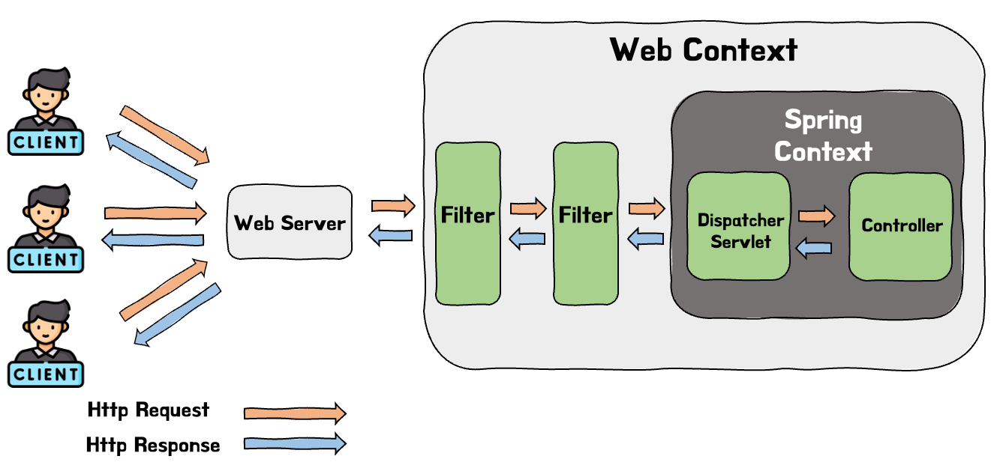
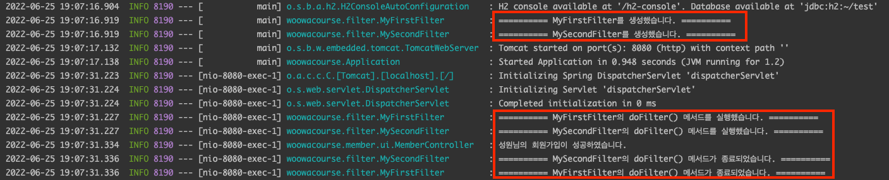

# Filter란 무엇일까?

스프링에서 공통 기능을 제거하는 대표적인 방법으로는 Filter, Interceptor, AOP가 있다. 이번 포스트에서는 공통 기능 제거 방법 중 Filter에 대해 알아볼 것이다.

# 1. Filter란?

필터는 스프링에서 제공하는 것이 아닌 J2EE 표준 스펙 기능으로 Dispatcher Servlet으로 request가 가기 전/후에 사전에 정의한 url 패턴에 맞는 요청들에 대해 부가적인 작업을 처리해준다. 필터는 아래의 사진과 같이 Spring Context가 아닌 톰켓과 같은 Web Context내에서 관리가 되어 Dispatcher Servlet 전/후에 실행된다. 또한 필터는 Filter Chain을 통해 여러 필터가 연쇄적으로 동작하게 할 수 있다.



이러한 필터는 주로 인증/인가를 하기 위해 사용하며 Spring에서는 Spring Security라는 도구를 제공하기도 한다. 인증/인가 외에도 모든 요청에 대한 로깅, 이미지/데이터의 압축 및 문자열 인코딩 등의 작업을 위해 사용하기도 합니다.

# 2. Spring 외부의 영역인 Filter의 Bean으로 등록!?

앞서 필터는 스프링의 영역인 Spring Context 외부에서 사용된다고 하였다. 하지만 Spring은 Filter를 빈으로 등록할 수 있도록 지원하여 개발자들은 Spring Framework내에서도 Filter를 추가하는 등의 조작이 가능하다.

해당 내용은 다음 블로그에서 상세한 설명을 해주어서 블로그 링크만 첨부하도록 하겠다.

- [[Spring] 필터(Filter)가 스프링 빈 등록과 주입이 가능한 이유(DelegatingFilterProxy의 등장)](https://mangkyu.tistory.com/221)

# 3. Filter의 메서드

필터를 만들기 위해서는 javax.servlet의 Filter 인터페이스를 구현한 클래스를 만들어야 한다. Filter인터페이스는 init(), doFilter(), destroy() 메서드를 갖고 있고 우리는 이를 구현해야한다.

```java
package javax.servlet;

import java.io.IOException;

public interface Filter {

    public default void init(FilterConfig filterConfig) throws ServletException {}

    public void doFilter(ServletRequest request, ServletResponse response,
            FilterChain chain) throws IOException, ServletException;

    public default void destroy() {}
}
```

- `init()`: 필터 객체를 초기화하고 서비스에 추가해주는 메서드이다. 웹 컨테이너는 `init()`메서드를 한 번만 호출하여 필터 객체를 초기화한다.
- `doFilter()`: 설정된 URL 패턴에 맞는 모든 요청들에 대해 실행되는 메서드이다. 해당 메서드의 수행이 끝나면 파라미터로 존재하는 FilterChain를 이용한 `chain.doFilter()`를 통해 다음 필터를 실행하게 된다.
- `destroy()`: 필터가 소멸될 때 수행되는 메서드로 필터 객체를 서비스에서 제거하고 사용하는 자원을 반환하는 작업을 한다. 해당 메서드도 웹 컨테이너에 의하여 한 번 호출 됩니다.

> `init()`과 `destroy()`메서드는 Filter 인터페이스에서 default메서드로 만들어져서 필수적으로 재정의하지 않아도 된다.

# 4. Filter 사용해보기

앞서 설명한 javax.servlet의 Filter 인터페이스를 구현한 필터 클래스를 Bean으로 등록해주면 해당 Filter가 동작하게 된다.

테스트를 위해 Filter클래스의 메서드들이 로그를 남기도록 메서드 재정의를 하고 Bean으로 등록 후 애플리케이션을 실행하며 두번의 회원가입 요청을 보내봤다.

```java
@Slf4j
public class MyFirstFilter implements Filter {

    @Override
    public void init(FilterConfig filterConfig) throws ServletException {
        log.info("========== MyFirstFilter를 생성했습니다. ==========");
    }

    @Override
    public void doFilter(ServletRequest request, ServletResponse response, FilterChain chain) throws IOException, ServletException {
        log.info("========== MyFirstFilter의 doFilter() 메서드를 실행했습니다. ==========");
        chain.doFilter(request, response);
        log.info("========== MyFirstFilter의 doFilter() 메서드가 종료되었습니다. ==========");

    }

    @Override
    public void destroy() {
        log.info("========== MyFirstFilter를 제거했습니다. ==========");
    }
}
```

```java
@Configuration
public class FilterConfig {

    @Bean
    public FilterRegistrationBean<MyFirstFilter> myFirstFilter() {
        FilterRegistrationBean<MyFirstFilter> registrationBean = new FilterRegistrationBean<>(new MyFirstFilter());
        registrationBean.setUrlPatterns(List.of("/api/members/*"));
        return registrationBean;
    }
}
```

여기서 눈여겨 볼 코드는 `FilterRegistrationBean`클래스와 `setUrlPatterns()`메서드이다. `@Configuration`이 붙은 설정 클래스에서 필터를 빈으로 등록할 때는 `FilterRegistrationBean`클래스를 사용하여 직접 등록한다. 해당 클래스에서는 많은 메서드들을 제공하고 있는데 그 중 하나가 `setUrlPatterns()`메서드이다. 해당 메서드는 이름에서 알 수 있듯이 Filter를 적용할 URL 패턴을 설정하는 메서드이다.

테스트를 위해 작성한 코드에서는 `"/api/members"` 하위 경로에 대한 모든 요청에 Filter를 동작시키도록 하였다.

```java
@Slf4j
@RestController
@RequestMapping("/api/members")
public class MemberController {

    private final MemberService memberService;

    public MemberController(MemberService memberService) {
        this.memberService = memberService;
    }

    @PostMapping
    @ResponseStatus(HttpStatus.CREATED)
    public void signUp(@Valid @RequestBody SignUpRequest request) {
        memberService.signUp(request.toServiceRequest());
        log.info(request.getName() + "님의 회원가입이 성공하였습니다.");
    }
}
```

실행 결과는 다음과 같다.


먼저 스프링 프로젝트를 실행하게 되면 1번으로 표시한 것을 통해 알 수 있듯이 Bean으로 등록한 필터가 정상적으로 만들어진 것을 확인할 수 있다. 이후, 회원 가입을 하는 2번의 요청을 보낸 결과 doFilter의 메서드의 호출 시점과 끝나는 시점에 2, 3번의 로그가 찍히게 되었다. 마지막으로 어플리케이션을 종료하였더니 4번 로그인 Filter가 제거되었다는 로그를 확인할 수 있었다.

지금까지 하나의 필터가 정상 작동하는 것을 확인하였다. 필터를 하나 더 추가하여 이들의 실행 순서를 확인해보겠다. 테스트를 위해 MySecondFilter라는 이름의 필터를 생성하였다.

```java
@Slf4j
public class MySecondFilter implements Filter {

    @Override
    public void init(FilterConfig filterConfig) throws ServletException {
        log.info("========== MySecondFilter를 생성했습니다. ==========");
    }

    @Override
    public void doFilter(ServletRequest request, ServletResponse response, FilterChain chain) throws IOException, ServletException {
        log.info("========== MySecondFilter의 doFilter() 메서드를 실행했습니다. ==========");
        chain.doFilter(request, response);
        log.info("========== MySecondFilter의 doFilter() 메서드가 종료되었습니다. ==========");

    }

    @Override
    public void destroy() {
        log.info("========== MySecondFilter를 제거했습니다. ==========");
    }
}
```

```java
@Configuration
public class FilterConfig {

    @Bean
    public FilterRegistrationBean<MyFirstFilter> myFirstFilter() {
        FilterRegistrationBean<MyFirstFilter> registrationBean = new FilterRegistrationBean<>(new MyFirstFilter());
        registrationBean.setUrlPatterns(List.of("/api/members"));
        registrationBean.setOrder(1);
        return registrationBean;
    }

    @Bean
    public FilterRegistrationBean<MySecondFilter> mySecondFilter() {
        FilterRegistrationBean<MySecondFilter> registrationBean = new FilterRegistrationBean<>(new MySecondFilter());
        registrationBean.setUrlPatterns(List.of("/api/members"));
        registrationBean.setOrder(2);
        return registrationBean;
    }
}
```

📌  필터가 여러개인 경우 setOrder()메서드를 통해 필터의 동작 순서를 결정할 수 있다.

MyFirstFilter를 1번, MySecondFilter를 2번째에 실행되도록 설정 후 테스트를 해보겠다.



테스트 결과는 setOrder()를 통해 정해둔 순서대로 filter가 동작되는 것을 확인할 수 있다. 그리고 실행 로그를 보면 doFilter의 실행은 MyFirstFilter필터가 먼저 실행되었으나 종료될 때는 MySecondFilter가 먼저 실행되는 것을 확인할 수 있다. 이를 통해 Filter의 수행은 자료구조의 stack구조와 들어갈때와 나올 때의 순서가 반대인 것을 확인할 수 있다.

> setOrder의 순서를 MySecondFilter가 먼저 실행되도록 설정 후, 테스트를 해보니 실행 순서는 설정을 바꾼대로 MySecondFilter의 doFilter가 먼저 실행되었다. 하지만 Init()메서드의 경우 Bean이 등록되면서 실행이 되는 것이기에 setOrder()와는 무관하게 Bean으로 등록되는 순서대로 실행되는 것을 확인하였다.

# 5. Filter의 Bean 등록 방법

모두들 Bean을 등록하는 방법에는 `@Component`, `@ComponentScan`를 사용한 방법과 `@Configuration`, `@Bean`을 사용한 방법이 있다.

> 빈에 대한 지식이 부족하다면 [다음 게시글](https://seongwon.dev/Spring-MVC/20220616-%EC%8A%A4%ED%94%84%EB%A7%81-Bean/)을 참고하길 바란다.

앞서 Filter를 사용하는 실습 코드들에서는 `@Configuration`, `@Bean`을 통해 빈을 등록하는 방법을 사용하였다. 하지만 Filter를 Bean으로 등록하는 방법에는 `@Component`를 통해 간단히 등록하는 방법도 존재한다.

```java
@Configuration
public class FilterConfig {

    @Bean
    public FilterRegistrationBean<MyFirstFilter> myFirstFilter() {
        FilterRegistrationBean<MyFirstFilter> registrationBean = new FilterRegistrationBean<>(new MyFirstFilter());
        registrationBean.setUrlPatterns(List.of("/api/members"));
        registrationBean.setOrder(1);
        return registrationBean;
    }

    @Bean
    public FilterRegistrationBean<MySecondFilter> mySecondFilter() {
        FilterRegistrationBean<MySecondFilter> registrationBean = new FilterRegistrationBean<>(new MySecondFilter());
        registrationBean.setUrlPatterns(List.of("/api/members"));
        registrationBean.setOrder(2);
        return registrationBean;
    }
}
```

`@Component` 을 통해서도 Filter를 추가하기 위해 여러 어노테이션들이 제공되고 있다. 2가지 어노테이션을 예시로 들자면 먼저 필터의 이름, 적용할 URL패턴 등을 정하기 위해 `@WebFilter`을 제공하고 있다. 그리고 Filter의 적용 순서를 정하기 위해서는 `@Order`어노테이션을 사용하면 된다. 두 어노테이션을 적용한 코드 예시는 아래와 같다.

```java
@Slf4j
@WebFilter(urlPatterns = "/api/user/*")
@Order(1)
@Component //Spring Bean으로 관리되어야함
public class MyFirstFilter implements Filter {
```

## 5.1. 추천하는 방법

개인적인 생각으로 두 방법중 좋은 방법은 `@Configuration`, `@Bean`을 사용한 방법인 것 같다. 프로젝트의 규모가 커질 수록 인증/인가의 기능의 규모도 커지고 그 외에도 적용을 해야하는 Filter들이 많아질 것이다.

만들고 적용해야하는 Filter가 많은 상황에서 `@Component`를 통해 빈을 등록할 경우 적용되는 순서와 적용되는 URL 패턴을 파악하려면 각각의 Filter 클래스를 들어가야 할 것이다. 하지만 설정 클래스에서 빈들을 추가하며 적용 순서, URL 패턴 등의 필터에 대한 설정들을 하게 된다면 유지보수 측면에서 훨씬 수월할 것이라 생각된다.

# Reference

- [Spring.io - Web on Servlet Stack - Filter](https://docs.spring.io/spring-framework/docs/current/reference/html/web.html#filters)
- [spring - 스프링에서의 필터 개념 및 예제](https://gardeny.tistory.com/35)
- [[Spring] 필터(Filter) vs 인터셉터(Interceptor) 차이 및 용도 - MangKyu's Diary:티스토리](https://mangkyu.tistory.com/173)
- [https://ok-vamos.tistory.com/m/79](https://ok-vamos.tistory.com/m/79)
