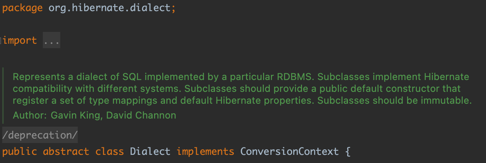
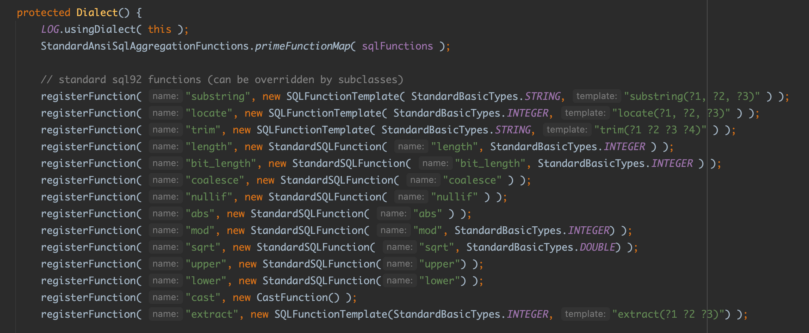
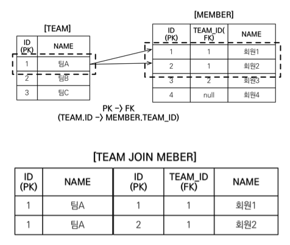

> 해당 포스트는 인프런 김영한님의 [자바 ORM 표준 JPA 프로그래밍 - 기본편](https://www.inflearn.com/course/ORM-JPA-Basic/dashboard) 강의를 기반으로 작성하였습니다.

# 1. JPQL이란?

JPA만의 기술을 사용했을 때는 DB의 데이터 조회를 식별자를 통한 조회와 객체 그래프를 통한 탐색만 가능하였다.

- 식별자를 통한 조회: `em.find()`
- 객체 그래프 탐색: `a.getB().getC()`

하지만 두가지 조회 방법으로만 어플리케이션 개발을 한다면 모든 엔티티를 메모리에 올려두고 애플리케이션에서 필터링하는 등의 성능 낭비가 발생하게 된다. 이러한 낭비를 막으려면 데이터베이스에서 상황별 조건에 맞게 필터링하여 필요한 데이터를 가져올 기술이 필요하다. JPA는 이러한 기능 제공을 위해 JPQL을 제공하고 있다.

JPQL은 Jaca Persistence Query Language의 약자로 JPA에서 SQL을 추상화하여 만든 객체 지향 쿼리 언어이다. SQL을 추상화하였기에 특정 데이터베이스에 의존적이지 않다. `SELECT`, `FROM`, `WHERE`, `GROUP BY`, `HAVING`, `JOIN` 등 SQL과 문법이 유사하여 개발자가 쉽게 사용할 수 있다. 하지만 한가지 기억해야할 사실이 존재한다. **SQL은 데이터베이스 테이블을 대상으로 쿼리**하지만 **JPQL은 엔티티 객체를 대상으로 쿼리**한는 점이다. `select m From Member m where m.name like ‘%hello%'` 라는 쿼리문을 봤을 때 JPQL을 모르는 개발자라면 쿼리문에 있는 Member는 테이블 이름이라 생각할 것이다. 하지만 일반적인 SQL문과 다르게 JPQL에서는 테이블이 아닌 `@Entity(name = “”)`에 지정된 엔티티 이름을 가르키고 있다. (지정하지 않았다면 default값이 클래스이름이다.) 이와같이 JPQL에서는 지금까지 학습한 JPA 문법들과 동일하게 객체를 중심으로 쿼리를 작성하게 된다. 지금부터 이러한 JPQL에 대해 더욱 구체적으로 알아보겠다.

# 2. 기본 문법

- JPQL은 엔티티와 속성은 객체에 있는 것과 같아 대소문자를 구분한다. 하지만  `SELECT`, `FROM`, `WHERE`과 같은 JPQL 키워드는 대소문자를 구분하지 않는다.
- `from Member m`에서 m과 같은 별칭(alias)은 필수이다. 하지만 SQL문에서 별칭 지정을 위해 사용하는 as는 생략 가능하다.

# 3. createQuery의 반환 타입

순수 JPA의 JPQL은 쿼리를 실행할 때 `EntityManager`의 `createQuery();` , `createNamedQuery()`, `createNativeQuery()` 등의 메서드를 사용해야 한다.

```java
public interface EntityManager {

    public Query createQuery(String qlString);
    public <T> TypedQuery<T> createQuery(CriteriaQuery<T> criteriaQuery);
    public Query createQuery(CriteriaUpdate updateQuery);
    public Query createQuery(CriteriaDelete deleteQuery);
    public <T> TypedQuery<T> createQuery(String qlString, Class<T> resultClass);
    ...
}
```

각각의 `createQuery()` 메서드의 반환값을 살펴보면 `Query`, `TypedQuery` 두 종류가 존재한다.

- `TypeQuery`: 반환 타입이 명확할 때가 사용한다. 아래의 두 명령어와 같이 쿼리의 반환 타입이 동일한 경우 TypedQuery를 사용할 수 있다.

    ```java
    TypedQuery<Member> result1 = em.createQuery("select m from Member as m", Member.class);
    TypedQuery<String> result2 = em.createQuery("select m.username from Member as m", String.class);
    ```

- `Query`: 반환 타입이 명확하지 않을 때 사용한다. 아래의 코드와 같이 쿼리의 반환 타입이 여러개인 경우 Query타입으로 return 받아야 한다.

    ```java
    Query result3 = em.createQuery("select m.username, m.age from Member as m");
    ```


# 4. query의 반환 타입

createQuery()를 통해 만든 `Query`, `TypedQuery` 객체로부터 결과를 반환받기 위해서는 `getResultList()`, `getSingleResult()` 메서드를 사용해야 한다. 둘은 반환되는 결과가 한개인지 아니면 그 이상인지에 따라 나뉘게 된다.

- `query.getResultList()`: 결과가 하나 이상일때 사용하며 리스트를 반환한다. 만약 결과가 없으면 빈 리스트를 반환한다. 덕분에 nullPointException을 걱정할 필요가 없다.
- `query.getSingleResult()`: 결과가 정확히 하나일때만 객체를 반환한다. `getSingleResult()`는 결과가 무조건 하나여야해서 결과가 없거나 둘 이상이면 exception이 발생한다. 그래서 값이 있다고 보장될 때만 사용해야 한다.

  > 결과가 없으면 `javax.persistence.NoResultException`이 발생하며 결과가 둘 이상이면 `javax.persistence.NonUniqueResultException`이 발생한다.
  >

  > Spring Data JPA에서는 optional로 retuen 하며 해당 문제를 해결하였다.
>

# 5. 프로젝션 (SELECT)

## 5.1. 프로젝션 조회 타입

앞서 반복해서 말했듯이 JPQL에서는 테이블이 아닌 엔티티(객체)를 대상으로 쿼리를 작성한다. JPQL이 프로젝션을 할 수 있는 대상으로는 엔티티 타입 , 엔티티에 속한 인베디드 타입, 스칼라 타입이 존재한다.

- **엔티티 타입**

    ```java
    SELECT m FROM Member m
    SELECT m.team FROM Member m
    ```

  > 두번째 쿼리의 경우 Member에 연관된 Team을 조회하는 쿼리이다. 해당 쿼리와 같이 연관된 테이블을 조회하는 경우 두 테이블이 inner join을 하며 프로젝션을 하게 된다.
  >

  > **📌 Tip**
  >
  >
  > 프로젝션을 통해 m.team과 같이 연관관계에 연결된 엔티티를 바로 조회할 수도 있다. 하지만 유지보수를 위해 어떤 쿼리가 실행되는지 예측할 수 있도록 실제 sql문과 비슷하게 작성하는 것이 좋다.
  >
  > ex) `select t from Member m join m.team t;`
>
- **임베디드 타입**

  임베디드타입은 부모의 테이블 안에 속해있는 데이터라 join을 통한 표현을 할 필요가 없다.

    ```java
    SELECT m.address FROM Member m
    ```

- **스칼라(숫자, 문자열 등의 기본) 타입**

    ```java
    SELECT m.username, m.age FROM Member m
    ```


## 5.2. 프로젝션 여러 값에 대한 반환 타입

프로젝션을 통해 특정 엔티티에 대한 데이터를 조회할 때는 아래와 같이 반환 타입이 엔티티이면 된다.

```java
List<Member> resultList = em.createQuery("select m from Member m")
                            .getResultList();
```

하지만 반환 타입이 엔티티가 아닌 여러개의 데이터일 경우 반환을 위해 데이터를 주입할 객체가 없어 객체가 아닌 다른 타입으로 조회를 해야한다. 조회 타입으로는 `Query`타입, `Object[]`타입, `DTO`타입이 존재한다.

- **Query 타입으로 조회**

  해당 타입은 타입 캐스팅이 필요하다

    ```java
    List resultList = em.createQuery("select m.username, m.age from Member m")
                        .getResultList();
                
    Object o = resultList.get(0);
    Object[] result = (Object[]) o;
    System.out.println("username = " + result[0]);
    System.out.println("age = " + result[1]);
    ```

- **Object[] 타입으로 조회**

    ```java
    List<Object[]> resultList = em.createQuery("select m.username, m.age from Member m")
                                    .getResultList();
    
    Object[] result = resultList.get(0);
    System.out.println("username = " + result[0]);
    System.out.println("age = " + result[1]);
    ```

- **new 명령어로 조회 (DTO)**

  JPQL문 안에 `new {DTO 경로}.{DTO 이름}`을 프로젝션 대상에 넣게 되면 해당 객체로 결과를 반환한다. 이때 new를 통해 생성하는 객체에는 매개변수의 순서와 타입이 일치하는 생성자가 필요하다.

    ```java
    List<MemberDTO> resultList = em.createQuery("select new jpql.MemberDTO(m.username, m.age) from Member m", MemberDTO.class)
                                    .getResultList();
    
    MemberDTO result = resultList.get(0);
    System.out.println("username = " + result.getUsername());
    System.out.println("age = " + result.getAge());
    ```


## 5.3. ID가 아닌 엔티티의 사용

JPQL에서는 쿼리문에서 엔티티를 직접 사용하면 SQL에서 자동으로 해당 엔티티의 기본 키 값을 사용한다.

```java
// 엔티티를 통한 조회
String jpql = “select m from Member m where m = :member”; 
List resultList = em.createQuery(jpql)
                    .setParameter("member", member) 
                    .getResultList();

// 식별자를 통한 조회
String jpql = “select m from Member m where m = :memberId”; 
List resultList = em.createQuery(jpql)
                    .setParameter("member", memberId) 
                    .getResultList();
```

예시를 살펴보면 위에 위치한 코드는 엔티티를 식별자로 받아 조회를 하고 아래의 코드는 memberId라는 식별자를 받아 조회를 하고 있다. 하지만 두 코드의 결과로 실행되는 쿼리는 모두 `select m.* from Member m where m.id=?` 와 같이 식별자를 기준으로 조회되게 된다. 즉, 식별자가 아닌 엔티티를 사용하여도 JPA는 식별자를 자동으로 사용하게 된다.

# 6. Parameter Binding

특정 테이블의 전체 조회, 전체 삭제가 아닌 그 외의 쿼리문들은 항상 `where`, `having` 등을 통한 필터링이 필요하다. 각각의 상황에 맞는 필터링을 위해서는 쿼리문에 넣어줄 Parameter를 넣어줘야 한다. JPQL에서 파라미터를 넣어주기 위해서는 `setParameter()` 메서드를 이용해 할당할 수 있다.

- **파라미터 기반 할당**

  파라미터 기반 할당을 위해서는 query문에 `:{파라미터명}`의 형태로 입력 후 `setParameter()`를 통해 파라미터 값을 할당해주는 방법이 있다.

    ```java
    String query = "select m.username from Member m where m.username = :name";
    
    List<Object[]> result = em.createQuery(query)
    	                    .setParameter("name", "Rex")
                                .getResultList();
    ```

- **위치 기반 할당**

  위치 기반 할당은 파라미터 기반과 유사하나 `:{파라미터명}` 대신에 파라미터 순서를 대입하면 된다. 하지만 위치 기반은 중간에 데이터가 들어오면 꼬이기 때문에 사용하지 않는 것이 좋다.

    ```java
    String query = "select m from Member m where m.name=?1"; 
    
    List<Object[]> result = em.createQuery(query)
                                .setParameter(1, "Rex")
                                .getResultList();
    ```


# 7. 페이징 (Paging)

페이징을 위한 데이터 조회를 하기 위해서는 아래와 같이 몇 페이지부터 몇 개의 데이터를 가져올지의 설정이 필요해 JPQL parameter binding으로 구현시 많은 어려움을 느낄 수 있다.

```sql
select *
from member m
order by m.name desc limit ?, ?;
```

JPA에서는 페이징 쉽게 할 수 있도록 `setFirstResult(in startPosition)`과 `setMaxResults(int maxResult)` 메서드를 제공하여 개발자가 쉽게 페이징을 구현할 수 있다.

> `setFirstResult(in startPosition)`: 조회 시작 위치
>
>
> `setMaxResults(int maxResult)` : 조회할 데이터 수
>

```java
//페이징 쿼리
String jpql = "select m from Member m order by m.name desc"; 
List<Member> resultList = em.createQuery(jpql, Member.class)
                            .setFirstResult(10)
                            .setMaxResults(20)
                            .getResultList();
```

# 8. 조인 (Join)

JPQL에서는 SQL문과 같게 내부조인, 외부조인, 세타 조인을 모두 지원하고 있다.

```sql
// 내부조인
SELECT m FROM Member m [INNER] JOIN m.team t

// 외부조인
SELECT m FROM Member m LEFT [OUTER] JOIN m.team t

// 세타조인 (연관관계가 없는 것을 cross 조인을 통해 조회)
// 하이버네이트 5.1부터 지원
select count(m) from Member m, Team t where m.username = t.name
```

> 조인에 조건을 거는 기능을 하는 `ON` 절은 JPA 2.1버전부터 지원을 하였다. 아마 이 글을 보는 대부분의 독자들은 2.1 이상의 버전을 쓸 것이기에 걱정하지 않아도 될 것이다.
>

```sql
// JPQL
SELECT m, t FROM Member m LEFT JOIN m.team t on t.name = 'A' 

// SQL
SELECT m.*, t.* FROM 
Member m LEFT JOIN Team t ON m.TEAM_ID=t.id and t.name='A'
```

# 9. 서브 쿼리 (Sub Query)

## 9.1. 서브 쿼리의 주의할 점 (성능 감소)

```sql
// **나이가 평균보다 많은 회원 조회**
select m from Member m
where m.age > (select avg(m.age) from Member m)
```

다음과 같이 메인 쿼리의 엔티티를 서브쿼리로 가져오면 성능이 더 떨어지긴 한다.

```java
select m from Member m
where m.age > (select avg(m2.age) from Member m2)
```

서브쿼리를 작성할 때는 다음과 같이 메인 쿼리에서 지정한 m을 서브쿼리에서 사용하지 않고 서브쿼리에서 새로 m2를 지정한 것과 같이 하는 것이 좋다. 그래야지 성능도 더 좋게 나온다.

## 9.2. 서브 쿼리 지원 함수

- `[NOT] EXIST`: 서브쿼리에 결과가 존재하면 참이다.
- `ALL`: 모두 만족하면 참이다.
- `ANY`, `SOME`: 조건을 하나라도 만족하면 참이다.
- `[NOT] IN`: 서브쿼리의 결과 중 하나라도 같은 것이 있으면 참이다.

## 9.3. JPA 서브쿼리의 한계

JPA의 서브쿼리는 `WHERE`, `HAVING`절에서만 사용가능하다. 물론 JPA를 사용하는 대다수의 개발자들은 하이버네이트를 통해 JPA를 사용할 것이기에 `SELECT`절도 사용가능하지만 아직까지 `FROM`절에서는 사용이 불가능하다. 만약 `FROM` 절에서 서브쿼리를 사용하고자 한다면 조인으로 풀어서 해결을 하도록 노력하고 그것도 안되면 최후의 수단으로 **native sql**을 써야한다.

> 📌 영한님은 이러한 상황에서는 from절의 서브쿼리를 쓰지 않아도 어느정도 결과가 추려지기에 해당 결과를 받아서 application에서 결과 조작을 한다고 한다. 그것도 정 안되면 쿼리를 두번 날려서 한다고 한다.
>

# 10. 타입 표현

- **문자**

  문자는 `‘ ‘` 안에 넣어주고 문자로 `‘` 를 표현하고 싶으면 `“` 을 넣어주면 된다.

  - ex) ‘HELLO’, ‘She”s’
- **숫자**

  숫자는 L, D, F 를 붙여 타입 표현한다.

  - ex) 10L(Long), 10D(Double), 10F(Float)
- **Boolean**
  - 대소문자 구분없이 `true`, `false`를 입력해주면 된다.
- **Enum**

  enum은 자바의 패키지 명을 모두 포함해서 넣어야 한다. 바인딩하여 사용하면 보기에는 더 좋은 듯 하다.

  - ex) `jpabook.MemberType.Admin` (패키지명 포함)
- **엔티티 타입**

  엔티티 타입은 다음과 같이 `TYPE`키워드를 통해 타입을 조회할 수 있다.

  - `TYPE(m) = Member` (상속 관계에서 사용)
  - ex) `em.createQuery(select i from Item i where type(i) == Book”, Item.class);`

# 11. 조건식

## 11.1. CASE 식

- **기본 CASE식**

  아래와 같이 when 절에 조건식이 들어가 있는 것을 기본 CASE식이라고 한다.

    ```java
    select
        case 
            when m.age <= 10 then '학생요금' 
            when m.age >= 60 then '경로요금'
            else '일반요금'
        end
    from Member m
    ```

- **단순 CASE식**

  `~와 정확히 매칭이 되면 ~하라`와 같은 조건식은 단순 CASE식이라고 한다.

    ```java
    select
        case t.name
            when '팀A' then '인센티브110%' 
            when '팀B' then '인센티브120%'
            else '인센티브105%'
        end
    from Team t
    ```


## 11.2. COALESCE

- 데이터를 하나씩 조회하여 null일경우 반환한다.

    ```java
    select coalesce(m.username,'이름 없는 회원') from Member m
    ```


## 11.3. NULLIF

- 두 값이 같으면 null을 반환하고 다르면 첫번째 값을 반환한다.

  username이 관리자일경우 null을 반환하고 관리자가 아닐 경우 username을 반환한다.

    ```java
    select NULLIF(m.username, '관리자') from Member m
    ```


# 12. JPQL의 함수

- `CONCAT`, `SUBSTRING`, `TRIM`, `LOWER`, `UPPER`, `LENGTH`, `LOCATE`, `ABS`, `SQRT`, `MOD`등과 같은 함수들은 JPQL에서 기본적으로 제공하는 것으로 DB에 상관없이 그냥 사용하면 된다.

  > hibernate.dialect의 Dialect 클래스를 보면 해당 함수들이 등록되어있는 것을 확인할 수 있다.
  >
  >
  > 
  >
  > 
>
- 기본 함수로 안된다면 사용자 정의 함수를 호출하여 사용할 수 있는데 사용자 정의 함수를 사용하려면 DB방언에 사용자 정의함수를 등록하고 사용해야한다.
  - 사용자 정의 함수를 등록하려면 프로그램에서 사용하려는 방언의 Dialect클래스를 상속받은 클래스를 새로 만든 후 생성자에서 `registerFunction()`을 통해 등록해주면 된다. 방언의 Dialect클래스는 H2 DB를 사용하면 `H2Dialect`, MySQL을 사용하면 `MySQLDialect`와 같은 클래스를 상속하면된다. 그리고 `registerFunction`을 등록하는 방법은 외우지는 못하고 실제 각각의 Dialect 에서 `registerFunction`을 하는 방법을 참고하여 등록을 하면 된다.

      ```java
      public class NewMySQLDialect extends MySQLDialect {
      
          public NewMySQLDialect() {
              registerFunction( "upper", new StandardSQLFunction( "upper" ) );
          }
      }
      ```

  - 마지막으로 yml, xml과 같은 설정 파일의 dialect설정에서 Hibernate에서 제공하는 dialect가 아닌 내가 직접 설정한 dialect클래스로 설정해주면 내가 추가한 사용자 정의 함수가 올바르게 동작한다.

      ```yaml
      spring:
        jpa:
          properties:
            hibernate.dialect: dialect.NewMySQLDialect
             hibernate.ddl-auto: create-drop
      ```


# 13. 경로 표현식

## 13.1. 필드의 종류

JPQL의 필드는 크게 상태필드, 단일 값 연관 필드, 컬렉션 값 연관 필드로 3가지로 나뉜다.

- **상태필드**
  - 단순히 값을 저장하기 위한 필드이다.
  - `m.name`과 같이 현재 경로 이후에 `.`을 붙여서 더 깊게 갈 수 없는 경로의 끝인 것을 상태 필드라고 한다.
  - ex) `m.name`
- **단일 값 연관 필드**
  - `~ToOne`의 관계로 1개의 엔티티인 필드이다.
  - **묵시적 내부 조인**이 발생한다.

    > 단일 값 연관 경로를 탐색하면 inner join을 하는 것을 확인할 수 있다. JPQL 입장에서는 `m.team`과 같이 `.`을 찍으면 되지만 실제 실행되는 SQL입장에서는 Join을 거쳐야 한다.이렇게 객체에서는 없는데 SQL에서 생기는 join들을 **묵시적 내부 조인**이라고 한다.
  >
  - 타고 들어간 객체로부터 추가적인 탐색이 가능하다.
  - ex) `m.team`
- **컬렉션 값 연관 필드**
  - `~ToMany`의 관계로 여러개의 엔티티들로 된 컬렉션인 필드이다.
  - **묵시적 내부 조인**이 발생한다.
  - 타고 들어간 결과의 return type이 collection이라서 `.`을 통한 추가적인 경로 탐색을 할 수 없다. 컬렉션의 메서드인 `.size`정도만 가능하다. 하지만 from절의 명시적 조인을 통해 별칭을 얻으면 다른 경로탐색도 가능하다.
  - ex) `m.teams`

## 13.2. 묵시적 조인 vs 명시적 조인

- 묵시적 내부 조인
  - 경로 표현식에 의해 JPQL 쿼리 상으로는 Join문이 없지만 실제 실행되는 SQL에서는 Join문이 발생한다.
  - 내부조인만 가능하다.
  - 컬렉션 값 연관 필드의 묵시적 조인의 경우 추가 탐색이 불가능하다.
  - ex) `select m.team from Member m`
- 명시적 조인
  - 쿼리문에 join 키워드를 직접 사용하여 개발자가 쿼리문을 예측할 수 있다.
  - Join을 통해 연결한 테이블에 별칭을 주어 추가적인 경로 탐색이 가능하다.
  - ex) `select m from Member m join m.team t`

> **실무 Tip 📌**
>
>
> 묵시적 조인은 프로그램상에서 작성한 쿼리와 실제 실행된 쿼리가 달라 해당 쿼리가 실행되었을 때 발생하는 상황을 한 눈에 파악하기 어렵고 개발자가 예측하기 어려운 상황이 발생하기도 한다. 그리고 조인은 SQL 튜닝의 중요한 포인트임으로 가급적이면 묵시적 조인 대신에 명시적 조인을 사용하는 것이 좋다.
>

# 14. 페치 조인(Fetch Join)

페치조인은 SQL상의 공식적인 문법이 아닌 JPQL에서 성능 최적화를 위해 제공하는 기능이다. 해당 기능은 JPA 로딩 전략중 즉시 로딩과 같이 연관 엔티티의 엔티티나 컬렉션을 한번의 쿼리로 가져온다. 하지만 원하는 객체 그래프를 가져오는 것을 동적인 타이밍에 정할 수 있다는 점에서 다르다.

## 14.1. 페치 조인 사용하기

페치 조인의 사용은 간단하다. 단순히 아래의 JPQL 쿼리문과 같이 join뒤에 fetch를 붙이면 페치 조인이 된다.

```java
String jpql = "select m from Member m join fetch m.team";
 
List<Member> members = em.createQuery(jpql, Member.class)
                            .getResultList();
```

JPQL의 특성상 테이블이 아닌 객체와 객체의 필드를 기준으로 작성하여 Member객체의 team 필드를 페치조인 한 결과 실제 실행되는 쿼리문은 아래와 같이 Member 테이블과 Team 테이블이 inner join을 하여 두 테이블의 모든 컬럼 값을 가져오는 것을 확인할 수 있다.

```sql
SELECT M.*, T.* FROM MEMBER M
INNER JOIN TEAM T ON M.TEAM_ID=T.ID
```

## 14.2. 페치 조인과 일반 조인의 차이

앞서 `select m from Member m join fetch m.team` 쿼리문을 통해 페치 조인의 실행 SQL문을 본 결과 Member와 Team 테이블의 테이터를 모두 반환하는 것을 확인하였다. 하지만 페치 조인이 아닌 단순 조인을 한다면 어떤한 결과가 나올까..? 둘의 차이는 무엇일까?? 테스트를 해보면 다음과 같다. 페치 조인이 아닌 단순 조인을 한 `select m from Member m join m.team` 쿼리문을 실행해보겠다. 그 결과 실행되는 SQL문은 아래와 같이 단순히 Member테이블의 반환값만 반환하는 것을 확인할 수 있다. 즉, 페치 조인의 경우 조인한 객체 테이블의 정보도 모두 반환을 하지만 일반 조인의 경우 쿼리상에서 해당 테이블과 조인은 하지만 반환값에는 아무런 변화가 없다.

```sql
SELECT M.* FROM MEMBER M
INNER JOIN TEAM T ON M.TEAM_ID=T.ID
```

## 14.3. 1:N 관계 페치 조인의 주의할 점

Team과 Member의 관계가 1:N 관계라고 하였을 때, N인 Member객체를 기준으로 `select m from Member m join fetch [m.team]` 와 같이 조회를 할 시 아무런 문제가 발생하지 않는다.

하지만 1인 Team을 기준으로 `select t from Team t join fetch t.members` 와 같은 조회를 할 시에는 데이터가 예상한 바와 다르게 늘어날 수 있다는 점을 조심하여야 한다. 해당 문제는 SQL에서 Join을 하였을 때 Join되는 모든 경우의 수가 Row로 만들어지기 때문이다.  이와 같이 SQL문을 통해 DB에서 return된 결과 수만큼 collection개수를 돌려주기 때문에 중복된 Team데이터가 return되게 되는 문제가 발생하게 된다.



쉬운 이해를 위해 사진을 통해 보겠다. 일대다 조인을 하게 된다면 사진과 같이 하나의 팀에 여러명의 멤버 데이터가 매핑되어 있을 수 있다. 팀 A의 경우 연결된 멤버가 2개라 결과 리턴을 하여 팀 조회를 하면 팀A 데이터가 중복된 2개가 된다.

> 이러한 경우 하나의 팀 엔티티를 읽어오면 여러개의 멤버 엔티티들도 불러와지게 되는데 같은 팀에 매핑된 멤버들은 영속성 컨텍스트에 올라온 하나의 팀의 주소 값을 똑같이 사용하며 운영된다. (팀은 하나만 저장, 멤버는 해당 팀의 주소를 공용으로 사용)
>

이를 해결할 수 있는 방법은 1차적으로 `DISTINCT` 예약어를 사용하는 방법이 있다.

SQL에서 `DISTINCT`는 중복된 Row를 제거하라는 명령이다. JQPL에서는 SQL의 DISTINCT로는 모든 중복을 제거할 수 없어서 내부적으로 SQL문 외에 애플리케이션에서 엔티티 중복 제거를 해준다. 즉, JPQL에서의 DISTINCT는 SQL에서 DISTINCT를 제외하는 것 이외에 애플리케이션에서 엔티티를 중복제거하는 일까지 제공하고 있다. 사용은 다음과 같이 중복제거를 하고 싶은 결과 앞에 `DISTINCT` 예약어를 붙여주면 된다.

```sql
select distinct t from Team t join fetch t.members
```

## 14.4. 페치 조인의 특징과 한계

- **연관된 엔티티들을 한 번의 SQL문으로 모두 조회하여 성능 최적화를 할 수 있다.**
- **엔티티에 직접 적용하는 글로벌 로딩 전략보다 우선적이다.**
- **페치 조인 대상에는 별칭을 줄 수 없다.**

  JPA의 공식 스펙상으로는 `select t from Team t join fetch t.members as m` 과 같이 패치조인 대상인 `t.member`에는 as를 통한 별칭을 줄 수 없다. 해당 별칭은 하이버네이트에서는 가능하긴하지만 아래의 이유때문에 가급적이면 사용을 지양하는 것이 좋다.

  > JPA는 비즈니스 코드 상에서는 DB와의 관계를 독립시키고 각각의 객체는 조회시 필터링된 데이터가 아닌 모든 데이터가 존재하는 것을 추구하고 의도하고 있다. 즉, Team과 Member의 관계를 생각하였을 때 Team에서 getMembers()를 통해 연관된 Member리스트를 조회하게 된다면 필터링된 멤버가 아니라 모든 멤버가 조회되어야 한다. 하지만 JPQL의 페치 조인 쿼리에서 조인을 한 객체에 별칭을 주고 조건을 추가하게 된다면 일부 Member 데이터가 제거되게 되어 객체의 정확성 이슈가 발생과 동시에 JPA의 의도와 다르게 동작하게 된다.
  >

  하지만 때로는 Team에서 `fetch join`을 통해 끌고오는 member에 where m = “rex”와 같이 조건을 걸고 싶을 수도 있다. 이럴 때는 따로 조회를 하며 데이터를 가져오는 것이 좋다.

- **둘 이상의 컬렉션은 페치 조인을 할 수 없다.**

  1:N:M을 가져오게 될 경우 예상할 수 없는 데이터의 증가가 발생할 수 있다. 가끔 페치 조인이 성공할 때가 존재하기도 하지만 조인이 되더라도 데이터 정확성에 문제가 생길 수 있다. 컬렉션의 패치조인은 하나만 조인해야 한다.

- **컬렉션을 페치조인하면 페이징 API를 사용할 수 없다.**

  앞서 `1:N 관계 페치 조인의 주의할 점` 에서 살펴봤던 내용과 같이 1:N 관계에서 컬렉션을 패치조인하게 된다면 중복된 데이터의 발생과 의도와는 다른 결과를 반환하게 되어 페이징 API를 사용할 수 없다. 앞에서 언급한 Team과 Member의 1:N 관계 페치 조인을 예시로 생각하면 테이블에서 팀 정보 하나만 가져오라고 페이징을 하였을 때 결과는 팀 A에 해당하는 멤버 정보까지 모두 읽어오는 것이 아닌 팀A에 매칭된 멤버 1명의 데이터만 읽어오게 되어서 사용할 수 없다.

  > 1:1, N:1 같은 단일 값 연관 필드들은 페치 조인을 하여도 페이징이 가능하다.
  >

  **해결할 방법**

  - 1:N 인 경우 테이블 순서를 변경해 다대일로 변경하여 페이징을 사용할 수 있다.
  - 패치 조인이 아닌 `select t from Team t;`의 쿼리를 실행하여 1에 대한 정보를 받고 N의 결과는 Lazy Loading을 통해 데이터를 읽어오도록 하며 페이징을 사용하는 방법이 있다. 하지만 해당 방법은 lazy loading과정에 많은 쿼리문이 날라가게 되어서 배치 사이즈를 사용해야한다.
  - DTO로 뽑아서 조작하는 방법도 존재한다.

> **📌 실무 Tip**
>
>
> 실무에서는 모든 글로벌 로딩 전략을 지연로딩으로 설정하고 최적화가 필요한 곳에는 JPQL의 페치조인을 통해 성능을 최적화하는 것이 좋다. 그리고 여러 테이블을 조인해서 엔티티가 가진 모양이 아닌 전혀 다른 결과를 내야 하면, 페치 조인 보다는 일반 조인을 사용하고 필요한 데이터들만 조회해서 DTO로 반환하는 것이 효과적이다.
>

# 15. Named 쿼리

named쿼리는 엔티티를 정의할 때 이름을 부여하여 미리 정의하고 정적으로 불러서 사용하는 JPQL이다. 정적으로 불러서 사용하는 쿼리이기에 동적 쿼리는 불가능하고 **정적 쿼리만 가능**하며 정적 쿼리답게 애플리케이션 로딩 시점에 초기화 후 캐싱하여서 이후에 호출할 때, 쿼리를 생성 및 실행하는 비용에서 절약을 할 수 있다. 또한 애플리케이션 로딩 시점에 초기화를 하며 쿼리를 검증하게 되고 잘못된 JPQL일 경우 컴파일 오류를 발생시켜준다는 장점도 있다.

순수 JPA에서 Named쿼리를 등록하는 방법은 어노테이션을 통한 등록 방법과 XML을 통한 등록 방법이 존재한다. 해당 포스트에서는 어노테이션을 통한 등록 예시만을 기록해두겠다.

```java
// 순수 JPA
@Entity
@NamedQuery(name = "Member.findByUsername", 
        query="select m from Member m where m.username = :username")
public class Member {
    ...
}

public class MemberRepository { 
    public findMemberByUserName(String userName) {
        List<Member> resultList = em.createNamedQuery("Member.findByUsername", Member.class)
                                    .setParameter("username", userName)
                                    .getResultList();
    }
}
```

Spring Data JPA의 @Query 어노테이션도 바로 Named 쿼리로 등록된다.

```java
// Spring Daa JPA
public class MemberRepository {
    @Query("select m from Member m where m.username = :username")
    public findMemberByUserName(String userName);
}
```

# 16. 벌크 연산

물가 상승으로 인해 DB에 저장된 모든 상품의 가격을 10프로 인상한다고 생각해보겠다. 이를 애플리케이션 내에서 처리를 하려고 한다면 모든 상품들을 조회하여 메모리에 올린 뒤에 상품 엔티티의 가격을 모두 10프로 인상시킬 것이다. 그러면 트랜잭션 커밋 시점에 변경 감지가 동작하여 각각의 엔티티마다 Update 쿼리문이 하나씩 나갈 것이다. 만약 1000개의 상품이 존재한다면 1000개의 SQL 문이 실행될 것이다.

지금까지는 JPA를 통한 애플리케이션 내에서 값 업데이트를 생각해봤으나 일반적으로는 이러한 다중 데이터에 대한 업데이트, 삭제는 `update Product p set p.price = p.price * 1.1` 와 같은 하나의 쿼리문으로 테이블의 데이터를 한번에 변경한다. 이러한 것을 우리는 벌크 연산이라고 하고 JPQL의 벌크 연산을 지원하기 위해 JPA는 `exucuteUpdate()`메서드를 제공하고 있다.

```java
String query = "update Product p set p.price = p.price * 1.1";
int resultCount = em.createQuery(query)
                    .executeUpdate();
```

> `executeUpdate()`메서드는 `Update`와 `Delete`쿼리를 지원하며 반환값으로는 변경된 Row의 수를 반환한다. (하이버네이트는 `Insert`도 지원한다.)
>

## 16.1. 주의할 점

벌크 연산은 영속성 컨텍스트를 무시하고 직접 데이터베이스에 쿼리를 하게 된다. 그리하여 우리는 영속성 컨텍스트와 DB의 불일치에 대해 신경쓰며 벌크 연산을 사용해야 한다.

**사용방법 1. 벌크 연산을 먼저 실행한다.**

영속성 컨텍스트 실행전에 벌크연산을 먼저 실행해서 영속성 컨텍스트가 꼬일 수 있는 상황을 만들지 않는다.

**사용방법 2. 벌크 연산 수행 후에 영속성 컨텍스트를 초기화해준다.**

영속성 컨텍스트에 무언가가 존재한다면, 벌크 연산도 JPQL이어서 실행 이전에 영속성 컨텍스트 변경점에 따른 쿼리가 날라가게 된다. 그래서 기존 영속성 컨텍스트에 대한 것은 걱정할 필요가 없고 벌크 연산 수행 후의 영속성 컨텍스트가 꼬이는 것을 방지하기 위해 영속성 컨텍스트를 초기화해줘야 한다.

> Spring Data JPA에서는 `@Modifying` 어노테이션을 활용하면 위의 동작을 알아서 해준다.
>

# 📚 Reference
- [자바 ORM 표준 JPA 프로그래밍 - 기본편 - 인프런 | 강의](https://www.inflearn.com/course/ORM-JPA-Basic/dashboard)
