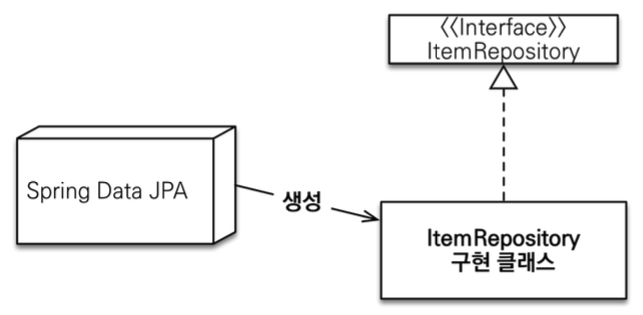
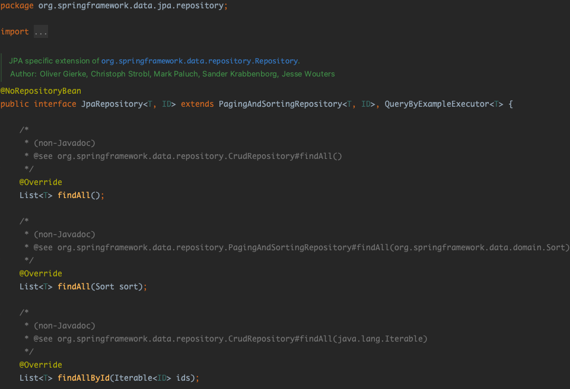

# 1. Spring Data JPA란?

Spring Data는 관계형/비관계형 데이터베이스, Map-reduced 프레임워크 등의 여러 데이터 접근 관련 기술들을 쉽게 사용할 수 있는 모듈들을 제공하고 있다. 대표적으로 몇가지 모듈을 설명하자면 Spring Data JDBC, Spring Data JPA, Spring Data Redis 등의 여러 모듈들이 존재한다. 이번 포스트에서는 Spring Data의 Spring Data JPA 모듈에 대해 자세히 살펴볼 것이다.

Spring Data JPA는 JPA기반의 Repository를 편리하게 구현할 수 있도록 개발자의 편의성을 제공하는 모듈이다. 데이터 접근 기술을 JDBC에서 JPA로 넘어가면서 개발자가 SQL문을 일일이 작성하지 않아도 되며 개발의 생산성이 크게 향상되었다. 하지만 JPA도 개발을 하다보면 `EntityManager`의 호출과 CRUD로직 작성 등에서 많은 중복 로직은 여전히 존재하였다. Spring Data JPA 모듈은 Data Access Layer의 구현을 최대한 개선하는 것을 목표로 만들어져 앞서 말한 중복로직등을 작성하지 않고서도 적은 양의 코드로 데이터 접근 로직들을 구현할 수 있도록 지원하고 있다.

# 2. Spring Data JPA 인터페이스 설정 (@EnableJpaRepositories)

Spring Data JPA는 `JpaRepository` 인터페이스를 상속하는 작업만으로 DB의 CRUD 이상의 기능들을 사용할 수 있다. 이러한 JPA가 제공하는 공통 인터페이스를 사용하려면 Spring이 인터페이스에 대한 프록시 인스턴스를 생성할 수 있도록 아래와 같이`@EnableJpaRepositories` 어노테이션을 애플리케이션을 실행하는 클래스 또는 Config 클래스에 붙여줘야 했다. 하지만 SpringBoot를 사용한다면 해당 어노테이션은 없어도 된다. `@SpringBootApplication` 어노테이션은 `@EnableJpaRepositories` 어노테이션이 붙은 클래스와 같은 레벨에 있는 디렉터리를 자동으로 탐색한다.

```java
@Configuration
@EnableJpaRepositories(basePackages = "jpabook.jpashop.repository")
public class AppConfig { }
```

# 3. Repository의 자동 생성 원리

`JpaRepository`를 상속하여 Spring Data JPA의 기능을 쓰고자 한 Repository 클래스들은 Spring Data JPA가 탐색을 한 후 구현 클래스를 대신 생성해준다. 이때 생성된 구현 클래스의 클래스 타입을 알기 위해 `getClass()`를 실행해보면 원본 객체가 아닌 Proxy객체임을 알 수 있다. Repository객체들이 원본 객체가 아닌 Proxy객체인 이유는 Spring Data JPA의 DI와 관련이 있다. Spring Data JPA는 컴포넌트 스캔을 통해 Repository 객체들을 찾아 Proxy객체로 만들고, 실제 객체는 인터페이스를 분석하여 구현 클래스를 만든 후에 Proxy에 Injection하며 기능을 제공하고 있다. 즉, JPA의 지연로딩과 같이 Proxy객체를 생성한 후에 원본 객체와 프록시 객체를 연결해두며 요청이 올 때는 연결된 실제 구현 객체를 통해 기능을 제공하고 있다.



### 3.1. @Repository 어노테이션의 생략

Spring Data Jpa의 레포지토리는 `@Repository` 어노테이션이 붙지 않아도 된다. 그 이유는 앞서 말했듯이 Spring Data JPA가 컴포넌트 스캔을 통해 `Repository`가 상속된 인터페이스를 보고 내가 Proxy객체와 실제 구현 클래스를 만들어 잘 넣어줘야겠다고 인지를 하고 만들어주기 때문이다. 뿐만 아니라 JPA의 예외를 스프링의 예외로 변환하는 과정도 자동으로 처리해주고 있다.

# 4. Spring Data 인터페이스 구조와 동작 원리

Spring Data는 마커 인터페이스인 `Repository` 를 제공하고 있다. 해당 인터페이스는 Repository가 관리할 엔티티의 클래스 타입과 Id 의 타입을 인자로 받으며 동작한다.

```java
@Indexed
public interface Repository<T, ID> {
	// T: 엔티티 타입
	// ID: 엔티티의 식별자 타입
}
```

그리고 Spring Data는 마커 인터페이스인 `Repository`를 기반으로, 해당 인터페이스를 상속해가며 인터페이스를 확장하고 있다. 대표적인 인터페이스로는 `CrudRepository`가 있다. `CrudRepository`는 아래와 같이 기본적인 CRUD와 부가적인 기능들을 제공하고 있다. 이 외에도 `CurdRepository`를 상속하는 `PagingAndSortingRepository` 가 있는 등 Spring Data는 `Repository` 를 시작으로 기능 확장에 따라 인터페이스를 확장하고 있다.

```java
@NoRepositoryBean
public interface CrudRepository<T, ID> extends Repository<T, ID> {

	<S extends T> S save(S entity);

	<S extends T> Iterable<S> saveAll(Iterable<S> entities);

	Optional<T> findById(ID id);

	boolean existsById(ID id);

	Iterable<T> findAll();

	Iterable<T> findAllById(Iterable<ID> ids);

	long count();

	void deleteById(ID id);

	void delete(T entity);

	void deleteAllById(Iterable<? extends ID> ids);

	void deleteAll(Iterable<? extends T> entities);

	void deleteAll();
}
```

## 4.1. JpaRepository 분석하기

`JpaRepository`는 `PagingAndSortingRepository`와 `QueryByExampleExecutor` 를 상속하고 있다.



### 4.1.1. PagingAndSortingRepository

앞서 Spring Data 인터페이스 구조를 살펴보며 `CrudRepository`인터페이스를 상속하는 인터페이스라고 소개를 하였다. `PagingAndSortingRepository`는 `CrudRepository` 인터페이스를 상속하여 `CrudRepository`에서 제공하는 기본적인 CRUD 메서드 외에도 페이징과 정렬 기능을 제공하는 메서드를 제공한다. 덕분에 구현이 어려운 페이징과 정렬 기능을 `Sort`와 `Pageable`객체를 생성하여 인자로 넘겨주는 작업만으로 간편하게 사용할 수 있다.

```java
@NoRepositoryBean
public interface PagingAndSortingRepository<T, ID> extends CrudRepository<T, ID> {

	Iterable<T> findAll(Sort sort);

	Page<T> findAll(Pageable pageable);
}
```

### 4.1.2. QueryByExampleExecutor

QBE(QueryByExampleExecutor)는 필드 이름이 포함된 쿼리를 작성할 필요 없이 동적 쿼리 생성 기능을 제공하는 친화적인 쿼리 기술이다. 인터페이스를 살펴보면 앞서 살펴봤던 인터페이스들과 다르게 `Example`객체를 인자로 받고 있다.

```java
public interface QueryByExampleExecutor<T> {

	<S extends T> Iterable<S> findAll(Example<S> example);
	...
}
```

쿼리를 만들 때는 `Example`와 `ExampleMatcher` 를 통해 동적 쿼리의 조건을 설정한 후, `QueryByExample`에서 제공하는 메서드에 매개변수로 주면 자동으로 쿼리문을 만들어준다.

```java
    @Test
    public void queryByExampleExecutor() {
        Person person = new Person();
        person.setFirstname("Dave");

        ExampleMatcher matcher = ExampleMatcher.matching()
                .withIgnorePaths("lastname")
                .withIncludeNullValues()
                .withStringMatcher(StringMatcher.ENDING);

        Example<Person> example = Example.of(person, matcher);

        personRepository.findAll(example);
    }
```

> 자세한 내용은 공식 문서를 참고하길 바란다.
> - [Spring Data JPA - Reference Documentation](https://docs.spring.io/spring-data/jpa/docs/current/reference/html/#query-by-example)

# 📚 Reference
- [실전! 스프링 데이터 JPA - 인프런 | 강의](https://www.inflearn.com/course/%EC%8A%A4%ED%94%84%EB%A7%81-%EB%8D%B0%EC%9D%B4%ED%84%B0-JPA-%EC%8B%A4%EC%A0%84/dashboard)
- [Spring Data JPA - Reference Documentation](https://docs.spring.io/spring-data/jpa/docs/current/reference/html/#repositories.core-concepts)
