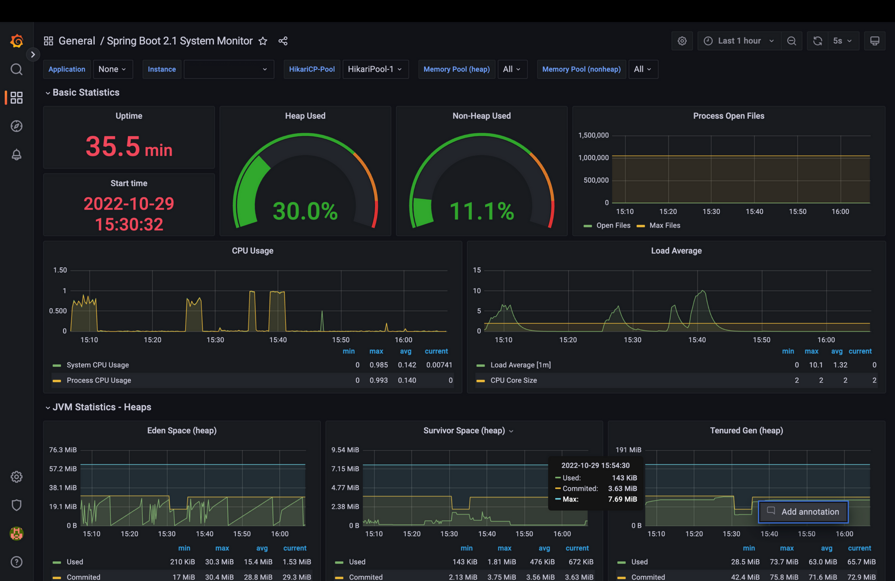
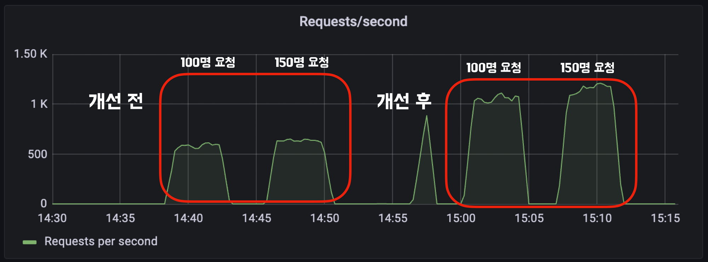

# 1. 들어가며

모모팀 서비스의 기능 개발을 1차적으로 마무리한 후, 의존관계와 성능 개선을 진행하게 되었다. 이번 포스트에서는 3차례에 걸친 서비스 성능 개선 작업 전/후로 성능이 얼마나 향상되었는지 비교해보려한다.

> 앞서 진행한 의존관계 개선과 쿼리 개선 과정을 자세히 확인하고 싶다면 아래의 포스트를 확인하길 바란다.
>
>
> [모모팀 서비스 성능 개선기1 (의존관계 개선)](https://seongwon.dev/Spring-MVC/20221009-%EB%AA%A8%EB%AA%A8%ED%8C%80-%EC%84%9C%EB%B9%84%EC%8A%A4%EC%84%B1%EB%8A%A5-%EA%B0%9C%EC%84%A0%EA%B8%B01/)
>
> [모모팀 서비스 성능 개선기2 (조회 쿼리 개선)](https://seongwon.dev/Spring-MVC/20221014-%EB%AA%A8%EB%AA%A8%ED%8C%80-%EC%84%9C%EB%B9%84%EC%8A%A4%EC%84%B1%EB%8A%A5-%EA%B0%9C%EC%84%A0%EA%B8%B02/)
>
> [모모팀 서비스 성능 개선기3 (CUD 쿼리 개선)](https://seongwon.dev/Spring-MVC/20221017-%EB%AA%A8%EB%AA%A8%ED%8C%80-%EC%84%9C%EB%B9%84%EC%8A%A4%EC%84%B1%EB%8A%A5-%EA%B0%9C%EC%84%A0%EA%B8%B03/)
>

# 2. 테스트 환경 세팅

## 2.1. 부하 테스트 툴

성능 테스트 툴은 대표적으로 Apache에서 개발한 JMeter와 Naver에서 개발한 NGrinder가 존재한다. 처음에는 NGrinder의 경우 EC2에 컨트롤러와 에이전트를 분리하여 각각 올려서 테스트를 하려고 하였으나 제공받은 EC2의 보안 인바운드 규칙에 의해 컨트롤러와 에이전트를 분리하여 사용할 수가 없었다. 또한 로컬 PC에 설치하여 테스트를 진행하려고 하여도 M1 Pro 칩 관련 호환성 이슈가 있어 테스트 스크립트 컴파일이 불가능해 사용하지 못하였다. 결국 NGrinder는 뒤로하고 **모모팀은 테스트 툴로 JMeter를 사용하게 되었다.**

## 2.2. 모니터링 툴

JMeter로 성능 테스트를 진행하여도 테스트 결과에 대한 지표를 확인할 수 있다. 하지만 Response Time, TPS등의 적은 양의 정보만을 제공받을 수 있기에 추가적으로 **Prometheus**, **Grafana**를 이용한 모니터링 환경을 구축하였다.

> **Prometheus란?**
>
> - Prometheus는 오픈소스 시스템 모니터링 툴킷이다. 모니터링을 할 서버에 exporter를 설치해 매트릭을 수집하고 HTTP 통신을 통해 엔드포인트를 제공하면 Prometheus는 해당 정보를 수집할 수 있다.
>
> **Grafana란?**
>
> - Grafana는 메트릭 데이터 시각화 도구이다. 해당 툴을 사용하면 Prometheus에서 수집한 정보를 보기 쉽게 시각화해준다.
>

> 더 자세한 정보를 얻고 싶다면 아래의 링크를 참고하길 바란다.
> - [Prometheus란?](https://medium.com/finda-tech/prometheus%EB%9E%80-cf52c9a8785f)
> - [그라파나(Grafana)란?](https://www.44bits.io/ko/keyword/grafana)
>

환경을 구축한 결과 아래와 같이 CPU, HikariCP의 DB 커넥션, 메모리, GC사용량 등 여러 정보를 복합적으로 모니터링 할 수 있게 되었다.

# 3. 테스트 구조

테스트 구조는 위와 같다. 로컬에서 JMeter로 우리 서비스의 목표 인원인 100명에서 150명이 각각 4분동안 지속적으로 전체 페이지 조회 API와 상세 페이지 조회 API를 호출하도록 하며 부하를 줬다.

부하를 준 모니터링 EC2에서는 Prometheus가 WAS서버에서 보내주는 정보를 모으고 Grafana가 해당 정보를 시각화해주는 구조로 만들었다.

> 실제 서비스 구조대로 NGINX 웹 서버를 거친 이후에 WAS로 요청이 간다. 테스트에서는 WAS만의 성능 개선 전/후를 비교하기 위해 최대한 외부의 영향을 줄이기 위해서 WAS로 바로 요청을 보냈다.
>

> 각각의 EC2정보는 아래와 같다.
>
> - t4g.micro
> - CPU: 2 Core
> - RAM: 1 GB
> - Memory: 8GB

# 4. 테스트 결과

## 4.1. Throughput

- 개선 전, 150명이 지속적으로 2분 30초동안 요청한 결과
   

- 개선 후, 150명이 지속적으로 2분30초동안 요청한 결과
   

개선 전/후로 JMeter를 통해 150명이 2분 30초동안 지속적으로 요청을 보낸 결과는 위와 같다. 해당 Throughput 표를 살펴보면 **초당 처리량이 2.6배로 향상**된 것을 확인할 수 있다.

## 4.2. TPS

> TPS는 Transaction Per Second의 약자로 초당 초당 request / response가 수행된 양을 뜻한다.
>
>
> 📌 여기서 transaction이란 하나의 HTTP request / response 쌍을 의미한다.
>

150명의 요청을 기준으로 TPS의 수치를 비교해보면 평균 300에서 570으로 **약 90%정도 처리량이 증가**한 것을 확인할 수 있다.

## 4.3. Response Time

Response Time의 결과를 비교해봤을 때도 개선 전/후를 비교하였을 때 응답 시간이 줄어든 것을 확인할 수 있었다.

> 출력된 표에서 그래프의 y축 범위가 너무 크게 나와 응답시간의 수치를 추출하기 어려워 수치상의 비교는 생략하였다.
>

## 4.4. CPU 사용량

CPU 사용량은 사용중인 EC2의 코어가 2개뿐이라 사용량에 대해서는 큰 차이가 없다. 하지만 이미지를 보면 알 수 있듯이 사용량이 조금은 줄어든 것을 확인할 수 있다.

## 4.5. Memory Allocation

메모리 사용량은 개선/전 후를 비교하였을 때 크게 감소한 것을 확인할 수 있었다. 기존 조회로직 개선을 하지 않았을 때는 모임 목록 조회를 할 때, DTO가 아닌 수많은 실제 객체들을 만들었다. 해당 로직들을 개선하고 Repository 레이어에서 실제 객체가 아닌 DTO를 직접 반환하여 메모리 사용량이 **150명 요청을 기준으로 약 44% 감소**하였다.

## 4.6. GC

쿼리 개선 이후,  조회를 처리하기 위해 생성하는 클래스가 줄어들어 메모리 사용량뿐만 아니라 GC를 살펴봤을 때도 성능 향상을 느낄 수 있었다. GC Count와 GC stop 시간을 살펴봤을 때 확실히 성능 개선 전/후를 비교하였을 때 많은 개선이 있는 것을 확인할 수 있다.

## 4.7. DB Connection Pool (HikariCP)

DB ConnectionPool인 HikariCP 모니터링 결과를 비교해보면 개선 전/후의 DB 커넥션풀 사용을 대기하는 수가 크게 줄어든 것을 확인할 수 있다. 해당 결과는 쿼리 개선 전에는 지연로딩과 N+1문제로 인한 쿼리 등으로 수많은 쿼리들이 실행되었는데 쿼리 개선을 하며 필요한 최소한의 쿼리가 실행되도록 개선하여 Connection Pool의 Pending이 크게 줄어들었다. 150명 요청을 기준으로 비교하였을 때 **커넥션 대기 최대치가 약 49% 감소**하였다.

## 4.8. Requests/second

Requests/second 데이터는 초당 WAS에서 처리한 Request양을 의미한다. 해당 데이터의 수치를 비교하면 개선 전에는 초당 약 620개의 요청을 처리하였으며 개선 후에는 약 1150개의 요청을 처리하였다. 이를 성능 개선 수치로 비교하면 **초당 약 85% 더 많은 요청을 처리할 수 있게 되었다.**

# 5. 결론

지난 모모팀 쿼리 성능 개선을 진행한 후, 조회 쿼리에 한해서 성능 비교를 진행해봤다. 모임 목록 조회, 모임 단건 조회의 쿼리를 한 세트로 100명/150명의 유저가 지속적으로 요청을 날리도록 부하를 주며 테스트를 해본 결과 DB connection, 메모리 사용량 등 **자원의 사용량은 약 45% 정도 감소**하였으며 **요청 처리에 대해서는 약 90% 정도 성능이 향상**한 것을 확인하였다.

모임 생성, 수정, 삭제에 대한 CUD작업에 대해서는 직접 진행하지 않았지만 개선된 CUD 쿼리의 전, 후를 비교하였을 때 조회 쿼리보다 더욱 큰 개선이 되었을 것이라 생각된다.
