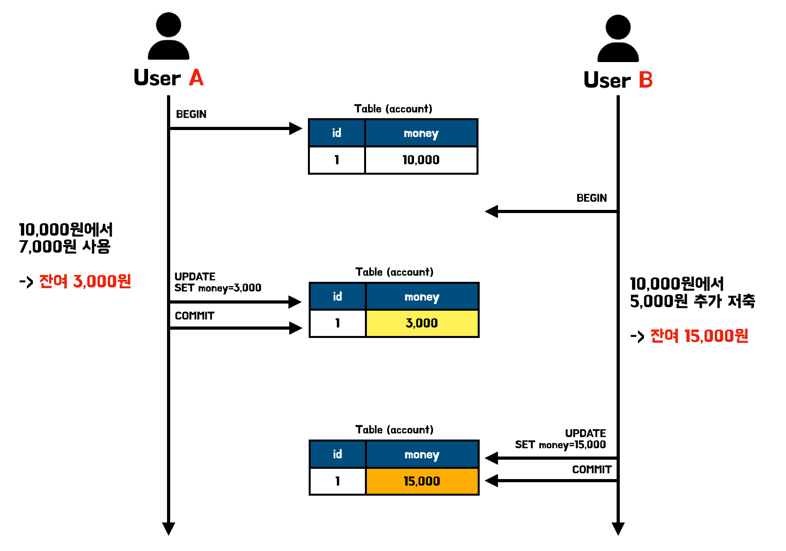
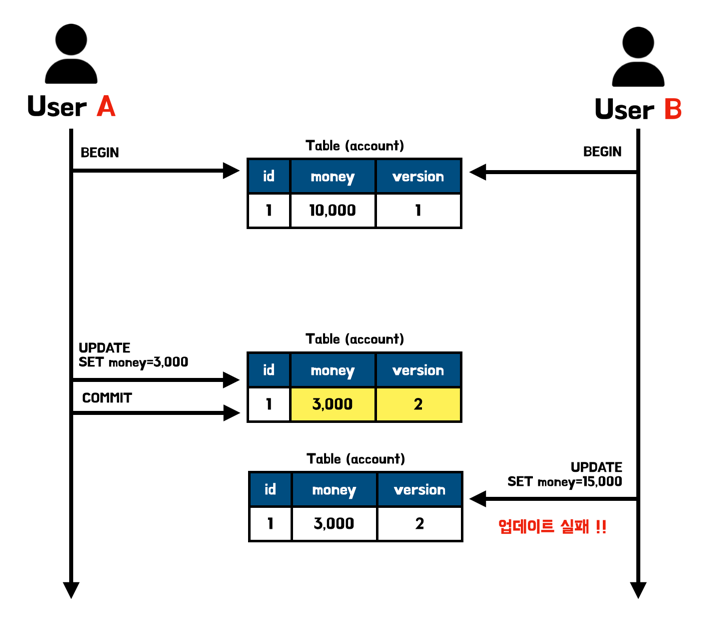

서비스를 개발하고 운영하다보면 동시성 문제는 피할 수 없는 문제이다. 많은 사용자들이 동시에 서비스를 사용해서 발생하는 문제를 생각하면 트랜잭션의 격리 수준을 생각할 수 있다. 하지만 격리수준은 각 사용자가 트랜잭션을 사용하는 동안 일관된 데이터 읽게 해주도록 지원하며 동시성으로 인해 발생하는 데이터 손실에 대해서는 관여하지 않는다. 실제로 격리수준에 대해 살펴본 글에서 알 수 있듯이 MySQL은 Lock이 아닌 MVCC를 통해 사용자에게 일관된 데이터를 제공해준다.

동시성으로 발생하는 문제는 흔히 알려진 **두 번의 갱신 분실 문제**가 존재한다. 해당 문제를 살펴보며 동시성에 대한 추가 처리가 필요한 이유와 방법에 대해 살펴보겠다.

> 📌 **격리수준에 대해 궁금하다면 아래의 게시글을 참고하길 바란다.**
>
> - [트랜잭션의 격리수준(Isolation level)이란?](https://seongwon.dev/Database/20221022-트랜잭션-격리수준이란/)


# 두 번의 갱신 분실 문제(Second lost updates problem)

두 트랜잭션에서 데이터를 변경하였을 때, 최종적으로 한 트랜잭션의 결과만 남는 것을 두 번의 갱실 분실 문제라고 한다. 예시를 하나 살펴보겠다.



상황으로는 부부가 같이 사용하는 계좌에서 한 명은 돈을 사용하고 한 명은 돈을 저축하였는데 그 동작이 동시에 일어났다 생각해보겠다. 위의 이미지를 살펴보면 User A와 B는 각각 트랜잭션을 시작할 때, 데이터베이스로부터 잔액 10,000원이라는 결과를 받았다. 그리고 각각 7,000원 사용과 5,000원 추가 저축이라는 행위를 하였다. 정상적인 결과로는 10,000 - 7,000 + 5,000을 하여서 잔액이 8,000원이 되어야 한다. 하지만 결과는 어떠한가? 돈을 사용한 트랜잭션의 결과에 돈을 저축한 결과가 덮어 쓰여져서 돈을 사용한 결과가 분실되게 되었다. 이러한 문제를 두 번의 갱신 분실 문제라고 한다.

해당 문제는 데이터베이스 트랜잭션의 기능으로는 해결할 수 없는 문제라 추가적인 처리가 필요하다. 처리 방법으로는 아래의 3가지 방법이 존재한다.

- **마지막 커밋만 인정하기:** 사용자A의 내용은 무시하고 마지막에 커밋한 사용자B의 내용만 인정한다.
- **최초 커밋만 인정하기:** 사용자A가 이미 수정을 완료했으므로 사용자B가 수정을 완료할 때 오류가 발생한다.
- **충돌하는 갱신 내용 병합하기:** 사용자A와 사용자B의 수정사항을 병합한다.

JPA에서는 두 번의 갱실 문제를 해결하는 방법으로 비관적 락과 낙관적 락 매커니즘을 제공하고 있다.

> JPA는 데이터베이스의 트랜잭션 격리 수준을 READ COMMITTED 정도로 가정한다.
>

# 비관적 락(Pessimistic Lock)

비관적 락은 트랜잭션의 충돌이 발생한다고 가정하고 트랜잭션이 시작될 때 **데이터베이스에 락**을 걸어 다른 트랜잭션이 접근하지 못하게 하는 방법이다. 락의 종류로는 Shared Lock과 Exclusive Lock이 존재한다.

데이터베이스에서 제공하는 락을 사용하여 데이터를 수정 요청과 동시에 충돌 여부를 알 수 있다.

> 📌 **Shared Lock과 Exclusive Lock이란?**
>
>
> **Shared Lock(공유 락, S Lock)**
>
> - 특정 Row를 읽을(Read) 때 사용되는 Lock이다.
> - 여러 트랜잭션이 동시에 한 Row에 Shared Lock을 걸 수 있다. → 하나의 Row를 여러 트랜잭션이 동시에 읽을 수 있다.
> - Shared Lock이 설정된 Row에는 Exclusive Lock을 사용할 수 없다.
> - InnoDB에서 일반적인 `SELECT` 쿼리는 Lock을 사용하지 않는다. 하지만 `SELECT .. FOR SHARE` 등의 일부 쿼리는 각 Row에 Shared Lock을 건다.
>
> **Exclusive Lock(배타 락, X Lock)**
>
> - 특정 Row를 변경(write)할 때 사용된다.
> - 특정 Row에 Exclusive Lock이 걸려있을 경우, 다른 트랜잭션은 읽기 작업을 위해 Shared Lock을 걸거나, 쓰기 작업을 위해 Exclusive Lock을 걸 수 없다. → 쓰기 작업을 하고 있는 Row에는 모든 접근이 불가하다.
> - `SELECT … FOR UPDATE`, `UPDATE`, `DELETE` 등의 수정 쿼리들이 실행될 때 Row에 걸린다.

## LockModeType

Data JPA에서 낙관적 락과 비관적 락을 사용하기 위해서는 아래와 같이 Repository 인터페이스에 지정한 커스텀 메서드에 `@Lock` 어노테이션을 붙여주고 Lock 어노테이션의 설정 값인 value에 설정하고자 하는 `LockModeType`을 지정해주면 된다.

```java
public interface AccountRepository extends JpaRepository<Account, Long> {

    @Lock(value = LockModeType.OPTIMISTIC)
    Optional<Account> findByName(String name);
}
```

비관적 락에는 `PESSIMISTIC_READ`, `PESSIMISTIC_WRITE`, `PESSIMISTIC_FORCE_INCREMENT`로 총 3가지의 LockModeType이 존재한다.

**PESSIMISTIC_READ**

- 데이터를 반복적으로 읽기만 하고 수정하지 않을 때 사용한다.
- 일반적으로는 잘 사용하지 않는다.
- `SELECT … FOR SHARE`를 통해 공유 락을 건다.

**PESSIMISTIC_WRITE**

- 비관적 락을 걸 때 일반적으로 사용하는 옵션이다.
- NON-REPEATABLE READ를 방지할 수 있다.
- `SELECT … FOR UPDATE` 를 통해 베타 락을 건다.

**PESSIMISTIC_FORCE_INCREMENT**

- 유일하게 버전 정보를 사용하는 락이며 버전 정보를 강제로 증가시킨다.
- 하이버네이트의 경우 `nowait` 를 지원하는 데이터베이스에 대해서 `FOR UPDATE NOWAIT` 옵션을 적용하고, 그렇지 않다면 `FOR UPDATE` 를 적용한다.

# 낙관적 락(Optimistic Lock)

대부분의 트랜잭션은 충돌이 발생하지 않는다고 낙관적으로 가정하는 방법이다.

낙관적 락은 비관적락과 다르게 데이터베이스가 제공하는 락이 아닌 **애플리케이션 레벨에서 락을 구현**하게 된다. JPA에서는 버전 관리 기능(`@Version`)을 통해 구현할 수 있다.

낙관적 락은 애플리케이션에서 충돌을 관리하기에 트랜잭션을 커밋하기 전까지는 충돌을 알 수 없다.

## @Version

JPA는 낙관적 락을 위해 `@Version` 어노테이션을 제공하고 있다. 해당 어노테이션이 붙은 필드를 포함하는 엔티티를 정의하면, 해당 엔티티 테이블을 읽는 각 트랜잭션은 업데이트를 수행하기 전에 버전의 속성을 확인하게 된다. 만약 데이터를 읽고 업데이트를 하기 이전에 버전 값이 변경되어있다면 `OptimisticLockException`을 발생 시키며 해당 업데이트를 취소하게 된다.

그림으로 살펴보면 아래와 같다.



`@Version` 필드를 선언할 때에는 아래의 규칙을 따라야 한다.

- 각 엔티티 클래스에는 한 개의 버전 필드만 있어야 한다.
- 여러 테이블에 매핑된 엔티티의 기본 테이블에 배치해야 한다.
- 버전 유형은 int, Integer, long, Long, short, Short, java.sql.Timestamp 중 하나여야 한다.
- **엔티티를 통해 버전이 어떠한지 필드를 탐색할 수는 있지만 우리가 직접 수정해서는 안 된다.**
    - 단 벌크 연산시에는 JPA가 관라하지 않아 직접 +1을 하며 관리해줘야 한다.

엔티티에 버전 필드를 추가한 예시는 아래와 같다.

```java
@Entity
@NoArgsConstructor
public class Account {

    @Id
    @GeneratedValue(strategy = GenerationType.IDENTITY)
    private Long id;

    private String name;
    private Long money;

    @Version
    private int version;

    public Account(String name, Long money) {
        this.name = name;
        this.money = money;
    }
}
```

## LockModeType

**NONE**

- 엔티티에 버전 필드가 존재하는데 락 모드가 정의되지 않았다면 적용되는 옵션이다.
- 조회한 엔티티를 수정하는 시점에 다른 트랜잭션으로부터 변경되지 않음을 보장한다.

**OPTIMISTIC**

- NONE의 경우 엔티티를 수정할 때만 버전을 체크하지만 해당 옵션을 추가하면 엔티티를 조회만 해도 버전을 체크한다.
- 즉, 한 번 조회한 엔티티는 종료할 때까지 다른 트랜잭션에서 변경하지 않음을 보장한다.
- READ 타입과 동일하다.

**OPTIMISTIC_FORCE_INCREMENT**

- 낙관적 락을 사용하며 버전 정보를 항상 강제로 증가시킨다.
- 엔티티가 물리적으로 변경되지 않았지만 논리적으로 변경 되었을 때, 버전 정보를 증가시킬 수 있다. → 논리적인 단위로 엔티티를 관리할 때 사용한다.
    - e.g. 1:N 관계의 엔티티에서 1의 변화는 없는데 N에 데이터가 추가되거나 제거된 경우, 1에는 물리적인 변화가 없지만 논리적인 변화가 일어난 것이다. 이런 경우에도 버전을 변경할 수 있다.
- WRITE 타입과 동일하다.

# 언제 어떤 락을 사용해야할까?

**비관적락**은 데이터베이스 레벨의 락을 이용하기에 데이터의 무결성이 중요하고, 충돌이 많이 발생하여 잦은 롤백으로 인한 효율성 문제가 발생하는것이 예상되는 시나리오에 사용하면 좋다. 하지만 DB상에 락을 걸어 성능상에 손해를 보게 된다.

**낙관적락**은 실제로 데이터 충돌이 자주 일어나지 않을것이라고 예상되는 시나리오에서 좋다.하지만 추가적인 오류 처리가 필요하고 동시 접근이 많이 발생하면 오류 처리를 위해 더 많은 리소스가 소모되는 상황이 만들어질 수 있다.

- e.g. 선착순 쿠폰 100개가 있는 서비스에 낙관적 락이 걸려있고 1000명이 동시 요청을 하였다 가정하자. 그러면 최초 커밋 1명은 통과하며 버전을 변경하게 된다. 그리고 이후의 남은 999명은 업데이트 시점에 버전이 변경되었기에 취소되고 애플리케이션에서 오류 처리 로직에 따라 다시 재시도를 요청해야한다. 그리고 다음 한명이 요청을 처리하게되고 남은 998명은 다시 새로운 버전을 읽고 재시도를 해야한다…(반복) → 해당 상황과 같이 충돌이 많은 서비스는 비관적 락 또는 대기열 시스템을 통해 쿠폰이 선착순으로 할당되도록 구현하는 것이 적합하다.

락에 대한 선택은 정해진 정답이 없다. 현재 구현하는 **서비스의 비즈니스 요구사항, 성격, 애플리케이션 부하, 재시도에 대한 별도 처리** 등 여러 사항들을 고려하며 서비스에 적합한 전략을 사용하는 것이 좋다.

# 📚 Reference

- [Optimistic Locking in JPA | Baeldung](https://www.baeldung.com/jpa-optimistic-locking)
- [JPA의 낙관적 락과 비관적 락을 통해 엔티티에 대한 동시성 제어하기](https://hudi.blog/jpa-concurrency-control-optimistic-lock-and-pessimistic-lock/)
- [OKKY - 낙관적락과 비관적락에 대해서 - 이론과 JPA 실습](https://okky.kr/articles/1023929)
- [[JPA] 비관적 락 , 낙관적 락](https://k3068.tistory.com/92)
- [How are locking mechanisms (Pessimistic/Optimistic) related to database transaction isolation levels?](https://stackoverflow.com/questions/22646226/how-are-locking-mechanisms-pessimistic-optimistic-related-to-database-transact)
- [동시성 문제 해결하기 V1 - 낙관적 락(Optimistic Lock) feat.데드락 첫 만남](https://velog.io/@znftm97/동시성-문제-해결하기-V1-낙관적-락Optimisitc-Lock-feat.데드락-첫-만남)
