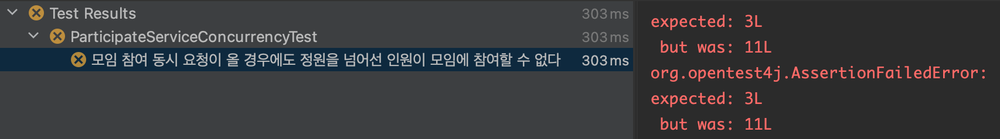
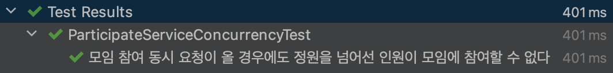
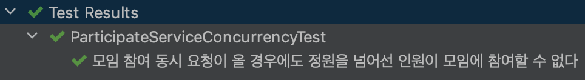
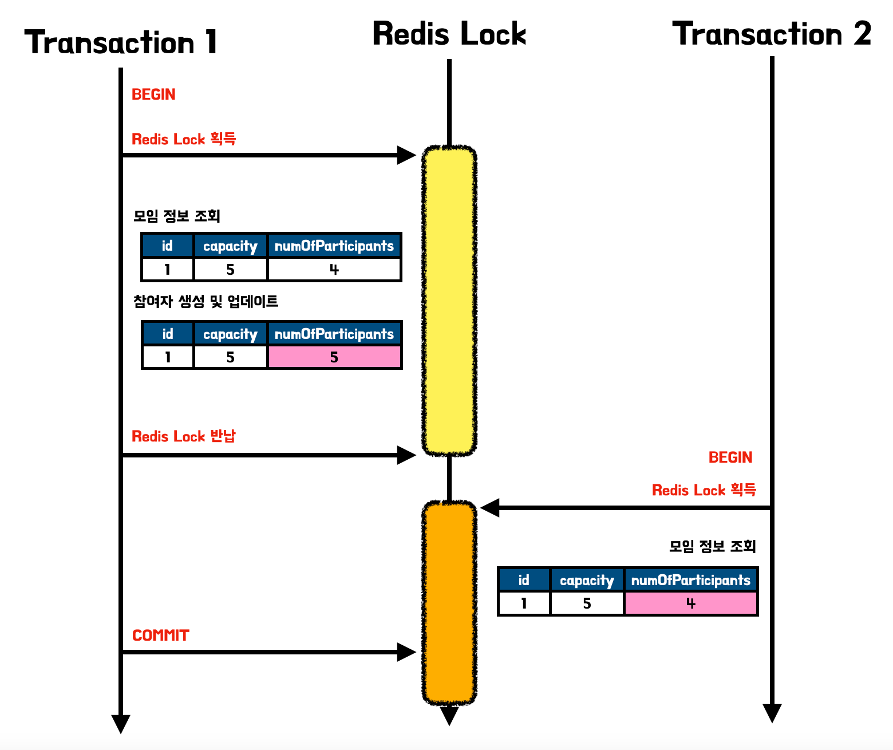
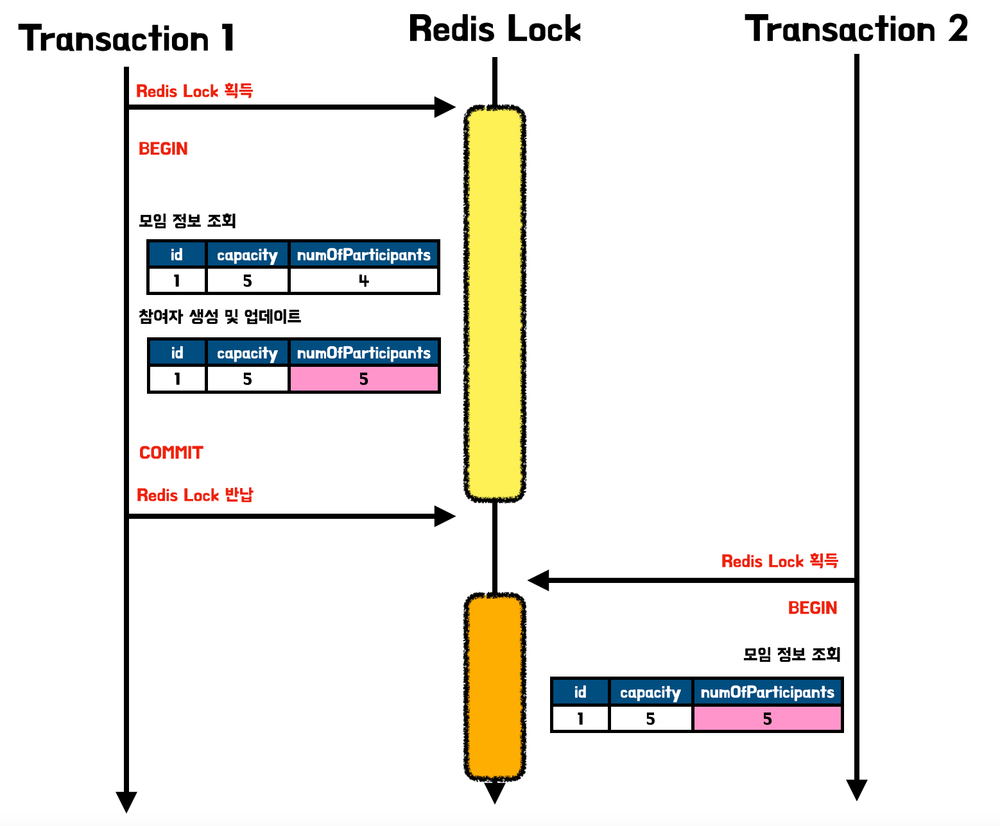
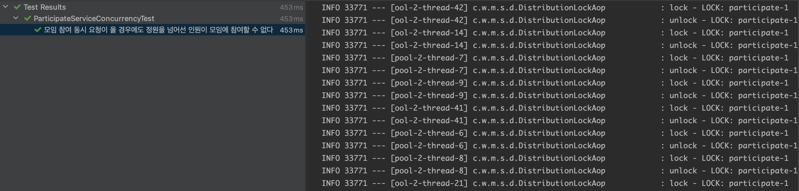
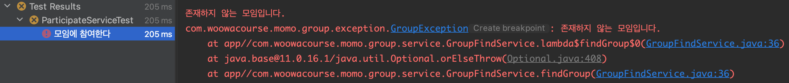

이번 게시글은 모임 플랫폼인 모두모여라 프로젝트를 진행하며 동시성 문제를 해결한 과정에 대해 정리한 게시글입니다. 단일 서버에서 간단하게 해결한 방법으로부터 최종적으로 분산락을 적용한 과정까지 전 과정을 정리하였습니다. (앞의 과정은 간단히 설명하고 최종 적용한 분산락에 대해 자세히 설명하려 합니다.)

모두모여라 서비스의 모임 참여 기능은 모임 별로 주최자가 정한 모임의 인원 제한이 있습니다. 동시성 문제에 대한 아무런 처리가 없는 상황에서 여러 참여자가 동시에 참여 요청을 할 경우 모임의 제한 인원을 넘는 참여자가 생겨나는 문제가 발생하였습니다.

먼저 문제 상황을 알아보고자 기존 로직을 살펴보고 모임 참여에 대한 동시성 테스트 코드를 작성하며 테스트를 해보겠습니다. 모임 참여 로직을 살펴보면 아래와 같이 JPA를 통해 모임(Group)과 회원(Member) 정보를 데이터베이스에서 읽어온 후에 모임 참여를 진행하였습니다.

```java
@RequiredArgsConstructor
@Transactional(readOnly = true)
@Service
public class ParticipateService {

    private final MemberFindService memberFindService;
    private final GroupFindService groupFindService;

    @Transactional
    public void participate(Long groupId, Long memberId) {
        Group group = groupFindService.findGroup(groupId);
        Member member = memberFindService.findMember(memberId);

        group.participate(member);
    }
}
```

다음으로 테스트 코드입니다. 동시성 문제를 테스트하기 위해서는 동시 요청을 테스트코드로 작성해야하기에 `CountDownLatch`와 `ExecutorService`를 통해 별도의 스레드에서 참여로직이 동시에 처리되도록 하였습니다.

```java
@Sql(value = "classpath:init.sql", executionPhase = BEFORE_TEST_METHOD)
@Sql(value = "classpath:truncate.sql", executionPhase = AFTER_TEST_METHOD)
@TestConstructor(autowireMode = TestConstructor.AutowireMode.ALL)
@RequiredArgsConstructor
@SpringBootTest
class ParticipateServiceConcurrencyTest {

    private final ParticipateService participateService;
    private final GroupRepository groupRepository;
    private final MemberRepository memberRepository;

    private Member host;

    @BeforeEach
    void setUp() {
        this.host = memberRepository.save(MOMO.toMember());
    }

    @DisplayName("모임 참여 동시 요청이 올 경우에도 정원을 넘어선 인원이 모임에 참여할 수 없다")
    @Test
    void participateConcurrencyTest() throws InterruptedException {
        int capacity = 3;
        int numOfParticipants = 50;
        long groupId = groupRepository.save(
                MOMO_STUDY.builder()
                        .capacity(capacity)
                        .toGroup(host)
        ).getId();

        List<Long> participantIds = new ArrayList<>();
        for (int i = 0; i < numOfParticipants; i++) {
            Member savedMember = memberRepository.save(
                    new Member(UserId.momo("user" + i),
                            Password.encrypt("User123!", new SHA256Encoder()),
                            UserName.from("user" + i)));
            participantIds.add(savedMember.getId());
        }

        CountDownLatch latch = new CountDownLatch(numOfParticipants);
        ExecutorService executor = Executors.newFixedThreadPool(numOfParticipants);

        for (Long participantId : participantIds) {
            executor.submit(() -> {
                try {
                    participateService.participate(groupId, participantId);
                } finally {
                    latch.countDown();
                }
            });
        }

        executor.shutdown();
        latch.await();

        long actual = participateService.findParticipants(groupId).size();

        assertThat(actual).isEqualTo(capacity);
    }
}
```

결과를 살펴보면 아래와 같이 3명의 인원 제한이 있는 모임인데 11명의 참여자가 발생하게 되었습니다. 즉, 동시성 문제에 대한 제어가 필요한 상황입니다.



# 해결 과정 1 - synchronized

첫번째 해결 책으로는 자바에서 하나의 스레드만이 임계 구역(Critical Section)에 접근하도록 지원해주는 `synchronized`를 통해 해결하였습니다. 단순히 기존 참여 메서드에 `synchronized`만 붙여주는 작업만으로도 기존에 발생하던 동시성 문제를 해결할 수 있었습니다.

## 코드 및 결과

```java
@RequiredArgsConstructor
@Transactional(readOnly = true)
@Service
public class ParticipateService {

    private final MemberFindService memberFindService;
    private final GroupFindService groupFindService;

    @Transactional
    public synchronized void participate(Long groupId, Long memberId) {
        Group group = groupFindService.findGroup(groupId);
        Member member = memberFindService.findMember(memberId);

        group.participate(member);
    }
}
```



> 관련 PR: https://github.com/woowacourse-teams/2022-momo/pull/431
>

## 남아있는 문제

하지만 해당 방법은 단일 서버에서는 해결법이 될 수 있으나, N개의 서버를 운영하는 분산 환경에서는 각각의 서버에서 1개의 요청씩 동작시킨다 하더라도 전체적인 시스템을 보면 N개의 동일 요청이 실행되어 동시 접근을 제어하지 못하게 됩니다.

그럼 다중 서버에서 동시성 문제를 해결하는 방법은 무엇이 있을까요?? 이를 해결하기 위해서는 JPA에서 제공하는 **낙관적락**, 데이터베이스에 x-lock을 거는 **비관적락**, 락은 관리하는 외부 데이터베이스를 이용한 **분산락**이 존재합니다. 이 중에서 모두모여라 팀은 먼저 낙관적락과 비관적락을 고려하며 로직을 수정해봤습니다.

> 📌 해당 게시글은 프로젝트에서 발생한 문제를 기록하고 정리하는 게시글인 만큼 자세한 이론에 대해 다루지 않고 있습니다. 낙관적락, 비관적락, 분산락에 대해 자세히 알고싶으시면 아래의 포스트를 확인해주시기 바랍니다.
>
>
> [비관적 락(Pessimistic Lock)과 낙관적 락(Optimistic Lock)](https://seongwon.dev/Spring-MVC/20230430-비관적락과_낙관적락/)
>
> [Redis를 통한 분산락(Distribution Lock)으로 동시성 문제 제어하기](https://seongwon.dev/MSA/20230503-Redis를_통한_분산락으로_동시성_문제_제어하기/)
>

# 해결 과정 2 - 비관적 락 vs 낙관적 락

우리 팀은 서비스의 특성을 고려하여 낙관적 락과 비관적 락 중 비관적 락을 선택 및 적용하였습니다. 선택 이유는 충돌에 대한 잦은 롤백 처리로 인해 성능이 더 안 좋아질 수 있기 때문이었다.

이해를 돕기 위해 상황 예시를 한번 들어보겠습니다. 10명만 참여 가능한 모임 서비스에 낙관적 락이 걸려있고 1000명이 동시 요청을 하였다 가정하면 최초로 데이터베이스에 Commit 요청이 처리된 1명은 통과하며 엔티티의 버전을 변경하게 됩니다. 그리고 이후의 남은 999명은 업데이트 시점에 버전을 확인하였는데 버전이 변경되었기에 취소되고 애플리케이션에서 오류 처리 로직에 따라 다시 재시도를 요청하게 됩니다. 그리고 다음 한명이 요청을 처리하게되고 남은 998명은 다시 새로운 버전을 읽고 재시도를 해야한다…(반복)

이와 같이 인기 있는 모임에 참여 동시 요청이 발생할 경우, 잦은 충돌로 인한 낙관적 락의 오류 처리 비용으로 인해 성능에 더 영향을 줄 것이라 판단해 비관적 락을 택하였습니다.

## 코드 및 결과

비관적 락을 적용한 코드는 아래와 같습니다.

```java
public interface GroupSearchRepository extends Repository<Group, Long>, GroupSearchRepositoryCustom {

    @Lock(value = LockModeType.PESSIMISTIC_WRITE)
    @Query("select g from Group g where g.id = :id")
    Optional<Group> findByIdForUpdate(@Param("id") Long id);
    
    ...
}
```

```java
@RequiredArgsConstructor
@Transactional(readOnly = true)
@Service
public class GroupFindService {

    private final GroupSearchRepository groupSearchRepository;
    private final ParticipantRepository participantRepository;

    ...

    public Group findByIdForUpdate(Long id) {
        return groupSearchRepository.findByIdForUpdate(id)
                .orElseThrow(() -> new GroupException(NOT_EXIST));
    }
    ...
}
```

```java
@RequiredArgsConstructor
@Transactional(readOnly = true)
@Service
public class ParticipateService {

    private final MemberFindService memberFindService;
    private final GroupFindService groupFindService;

    @Transactional
    public void participate(Long groupId, Long memberId) {
        Group group = groupFindService.findByIdForUpdate(groupId);
        Member member = memberFindService.findMember(memberId);

        group.participate(member);
    }
    ...
}
```



테스트를 실행한 결과 정상적으로 통과하며 문제를 해결할 수 있었습니다.

## 남아있는 문제

비관적 락을 적용하며 다중 서버에서 동시성 문제를 해결할 수는 있었으나 데이터 베이스에 x-lock을 걸게 되며 쓰기 뿐만 아니라 데이터 조회에도 영향을 주는 문제가 발생했습니다.

```java
@RequiredArgsConstructor
@Transactional(readOnly = true)
@Service
public class ParticipateService {

    private final MemberFindService memberFindService;
    private final GroupFindService groupFindService;

    @Transactional
    public void participate(Long groupId, Long memberId) {
        // findByIdForUpdate -> SELECT FOR UPDATE를 통한 x-lock 획득
        Group group = groupFindService.findByIdForUpdate(groupId);
        Member member = memberFindService.findMember(memberId);
        // group 객체는 capacity와 참여자의 정보를 얻기 위한 그래프 탐색을 하기 위해 획득
        // group 테이블에는 변경 X, Participants 테이블에만 새로운 참가자 데이터가 추가됨
        group.participate(member);
    }
}
```

위의 로직을 살펴보면 `participate()` 메서드가 실행됨과 동시에 `SELECT FOR UPDATE`를 통해 Group정보를 얻으며 해당 데이터에 x-lock을 걸며 다른 읽기, 쓰기 요청에 대한 모든 접근을 제한하였습니다. **즉, 모임 참여 요청을 처리하는 과정에서 모임 테이블에 변동을 주지 않음에도 불구하고 모임 조회에 대한 접근도 막게 되며 조회 성능에도 영향을 주게 된겁니다.**

# 해결 과정 3 - Redis 분산락

비관적 락으로 발생함 문제를 해결하기 위해 최종적으로 분산락 적용을 고려하게 됐습니다. 분산락은 기존 코드처럼 데이터베이스 row에 Lock을 거는 것이 아닌 직접적으로 참여하기 로직을 수행하는 부분(Critical Section)에 걸며 모임 테이블의 조회에는 영향을 주지 않을 수 있습니다.

## 사용 기술 선정

분산락은 MySQL, Redis, Zookeeper 등을 통해 구현할 수 있습니다. 여러 기업들이 분산락을 사용 사례를 보면 카카오, 토스와 마켓 컬리 등 많은 기업들에서 Redis를 통한 분산락을 구현하였습니다. 그렇다고 MySQL을 사용하지 않는 것은 아닙니다. 우아한형제들의 기술 블로그를 보면 광고 시스템에서는 MySQL을 사용한 것을 확인할 수 있습니다.

> 📌 IT 기업들의 분산락 적용 포스트
>
> - [풀필먼트 입고 서비스팀에서 분산락을 사용하는 방법 - Spring Redisson](https://helloworld.kurly.com/blog/distributed-redisson-lock/)
> - [MySQL을 이용한 분산락으로 여러 서버에 걸친 동시성 관리 | 우아한형제들 기술블로그](https://techblog.woowahan.com/2631/)


모모팀은 위의 여러 방법 중 Redis를 택했습니다. Redis를 택한 이유는 사전에 글로벌 캐시를 구축하며 Redis 환경을 구축하며 별도의 추가적인 인프라 구축이 필요없다는 점입니다. 물론 MySQL 서버도 구축되어 있으나 Redis와 MySQL을 비교해봤을 때, Redis의 처리 속도가 더 빠르고 락을 위한 MySQL의 부하를 발생시키지 않기 위해 이와 같은 선택을 하였습니다.

### Lettuce vs Redisson

Redis를 통한 분산락 구현은 대표적으로 Lettuce와 Redisson이라는 RedisClient 중 하나를 사용합니다. 각각 분산락을 구현하였을 때 특징을 간단히 설명하자면 Lettuce는 Spin Lock 방식으로 락에 대한 획득 시도를 지속적으로 해야하며 락에 대한 타임 아웃을 지정할 수 없다는 특징이 있습니다. 반면 Redisson은 pub/sub 방식으로 동작해 레디스 서버의 부하 문제를 줄여줄 수 있고 락에 타임 아웃을 지정할 수 있다는 특징이 있습니다.

이러한 특징을 고려하여 Reddison을 최종적으로 사용하였습니다.

## 분산락 적용

분산락을 사용하는 비즈니스 코드에 Redisson을 통해 락을 획득하고 락을 풀어주는 코드들이 추가될 것입니다. 이는 비즈니스 코드를 복잡하게 만들고 분산락을 사용하게 되는 부분에 코드의 중복이 생겨 유지보수를 어렵게 됩니다. 이를 위해 AOP를 통해 어노테이션 기반으로 분산락을 쉽게 구현하고자 합니다.

### 의존성 추가

```
dependencies {
	...
	implementation 'org.redisson:redisson-spring-boot-starter:3.17.7'
}
```

Redis Client인 Redisson을 사용하기 위해 의존성을 추가해줍니다.

### DistributionLock.java

```java
import java.lang.annotation.ElementType;
import java.lang.annotation.Retention;
import java.lang.annotation.RetentionPolicy;
import java.lang.annotation.Target;
import java.util.concurrent.TimeUnit;

@Target(ElementType.METHOD)
@Retention(RetentionPolicy.RUNTIME)
public @interface DistributionLock {

    String key();

    long waitTime() default 5L;

    long leaseTime() default 2L;

    TimeUnit timeUnit() default TimeUnit.SECONDS;
}
```

분산락을 통해 동시성 문제를 해결할 메서드에 붙일 어노테이션을 만들어줍니다. 유연한 사용을 위해 락에 사용될 키 값과 Redisson에서 락을 획득하기 위해 사용하는 메서드(`tryLock()`)의 파라미터 값들을 변수로 두어 락에 관한 설정을 쉽게 할 수 있게 하였습니다.

- waitTime : 락을 획득하기까지 기다리는 최대 시간 (시간이 지날 때까지 락을 획득하지 못하면 false를 반환)
- leaseTime : 락의 타임아웃을 설정 (설정 시간만큼 지나면 락이 만료되어 스스로 해제)
- timeUnit : 락 설정 값에 사용될 시간 타입

### DistributionLockKeyGenerator.java

```java
import org.springframework.expression.ExpressionParser;
import org.springframework.expression.spel.standard.SpelExpressionParser;
import org.springframework.expression.spel.support.StandardEvaluationContext;

public class DistributionLockKeyGenerator {

    public static Object generate(String methodName, String[] parameterNames, Object[] args,
                                  String key) {
        ExpressionParser parser = new SpelExpressionParser();
        StandardEvaluationContext context = new StandardEvaluationContext();

        for (int i = 0; i < parameterNames.length; i++) {
            context.setVariable(parameterNames[i], args[i]);
        }

        return methodName + "-" + parser.parseExpression(key).getValue(context, Object.class);
    }
}
```

Lock에 사용될 키를 생성하는 클래스입니다. 키 값은 전달받은 메서드의 이름과 springframework의 `ExpressionParser`를 통해  파싱한 값을 통해 생성합니다.

### DistributionLockAop.java

```java
import java.lang.reflect.Method;

import org.aspectj.lang.ProceedingJoinPoint;
import org.aspectj.lang.annotation.Around;
import org.aspectj.lang.annotation.Aspect;
import org.aspectj.lang.reflect.MethodSignature;
import org.redisson.api.RLock;
import org.redisson.api.RedissonClient;
import org.springframework.stereotype.Component;

import lombok.RequiredArgsConstructor;
import lombok.extern.slf4j.Slf4j;

import com.woowacourse.momo.global.exception.exception.GlobalErrorCode;
import com.woowacourse.momo.global.exception.exception.MomoException;

@Component
@Aspect
@RequiredArgsConstructor
@Slf4j
public class DistributionLockAop {
    private static final String LOCK_PREFIX = "LOCK: ";

    private final RedissonClient redissonClient;
    private final TransactionGeneratorAop transactionGeneratorAop;

    @Around("@annotation(com.woowacourse.momo.support.distributionlock.DistributionLock)")
    public Object lock(ProceedingJoinPoint joinPoint) throws Throwable {
        MethodSignature methodSignature = (MethodSignature) joinPoint.getSignature();
        Method method = methodSignature.getMethod();
        DistributionLock distributionLock = method.getAnnotation(DistributionLock.class);

        String key = LOCK_PREFIX + DistributionLockKeyGenerator.generate(methodSignature.getName(),
                methodSignature.getParameterNames(), joinPoint.getArgs(), distributionLock.key());

        RLock lock = redissonClient.getLock(key);
        try {
            if (!lock.tryLock(distributionLock.waitTime(), distributionLock.leaseTime(), distributionLock.timeUnit())) {
                throw new MomoException(GlobalErrorCode.LOCK_ACQUISITION_FAILED_ERROR);
            }
            log.info("lock - " + key);
            return transactionGeneratorAop.proceed(joinPoint);
        } catch (InterruptedException e) {
            log.error(e.getMessage());
            throw new MomoException(GlobalErrorCode.LOCK_INTERRUPTED_ERROR);
        } finally {
            log.info("unlock - " + key);
            lock.unlock();
        }
    }
}
```

앞서 생성한 `@DistributionLock` 어노테이션을 통해 수행할 AOP 설정 클래스 입니다. 동작과정은 아래와 같습니다.

1.  `DistributionLockKeyGenerator.generate()` 메서드를 통해 Lock에 사용될 키 값을 생성한다.
2. redissonClient를 통해 `RLock` 인스턴스를 가져옵니다.
3. `RLock.tryLock()` 메서드를 통해 최대 waitTime 시간만큼 락의 획득을 기다린다.
4. 락의 획득이 가능하다면 leaseTime을 타임아웃으로 설정하며 락을 획득한다.
5. transactionGeneratorAop를 통해 새로운 트랜잭션을 생성하며 로직을 수행한다.

   > 해당 내용은 `TransactionGeneratorAop` 클래스의 설명을 하며 자세히 다루겠습니다.


### TransactionGeneratorAop.java

```java
@Component
public class TransactionGeneratorAop {

    @Transactional(propagation = Propagation.REQUIRES_NEW)
    public Object proceed(ProceedingJoinPoint joinPoint) throws Throwable {
        return joinPoint.proceed();
    }
}
```

`@Transactional(propagation = Propagation.REQUIRES_NEW)`를 통해 새로운 트랜잭션을 만들어 로직을 수행하는 AOP 클래스입니다.

해당 AOP를 통해 새로운 트랜잭션을 생성하지 않더라도 분산락 테스트는 정상적으로 통과합니다. 하지만 이럴 경우 분산락의 반납이 진행된 이후에 트랜잭션의 커밋이 발생하기에 희박한 가능성으로 예상하지 못한 동작으로 이어질 수 있습니다. 이해를 위해 그림으로 살펴보겠습니다.



분산락을 획득하고 반납이 트랜잭션 안에서 처리되면 위와 같이 이전에 동락한 트랜잭션(1번 트랜잭션)의 커밋이 되지 않아 락을 획득한 트랜잭션(2번 트랜잭션)에서 업데이트 된 데이터가 아닌 언두로그의 데이터를 읽어와 동시성 문제가 해결되지 않는 상황이 발생할 수 있습니다. 이러한 문제는 락을 획득하고 반납하는 로직 내에서 트랜잭션의 커밋까지 이루어지도록 변경하면 됩니다.

위에서 지정한 `TransactionGeneratorAop`를 통해 분산락을 통해 동작하는 로직을 새로운 트랜잭잭션 내에서 수행하도록 변경하면 락을 반납하기 이전에 트랜잭션의 커밋이 이루어져 아래와 같이 동작하게 됩니다.



### 비즈니스 로직

```java
@RequiredArgsConstructor
@Service
public class ParticipateService {

    private final MemberFindService memberFindService;
    private final GroupFindService groupFindService;

    @DistributionLock(key = "#groupId")
    public void participate(Long groupId, Long memberId) {
        Group group = groupFindService.findGroup(groupId);
        Member member = memberFindService.findMember(memberId);

        group.participate(member);
    }
}
```

이제 앞서 생성한 분산락 어노테이션을 비즈니스 로직에 적용하고 테스트해보겠습니다. 기존 비즈니스 로직과 다르게 내부 로직에서 새로운 트랜잭션을 만들기에 `@Transacitonal`을 제거하였습니다. `@Transactional`을 그대로 붙여둬도 되지만 불필요하게 더 많은 데이터베이스 커넥션을 사용하여 커넥션 고갈 문제가 발생할 수 있습니다. 이는 아래의 분산락을 적용하며 발생한 문제 파트에서 자세히 다루도록 하겠습니다.

### 결과 확인

위의 로직을 적용 후 테스트를 진행해본 결과는 아래와 같이 성공적으로 통과하는 것을 확인할 수 있습니다. 또한 로그를 확인해보면 Lock의 획득과 Lock의 반납이 순차적으로 진행되는 것을 확인할 수 있습니다.




## 발생한 문제

### 문제 - 트랜잭션을 새로 분리하며 실패하는 테스트

트랜잭션을 분리하며 기존에 성공하던 관련 로직들이 실패하는 문제가 발생했습니다. 먼저 실패하는 테스트 중 한개를 살펴보겠습니다.

```java
@Transactional
@TestConstructor(autowireMode = TestConstructor.AutowireMode.ALL)
@RequiredArgsConstructor
@SpringBootTest
class ParticipateServiceTest {
    ...
    private Group group;
    private Member host;
    private Member participant;

    @BeforeEach
    void setUp() {
        this.host = memberRepository.save(MOMO.toMember());
        this.group = groupRepository.save(MOMO_STUDY.toGroup(host));
        this.participant = memberRepository.save(DUDU.toMember());
    }

    @DisplayName("모임에 참여한다")
    @Test
    void participate() {
        long groupId = group.getId();
        long participantId = participant.getId();

        participateService.participate(groupId, participantId);

        List<MemberResponse> participants = participateService.findParticipants(groupId);

        assertThat(participants).hasSize(2);
    }
    ...
}
```



기존에 정상적으로 통과하던 테스트가 “존재하지 않는 모임입니다.” 라는 예외와 함께 실패하게 됐습니다. 이러한 문제가 발생한 이유는 트랜잭션과 연관있습니다.

테스트는 각각의 테스트별 격리를 위해 클래스 레벨에 `@Transactional` 을 붙이며 테스트의 수행 후 Rollback이 되어 이후 테스트에 영향이 가지 않도록 했습니다. 테스트를 진행하는 `participate()`메서드는 분산락을 적용하기 전에는 비즈니스 로직에 `@Transactional`이 붙어있더라도 Default 설정값인 `Propagation.REQUIRED`으로 동작하며 테스트 메서드의 같은 트랜잭션 내에서 로직이 수행되게 되어 문제가 없었습니다. 하지만 분산락이 걸린 로직 내에서 `Propagation.REQUIRES_NEW`를 통해 **새로운 트랜잭션을 만들어 수행하다보니 트랜잭션 격리에 의해 커밋되지 않은 부모 트랜잭션의 데이터를 읽지 못해 모임을 찾지 못하는 문제가 발생한 것입니다.**

이를 해결하기 위해 테스트 격리 방법을 `@Transactional`을 통해 롤백하는 방식이 아닌 `@Sql`을 통해 테스트의 실행 전에 데이터베이스의 테이블을 초기화는 방식으로 변경하며 문제를 해결했습니다.

```java
@Sql(value = "classpath:init.sql", executionPhase = BEFORE_TEST_METHOD)
@Sql(value = "classpath:truncate.sql", executionPhase = AFTER_TEST_METHOD)
@TestConstructor(autowireMode = TestConstructor.AutowireMode.ALL)
@RequiredArgsConstructor
@SpringBootTest
class ParticipateServiceTest {
    ...

    @DisplayName("모임에 참여한다")
    @Test
    void participate() {
        long groupId = group.getId();
        long participantId = participant.getId();

        participateService.participate(groupId, participantId);

        List<MemberResponse> participants = participateService.findParticipants(groupId);

        assertThat(participants).hasSize(2);
    }
    ...
}
```

# 📚Reference
- [풀필먼트 입고 서비스팀에서 분산락을 사용하는 방법 - Spring Redisson](https://helloworld.kurly.com/blog/distributed-redisson-lock/)
- [Redisson Repo](https://github.com/redisson/redisson)
- [[JPA] 락을 이용한 재고 관리](https://velog.io/@chullll/JPA-락을-이용한-재고-관리)
- [SpringBoot 재고 감소 동시성 제어 - Redisson 사용 (+ AOP 적용)](https://devfunny.tistory.com/888)
- [Redis를 활용하여 동시성 문제 해결하기](https://velog.io/@ohzzi/Redis를-활용하여-동시성-문제-해결하기)
- [[Spring & Java] 🚀 재고시스템으로 알아보는 동시성이슈 해결방법](https://thalals.tistory.com/370)
