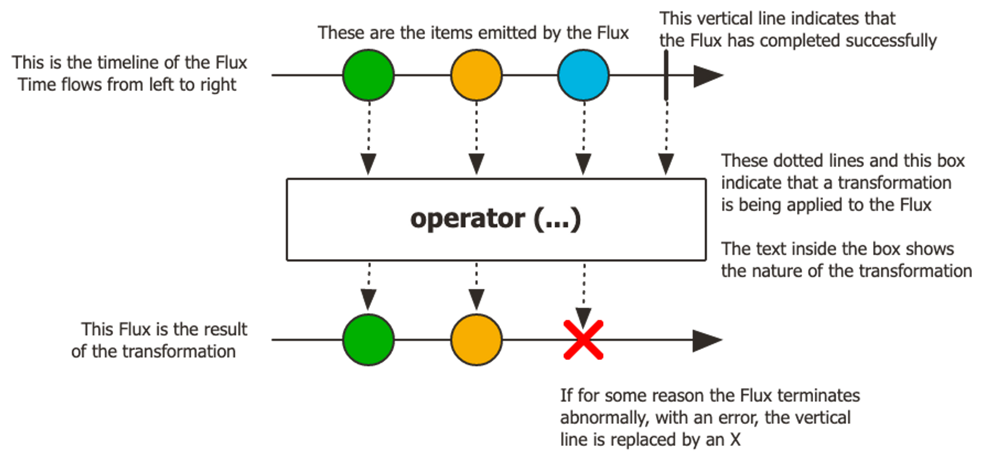
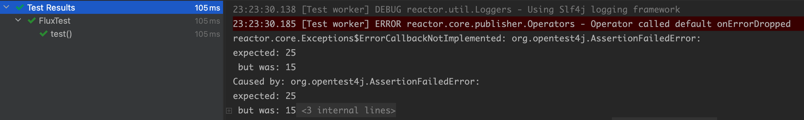

# 1. 리액터란?

리액터는 JVM위에서 동작하는 Non-Blocking 리액티브 프로그래밍을 위한 라이브러리로 Reactive Stream의 구현체입니다. 잘 알려진 Reactive Stream의 구현체로는 RxJava도 존재합니다. 하지만 이 두가지 구현체 중 리액터를 학습하는 이유는 간단합니다. 바로 Spring Framework5부터 스프링은 리액티브 프로그래밍을 위해 버전 5부터 리액터를 공식적으로 지원한다는 이유만으로도 리액터는 충분히 배울만한 가치가 있다 생각합니다.

## 1.1. 사용 준비하기

리액터의 사용을 위해서는 자바 8 이상의 버전과 함께 아래의 두 의존성을 추가하면 됩니다.

> 리액터는 Java8의 API들을 사용함으로 자바 8이상에서만 동작합니다.
>

```xml
<dependency>
    <groupId>io.projectreactor</groupId>
    <artifactId>reactor-core</artifactId>
</dependency>
```

```xml
<dependency>
    <groupId>io.projectreactor</groupId>
    <artifactId>reactor-test</artifactId>
    <scope>test</scope>
</dependency>
```

# 2. Mono와 Flux

리액터는 리액티브 스트림의 `Publish` 인터페이스를 구현한 리액티브 타입인 `Mono`, `Flux`을 제공하고 있습니다. 둘의 차이는 가질 수 있는 데이터의 수의 차이가 있습니다. `Mono`는 하나(0~1)의 데이터 항목만을 가질 수 있으며 `Flux`는 다수(0~N)의 데이터를 갖는 파이프라인을 나타냅니다.



리액티브 프로그래밍은 기본적으로 여러개의 Operator들로 이루어진 하나의 Pipeline을 만들어 제공해야 합니다. 리액터의 `Mono`와 `Flux`에는 500개 이상의 생성(Creation), 조합(Combination), 변환(Transformation), 로직(Logic) 오퍼레이터(Operator)들을 제공하고 있습니다. **우리는 이러한 오퍼레이터들을 잘 조합해 하나의 Stream을 만들면 됩니다.** 리액터가 제공하는 오퍼레이터의 양이 너무 방대하여 해당 게시글에서는 제가 학습하면서 헷갈렸던 몇가지 연산자들만 예시로 살펴보겠습니다. 그 외의 여러 연산자는 아래의 Flux, Mono의 문서를 통해 확인하실 수 있습니다. 문서에는 각각의 오퍼레이터마다 마블 다이어그램(marble diagrams)을 포함한 자세한 설명이 나와있어 쉽게 이해하실 수 있습니다.

> Flux, Mono의 연산자들
>
>
> [Flux (reactor-core 3.5.3)](https://projectreactor.io/docs/core/release/api/reactor/core/publisher/Flux.html)
>
> [Mono (reactor-core 3.5.3)](https://projectreactor.io/docs/core/release/api/reactor/core/publisher/Mono.html)
>

> 마블 다이어그램을 읽는 법을 잘 모르겠다면 아래의 링크를 통해 학습하시면 됩니다.
>
>
> [Reactor 3 Reference Guide](https://projectreactor.io/docs/core/release/reference/#howtoReadMarbles)
>

## 2.1. Cold & Hot

오퍼레이터들을 살펴보기 전에 리액터의 Hot & Cold의 개념에 대해 먼저 살펴보겠습니다. 리액터를 처음 접하였을 때 필요한 지식은 오퍼레이터의 종류가 우선적이긴한데, 알아두면 좋은 개념이라 간단히 추가를 해봤습니다.

리액터에서 Publisher는 데이터의 생성 시점, 생성양에 따라 Hot과 Cold 두 종류로 나눌 수 있습니다.

- Cold Publisher는 각각의 Subscription에 대해 새로운 데이터를 생성(발행)하는 Publisher입니다. 구독이 발생하기 전까지는 데이터 생성이 발생하지 않다가 구독이 발생한 이후에 데이터를 생성하게 됩니다. 덕분에 구독자는 구독하는 시점과 상관 없이 데이터를 처음부터 전달 받을 수 있습니다.

  > 대부분의 Publisher는 Cold입니다.
>
- Hot Publisher는 Cold와 다르게 데이터를 한 번만 생성합니다. 그 결과 Subscriber들은 매번 새로운 데이터가 아닌 동일한 데이터를 받게 됩니다. 그 결과 구독하는 시점에 따라 전달받지 못하는 데이터가 발생할 수 있습니다. 대표적인 예로는 `just`가 있습니다.

Cold Publisher라고 Cold로만 사용하고 Hot Publisher라고 Hot으로만 사용할 수 있는 것은 아닙니다. 두 종류는 서로 변환을 할 수 있습니다. Hot에서 Cold로 변환하려면 `defer` 을 사용하면 되며 Cold에서 Hot으로의 변환은 `share()`, `replay()`를 통해 변환할 수 있습니다.

# 3. 학습하며 헷갈렸던 Mono, Flux의 Operator

## 3.1.  `map` va `flatMap`

map과 flatMap은 이름도 비슷하고 둘 다 스트림 중간에 값을 변환하는 역할을 합니다. 두 Operator는 리액터를 통한 개발을 진행하며 가장 많이 사용하는 Operator이기도 합니다. 먼저 각각의 Operator에 대해 살펴보겠습니다.

### map

`map()`은 방출된 아이템들을 각각 **동기적인 함수**를 적용해 Object로 반환을 합니다. 변환 동작은 하나의 Stream 내에서 이루어지게 됩니다.

```java
val numbers = Flux.just(1, 2, 3)

numbers.map { i -> i + 10 }
    .subscribe { println(it) }
```

### flatMap

`flatMap()`은 방출된 요소(element)를 동기적 또는 **비동기적으로** Publisher로 변환한 다음에 하나의 단일 Flux로 병합을 한 후에 인터리빙합니다. `flatMap`은 `map`과 다르게 비동기적으로 동작할 수 있으며 Object 타입이 아닌 Publisher 타입으로 변환합니다.

변환 과정에서는 내부적으로 N개의 스트림을 새로 생성하고 작업이 완료된 N개의 스트림을 하나의 스트림으로 병합하여 반환하게 됩니다.

```java
val numbers = Flux.just(1, 2, 3)

numbers.flatMap { i ->
    Flux.just(i + 10)
}.subscribe { println(it) }
```

위의 예시를 살펴보면 numbers는 flatMap 동작을 할 때 원소의 개수인 3개의 스트림을 새로 생성하여 비동기적으로 동작을 하고 그 후에 모든 동작이 완료되면 하나의 스트림으로 통합되어 결과가 만들어집니다. 병합을 할 때는 내부적으로 동작한 요소들이 도착한 순차적으로 병합되어 초기의 순서를 유지하지는 않습니다.

> 순서를 유지하려면 `flatMapSequential` 을 사용하면 됩니다.
>

## 3.2.  `doOnError` vs `onError~`

### doOnError

doOnError를 비롯한 `doOnNext`,  `doOnComplete`, `doOnSubscribe`, `doOnRequest`, `doOnCancel`는 sequence를 처리하며 데이터 자체에 영향을 주지 않고 부수 효과(side-effect)만을 위한 연산자입니다. 목적에 따라 다르지만 주로 로그를 남기거나 디버깅 용도로 사용되는 오퍼레이터입니다.

```java
flux.doOnError { e -> logger.error(e) }
```

### onError~

`onErrorReturn`, `onErrorResume`, `onErrorMap`는 문제가 발생하였을 때, 동작할 핸들러를 지정할 수 있다. 각각의 메서드를 사용하여 새로운 반환값을 지정할 수도 있고, 새로운 동작, 또는 다른 flux로 변환하여 보낼 수 있다.

## 3.3.  `defaultIfEmpty` vs `switchIfEmpty`

두 오퍼레이터 모두 이름을 보면 알 수 있듯이 Flux, Mono 타입의 스트림이 비어있을 때 동작을 하게 된다. 하지만 동작하는 측면에서 살짝 다른 점이 존재한다.

### defaultIfEmpty

`defaultIfEmpty`는 스트림이 비어있을 경우 아래와 같이 특정 값을 반환합니다.

```java
Flux.empty<Int>()
    .defaultIfEmpty(3)
    .subscribe { println(it) }
```

### switchIfEmpty

`switchIfEmpty`는 `defaultIfEmpty`처럼 스트림이 비어있을 경우 특정 값을 반환하는데, 기본 값을 넣어서 반환하는 것이 아닌 새로운 Mono, Flux 스트림을 생성하여 바꿔줍니다.

```java
Flux.empty<Int>()
    .switchIfEmpty(Flux.just(3))
    .subscribe { println(it) }
```

즉, `defaultIfEmpty`는 새로운 값을 기존의 스트림에 넣어주는 것이고 `switchIfEmpty`는 새로운 스트림을 만들어 변환해주도록 동작합니다.

## 3.4.  `concat` vs `merge`

concat과 merge도 여러개의 스트림을 합치는 의미에서 동일한 역할을 합니다. 하지만 동작하는 순서 보장의 측면에서 차이점이 있습니다.

### concat

concat은 여러 스트림을 합칠 때, 순서대로 구독하여 방출되는 순서를 유지합니다.

```java
Flux.concat(
    Flux.just(1, 2, 3),
    Flux.just(4, 5, 6)
).subscribe { print("$it ") }
```

### merge

merge는 concat과 다르게 방출되는 순서를 유지하지 않습니다. 모든 스트림을 동시에 구독하고 들어오는 순서대로 요소들을 방출하여 순서가 보장되지 않은 상태의 결과값이 생성됩니다.

```java
Flux.merge(
    Flux.just(1, 2, 3),
    Flux.just(4, 5, 6)
).subscribe { print("$it ") }
```

# 4. 각각의 상황에 어떤 Operator를 사용해야 할까?

앞서 Mono와 Flux는 500개 이상의 Operator를 제공한다고 언급한바 있습니다. 리액터가 너무 많은 Operator가 존재하다보니 각각 상황별로 어떤 Operator를 사용해야할지 모를 때가 빈번하게 발생하곤 합니다. 이를 위해 리액터 공식 사이트에서는 [Appendix A: Which operator do I need?](https://projectreactor.io/docs/core/release/reference/#which-operator)라는 제목으로 상황별로 어떤 Operator를 사용하면 좋은지에 대한 가이드를 제공하고 있습니다. 개발을 진행하며 Operator 선택에 대한 고민이 든다면 해당 링크에 접속하여 고민을 해보는 것도 좋은 방법입니다.

> 영어로 만들어진 공식 문서를 보는 것에 부담이 있다면 제가 학습하면서 번역한 글을 봐주셔도 좋습니다.
>
>
> [[Reactor] 상황별 사용해야하는 Operator 정리](https://seongwon.dev/Spring-WebFlux/20230216-%EC%83%81%ED%99%A9%EB%B3%84_%EC%82%AC%EC%9A%A9%ED%95%B4%EC%95%BC%ED%95%98%EB%8A%94_Operator_%EC%A0%95%EB%A6%AC/)
>

# 5. 테스트하기

## 5.1. 기존의 테스트 방식

대부분의 사람들은 리액티브 프로그래밍을 하기 이전까지는 항상 동기 방식의 프로그래밍만을 진행하였고 테스트 코드 또한 동기 방식으로 진행하였을 것입니다. 하지만 과거에 작성해왔던 코드를 동기식으로 아무런 생각 없이 테스트 코드를 작성한다면 문제가 발생하게 됩니다. 코드로 한번 살펴보겠습니다.

```java
@Test
fun test() {
    val mono = Mono.just(5)
        .map { i -> i + 10 }

    val expected = 15
    mono.subscribe { i -> assertThat(i).isEqualTo(expected) }
}
```

비동기에 대한 생각 없이 위의 코드를 본다면 단순히 “5+10은 15이다!” 를 테스트 하는 것으로 아무런 문제가 없어 보입니다. 하지만 아래의 코드는 expected를 15가 아닌 다른 값으로 변경하여도 아무런 문제 없이 테스트가 통과하게 됩니다.



에러 로그를 보면 exception이 발생한 것을 확인할 수 있음에도 테스트가 통과한 이유는 Mono/Flux는 비동기 논블로킹으로 동작하기 때문입니다. 테스트를 실행하는 메인 스레드가 아닌 별도의 스레드에서 작업이 진행되다보니, Exception 발생은 테스트 메인 스레드가 종료된 이후에 발생하게 되어 테스트가 통과하게 되는 겁니다. 이 문제는 `CountDownLatch`를 통해 해결할 수도 있으며 Flux/Mono 타입의 오퍼레이터인 `block`을 통해서도 진행할 수 있습니다. 하지만 `CountDownLatch`를 사용해보신 분들은 알겠지만 하나의 테스트를 짜기 위해 `CountDownLatch` 인스턴스를 생성하고, iterator를 돌며 `latch.countDown()`을 진행해야하는 등의 부수적인 코드들을 많이 작성해야하는 불편함이 있습니다. Flux/Mono의 `block` 오퍼레이터도 비동기 논블록킹의 스트림을 테스트하는데 결국은 동기로 막아버리기 때문에 리액티브 프로그래밍을 하는 의미가 희미해지게 되는 것 같습니다. 또한 Mono값의 경우 단일 값이라 문제가 없지만 값이 여러개인 Flux 타입을 검증하려면 코드가 복잡해지기도 합니다.

## 5.2. StepVerifier

리액터는 이러한 불편함과 문제를 해결하며 데이터 스트림의 간편한 테스트를 위해 StepVerifier라는 테스트 라이브러리를 제공하고 있습니다. StepVerifier는 값 검증, 예외, 완료 검증 등 많은 검증 기능들을 제공하고 있으며 JUnit과 함께 활용하면 보다 많은 테스트를 진행할 수 있습니다.

### 5.2.1. StepVerifier 사용하기

StepVerifier객체는 Mono/Flux 타입의 스트림을 `StepVerifier.create()`에 인자로 넘겨주며 생성할 수 있습니다.

> 코틀린의 경우 `StepVerifier.create()`를 호출하지 않고 Mono/Flux 타입에 확장 함수인 `.test()` 를 붙이면 StepVerifier객체를 생성할 수 있습니다.
>
>
> ```java
> fun <T> Mono<T>.test(): StepVerifier.FirstStep<T> = StepVerifier.create(this)
> ```
>

StepVerifier객체가 생성되었다면 아래와 같이 StepVerifier가 제공하는 API를 통해 체이닝을 하며 결과 값을 검증한다거나 최종적으로 어떤 Subscriber의 메서드가 실행되었는지 테스트를 진행할 수 있습니다. 참고로 메서드 체이닝 마지막 부분에는 `.verify()`, `.verifyComplete()`과 같이 verify라는 prefix가 붙은 이름의 메서드를 호출하여야지 해당 스트림을 구독 및 테스트하게 됩니다.

```java
@Test
fun saveProduct() {
    val product = Product("딸기 우유", 1_300, 200)
    val productMono = productRepository.save(product)

    productMono.test()
        .assertNext {
            assertThat(it.id).isNotNull()
        }.verifyComplete()
}
```

위의 테스트 예시는 Product 객체를 repository에 저장을 하였을 때, 정상적으로 저장되어 id를 할당받았는지를 체크 후, 이후에 `onComplete()` 메서드가 호출되었는지 검증하는 테스트 코드입니다.

# 📚Reference
- [Reactor 3 Reference Guide](https://projectreactor.io/docs/core/release/reference/)
- [Project Reactor: map() vs flatMap() | Baeldung](https://www.baeldung.com/java-reactor-map-flatmap)
- [Flux (reactor-core 3.5.2)](https://projectreactor.io/docs/core/release/api/reactor/core/publisher/Flux.html#map-java.util.function.Function-)
- [Mono (reactor-core 3.5.3)](https://projectreactor.io/docs/core/release/api/reactor/core/publisher/Mono.html)
- [Reactor map, flatMap method는 언제 써야할까?](https://luvstudy.tistory.com/95)
