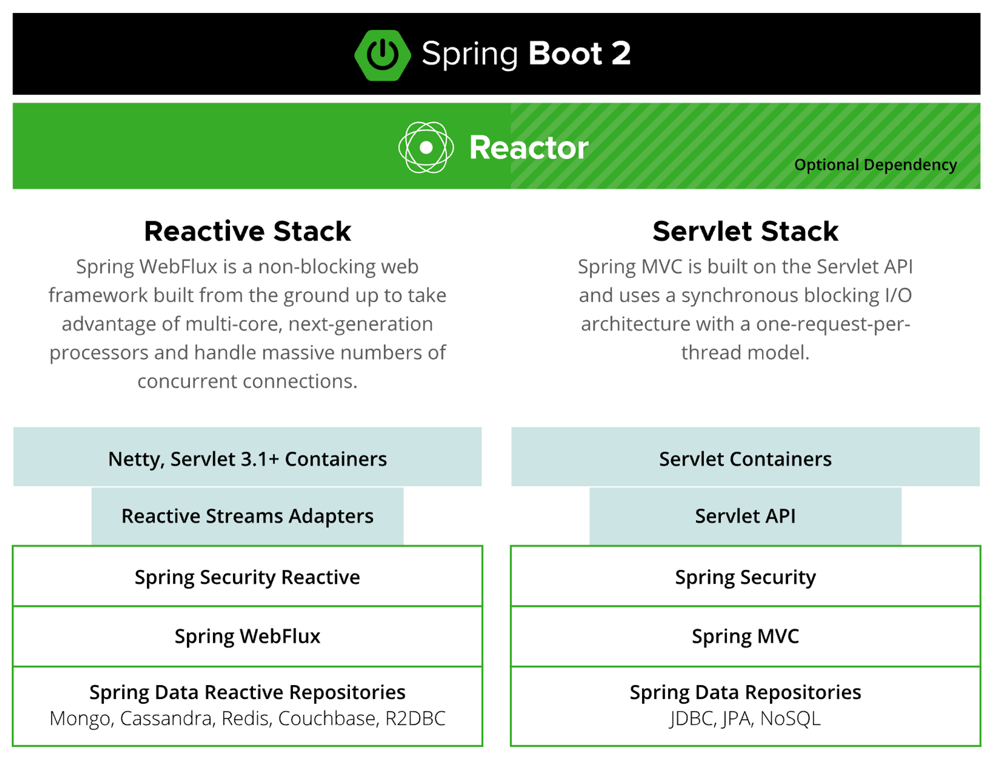
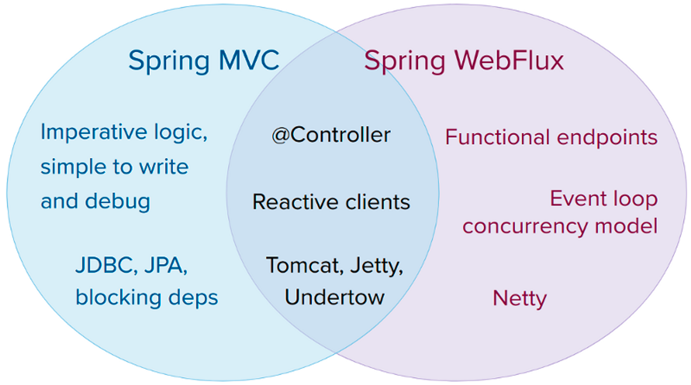

# 1. 비동기 웹 프레임워크의 장점 (Feat. Spring MVC의 한계)

Spring MVC와 같이 서블릿 기반의 웹 프레임워크는 매 연결마다 하나의 스레드를 사용하여 요청이 처리될 때, 작업 스레드가 종료될 때까지 요청 스레드를 잡고 있습니다. 내부적으로만 요청을 처리한다면 스레드의 낭비가 발생하지 않겠지만, 대부분의 API들은 요청을 처리하기 위해 데이터베이스를 접근하거나 외부 API를 호출하여 응답을 만들어 반환하게 됩니다. 이와 같은 작업들을 수행할 때는 스레드의 블로킹(blocking)가 발생하게 되며 CPU도 스레드가 대기 상태에 있는 동안 다른 스레드의 작업을 처리하기 위해 컨텍스트 스위칭을 빈번하게 할 것입니다. 또한 작업 스레드가 스레드 풀로 반환되어 다른 요청의 처리를 준비하는데 많은 시간이 걸린다는 낭비도 발생하게 됩니다. 이러한 이유 때문에 MVC는 요청량의 증가에 따른 확장이 어렵다는 문제가 발생하게 됩니다. Spring MVC와 다르게 비동기 웹 프레임워크는 적은 수의 스레드로 더 높은 확장성을 달성할 수 있습니다.

비동기 웹 프레임워크는 일반적으로 **CPU 코어당 하나의 스레드**를 만들어 사용하여도 **이벤트 루핑(Event Looping)기법** 덕분에 한 스레드당 많은 요청을 처리할 수 있어 Connection별 소모 비용이 적습니다. 이벤트 루프에서는 데이터베이스와 네트워크 작업 등 모든 작업을 이벤트로 처리합니다. 비용이 드는 작업이 필요할 때는 해당 작업의 콜백(call back)을 등록하여 병행으로 수행하고 다른 이벤트로 넘어가며 작업이 완료되었을 때도 이벤트로 처리하는 등 모든 동작을 이벤트로 처리합니다. 비동기 웹 프레임워크는 이러한 이벤트루프 덕분에 적은 양의 스레드로 많은 요청을 처리할 수 있어 스레드의 관리 부담이 줄고 확장성이 높다는 장점이 있습니다.

# 2. Spring WebFlux란?

Spring WebFlux는 [리액터(Reactor)](https://github.com/reactor/reactor)를 기반으로한 스프링의 리액티브 웹 프레임워크로 Spring 5.0부터 해당 기능을 제공하고 있습니다. spring.io에서 언급하는 WebFlux 방식을 개발한 이유는 2가지 이유가 있습니다.

1. 스프링도 적은 스레드로 동시성을 제어하고 적은 하드웨어 리소스로 확장성을 얻기 위해 논블로킹 웹 스택이 필요했다. 물론 기존에 서블릿 3.1이 논블로킹 I/O를 위한 API를 제공였으나 MVC의 동기 처리나 블로킹 방식을 쓰는 API를 함께 사용하기 어렵기에 논블로킹에 잘 동작하는 환경인 서버를 위한 API가 필요했다.
2. 자바 8에서 람다가 추가되며 함수형 프로그래밍이 가능해지며 논블로킹 애플리케이션을 만들거나 비동기 로직을 선언적으로 작성할 수 있게 되었다.

이러한 두 가지 이유로 스프링은 새로운 프로젝트인 WebFlux를 개발하게 되었다 합니다.

> 💡 Reactor는 Java 기반의 논블로킹 리액티브 프로그래밍을 위한 라이브러리입니다. Mono, Flux의 데이터 타입을 제공하여 데이터 시퀀스에서 다양한 연산을 할 수 있는 기능을 제공하고 있습니다.
>
>
> Reactor에 대해 더 자세히 알고 싶다면 아래의 링크를 참고해주시기 바랍니다.
>
> - [Reactor란?](https://seongwon.dev/Spring-WebFlux/20230217-Reactor%EB%9E%80/)
>

## 2.1. WebFlux의 특징

WebFlux에 대해 더 자세한 설명을 하기 앞서 MVC와 WebFlux의 기술 스텍에 대해 설명하는 이미지 2장을 살펴보겠습니다. 이미지에서 눈여겨 볼 것은 `MVC, WebFlux가 공유하는 컴포넌트`, `동작하는 서버`, `적합한 Repository`가 있습니다.





**MVC와 공유하는 컴포넌트**

Spring WebFlux는 Spring MVC와는 분리된 프로젝트이지만 Spring MVC의 많은 핵심 컴포넌트들을 공유하고 있습니다. 이미지를 통해 알 수 있듯이 WebFlux는 MVC와 Spring Boot2의 스펙과 Reactor의 스펙들을 모두 공유하고 있으며 기존의 MVC의 컨트롤러 작성법과 동일하게 어노테이션 기반의 개발을 진행할 수 있습니다. 덕분에 MVC에 익숙한 개발자들이라면 WebFlux를 사용하기 위해 Reactor와 함수형 프로그래밍에 대한 학습이 필요할 뿐, 프레임워크에 대해 필요한 추가적인 학습량은 적다 생각합니다.

**동작하는 서버**

기존 MVC은 서블릿 API와 서블릿 컨테이너에 종속적인 프로젝트였습니다. 하지만 WebFlux는 MVC와 다르게 블로킹이 없는 어떤 웹 컨테이너에서도 실행될 수 있습니다. 이에는 서블릿 기반인 Tomcat, Jetty, 서블릿 3.1+ 컨테이너 외에도 서블릿 기반이 아닌 Netty, Undertow가 있습니다. 여러 서버중에서 Spring WebFlux는 보통 논블로킹에 많이 사용되고, 클라이언트와 서버 리소스를 공유할 수 있는 Netty를 기본 내장 서버로 사용합니다.

> 💡 Netty는 비동기적인 이벤트 중심의 서버 중 하나이며 Spring WebFlux와 같은 리액티브 웹 프레임워크에 잘 맞는 서버입니다.
>

**Reactive Repository**

WebFlux를 사용하여 상위 레이어에서 논블로킹을 프로그래밍을 하더라도 MVC에서 사용하는 Spring Data Repository의 JDBC, JPA를 통한 데이터베이스 접근 방식을 사용한다면, 접근하는 동안 블로킹(blocking)이 발생하게 됩니다. 이러한 기술을 리액티브 웹 프레임워크에 한다면 중간에 블로킹이 걸리게 되어 리액티브 프로그래밍을 하는 의미가 무색해집니다. Spring Data는 논블로킹으로 데이터베이스에 접근하는 리액티브 레포지토리(Reactive Repository) 기술을 제공하고 있습니다. 리액티브 레포지토리를 지원하는 데이터베이스로는 리액티브 프로그래밍 모델을 지원하는 MongoDB, Redis, Cassandra 등이 있으며, 이러한 데이터베이스와 리액티브 레포지토리를 사용하면 블로킹이 없이 완전한 비동기 논블로킹의 애플리케이션을 만들 수 있습니다.

> 💡 R2DBC는 MySQL과 같은 RDBMS에서 논블로킹 처리를 하도록 지원하는 Spring Data의 프로젝트입니다.
>

**Backpressure**

백프레셔는 리액티브 프로그래밍에서 가장 큰 특징으로 언급되는 기능입니다. 백프레셔는 데이터를 소비하는 컨슈머가 처리할 수 있는 만큼으로 전달 데이터를 제한하며 지나치게 빠른 데이터 소스로부터 데이터 전달의 폭주를 피할 수 있는 수단입니다. 논블로킹에선 프로듀서(Producer)의 속도가 컨슈머(Concumer)의 처리 속도를 압도하지 않도록 이벤트 속도를 제어해줘야 합니다.

WebFlux에서 사용하는 리액터의 뿌리인 [리액티브 스트림의 공식 문서](https://www.reactive-streams.org/)에는 첫 문단에 아래와 같은 정의가 있습니다.

> Reactive Streams is an initiative to provide a standard for asynchronous stream processing with non-blocking back pressure.
→ 리액티브 스트림은 논블로킹 백프레셔로 비동기 스트림을 처리하기 위한 표준을 제공한다.
>

즉, 리액티브 스트림은 백프레셔를 통한 비동기 컴포넌트간의 상호작용을 정의한 스펙으로 subscriber가 publisher의 데이터 생성 속도를 제어하는 것을 주 목적으로 갖고 있습니다. WebFlux는 이러한 리액티브 스트림 라이브러리인 리액터를 사용하여 모든 연산자는 논블로킹 백프레셔를 제공하고 있습니다.

## 2.2. WebFlux의 성능

속도 측면으로 비교하였을 때, WebFlux가 리액티브와 논블로킹을 사용한다고 MVC보다 무조건 빨라지는 것은 아닙니다. WebClient를 통해 외부 API를 병렬로 처리하는 것과 같이 특정 상황에서 속도가 빠를 수는 있지만 일반적으로는 논블로킹 방식이 더 많은 작업이 필요해 처리 시간이 증가할 수가 있습니다.

하지만 자원 사용 측면에서의 비교는 WebFlux가 확실한 이점을 갖고 있습니다. 블로킹이 발생할 수 있다는 특성을 갖고 요청별로 별도의 스레드를 사용하는 MVC에 비해 WebFlux는 이벤트루프 작업을 하는 작은 크기의 고정된 적은 양의 스레드와 메모리로 요청을 처리하기에 서비스를 확장하기 쉽다는 장점이 있습니다. 또한 고정된 자원으로 확장하기에 예측할 수 있어 부하속에서도 애플리케이션의 복원 능력이 좋다는 이점도 있습니다.

> 💡 참고로 WebFlux의 비동기-논블로킹 구조의 성능상의 이점은 블로킹 I/O를 제거하는 데서 나옵니다. 최적의 성능을 발휘하기 위해서는 데이터에 접근하는 Repository를 리액티브로 사용하며, WebClient를 통한 리액티브 원격 API 호출, 리액티브 지원 외부 서비스 이용, `@Async` 블로킹 I/O 등 코드에서 블로킹 작업이 발생하지 않도록 프로그래밍을 하는 것이 가장 중요합니다.
>

# 3. WebFlux 사용해보기

웹플럭스는 프로그래밍 방식으로 MVC와 같이 어노테이션 기반의 컨트롤러와 Functional Endpoint 방식을 지원합니다. 두 가지 방법을 간단히 살펴보면 아래와 같습니다.

- Annotated Controllers: Spring MVC와 동일하게 `spring-web` 모듈에 있는 어노테이션을 사용한다. MVC도 리액티브를 지원하기는 하여 둘의 차이점은 크게 없다. 하지만 WebFlux는 request body로 `Mono`/`Flux`와 같은 리액티브 인자를 받을 수 있다는 차이점이 있다.
- Functional Endpoint: 경량화된 람다 기반의 함수형 프로그래밍 모델로 요청을 해주는 라이브러리나 유틸리티의 모음이다. 즉, 함수형 프로그래밍으로 API를 생성하는 방법이다.

이 두 가지 방법을 각각 간단하게 살펴보겠습니다.

## 3.1. 의존성 추가하기

```yaml
dependencies {
    implementation 'org.springframework.boot:spring-boot-starter-webflux'
}
```

## 3.2. Annotated Controllers

어노테이션 기반의 컨트롤러 작성은 Spring MVC와 핵심 컴포넌트들을 공유하고 있기에 큰 차이가 별로 없습니다. 코드를 간단하게 살펴보겠습니다.

```java
@RestController
@RequestMapping(path = "/products")
public class ProductController {
  ...
  @GetMapping("{id}")
  public Product findProduct(@PathVariable Long id) {
    return productRepository.findById(id).block();
  }

  @GetMapping
  public Flux<Product> findProducts() {
    return productRepository.findAll().take(12);
  }

  @PostMapping(consumes = "application/json")
  @ResponseStatus(HttpStatus.CREATED)
  public Mono<Product> registerProduct(@RequestBody Produc product) {
    return productRepository.save(product);
  }
}
```

위의 코드를 통해 알 수 있듯이 어노테이션을 통한 WebFlux의 프로그래밍 방식은 MVC프로그래밍 방식과 다른 점을 찾기가 어렵습니다. 반환 타입이 `Mono`/`Flux`와 같은 리액티브 타입을 반환한다는 차이가 있다고 생각하실 수 있는데, 리액티브 타입의 반환은 MVC에서도 리액터를 사용할 수 있기에 똑같이 진행할 수 있습니다. 단, `Mono`/`Flux` 타입이 사용은 WebFlux는 요청이 이벤트 루프로 처리되지만 MVC는 다중 스레드에 의존하여 다수의 요청을 처리한다는 동작 측면에서의 차이가 존재하긴 합니다.

본론으로 돌아가자면, MVC와 WebFlux 모두 리액티브 타입와 리액티브 타입이 아닌 값을 모두 반환 값으로 가질 수 있습니다. 하지만 WebFlux의 경우 리액티브 타입이 아닌 타입들은 리액티브 오퍼레이션도 적용할 수 없고 프레임워크가 해당 값들을 여러 스레드에 걸쳐 분할 작업을 할 수도 없어 리액티브 타입인 `Mono`와 `Flux`타입으로 감싸주어 반환해주어야 리액티브 프로그래밍의 효과를 극대화할 수 있습니다.

MVC와 다른 점이 하나 존재하긴 합니다. 그것은 바로 Request Body에서 리액티브 타입으로 받는 것을 지원한다는 점입니다. MVC의 경우, 위의 코드와 가입력 값도 반환 값과 같이 `@RequestBody`로 객체를 받도록 구현하였습니다. 이와 같이 리액티브 타입이 아닌 객체로 받도록 구현하면 Request 객체를 `ObjectMapper`로부터 Request Body를 분석 후, 객체를 만들어지기까지 1번, Controller Method에서 Repository에 작업을 요청하고 응답이 오기까지 1번, 총 두 번의 블로킹이 발생하게 됩니다. WebFlux는 아래의 코드와 같이 Request Body로 리액티브 타입을 받을 수 있어 컨트롤러를 블로킹이 발생하지 않는 메서드로 만들 수 있습니다.

```java
@RestController
@RequestMapping(path = "/products")
public class ProductController {
  ...
  @PostMapping(consumes = "application/json")
  @ResponseStatus(HttpStatus.CREATED)
  public Mono<Product> registerProduct(@RequestBody Mono<Product> product) {
    return productRepository.save(product);
  }
}
```

> 💡 컨트롤러에 보면 `subscribe()`를 호출하지 않는 것을 확인할 수 있습니다. 이는 프레임워크가 호출해주기때문에 직접 호출할 필요가 없습니다.
>

> 💡 리액티브 웹 프레임워크의 장점을 극대화하려면 컨트롤러의 반환뿐만 아니라 Repository-Service, Service-Controller 사이의 통신도 리액티브 타입을 사용해야 합니다.
>

> 💡 리액티브 컨트롤러의 테스트는 `WebTestClient`를 통해 테스트할 수 있습니다.  자세한 내용은 공식 문서를 참고해주시기 바랍니다.
>

## 3.3. Functional Endpoints

WebFlux와 다르게 스프링 5는 함수형 프로그래밍 방식을 사용해 리액티브 API를 생성하는 방법도 제공하고 있습니다. Spring MVC의 어노테이션 방식에는 몇가지 불편한 점이 존재합니다.

1. 어노테이션 기반 프로그래밍은 “무엇을”하는지는 알지만 “어떻게” 하는지는 외부에 노출되지 않아 모델을 커스터마이징하거나 확장할 때 복잡해진다.
2. 어노테이션에 Break Point를 걸 수 없어서 디버깅을 하기 어렵다.
3. 스프링을 처음 접하는 개발자들은 Spring의 어노테이션 기반 구조에 대한 학습이 필요하다.

이러한 단점을 보완하기 위해 WebFlux에서 제공하는 새로운 프로그래밍 모델은 어노테이션을 사용하지 않고 요청을 핸들러 코드에 연관시켜 프레임워크보다는 라이브러리 형태로 사용하고 있습니다.

이러한 함수형 프로그래밍 모델의 API 작성에는 아래의 4가지 타입이 사용됩니다.

- `RequestPredicate`: 처리될 요청의 종류를 선언한다.
- `RouterFunction`: 일치하는 요청이 어떻게 핸들러에게 전달되어야 하는지를 선언한다.
- `ServerRequest`: HTTP 요청을 나타내며, 헤더와 몸체 정보를 사용할 수 있다.
- `ServerResponse`: HTTP 응답을 나타내며, 헤더와 몸체 정보를 포함한다.

```java
@Configuration
public class GreetingRouterFunctionConfig {
   ...
    @Bean
    public RouterFunction<?> greetingRouterFunction() {
        return route(GET("/hello"), request -> ok().body(just("Hello"), String.class))
                .andRoute(GET("/bye"), this::bye);
    }
   ...
}
```

사용 방법은 위의 클래스와 같이 `@Configuration`어노테이션을 붙은 클래스에 `RouterFunction<?>`타입을 반환하는 메서드를 `@Bean`으로 등록하고 `RouterFunctions`의 `route()` 메서드를 통해 생성할 API들을 만들면 됩니다.

```java
public abstract class RouterFunctions {
   ...
   public static <T extends ServerResponse> RouterFunction<T> route(
			RequestPredicate predicate, HandlerFunction<T> handlerFunction) {

		return new DefaultRouterFunction<>(predicate, handlerFunction);
	}
}
```

`RouterFunctions`의 `route()` 메서드의 파라미터는 `RequestPredicate`과 `HandlerFunction`를 받고 있습니다. `RequestPredicate` 에는 코드에서 볼 수 있듯이 처리될 요청의 종류를 대입하면 되며, `HandlerFunction`에는 해당 API가 호출되었을 때 동작하고 반환될 로직을 람다식 또는 메서드 참조를 통해 정의해주면 됩니다.

# 4. WebFlux..언제 도입해야할까?

WebFlux는 그럼 언제 도입하는게 좋을까요? “토비의 스프링”의 저자 이일민님은 아래의 상황에 경우 WebFlux의 도입을 고려해봐도 된다 하셨습니다.

- 100% 논블로킹 개발을 할 경우
- 업, 다운 스트리밍이 동시에 존재하고 백프레셔가 필요한 경우
- MSA와 같은 아키텍쳐 구조를 가져 서버 단에서 이벤트 방식으로 많은 동작이 있는 경우
- 본격적인 함수형 프로그래밍 모델을 구현하고 싶은 경우

사실 위의 내용 중에서 저에게 가장 와닿는 것은 MSA 아키텍처 구조인 것 같습니다. 최근 몇년간 MSA가 서버단 개발의 트랜드가 되어 많은 기업들이 모놀리틱 구조에서 MSA구조로 전환을 해왔습니다. MSA 구조에서는 비즈니스 기능들을 중심으로 서비스를 여러 컴포넌트로 분리하여 관리하기 때문에 사용자가 특정 API를 요청하였을 때, 요청을 처리하기 위해서는 컴포넌트 간에 유기적으로 수많은 API호출을 통해 데이터를 요청할 것입니다. 이때 사용하면 좋은 것이 바로 비동기 웹 프레임워크인 WebFlux라고 생각합니다. MSA 아키텍처에서 컴포넌트간의 통신을 할 때, 블로킹이 되는 낭비를 막을 수 있다는 이점만으로도 WebFlux를 도입하는 것은 큰 이점이 될 것 같습니다.

반대로 WebFlux를 사용하지 않는 것이 좋은 상황도 있습니다.

- WebFlux가 왜 필요한지 분명하게 모를 경우
- Spring MVC로 개발한 애플리케이션이 성능상에 아무런 문제가 없는 경우
- 블로킹이 서버, 코드, 라이브러리에 존재하는 경우

위의 세 가지 상황과 같이 현재의 애플리케이션에 불필요하게 새로운 기술을 도입한다거나 애플리케이션에 블로킹이 존재하여 리액티브의 장점을 살릴 수 없는 경우에는 WebFlux의 도입 및 전환에 대한 고민을 다시 한번 해보는 것이 좋습니다.
# 📚 Reference
- [Spring.io - WebFlux](https://docs.spring.io/spring-framework/docs/5.3.25/reference/html/web-reactive.html#webflux)
- [Spring in Action(도서)](https://search.shopping.naver.com/book/catalog/32441616013?cat_id=50010920&frm=PBOKPRO&query=%EC%8A%A4%ED%94%84%EB%A7%81+%EC%9D%B8+%EC%95%A1%EC%85%98&NaPm=ct%3Dlda9nxco%7Cci%3Dd906c43162d8f7ea0058b5d8256de70e78a43e28%7Ctr%3Dboknx%7Csn%3D95694%7Chk%3D2751d7b7f4d90950bf02e054abfb3a756da88fab)
- [스프링5 웹플럭스와 테스트 전략](https://tv.kakao.com/channel/3150758/cliplink/391418995)
- [reactive-streams](https://www.reactive-streams.org/)

