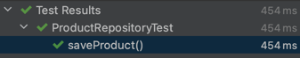

1월부터 3월까지 네이버 파이낸셜에서 인턴 근무를 하며 Kotlin, Spring WebFlux, Spring Cloud등 이전에 사용해보지 못 했던 기술들을 많이 접하고 단기간 많은 공부를 하며 성장을 하였습니다.

여러 기술을 학습하였으나 그중에서 개인적으로 WebFlux는 기술을 파면 팔 수록 WebFlux→Reactor→Reactive Stream, Backpressure와 같이 새로운 지식들이 나와 전반적인 흐름을 파악하기가 어려웠습니다.🥲

그래서 아직 WebFlux를 접해보지 않은 분들을 위해 Reactive Stream부터 Reactor, WebFlux까지 제가 학습하며 정리한 내용을 공유해보고자 합니다.

내용은 원래 각각의 주제별로 작성하였던 내용들이어서 주제가 바뀔 때마다 앞서 언급하였던 내용이 반복되어 나올 수 있습니다. 이 점은 양해해주셨으면 합니다.

만약 개별 게시글로 보고싶다면 아래에 링크를 첨부해둘테니 확인해주시기 바랍니다.

> 🔗 개별 게시글 링크
>
> - [리액티브 프로그래밍과 리액티브 스트림](https://seongwon.dev/Spring-WebFlux/20230120-Reactive-Programming/)
>
> - [Reactor란?](https://seongwon.dev/Spring-WebFlux/20230217-Reactor란/)
>
> - [WebFlux란?](https://seongwon.dev/Spring-WebFlux/20230219-WebFlux란/)


# 목차

1. 들어가며
2. 리액티브 프로그래밍과 스트림
   - 2.1. 리액티브 프로그래밍이란?
     - 명령형 프로그래밍 VS 리액티브 프로그래밍
   - 2.2. 리액티브 스트림이란?
     - Publisher, Subscriber, Subscription, Processor 인터페이스 살펴보기
   - 2.3. 코드로 리액티브 스트림 인터페이스 동작 살펴보기
3. 리액터 
   - 3.1. 리액터란? 
     - 3.1.1. 사용 준비하기
   - 3.2. Mono와 Flux 
     - 3.2.1. Cold & Hot
   - 3.3. 학습하며 헷갈렸던 Mono, Flux의 Operator
     - 3.3.1. map vs flatMap
     - 3.3.2. doOnError vs onError~
     - 3.3.3. defaultIfEmpty vs switchIfEmpty
     - 3.3.4. concat vs merge
   - 3.4. 각각의 상황에서 어떤 Operator를 사용해야 할까?
   - 3.5. 테스트하기
     - 3.5.1. 기존의 테스트 방식
     - 3.5.2. StepVerifier

4. WebFlux란?
   - 4.1. 비동기 웹 프레임워크의 장점(Feat. Spring MVC의 한계)
   - 4.2. Spring WebFlux란?
     - 4.2.1. WebFlux의 특징
     - 4.2.2. WebFlux의 성능
   - 4.3. WebFlux 사용해보기
     - 4.3.1. 의존성 추가하기
     - 4.3.2. Annotated Controllers
     - 4.3.3. Functional EndPoints
   - 4.4. WebFlux..언제 도입해야할까?


# 1. 들어가며

목차를 보면 알 수 있듯이 진행 순서는 Reactive Stream으로 부터 시작하여 Reactor, WebFlux순으로 진행됩니다. 해당 개념에 대해 완전히 처음 접하시는 분들이 계실 수 있어서 간단한 플로우를 설명드리며 글을 시작하겠습니다.

Spring은 프레임워크가 크게 MVC와 WebFlux로 나뉘게 됩니다. 이 중에서 이번 글에서 다루는 **WebFlux는 비동기 웹 프레임워크**인데, 이는 **Reactor라는 리액티브 프로그래밍 전용 라이브러리를 기반으로 만들어졌습니다.** 즉, WebFlux를 사용하려면 Reactor라는 라이브러리를 사용하실 수 있어야 합니다. 하지만..여기서 또 Reactor 라이브러리에 대해 학습을 하다보면 **Reactor는 Reactive Stream의 구현체**라는 정보를 얻게되며 리액티브 스트림과 리액티브 스트림에서 제공하는 Publisher, Subscriber라는 개념들이 나오게 됩니다.

WebFlux를 사용함에 있어 Reactive Stream, Reactor의 개념은 필수적으로 알아야 하는 개념이기에 low level의 개념부터 순차적으로 글을 작성하였습니다.

# 2. 리액티브 프로그래밍과 스트림

## 2.1. 리액티브 프로그래밍이란?

Spring을 통한 백엔드 개발을 시작하게 된다면 대부분의 개발자들은 MVC를 통한 명령형 블로킹 코드로 개발을 진행할 것입니다. 블로킹 코드의 경우 데이터베이스의 접근, 또는 다른 API의 호출과 같은 작업을 진행한다면 해당 작업이 완료될 때까지 대기 상태로 기다리는 낭비가 발생하게 됩니다. 이러한 성능을 향상시키기 위해서는 스레드를 병렬로 만들어 동작시킬 수 있지만, 너무 많은 스레드가 생기게 되면 동시성을 관리하기가 어려워지는 문제점이 발생하게 됩니다. 이를 위해 만들어진 것이 리액티브 프로그래밍입니다. 리액티브 프로그래밍은 비동기, 논블로킹 방식으로 프로그래밍을 할 수 있어 리소스를 낭비 없이 효율적으로 사용할 수 있습니다.

명령형 프로그래밍과 리액티브 프로그래밍의 차이점을 간단히 정리하면 아래와 같습니다.

### 명령형 프로그래밍

- 순차적으로 실행된다.
- 이전 작업이 완전히 끝난 이후에 다음 작업이 한 번에 하나씩 실행된다.
- 데이터는 모아서 처리되고 이전 작업이 데이터 처리를 완전히 끝내야 다음 작업을 진행할 수 있다.

### 리액티브 프로그래밍

- 작업들을 병렬로 실행할 수 있다.
- 처리가 끝난 데이터를 다음 작업에 넘겨주고 다른 부분 집합의 데이터로 작업을 계속할 수 있다.
    - 사용 가능한 데이터가 있을 때마다 처리되므로 입력되는 데이터가 무한할 수 있고 동시에 여러 작업을 수행하여 더 큰 확장성을 얻게 해준다.
- 고수준이면서 동시성에 구애받지 않을 정도의 높은 수준으로 추상화한다.
- 쉽게 구성할 수 있고 가독성이 있다.
- 구독하기 전까지 아무일도 일어나지 않는다.
- `Backpressure`를 통해 컨슈머가 프로듀서로부터 데이터를 받는 속도를 조절할 수 있다.

  > **백프레셔란?**
  >
  >
  > 백프레셔는 리액티브 프로그래밍에서 가장 큰 특징으로 언급되는 기능입니다. 백프레셔는 데이터를 소비하는 컨슈머가 처리할 수 있는 만큼으로 전달 데이터를 제한하며 지나치게 빠른 데이터 소스로부터 데이터 전달의 폭주를 피할 수 있는 수단입니다.


## 2.2. 리액티브 스트림이란?

Java에서는 비동기 프로그래밍을 위해 `Callbacks`과 `Futures`를 제공하고 있습니다. 하지만 `Callbacks`은 조합하기 까다로워 유지보수하기 어려운 코드를 만들어내기 쉬우며 `Futures` 또한 `get()`메서드를 호출하면 블로킹이 된다는 문제 등과 함께 조합하여 사용하기에는 어려움이 있는 문제가 있습니다. 이러한 `Callbacks`과 `Futures`의 한계를 리액티브 프로그래밍에서는 `Publisher`-`Subscriber`의 쌍으로 해결하였습니다.

Publisher와 Subscriber에 대해 더 자세히 살펴보기 전에 먼저 [리액티브 스트림의 공식 문서](https://www.reactive-streams.org/)의 첫 문단을 살펴보겠습니다.

> Reactive Streams is an initiative to provide a standard for asynchronous stream processing with non-blocking back pressure.
→ 리액티브 스트림은 논블로킹 백프레셔로 비동기 스트림을 처리하기 위한 표준을 제공한다.
>

즉, 리액티브 스트림은 백프레셔를 통한 비동기 컴포넌트간의 상호작용을 정의한 스펙으로 subscriber가 publisher의 데이터 생성 속도를 제어하는 것을 주 목적으로 갖고 있습니다. 이러한 리액티브 스트림 패키지(`package org.reactivestreams;`)는 4개의 인터페이스인 `Publisher`(발행자), `Subscriber`(구독자), `Subscription`(구독), `Processor`(프로세서)를 제공하고 있습니다. 인터페이스의 이름으로 알 수 있듯이 Subscriber가 Publisher로부터 구독을 하게 된다면 데이터를 끌어서 받는 식으로 전반적인 플로우가 흘러가며 이 과정 속에서 백프레셔를 지원하게 됩니다.

### Publisher

Publisher는 `subscribe()`메서드를 제공하며 하나의 Subscriber당 하나의 발행 데이터를 생성하도록 동작합니다.

```java
public interface Publisher<T> {
    public void subscribe(Subscriber<? super T> s);
}
```

### Subscriber

Subscriber는 구독이 신청되면 Publisher로부터 Subscription을 통해 이벤트를 수신받을 수 있습니다.

```java
public interface Subscriber<T> {
    public void onSubscribe(Subscription s);

    public void onNext(T t);

    public void onError(Throwable t);

    public void onComplete();
}
```

- `onSubscribe()`: 해당 메서드는 Publisher로부터 Subscription객체를 받으며 호출됩니다. 그러면 Subscriber는 Subscription객체를 통해 구독을 관리할 수 있게 됩니다.
- `onNext();`: Subscriber의 데이터 요청이 완료되면 해당 메서드를 통해 Publisher로부터 스트림을 통해 데이터가 전달됩니다.
- `onError();`: `onNext()`를 통해 데이터가 전달되는 중 에러가 발생하면 해당 메서드가 호출됩니다.
- `onComplete();`: Publisher에서 전송할 데이터가 없고 더 이상의 데이터를 생성하지 않는다면 Publisher가 해당 메서드를 호출하여 작업이 끝났다고 Subscriber에게 알려줍니다.

### Subscription

```java
public interface Subscription {
    public void request(long n);

    public void cancel();
}
```

- `request();` : Subscriber가 Publisher에게 데이터를 요청하기 위해 사용되는 메서드입니다. Publisher에게 parameter로 입력하는 n개의 데이터를 요청한다는 의미를 갖습니다.

  > 매개변수를 통해 요청하는 데이터 수를 전달하며 Subscriber가 Publisher로부터 받는 데이터의 폭주를 막습니다. 즉, `requst();` 메서드를 통해 백프레셔를 갖게 됩니다.

- `cancel();`: Subscriber가 Publisher로부터 더 이상의 데이터를 수신하지 않고 구독(subscribe)을 취소하는 요청을 할 때 사용됩니다. 하지만 요청을 한다고 바로 구독이 취소되는 것이 아니라 이전에 요청한 데이터들은 계속 전송되고 구독 취소가 될 수 있습니다.

### Processor

Subscriber와 Publisher인터페이스를 결합하여 Subscriber의 역할로 데이터를 수신하고 처리하며, 그 후에 역할을 바꾸어 Publisher의 역할로 처리 결과를 자신의 Subscribr들에게 발행하는 방식으로 동작합니다.

```java
public interface Processor<T, R> extends Subscriber<T>, Publisher<R> {
}
```

> **자바 스트림과의 비교**
>
>
> 자바와 리액티브 스트림은 데이터로 작업하기 위한 api를 제공한다는 유사성이 있습니다. 하지만 자바의 스트림은 대개 동기화되어 있고 한정된 데이터로 작업을 수행하는 반면에 리액티브 스트림은 어떤 크기의 데이터셋이건 비동기 처리를 지원합니다. 그리고 백프레셔를 통해 데이터 폭주를 막으며 실시간으로 데이터를 처리한하는 특징도 있습니다.
>

## 2.3. 코드로 리액티브 스트림 인터페이스 동작 살펴보기

### Publisher

```java
import java.util.Arrays;

import org.reactivestreams.Publisher;
import org.reactivestreams.Subscriber;

public class MyPublisher implements Publisher<Integer> {

    Iterable<Integer> data = Arrays.asList(1, 2, 3, 4, 5, 6);

    @Override
    public void subscribe(Subscriber<? super Integer> s) {
        System.out.println("Publisher.subscribe() 실행");
        System.out.println("Publisher.subscribe() -> Subscription 객체 생성 완료");
        MySubscription subscription = new MySubscription(s, data);
        System.out.println("Publisher.subscribe() -> 생성한 Subscription를 인자로 사용하며 Subscriber의 onSubscribe()호출");
        s.onSubscribe(subscription);
        System.out.println("Publisher.subscribe() 종료");

    }
}
```

### Subscriber

```java
import org.reactivestreams.Subscriber;
import org.reactivestreams.Subscription;

public class MySubscriber implements Subscriber<Integer> {

    private Subscription subscription;
    private int bufferSize = 2;

    @Override
    public void onSubscribe(Subscription s) {
        System.out.println("Subscriber.onSubscribe() 실행");
        this.subscription = s;
        System.out.println("Subscriber.onSubscribe() -> 요청할 데이터 수를 인자로 전달하며 Subscription의 request()메서드 호출");
        subscription.request(bufferSize); // 백 프레셔 -> 소비자가 한번에 처리할 수 있는 개수를 요청
        System.out.println("Subscriber.onSubscribe() 종료");
    }

    @Override
    public void onNext(Integer integer) {
        System.out.println("Subscriber.onNext() 실행");
        System.out.println("onNext(): " + integer);

        bufferSize--;
        if (bufferSize == 0) {
            bufferSize = 2;
            subscription.request(bufferSize); // 데이터가 모두 소모되는 것을 확인하기 위해 추가한 코드.
        }
    }

    @Override
    public void onError(Throwable t) {
        System.out.println("구독 중 에러");
    }

    @Override
    public void onComplete() {
        System.out.println("==== 구독 완료 ====");
    }
}
```

### Subscription

```java
import java.util.Iterator;

import org.reactivestreams.Subscriber;
import org.reactivestreams.Subscription;

// 구독 정보(구독자, 어떤 데이터를 구독할지에 대한 정보를 갖고 있어야 한다.)
public class MySubscription implements Subscription {

    private final Subscriber subscriber;
    private final Iterator<Integer> data;

    public MySubscription(Subscriber subscriber, Iterable<Integer> data) {
        this.subscriber = subscriber;
        this.data = data.iterator();
    }

    @Override
    public void request(long n) {
        System.out.println("\nSubscription.request() 실행");
        while (n > 0) {
            if (data.hasNext()) {
                System.out.println("Subscription.request() -> 요청받은 데이터 수만큼 반환하지 않고, 현재 데이터가 존재하면 subscriber.onNext()호출");
                subscriber.onNext(data.next());
            } else {
                System.out.println("Subscription.request() -> 요청받은 데이터 수만큼 반환하지 않고, 현재 데이터가 존재하지 않으면 subscriber.onComplete()호출");
                subscriber.onComplete();
                break;
            }
            n--;
        }
    }

    @Override
    public void cancel() {

    }
}
```

### Application.main()

```java
public class Application {

    public static void main(String[] args) {
        MyPublisher publisher = new MyPublisher();
        MySubscriber subscriber = new MySubscriber();

        publisher.subscribe(subscriber);
    }
}
```

Publisher, Subscriber, Subscription인터페이스가 어떻게 동작하는지 더 편한 이해를 위해 구현한 코드를 작성해봤습니다. 위의 코드들을 작성하고 실행을 해본 결과는 아래와 같습니다. 위에서 인터페이스를 살펴보았듯이 Publisher의 `subscribe()`메서드는 Subscriber 구현체를 인자로 받아 실행되면 인자로 받은 Subscriber만을 위한 구독자료(Subscription)을 만들어 제공하게 됩니다.

Subscriber는 본인이 처리할 수 있는 양만큼의 데이터 수를 Subscription의 `request()`메서드의 인자로 전달하여 데이터 처리양을 조절할 수 있으며 `request()`메서드는 Subscriber의 `onNext()`메서드를 통해 데이터를 전달하게 됩니다. 또한 데이터를 모두 전달하였으면 `onComplete()`메서드를 호출하도록 동작하게 됩니다.

코드에서 다루지 않았지만 구독 중에 구독을 취소하고 싶다면 Subscription의 `cancel()`메서드가 호출될 것이고 에러가 발생한다면 Subscriber의 `onError()`메서드가 동작할 것입니다.

```java
Publisher.subscribe() 실행
Publisher.subscribe() -> Subscription 객체 생성 완료
Publisher.subscribe() -> 생성한 Subscription를 인자로 사용하며 Subscriber의 onSubscribe()호출
Subscriber.onSubscribe() 실행
Subscriber.onSubscribe() -> 요청할 데이터 수를 인자로 전달하며 Subscription의 request()메서드 호출

Subscription.request() 실행
Subscription.request() -> 요청받은 데이터 수만큼 반환하지 않고, 현재 데이터가 존재하면 subscriber.onNext()호출
Subscriber.onNext() 실행
onNext(): 1
Subscription.request() -> 요청받은 데이터 수만큼 반환하지 않고, 현재 데이터가 존재하면 subscriber.onNext()호출
Subscriber.onNext() 실행
onNext(): 2

Subscription.request() 실행
Subscription.request() -> 요청받은 데이터 수만큼 반환하지 않고, 현재 데이터가 존재하면 subscriber.onNext()호출
Subscriber.onNext() 실행
onNext(): 3
Subscription.request() -> 요청받은 데이터 수만큼 반환하지 않고, 현재 데이터가 존재하면 subscriber.onNext()호출
Subscriber.onNext() 실행
onNext(): 4

Subscription.request() 실행
Subscription.request() -> 요청받은 데이터 수만큼 반환하지 않고, 현재 데이터가 존재하면 subscriber.onNext()호출
Subscriber.onNext() 실행
onNext(): 5
Subscription.request() -> 요청받은 데이터 수만큼 반환하지 않고, 현재 데이터가 존재하면 subscriber.onNext()호출
Subscriber.onNext() 실행
onNext(): 6

Subscription.request() 실행
Subscription.request() -> 요청받은 데이터 수만큼 반환하지 않고, 현재 데이터가 존재하지 않으면 subscriber.onComplete()호출
==== 구독 완료 ====
Subscriber.onSubscribe() 종료
Publisher.subscribe() 종료
```

# 3. 리액터

## 3.1. 리액터란?

리액터는 JVM위에서 동작하는 Non-Blocking 리액티브 프로그래밍을 위한 라이브러리로 Reactive Stream의 구현체입니다. 잘 알려진 Reactive Stream의 구현체로는 RxJava도 존재합니다. 하지만 이 두가지 구현체 중 리액터를 학습하는 이유는 간단합니다. 바로 Spring Framework5부터 스프링은 리액티브 프로그래밍을 위해 버전 5부터 리액터를 공식적으로 지원한다는 이유만으로도 리액터는 충분히 배울만한 가치가 있다 생각합니다.

### 3.1.1. 사용 준비하기

리액터의 사용을 위해서는 자바 8 이상의 버전과 함께 아래의 두 의존성을 추가하면 됩니다.

> 리액터는 Java8의 API들을 사용함으로 자바 8이상에서만 동작합니다.
>

```xml
<dependency>
    <groupId>io.projectreactor</groupId>
    <artifactId>reactor-core</artifactId>
</dependency>
```

```xml
<dependency>
    <groupId>io.projectreactor</groupId>
    <artifactId>reactor-test</artifactId>
    <scope>test</scope>
</dependency>
```

## 3.2. Mono와 Flux

리액터는 리액티브 스트림의 `Publish` 인터페이스를 구현한 리액티브 타입인 `Mono`, `Flux`을 제공하고 있습니다. 둘의 차이는 가질 수 있는 데이터의 수의 차이가 있습니다. `Mono`는 하나(0~1)의 데이터 항목만을 가질 수 있으며 `Flux`는 다수(0~N)의 데이터를 갖는 파이프라인을 나타냅니다.


리액티브 프로그래밍은 기본적으로 여러개의 Operator들로 이루어진 하나의 Pipeline을 만들어 제공해야 합니다. 리액터의 `Mono`와 `Flux`에는 500개 이상의 생성(Creation), 조합(Combination), 변환(Transformation), 로직(Logic) 오퍼레이터(Operator)들을 제공하고 있습니다. **우리는 이러한 오퍼레이터들을 잘 조합해 하나의 Stream을 만들면 됩니다.** 리액터가 제공하는 오퍼레이터의 양이 너무 방대하여 해당 게시글에서는 제가 학습하면서 헷갈렸던 몇가지 연산자들만 예시로 살펴보겠습니다. 그 외의 여러 연산자는 아래의 Flux, Mono의 문서를 통해 확인하실 수 있습니다. 문서에는 각각의 오퍼레이터마다 마블 다이어그램(marble diagrams)을 포함한 자세한 설명이 나와있어 쉽게 이해하실 수 있습니다.

> Flux, Mono의 연산자들
>
>
> - [Flux (reactor-core 3.5.3)](https://projectreactor.io/docs/core/release/api/reactor/core/publisher/Flux.html)
>
> - [Mono (reactor-core 3.5.3)](https://projectreactor.io/docs/core/release/api/reactor/core/publisher/Mono.html)
>

> 마블 다이어그램을 읽는 법을 잘 모르겠다면 아래의 링크를 통해 학습하시면 됩니다.
>
>
> - [Reactor 3 Reference Guide](https://projectreactor.io/docs/core/release/reference/#howtoReadMarbles)
>

### 3.2.1. Cold & Hot

오퍼레이터들을 살펴보기 전에 리액터의 Hot & Cold의 개념에 대해 먼저 살펴보겠습니다. 리액터를 처음 접하였을 때 필요한 지식은 오퍼레이터의 종류가 우선적이긴한데, 알아두면 좋은 개념이라 간단히 추가를 해봤습니다.

리액터에서 Publisher는 데이터의 생성 시점, 생성양에 따라 Hot과 Cold 두 종류로 나눌 수 있습니다.

- Cold Publisher는 각각의 Subscription에 대해 새로운 데이터를 생성(발행)하는 Publisher입니다. 구독이 발생하기 전까지는 데이터 생성이 발생하지 않다가 구독이 발생한 이후에 데이터를 생성하게 됩니다. 덕분에 구독자는 구독하는 시점과 상관 없이 데이터를 처음부터 전달 받을 수 있습니다.

  > 대부분의 Publisher는 Cold입니다.

- Hot Publisher는 Cold와 다르게 데이터를 한 번만 생성합니다. 그 결과 Subscriber들은 매번 새로운 데이터가 아닌 동일한 데이터를 받게 됩니다. 그 결과 구독하는 시점에 따라 전달받지 못하는 데이터가 발생할 수 있습니다. 대표적인 예로는 `just`가 있습니다.

Cold Publisher라고 Cold로만 사용하고 Hot Publisher라고 Hot으로만 사용할 수 있는 것은 아닙니다. 두 종류는 서로 변환을 할 수 있습니다. Hot에서 Cold로 변환하려면 `defer` 을 사용하면 되며 Cold에서 Hot으로의 변환은 `share()`, `replay()`를 통해 변환할 수 있습니다.

## 3.3. 학습하며 헷갈렸던 Mono, Flux의 Operator

### 3.3.1.  `map` va `flatMap`

map과 flatMap은 이름도 비슷하고 둘 다 스트림 중간에 값을 변환하는 역할을 합니다. 두 Operator는 리액터를 통한 개발을 진행하며 가장 많이 사용하는 Operator이기도 합니다. 먼저 각각의 Operator에 대해 살펴보겠습니다.

#### map

`map()`은 방출된 아이템들을 각각 **동기적인 함수**를 적용해 Object로 반환을 합니다. 변환 동작은 하나의 Stream 내에서 이루어지게 됩니다.

```kotlin
val numbers = Flux.just(1, 2, 3)

numbers.map { i -> i + 10 }
    .subscribe { println(it) }
```

#### flatMap

`flatMap()`은 방출된 요소(element)를 동기적 또는 **비동기적으로** Publisher로 변환한 다음에 하나의 단일 Flux로 병합을 한 후에 인터리빙합니다. `flatMap`은 `map`과 다르게 비동기적으로 동작할 수 있으며 Object 타입이 아닌 Publisher 타입으로 변환합니다.

변환 과정에서는 내부적으로 N개의 스트림을 새로 생성하고 작업이 완료된 N개의 스트림을 하나의 스트림으로 병합하여 반환하게 됩니다.

```kotlin
val numbers = Flux.just(1, 2, 3)

numbers.flatMap { i ->
    Flux.just(i + 10)
}.subscribe { println(it) }
```

위의 예시를 살펴보면 numbers는 flatMap 동작을 할 때 원소의 개수인 3개의 스트림을 새로 생성하여 비동기적으로 동작을 하고 그 후에 모든 동작이 완료되면 하나의 스트림으로 통합되어 결과가 만들어집니다. 병합을 할 때는 내부적으로 동작한 요소들이 도착한 순차적으로 병합되어 초기의 순서를 유지하지는 않습니다.

> 순서를 유지하려면 `flatMapSequential` 을 사용하면 됩니다.
>

### 3.3.2.  `doOnError` vs `onError~`

#### doOnError

doOnError를 비롯한 `doOnNext`,  `doOnComplete`, `doOnSubscribe`, `doOnRequest`, `doOnCancel`는 sequence를 처리하며 데이터 자체에 영향을 주지 않고 부수 효과(side-effect)만을 위한 연산자입니다. 목적에 따라 다르지만 주로 로그를 남기거나 디버깅 용도로 사용되는 오퍼레이터입니다.

```kotlin
flux.doOnError { e -> logger.error(e) }
```

#### onError~

`onErrorReturn`, `onErrorResume`, `onErrorMap`는 문제가 발생하였을 때, 동작할 핸들러를 지정할 수 있다. 각각의 메서드를 사용하여 새로운 반환값을 지정할 수도 있고, 새로운 동작, 또는 다른 flux로 변환하여 보낼 수 있다.

### 3.3.3.  `defaultIfEmpty` vs `switchIfEmpty`

두 오퍼레이터 모두 이름을 보면 알 수 있듯이 Flux, Mono 타입의 스트림이 비어있을 때 동작을 하게 된다. 하지만 동작하는 측면에서 살짝 다른 점이 존재한다.

#### defaultIfEmpty

`defaultIfEmpty`는 스트림이 비어있을 경우 아래와 같이 특정 값을 반환합니다.

```kotlin
Flux.empty<Int>()
    .defaultIfEmpty(3)
    .subscribe { println(it) }
```

#### switchIfEmpty

`switchIfEmpty`는 `defaultIfEmpty`처럼 스트림이 비어있을 경우 특정 값을 반환하는데, 기본 값을 넣어서 반환하는 것이 아닌 새로운 Mono, Flux 스트림을 생성하여 바꿔줍니다.

```kotlin
Flux.empty<Int>()
    .switchIfEmpty(Flux.just(3))
    .subscribe { println(it) }
```

즉, `defaultIfEmpty`는 새로운 값을 기존의 스트림에 넣어주는 것이고 `switchIfEmpty`는 새로운 스트림을 만들어 변환해주도록 동작합니다.

### 3.3.4.  `concat` vs `merge`

concat과 merge도 여러개의 스트림을 합치는 의미에서 동일한 역할을 합니다. 하지만 동작하는 순서 보장의 측면에서 차이점이 있습니다.

####concat

concat은 여러 스트림을 합칠 때, 순서대로 구독하여 방출되는 순서를 유지합니다.

```kotlin
Flux.concat(
    Flux.just(1, 2, 3),
    Flux.just(4, 5, 6)
).subscribe { print("$it ") }
```

#### merge

merge는 concat과 다르게 방출되는 순서를 유지하지 않습니다. 모든 스트림을 동시에 구독하고 들어오는 순서대로 요소들을 방출하여 순서가 보장되지 않은 상태의 결과값이 생성됩니다.

```kotlin
Flux.merge(
    Flux.just(1, 2, 3),
    Flux.just(4, 5, 6)
).subscribe { print("$it ") }
```

## 3.4. 각각의 상황에 어떤 Operator를 사용해야 할까?

앞서 Mono와 Flux는 500개 이상의 Operator를 제공한다고 언급한바 있습니다. 리액터가 너무 많은 Operator가 존재하다보니 각각 상황별로 어떤 Operator를 사용해야할지 모를 때가 빈번하게 발생하곤 합니다. 이를 위해 리액터 공식 사이트에서는 [Appendix A: Which operator do I need?](https://projectreactor.io/docs/core/release/reference/#which-operator)라는 제목으로 상황별로 어떤 Operator를 사용하면 좋은지에 대한 가이드를 제공하고 있습니다. 개발을 진행하며 Operator 선택에 대한 고민이 든다면 해당 링크에 접속하여 고민을 해보는 것도 좋은 방법입니다.

> 영어로 만들어진 공식 문서를 보는 것에 부담이 있다면 제가 학습하면서 번역한 글을 봐주셔도 좋습니다.
>
>
> - [[Reactor] 상황별 사용해야하는 Operator 정리](https://seongwon.dev/Spring-WebFlux/20230216-%EC%83%81%ED%99%A9%EB%B3%84_%EC%82%AC%EC%9A%A9%ED%95%B4%EC%95%BC%ED%95%98%EB%8A%94_Operator_%EC%A0%95%EB%A6%AC/)
>

## 3.5. 테스트하기

### 3.5.1. 기존의 테스트 방식

대부분의 사람들은 리액티브 프로그래밍을 하기 이전까지는 항상 동기 방식의 프로그래밍만을 진행하였고 테스트 코드 또한 동기 방식으로 진행하였을 것입니다. 하지만 과거에 작성해왔던 코드를 동기식으로 아무런 생각 없이 테스트 코드를 작성한다면 문제가 발생하게 됩니다. 코드로 한번 살펴보겠습니다.

```kotlin
@Test
fun test() {
    val mono = Mono.just(5)
        .map { i -> i + 10 }

    val expected = 15
    mono.subscribe { i -> assertThat(i).isEqualTo(expected) }
}
```

비동기에 대한 생각 없이 위의 코드를 본다면 단순히 “5+10은 15이다!” 를 테스트 하는 것으로 아무런 문제가 없어 보입니다. 하지만 아래의 코드는 expected를 15가 아닌 다른 값으로 변경하여도 아무런 문제 없이 테스트가 통과하게 됩니다.


에러 로그를 보면 exception이 발생한 것을 확인할 수 있음에도 테스트가 통과한 이유는 Mono/Flux는 비동기 논블로킹으로 동작하기 때문입니다. 테스트를 실행하는 메인 스레드가 아닌 별도의 스레드에서 작업이 진행되다보니, Exception 발생은 테스트 메인 스레드가 종료된 이후에 발생하게 되어 테스트가 통과하게 되는 겁니다. 이 문제는 `CountDownLatch`를 통해 해결할 수도 있으며 Flux/Mono 타입의 오퍼레이터인 `block`을 통해서도 진행할 수 있습니다. 하지만 `CountDownLatch`를 사용해보신 분들은 알겠지만 하나의 테스트를 짜기 위해 `CountDownLatch` 인스턴스를 생성하고, iterator를 돌며 `latch.countDown()`을 진행해야하는 등의 부수적인 코드들을 많이 작성해야하는 불편함이 있습니다. Flux/Mono의 `block` 오퍼레이터도 비동기 논블록킹의 스트림을 테스트하는데 결국은 동기로 막아버리기 때문에 리액티브 프로그래밍을 하는 의미가 희미해지게 되는 것 같습니다. 또한 Mono값의 경우 단일 값이라 문제가 없지만 값이 여러개인 Flux 타입을 검증하려면 코드가 복잡해지기도 합니다.

### 3.5.2. StepVerifier

리액터는 이러한 불편함과 문제를 해결하며 데이터 스트림의 간편한 테스트를 위해 StepVerifier라는 테스트 라이브러리를 제공하고 있습니다. StepVerifier는 값 검증, 예외, 완료 검증 등 많은 검증 기능들을 제공하고 있으며 JUnit과 함께 활용하면 보다 많은 테스트를 진행할 수 있습니다.

#### 3.5.2.1. StepVerifier 사용하기

StepVerifier객체는 Mono/Flux 타입의 스트림을 `StepVerifier.create()`에 인자로 넘겨주며 생성할 수 있습니다.

> 코틀린의 경우 `StepVerifier.create()`를 호출하지 않고 Mono/Flux 타입에 확장 함수인 `.test()` 를 붙이면 StepVerifier객체를 생성할 수 있습니다.
>
>
> ```java
> fun <T> Mono<T>.test(): StepVerifier.FirstStep<T> = StepVerifier.create(this)
> ```
>

StepVerifier객체가 생성되었다면 `assertNext()`, `exceptNext()`, `exceptError()`, `exceptNextCount()` 와 같이 StepVerifier가 제공하는 API를 통해 체이닝을 하며 결과 값을 검증한다거나 최종적으로 어떤 Subscriber의 메서드가 실행되었는지 테스트를 진행할 수 있습니다. 참고로 메서드 체이닝 마지막 부분에는 `.verify()`, `.verifyComplete()`과 같이 `verify`라는 prefix가 붙은 이름의 메서드를 호출하여야지 해당 스트림을 구독 및 테스트하게 됩니다.

> `verify()`는 `Duration`을 반환합니다. 해당 반환 값은 테스트를 수행하는데 걸린 시간 정보가 들어가있어 따로 확인하실 수도 있습니다.
>

repository를 통해 데이터를 저장하는 간단한 테스트 예시를 하나 살펴보겠습니다.

```java
@Test
fun saveProduct() {
    val product = Product("딸기 우유", 1_300, 200)
    val productMono = productRepository.save(product)

    productMono.test()
        .assertNext {
            assertThat(it.id).isNotNull()
        }.verifyComplete()
}
```

위의 예시는 Product 객체를 repository에 저장을 하였을 때, 정상적으로 저장되어 id를 할당받았는지를 체크 후, 이후에 `onComplete()` 메서드가 호출되었는지 검증하는 테스트 코드입니다. 테스트 수행 결과는 역시나 정상적으로 구동 되는 것을 확인할 수 있습니다.



# 4. WebFlux

## 4.1. 비동기 웹 프레임워크의 장점 (Feat. Spring MVC의 한계)

Spring MVC와 같이 서블릿 기반의 웹 프레임워크는 매 연결마다 하나의 스레드를 사용하여 요청이 처리될 때, 작업 스레드가 종료될 때까지 요청 스레드를 잡고 있습니다. 내부적으로만 요청을 처리한다면 스레드의 낭비가 발생하지 않겠지만, 대부분의 API들은 요청을 처리하기 위해 데이터베이스를 접근하거나 외부 API를 호출하여 응답을 만들어 반환하게 됩니다. 이와 같은 작업들을 수행할 때는 스레드의 블로킹(blocking)가 발생하게 되며 CPU도 스레드가 대기 상태에 있는 동안 다른 스레드의 작업을 처리하기 위해 컨텍스트 스위칭을 빈번하게 할 것입니다. 또한 작업 스레드가 스레드 풀로 반환되어 다른 요청의 처리를 준비하는데 많은 시간이 걸린다는 낭비도 발생하게 됩니다. 이러한 이유 때문에 MVC는 요청량의 증가에 따른 확장이 어렵다는 문제가 발생하게 됩니다. Spring MVC와 다르게 비동기 웹 프레임워크는 적은 수의 스레드로 더 높은 확장성을 달성할 수 있습니다.

비동기 웹 프레임워크는 일반적으로 **CPU 코어당 하나의 스레드**를 만들어 사용하여도 **이벤트 루핑(Event Looping)기법** 덕분에 한 스레드당 많은 요청을 처리할 수 있어 Connection별 소모 비용이 적습니다. 이벤트 루프에서는 데이터베이스와 네트워크 작업 등 모든 작업을 이벤트로 처리합니다. 비용이 드는 작업이 필요할 때는 해당 작업의 콜백(call back)을 등록하여 병행으로 수행하고 다른 이벤트로 넘어가며 작업이 완료되었을 때도 이벤트로 처리하는 등 모든 동작을 이벤트로 처리합니다. 비동기 웹 프레임워크는 이러한 이벤트루프 덕분에 적은 양의 스레드로 많은 요청을 처리할 수 있어 스레드의 관리 부담이 줄고 확장성이 높다는 장점이 있습니다.

## 4.2. Spring WebFlux란?

Spring WebFlux는  [리액터(Reactor)](https://github.com/reactor/reactor)를 기반으로한 스프링의 리액티브 웹 프레임워크로 Spring 5.0부터 해당 기능을 제공하고 있습니다. spring.io에서 언급하는 WebFlux 방식을 개발한 이유는 2가지 이유가 있습니다.

1. 스프링도 적은 스레드로 동시성을 제어하고 적은 하드웨어 리소스로 확장성을 얻기 위해 논블로킹 웹 스택이 필요했다. 물론 기존에 서블릿 3.1이 논블로킹 I/O를 위한 API를 제공였으나 MVC의 동기 처리나 블로킹 방식을 쓰는 API를 함께 사용하기 어렵기에 논블로킹에 잘 동작하는 환경인 서버를 위한 API가 필요했다.
2. 자바 8에서 람다가 추가되며 함수형 프로그래밍이 가능해지며 논블로킹 애플리케이션을 만들거나 비동기 로직을 선언적으로 작성할 수 있게 되었다.

이러한 두 가지 이유로 스프링은 새로운 프로젝트인 WebFlux를 개발하게 되었다 합니다.

> 💡 Reactor는 Java 기반의 논블로킹 리액티브 프로그래밍을 위한 라이브러리입니다. Mono, Flux의 데이터 타입을 제공하여 데이터 시퀀스에서 다양한 연산을 할 수 있는 기능을 제공하고 있습니다.
>
>
> Reactor에 대해 더 자세히 알고 싶다면 아래의 링크를 참고해주시기 바랍니다.
>
> - [Reactor란?](https://seongwon.dev/Spring-WebFlux/20230217-Reactor%EB%9E%80/)
>

### 4.2.1. WebFlux의 특징

WebFlux에 대해 더 자세한 설명을 하기 앞서 MVC와 WebFlux의 기술 스텍에 대해 설명하는 이미지 2장을 살펴보겠습니다. 이미지에서 눈여겨 볼 것은 `MVC, WebFlux가 공유하는 컴포넌트`, `동작하는 서버`, `적합한 Repository`가 있습니다.


**MVC와 공유하는 컴포넌트**

Spring WebFlux는 Spring MVC와는 분리된 프로젝트이지만 Spring MVC의 많은 핵심 컴포넌트들을 공유하고 있습니다. 이미지를 통해 알 수 있듯이 WebFlux는 MVC와 Spring Boot2의 스펙과 Reactor의 스펙들을 모두 공유하고 있으며 기존의 MVC의 컨트롤러 작성법과 동일하게 어노테이션 기반의 개발을 진행할 수 있습니다. 덕분에 MVC에 익숙한 개발자들이라면 WebFlux를 사용하기 위해 Reactor와 함수형 프로그래밍에 대한 학습이 필요할 뿐, 프레임워크에 대해 필요한 추가적인 학습량은 적다 생각합니다.

**동작하는 서버**

기존 MVC은 서블릿 API와 서블릿 컨테이너에 종속적인 프로젝트였습니다. 하지만 WebFlux는 MVC와 다르게 블로킹이 없는 어떤 웹 컨테이너에서도 실행될 수 있습니다. 이에는 서블릿 기반인 Tomcat, Jetty, 서블릿 3.1+ 컨테이너 외에도 서블릿 기반이 아닌 Netty, Undertow가 있습니다. 여러 서버중에서 Spring WebFlux는 보통 논블로킹에 많이 사용되고, 클라이언트와 서버 리소스를 공유할 수 있는 Netty를 기본 내장 서버로 사용합니다.

> 💡 Netty는 비동기적인 이벤트 중심의 서버 중 하나이며 Spring WebFlux와 같은 리액티브 웹 프레임워크에 잘 맞는 서버입니다.
>

**Reactive Repository**

WebFlux를 사용하여 상위 레이어에서 논블로킹을 프로그래밍을 하더라도 MVC에서 사용하는 Spring Data Repository의 JDBC, JPA를 통한 데이터베이스 접근 방식을 사용한다면, 접근하는 동안 블로킹(blocking)이 발생하게 됩니다. 이러한 기술을 리액티브 웹 프레임워크에 한다면 중간에 블로킹이 걸리게 되어 리액티브 프로그래밍을 하는 의미가 무색해집니다. Spring Data는 논블로킹으로 데이터베이스에 접근하는 리액티브 레포지토리(Reactive Repository) 기술을 제공하고 있습니다. 리액티브 레포지토리를 지원하는 데이터베이스로는 리액티브 프로그래밍 모델을 지원하는 MongoDB, Redis, Cassandra 등이 있으며, 이러한 데이터베이스와 리액티브 레포지토리를 사용하면 블로킹이 없이 완전한 비동기 논블로킹의 애플리케이션을 만들 수 있습니다.

> 💡 R2DBC는 MySQL과 같은 RDBMS에서 논블로킹 처리를 하도록 지원하는 Spring Data의 프로젝트입니다.
>

**Backpressure**

백프레셔는 리액티브 프로그래밍에서 가장 큰 특징으로 언급되는 기능입니다. 백프레셔는 데이터를 소비하는 컨슈머가 처리할 수 있는 만큼으로 전달 데이터를 제한하며 지나치게 빠른 데이터 소스로부터 데이터 전달의 폭주를 피할 수 있는 수단입니다. 논블로킹에선 프로듀서(Producer)의 속도가 컨슈머(Concumer)의 처리 속도를 압도하지 않도록 이벤트 속도를 제어해줘야 합니다.

WebFlux에서 사용하는 리액터의 뿌리인 [리액티브 스트림의 공식 문서](https://www.reactive-streams.org/)에는 첫 문단에 아래와 같은 정의가 있습니다.

> Reactive Streams is an initiative to provide a standard for asynchronous stream processing with non-blocking back pressure.
→ 리액티브 스트림은 논블로킹 백프레셔로 비동기 스트림을 처리하기 위한 표준을 제공한다.
>

즉, 리액티브 스트림은 백프레셔를 통한 비동기 컴포넌트간의 상호작용을 정의한 스펙으로 subscriber가 publisher의 데이터 생성 속도를 제어하는 것을 주 목적으로 갖고 있습니다. WebFlux는 이러한 리액티브 스트림 라이브러리인 리액터를 사용하여 모든 연산자는 논블로킹 백프레셔를 제공하고 있습니다.

### 4.2.2. WebFlux의 성능

속도 측면으로 비교하였을 때, WebFlux가 리액티브와 논블로킹을 사용한다고 MVC보다 무조건 빨라지는 것은 아닙니다. WebClient를 통해 외부 API를 병렬로 처리하는 것과 같이 특정 상황에서 속도가 빠를 수는 있지만 일반적으로는 논블로킹 방식이 더 많은 작업이 필요해 처리 시간이 증가할 수가 있습니다.

하지만 자원 사용 측면에서의 비교는 WebFlux가 확실한 이점을 갖고 있습니다. 블로킹이 발생할 수 있다는 특성을 갖고 요청별로 별도의 스레드를 사용하는 MVC에 비해 WebFlux는 이벤트루프 작업을 하는 작은 크기의 고정된 적은 양의 스레드와 메모리로 요청을 처리하기에 서비스를 확장하기 쉽다는 장점이 있습니다. 또한 고정된 자원으로 확장하기에 예측할 수 있어 부하속에서도 애플리케이션의 복원 능력이 좋다는 이점도 있습니다.

> 💡 참고로 WebFlux의 비동기-논블로킹 구조의 성능상의 이점은 블로킹 I/O를 제거하는 데서 나옵니다. 최적의 성능을 발휘하기 위해서는 데이터에 접근하는 Repository를 리액티브로 사용하며, WebClient를 통한 리액티브 원격 API 호출, 리액티브 지원 외부 서비스 이용, `@Async` 블로킹 I/O 등 코드에서 블로킹 작업이 발생하지 않도록 프로그래밍을 하는 것이 가장 중요합니다.
>

## 4.3. WebFlux 사용해보기

웹플럭스는 프로그래밍 방식으로 MVC와 같이 어노테이션 기반의 컨트롤러와 Functional Endpoint 방식을 지원합니다. 두 가지 방법을 간단히 살펴보면 아래와 같습니다.

- Annotated Controllers: Spring MVC와 동일하게 `spring-web` 모듈에 있는 어노테이션을 사용한다. MVC도 리액티브를 지원하기는 하여 둘의 차이점은 크게 없다. 하지만 WebFlux는 request body로 `Mono`/`Flux`와 같은 리액티브 인자를 받을 수 있다는 차이점이 있다.
- Functional Endpoint: 경량화된 람다 기반의 함수형 프로그래밍 모델로 요청을 해주는 라이브러리나 유틸리티의 모음이다. 즉, 함수형 프로그래밍으로 API를 생성하는 방법이다.

이 두 가지 방법을 각각 간단하게 살펴보겠습니다.

### 4.3.1. 의존성 추가하기

```yaml
dependencies {
    implementation 'org.springframework.boot:spring-boot-starter-webflux'
}
```

### 4.3.2. Annotated Controllers

어노테이션 기반의 컨트롤러 작성은 Spring MVC와 핵심 컴포넌트들을 공유하고 있기에 큰 차이가 별로 없습니다. 코드를 간단하게 살펴보겠습니다.

```java
@RestController
@RequestMapping(path = "/products")
public class ProductController {
    ...
    @GetMapping("{id}")
    public Product findProduct(@PathVariable Long id) {
        return productRepository.findById(id).block();
    }

    @GetMapping
    public Flux<Product> findProducts() {
        return productRepository.findAll().take(12);
    }

    @PostMapping(consumes = "application/json")
    @ResponseStatus(HttpStatus.CREATED)
    public Mono<Product> registerProduct(@RequestBody Produc product) {
        return productRepository.save(product);
    }
}
```

위의 코드를 통해 알 수 있듯이 어노테이션을 통한 WebFlux의 프로그래밍 방식은 MVC프로그래밍 방식과 다른 점을 찾기가 어렵습니다. 반환 타입이 `Mono`/`Flux`와 같은 리액티브 타입을 반환한다는 차이가 있다고 생각하실 수 있는데, 리액티브 타입의 반환은 MVC에서도 리액터를 사용할 수 있기에 똑같이 진행할 수 있습니다. 단, `Mono`/`Flux` 타입이 사용은 WebFlux는 요청이 이벤트 루프로 처리되지만 MVC는 다중 스레드에 의존하여 다수의 요청을 처리한다는 동작 측면에서의 차이가 존재하긴 합니다.

본론으로 돌아가자면, MVC와 WebFlux 모두 리액티브 타입와 리액티브 타입이 아닌 값을 모두 반환 값으로 가질 수 있습니다. 하지만 WebFlux의 경우 리액티브 타입이 아닌 타입들은 리액티브 오퍼레이션도 적용할 수 없고 프레임워크가 해당 값들을 여러 스레드에 걸쳐 분할 작업을 할 수도 없어 리액티브 타입인 `Mono`와 `Flux`타입으로 감싸주어 반환해주어야 리액티브 프로그래밍의 효과를 극대화할 수 있습니다.

MVC와 다른 점이 하나 존재하긴 합니다. 그것은 바로 Request Body에서 리액티브 타입으로 받는 것을 지원한다는 점입니다. MVC의 경우, 위의 코드와 가입력 값도 반환 값과 같이 `@RequestBody`로 객체를 받도록 구현하였습니다. 이와 같이 리액티브 타입이 아닌 객체로 받도록 구현하면 Request 객체를 `ObjectMapper`로부터 Request Body를 분석 후, 객체를 만들어지기까지 1번, Controller Method에서 Repository에 작업을 요청하고 응답이 오기까지 1번, 총 두 번의 블로킹이 발생하게 됩니다. WebFlux는 아래의 코드와 같이 Request Body로 리액티브 타입을 받을 수 있어 컨트롤러를 블로킹이 발생하지 않는 메서드로 만들 수 있습니다.

```java
@RestController
@RequestMapping(path = "/products")
public class ProductController {
    ...
    @PostMapping(consumes = "application/json")
    @ResponseStatus(HttpStatus.CREATED)
    public Mono<Product> registerProduct(@RequestBody Mono<Product> product) {
        return productRepository.save(product);
    }
}
```

> 💡 컨트롤러에 보면 `subscribe()`를 호출하지 않는 것을 확인할 수 있습니다. 이는 프레임워크가 호출해주기때문에 직접 호출할 필요가 없습니다.
>

> 💡 리액티브 웹 프레임워크의 장점을 극대화하려면 컨트롤러의 반환뿐만 아니라 Repository-Service, Service-Controller 사이의 통신도 리액티브 타입을 사용해야 합니다.
>

> 💡 리액티브 컨트롤러의 테스트는 `WebTestClient`를 통해 테스트할 수 있습니다.  자세한 내용은 공식 문서를 참고해주시기 바랍니다.
>

### 4.3.3. Functional Endpoints

WebFlux와 다르게 스프링 5는 함수형 프로그래밍 방식을 사용해 리액티브 API를 생성하는 방법도 제공하고 있습니다. Spring MVC의 어노테이션 방식에는 몇가지 불편한 점이 존재합니다.

1. 어노테이션 기반 프로그래밍은 “무엇을”하는지는 알지만 “어떻게” 하는지는 외부에 노출되지 않아 모델을 커스터마이징하거나 확장할 때 복잡해진다.
2. 어노테이션에 Break Point를 걸 수 없어서 디버깅을 하기 어렵다.
3. 스프링을 처음 접하는 개발자들은 Spring의 어노테이션 기반 구조에 대한 학습이 필요하다.

이러한 단점을 보완하기 위해 WebFlux에서 제공하는 새로운 프로그래밍 모델은 어노테이션을 사용하지 않고 요청을 핸들러 코드에 연관시켜 프레임워크보다는 라이브러리 형태로 사용하고 있습니다.

이러한 함수형 프로그래밍 모델의 API 작성에는 아래의 4가지 타입이 사용됩니다.

- `RequestPredicate`: 처리될 요청의 종류를 선언한다.
- `RouterFunction`: 일치하는 요청이 어떻게 핸들러에게 전달되어야 하는지를 선언한다.
- `ServerRequest`: HTTP 요청을 나타내며, 헤더와 몸체 정보를 사용할 수 있다.
- `ServerResponse`: HTTP 응답을 나타내며, 헤더와 몸체 정보를 포함한다.

```java
@Configuration
public class GreetingRouterFunctionConfig {
   ...
    @Bean
    public RouterFunction<?> greetingRouterFunction() {
        return route(GET("/hello"), request -> ok().body(just("Hello"), String.class))
                .andRoute(GET("/bye"), this::bye);
    }
   ...
}
```

사용 방법은 위의 클래스와 같이 `@Configuration`어노테이션을 붙은 클래스에 `RouterFunction<?>`타입을 반환하는 메서드를 `@Bean`으로 등록하고 `RouterFunctions`의 `route()` 메서드를 통해 생성할 API들을 만들면 됩니다.

```java
public abstract class RouterFunctions {
   ...
   public static <T extends ServerResponse> RouterFunction<T> route(
			RequestPredicate predicate, HandlerFunction<T> handlerFunction) {

		return new DefaultRouterFunction<>(predicate, handlerFunction);
	}
}
```

`RouterFunctions`의 `route()` 메서드의 파라미터는 `RequestPredicate`과 `HandlerFunction`를 받고 있습니다. `RequestPredicate` 에는 코드에서 볼 수 있듯이 처리될 요청의 종류를 대입하면 되며, `HandlerFunction`에는 해당 API가 호출되었을 때 동작하고 반환될 로직을 람다식 또는 메서드 참조를 통해 정의해주면 됩니다.

## 4.4. WebFlux..언제 도입해야할까?

WebFlux는 그럼 언제 도입하는게 좋을까요? “토비의 스프링”의 저자 이일민님은 아래의 상황에 경우 WebFlux의 도입을 고려해봐도 된다 하셨습니다.

- 100% 논블로킹 개발을 할 경우
- 업, 타운 스트리밍이 동시에 존재하고 백프레셔가 필요한 경우
- MSA와 같은 아키텍쳐 구조를 가져 서버 단에서 이벤트 방식으로 많은 동작이 있는 경우
- 본격적인 함수형 프로그래밍 모델을 구현하고 싶은 경우

사실 위의 내용 중에서 저에게 가장 와닿는 것은 MSA 아키텍처 구조인 것 같습니다. 최근 몇년간 MSA가 서버단 개발의 트랜드가 되어 많은 기업들이 모놀리틱 구조에서 MSA구조로 전환을 해왔습니다. MSA 구조에서는 비즈니스 기능들을 중심으로 서비스를 여러 컴포넌트로 분리하여 관리하기 때문에 사용자가 특정 API를 요청하였을 때, 요청을 처리하기 위해서는 컴포넌트 간에 유기적으로 수많은 API호출을 통해 데이터를 요청할 것입니다. 이때 사용하면 좋은 것이 바로 비동기 웹 프레임워크인 WebFlux라고 생각합니다. MSA 아키텍처에서 컴포넌트간의 통신을 할 때, 블로킹이 되는 낭비를 막을 수 있다는 이점만으로도 WebFlux를 도입하는 것은 큰 이점이 될 것 같습니다.

반대로 WebFlux를 사용하지 않는 것이 좋은 상황도 있습니다.

- WebFlux가 왜 필요한지 분명하게 모를 경우
- Spring MVC로 개발한 애플리케이션이 성능상에 아무런 문제가 없는 경우
- 블로킹이 서버, 코드, 라이브러리에 존재하는 경우

위의 세 가지 상황과 같이 현재의 애플리케이션에 불필요하게 새로운 기술을 도입한다거나 애플리케이션에 블로킹이 존재하여 리액티브의 장점을 살릴 수 없는 경우에는 WebFlux의 도입 및 전환에 대한 고민을 다시 한번 해보는 것이 좋습니다.

# 📚 Reference
- [Reactive Streams](https://www.reactive-streams.org/)
- [Reactor 3 Reference Guide](https://projectreactor.io/docs/core/release/reference/)
- [Flux (reactor-core 3.5.2)](https://projectreactor.io/docs/core/release/api/reactor/core/publisher/Flux.html#map-java.util.function.Function-)
- [Mono (reactor-core 3.5.3)](https://projectreactor.io/docs/core/release/api/reactor/core/publisher/Mono.html)
- [Project Reactor: map() vs flatMap() | Baeldung](https://www.baeldung.com/java-reactor-map-flatmap)
- [Reactor map, flatMap method는 언제 써야할까?](https://luvstudy.tistory.com/95)
- [Web on Reactive Stack](https://docs.spring.io/spring-framework/docs/5.3.25/reference/html/web-reactive.html#webflux)
- [3월 우아한 Tech 세미나 후기 | 우아한형제들 기술블로그](https://techblog.woowahan.com/2619/)
- [사용하면서 알게 된 Reactor, 예제 코드로 살펴보기](https://tech.kakao.com/2018/05/29/reactor-programming/#hot-cold-%EA%B0%9C%EB%85%90)
- [스프링5 웹플럭스와 테스트 전략](https://tv.kakao.com/channel/3150758/cliplink/391418995)
- [메타코딩 - Springboot-WebFlux 5강 - reactive streams](https://www.youtube.com/watch?v=6TiUCm3K_IE&list=PL93mKxaRDidFH5gRwkDX5pQxtp0iv3guf&index=6)
- [스프링 인 액션-크레이그 월즈](https://search.shopping.naver.com/book/catalog/32441616013?cat_id=50010920&frm=PBOKPRO&query=%EC%8A%A4%ED%94%84%EB%A7%81+%EC%9D%B8+%EC%95%A1%EC%85%98&NaPm=ct%3Dldd6rd20%7Cci%3Df076961ffc3dab854d41bc1cdeea73bfa8c0a8f1%7Ctr%3Dboknx%7Csn%3D95694%7Chk%3Df155b60e8553a8baef3d19bce28770da9fec5bfa)
