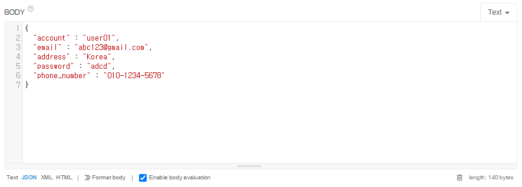

지난 GET API에 대해 공부한 것에 이어 오늘은 POST API에 대해 공부해보고자 한다.

먼저 POST API의 특징에 대해 알아보자

## POST API의 특징

- 리소스의 생성 및 추가하는 작업을 해주는 API이다.
- CRUD에서 C에 해당한다.
- POST Request를 반복한다면 데이터들은 계속 추가될 것이고 서버는 매번 다른 응답을 나타낼 것이다. 이때 응답이 같을 수도 있지만 응답이 같더라도 서로 다른 데이터기에 POST API는 멱등하지 않다.
- 또한 GET은 데이터를 읽어오기만 하여 안전성이 있었지만 POST의 경우는 데이터를 추가하며 조작하기에 안전성은 없다.
- Path Variable을 사용가능하다.
- Data Body를 사용 가능하다.

## 사용되는 Annotation의 종류

- **@RestController**
  - 해당 annotation을 추가해주면 해당 class는 REST API를 처리하는 controller로 등록이 된다.
- **@RequestMapping(path)**
  - 리소스를 설정하는 코드이며 괄호안에 입력하는 값에 따라 URI가 localhost:8080/path로 설정된다.
- **@PutMapping(path)**
  - POST API를 해당 URI로 mapping시켜준다.
- **@RequestBody**
  - Request body부분을 Parsing해준다.
- **@PathVariable**
  - 변화하는 구간에 사용하는 annotation이며 URL path를 parsing해준다.
- **@JsonProperty**
  - 지정한 변수에 대해 Snake case와 Camel case의 변수를 mapping해준다.
- **@JsonNaming**
  - 해당 Class 내에 있는 모든 변수에 대해 Snake case와 Camel case의 변수를 mapping해준다.

## POST API사용하기

### @PostMapping 사용하기

```java
@RestController
@RequestMapping("/api")
public class PostApiController {

    @PostMapping("/post")
    public void post(@RequestBody Map<String, Object> requestData){

        requestData.forEach((key, value) -> {
            System.out.println("key : " + key);
            System.out.println("value : " + value);
        });
    }
}
```

POST API도 GET API과 같이 parameter앞에 무언가를 붙여줘야한다. Get은 데이터를 읽어오기 위해 clinet에서 읽어오고자 하는 data의 parameter를 보내고 Server는 그것을 받기 위해 `@RequestParam`을 붙였다면 POST는 데이터를 생성하고 추가하기 위해 아래 사진과 같이 Json 또는 XML타입의 데이터를 Client에서 보내기 때문에 Post는 Data block을 받기 위해 `@RequestBody`를 붙여준다.



```java
@RestController
@RequestMapping("/api")
public class PostApiController {

    @PostMapping("/post1")
    public void post1(@RequestBody PostRequestDTO requestData){
        // get과 다르게 객체를 사용하여 받아와도 RequestBody를 입력해줘야한다.
        System.out.println(requestData);
    }
}
```

POST API도 Map형식 말고 DTO(class)를 통해 POST가 가능하다.
POST에서 객체를 사용하여 데이터를 받아올 때는 GET과 다르게 method parameter앞에 @RequestBody를 붙여줘야한다.

### @JsonProperty, @JsonNaming

단어 표현은 Snake case와 Camel Case를 가장 많이 사용한다.
**Snake case**는 단어의 구분을 \_(언더바)를 사용하여 구분하여 snake_case와 같이 표현을 하는 방법이다.
**Camel case**는 단어의 구분을 단어의 시작을 대문자로 만들어 구분을 하는 방법으로 camelCase와 같이 대문자로 구분을 하는 방법이다.

우리가 공부할 JSON과 spring boot의 Java는 대표적으로 사용하는 표현법이 서로 다르다. JSON의 경우는 Snake case를 주로 사용하며 Java에서는 Camel case를 주로 사용한다.

우리는 데이터를 원활하게 읽어오도록 구현하기 위해서는 snake case뿐만 아니라 camel case로도 parsing이 가능하도록 구현을 해야한다.

Spring boot에서는 `@JsonProperty`, `@JsonNaming`를 사용하면 쉽게 해결할 수 있다.

#### @JsonProperty사용하기

**PostRequestDTO.java**

```java
public class PostRequestDTO {

    private String account;
    private String email;
    private String address;
    private String password;
    private String phoneNumber;

    .....

}
```

**Request에 보내는 JSON**

```
{
  "account" : "user01",
  "email" : "abc123@gmail.com",
  "address" : "Korea",
  "password" : "adcd",
  "phone_number" : "010-1234-5678"
}
```

class내의 phoneNumber는 camel case로 생성되었다 하지만 request body에 담겨 보내지는 json에서는 phone_number와 같이 snake case로 key값이 정의되었다.
이러한 경우 request를 한다면 전화번호는 아래와 같이 null값이 출력될 것이다.

> **Result**
> PostRequestDTO{account='user01', email='abc123@gmail.com', address='Korea', password='adcd', phoneNumber='null'}

해결법 중 하나는 `@JsonProperty`을 이용해 다른 이름도 허용되도록 하는 것이다.
`@JsonProperty`는 OTP와 같이 camel도 아니고 snake도 아닌 애매한 것들은 JsonProperty("OTP")와 같은 것을 붙여 matching을 시켜주기도 한다.

```java
public class PostRequestDTO {

    private String account;
    private String email;
    private String address;
    private String password;

    @JsonProperty("phone_number")
    private String phoneNumber;

    .....

}
```

이와 같이 JsonProperty annotation을 통해 phoneNumber를 phone_number도 허용하게 한다면 null이었던 phoneNumber값이 정상적으로 출력되는 것을 확인할 수 있다.

> **Result**
> PostRequestDTO{account='user01', email='abc123@gmail.com', address='Korea', password='adcd', phoneNumber='010-1234-5678'}

#### @JsonNaming 사용하기

`@JsonProperty`는 변수 하나씩 지정해야하는 번거로움이 있다. `@JsonNaming`을 사용하면 class전체의 변수들을 camel case에서 snake case로 매칭시켜줄 수 있다.

```java
@JsonNaming(value = PropertyNamingStrategy.SnakeCaseStrategy.class)
public class PostRequestDTO {

    private String account;
    private String email;
    private String address;
    private String password;
    private String phoneNumber;

    .....

}
```
