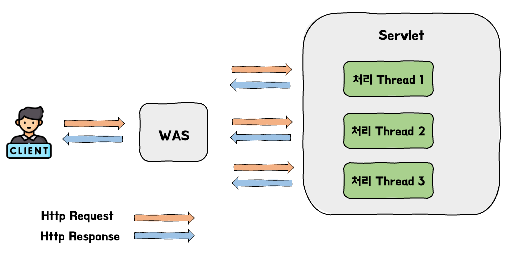

# 1. 정적/동적 웹 페이지

서블릿이 생겨난 이유를 타고 올라가보면 동적 웹 페이지라는 개념이 나오게 된다. 과거에는 동적 웝 페이지의 지원이 되지 않아 정적 웹 페이지만 지원되었다. 서블릿은 동적 웹 페이지를 지원하는 기술이다. 서블릿에 대한 자세한 이야기는 이후에 하도록 하고 먼저 정적, 동적 웹 페이지에 대해 알아보겠다.

## 1.1. 정적 페이지

정적 웹 페이지는 서버(Web Server)에 미리 저장된 파일(HTML, Image, JavaScript 등)이 그대로 전달되는 웹페이지를 의미한다. 그래서 모든 사용자는 서버에 저장되어있는 데이터들이 변경되지 않는 한 같은 결과의 페이지를 응답받게 된다. 예시를 들자면 아래의 구글 로그인 페이지는 어떤 클라이언트가 요청을 하더라도 같은 로그인 화면을 보여준다. 이러한 페이지를 정적 페이지라고 한다.

📌  구글 로그인 페이지도 로그인한 지역에 따라 다른 언어로 보여주는 등으로 동적으로 응답을 하는 동적 웹 페이지이다. 하지만 마땅한 예시 페이지를 생각하지 못하여 예시로 들게 되었다.


## 1.2. 동적 페이지

동적 페이지는 서버(Web Server)에 있는 데이터들을 스크립트에 의해 가공처리한 후 클라이언트에게 전송하는 웹페이지이다. 해당 페이지는 같은 페이지라도 사용자가 누구인지, 요청 시간이 언제인지 등에 따라 다른 결과의 웹 페이지를 응답받게 된다. 예를 들면 우리가 자주 사용하는 인스타그램, 페이스북, 유튜브 등은 로그인한 유저, 시간, 최근 본 영상들의 종류에 따라 내부적으로 알고리즘이 돌아가 다른 페이지를 보여주게 되는데 이러한 페이지들을 동적 웹 페이지라고 한다. 사실 우리가 보는 거의 모든 페이지들이 동적 웹 페이지일 것이다.


# 2. CGI

## 2.1. CGI란?

앞서 설명한 동적 웹 페이지를 보여주기 위해 처음 생겨난 것은 서블릿이 아닌 CGI(Common Gateway Interface)이다.

정적 웹 페이지만을 보여줄 수 있었던 웹 세계에서는 CGI가 생겨나면서 동적 웹 페이지들을 보여줄 수 있었다.

## 2.2. GCI의 동작 방식

1. Http Request가 웹 서버에 전달된다.
2. 웹 서버는 요청에 들어있는 주소가 CGI프로그램에 대응되는지 확인을 한다.
3. 대응되는 CGI 프로그램이 있다면 해당 프로그램을 실행하여 환경 변수와 [표준 입력 형태](https://www.w3.org/CGI/)로 요청을 전달한다.
4. 웹 서버는 CGI 프로그램이 표준 출력으로 돌려 보낸 내용을 그대로 돌려준다.

## 2.3. CGI의 단점

하지만 이러한 CGI는 몇가지 단점이 있었다. 가장 큰 단점으로는 웹 서버에 요청이 갔을 때 요청 처리를 프로세스를 만들어 사용하기에 처리 비용이 비싸다는 문제가 있었다. 또한 동일한 요청에도 이전 구현체의 재사용이 아닌 새로운 CGI 구현체를 생성하여 사용하여 낭비가 발생하였다.


# 3. Servlet

## 3.1. 서블릿이란? + CGI의 단점 보완

서블릿은 동적 웹 페이지(Dynamic Web Page)를 만들 때 사용되는 **자바 기반의 웹 애플리케이션 컴포넌트**이다. Servlet은 앞서 설명한 CGI의 단점들을 보완하며 나오게 되었다.

먼저 Servlet은 기존에 CGI에서 요청을 Process로 처리하던 방식을 Thread를 사용하도록 변경하였다. 기본적으로 Sevlet은 하나의 Process로 만들어지고 그 안에 Thread Pool을 만들어 Thread로 처리하도록 변경하였다.



또한 매번 새로운 구현체를 생성하여 요청을 처리하던 방식을 Singleton 패턴을 적용해 불필요한 구현체 생성을 없애고 동일한 구현체를 재사용하도록 자원의 사용량을 줄여 효율성을 높였다.

> 서블릿과 CGI는 CGI 규칙에 따라 데이터를 주고받는 것은 동일하다. 하지만 서블릿은 서블릿 컨테이너에게 요청 처리에 대한 작업을 위임을 하게 된다.

## 3.2. 서블릿의 특징

- 클라이언트의 Request에 대해 동적으로 작동하는 웹 애플리케이션 컴포넌트이다.
- JAVA의 스레드를 이용하여 동작한다.
- MVC 패턴에서의 컨트롤러로 이용된다.
- HTTP 프로토콜 서비스를 지원하는 `javax.servletGenericServlet`
  또는 `javax.servlet.http.HttpServlet` 클래스를 상속받아서 구현 가능하다.
- 서블릿 컨테이너에서 서블릿의 생명주기를 관리한다. (IoC → 서블릿 컨테이너에게 제어를 넘긴다.)

## 3.3. 서블릿의 동작 과정


1. 서블릿의 동작 과정은 클라이언트(브라우저)의 요청으로부터 시작된다.
2. 클라이언트가 동적인 자원 요청을 보내면 웹 서버는 해당 요청을 Tomcat과 같은 WAS에 위임을 하게된다.
3. HttpServletRequest, HttpServletResponse 객체를 Servlet container에서 생성한다.
4. WAS는 web.xml을 참조하여 해당 요청을 처리해줄 Servlet을 찾아 HttpServletRequest, HttpServletResponse 객체를 Servlet에 전달한다.
5. service()메서드를 실행한다.
6. 해당 Servlet이 처음 요청받아 만들어지지 않았다면 `init()` 메서드를 통해 초기화를 한 후에 `service()`메서드를 실행한다.
7. 해당 Servlet이 만들어져 있다면 Servlet에 대한 Thread를 생성해 `service()`메서드를 실행한다.

> `service()` 메서드는 내부적으로 분기처리를 하여 요청에 맞는 `doGet()`, `doPost()` 등의 메서드를 호출한다.
>
> 6. 만들어진 동적 페이지를 Response 객체에 담아 WAS에 전달한다.
> 7. WAS는 Response 객체를 HttpResponse 형태로 바꾸어 Web Server에 전달한다.
> 8. Thread를 종료하고, HttpServletRequest와 HttpServletResponse 객체를 제거한다.

> WebServer와 WAS에 대하여 구체적으로 알고 싶다면 해당 블로그를 참조하길 바란다.
>
> - **[Web Server와 WAS(Web Application Server), Apache Tomcat](https://velog.io/@falling_star3/web-Web-Server%EC%99%80-WASWeb-Application-Server)**

## 3.4. 서블릿의 생명주기

서블릿도 자바 클래스이므로 생성부터 소멸까지 생명 주기가 존재한다. 이 과정은 앞서 말했듯이 서블릿 컨테이너에서 관리하게 되며 각 단계마다 호출되어 기능을 수행하는 서블릿 생명주기 메서드가 존재한다.

1. 요청이 들어오면 서블릿 컨테이너는 해당 요청을 처리하는 서블릿이 메모리에 올라와있는지 확인을 한다. 만약 메모리에 없을 경우 `init()`메서드를 호출하여 메모리에 적재한다.

- `init()`메서드는 처음에 한번만 실행되기에 서블릿 스레드에서 공통적으로 사용해야하는 작업이 있다면 `init()`메서드를 재정의하여 작성하면 된다.
- `init()`메서드: 서블릿 생성시 초기화 작업을 수행하며 맨 처음 한 번만 수행한다.

  ```java
  void init(ServletConfig config) throws ServletException;
  ```

2. 서블릿이 생성되었다면 그 후에는 클라이언트의 요청에 따라서 `service()` 메소드를 통해 요청에 대한 처리를 한다. `service()` 메소드는 Http Method에 따라 분기 처리를 하여 요청에 맞게 `doGet()`, `doPost()` 같은 메서드가 호출된다.

- `service()` 메서드: 서블릿이 요청에 응답하도록 컨테이너에서 실행되는 메서드이다.

  ```java
  void service(ServletRequest req, ServletResponse res) throws ServletException, java.io.IOException;
  ```

3. 모든 스레드들이 종료되었거나 사용 시간이 오래되어 타임아웃 되어 컨테이너가 서블릿에 종료 요청을 하면 `destroy()` 메소드가 호출된다.

- 종료시에 처리해야 하는 작업들이 있다면 `destroy()` 메소드를 재정의하여 구현하면 된다.
- `destroy()` 메서드: 서블릿이 기능을 수행하고 메모리에서 소멸될 때 호출된다.

  ```java
  void destroy();
  ```

## 3.5. 서블릿 컨테이너

서블릿 컨테이너는 구현되어 있는 Servlet 클래스들의 규칙에 맞게 서블릿을 관리해주는 컨테이너이다. 서블릿 컨테이너는 서블릿들의 생명 주기를 관리해주며 클라이언트가 요청을 보내면 HttpServletRequest, HttpServletResponse 두 객체를 생성하여 post, get 여부에 따라 동적인 페이지를 생성하여 응답을 보낸다.

서블릿 컨테이너의 주요 기능 및 이점은 아래와 같다.

**1. 서블릿의 생명주기 관리 (IoC)**

서블릿 컨테이너는 서블릿 클래스를 로딩해서 인스턴스 화하고, 초기화 메서드를 호출하고, 요청이 들어오면 적절한 서블릿 메서드를 찾아서 동작하며 서블릿의 생명이 다하는 순간 가비지 컬렉션을 통해 메모리에서 제거하며 자원의 낭비를 막아준다. 이와 같은 서블릿의 생명주기를 관리해준다.

**2. 웹 서버와의 통신 지원**

웹 서버와 통신을 할 때는 소켓을 만들고 특정 포트를 열어 연결 요청이 들어오면 스트림을 생성하여 요청을 받는 과정이 있다. 서블릿 컨테이너는 이러한 기능을 API로 제공하여 복잡한 과정을 생략할 수 있게 해주었다. 덕분에 개발자들은 비즈니스 로직에 더욱 집중할 수 있게 되었다.

**3. 멀티스레딩 지원 및 관리**

서블릿 컨테이너는 멀티스레딩을 지원하여 동시다발적인 여러 요청들을 처리할 수 있다. 그리고 서블릿 컨테이너가 멀티스레딩을 지원하다보니 개발자들은 스레드를 관리하는 작업에 대해 시간 투자를 하지 않아도 된다.

**4. 선언적인 보안관리**

서블릿 컨테이너는 보안 관련된 기능을 지원하여 개발자들은 서블릿 또는 자바 클래스 안에 보안 관련된 메서드를 구현하지 않아도 된다. 대체적으로 보안관리는 XML 배포 서술자에 기록하기때문에 보안이슈로 소스를 수정할 일이 생겨도 자바 소스 코드를 수정하여 다시 컴파일 하지 않아도 관리가 가능하다.

## 3.6. 서블릿의 문제점

서블릿은 각각의 요청마다 1:1로 매핑되는 구조를 갖고 있다. 이럴 경우 서블릿의 `service()`메서드에 공통적으로 갖고 있는 로직이 존재한다면, 매번 반복되게 생성되고 실행되게 되는 문제점이 발생한다. (컨트롤러에서 중복되게 처리하는 로직이 생기면 중복이 발생한다.)
또한 요청들을 처리하는 모든 서블릿 클래스들이 서블릿을 사용하여 프로그램이 서블릿에 종속적인 구조를 갖게 된다.

이를 보완하기 위해 만들어진 것이 Front Controller와 Dispatcher Servlet이 있다. 이는 Spring의 MVC 프레임워크 동작 방식을 분석 글에서 정리해보겠다.

# Reference

- [[10분 테코톡] 루키의 Servlet & Spring Web MVC](https://www.youtube.com/watch?v=h0rX720VWCg)
- [자바 서블릿에 대해 알아보자. 근데 톰캣과 스프링을 살짝 곁들인](https://velog.io/@jakeseo_me/%EC%9E%90%EB%B0%94-%EC%84%9C%EB%B8%94%EB%A6%BF%EC%97%90-%EB%8C%80%ED%95%B4-%EC%95%8C%EC%95%84%EB%B3%B4%EC%9E%90.-%EA%B7%BC%EB%8D%B0-%ED%86%B0%EC%BA%A3%EA%B3%BC-%EC%8A%A4%ED%94%84%EB%A7%81%EC%9D%84-%EC%82%B4%EC%A7%9D-%EA%B3%81%EB%93%A4%EC%9D%B8)
- [[Servlet] 서블릿(Servlet)이란?](https://velog.io/@falling_star3/Tomcat-%EC%84%9C%EB%B8%94%EB%A6%BFServlet%EC%9D%B4%EB%9E%80)
- [[Tomcat] Web Server와 WAS(Web Application Server), Apache Tomcat](https://velog.io/@falling_star3/web-Web-Server%EC%99%80-WASWeb-Application-Server)
- [[Web] 서블릿(Servlet)이란 무엇인가? 서블릿 총정리](https://coding-factory.tistory.com/742)
