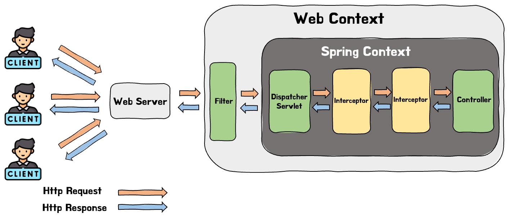

이전 포스트들에서 필터와 인터셉터에 대해 각각 비교해봤다.

- **[Filter란 무엇일까?](https://seongwon97.github.io/posts/Filter%EB%9E%80/)**
- **[Interceptor란 무엇일까?](https://seongwon97.github.io/posts/Interceptor%EB%9E%80/)**

두 포스트를 읽어보면 필터와 인터셉터의 관리하는 컨테이너와 실행 시점 등이 다르다는 것을 알 수 있을 것이다. 그래도 두 기능이 하는 일이 비슷하고 헷갈릴 수 있어 이번 포스트를 통해 둘의 차이점을 비교해보려 한다.

이번 포스트에서는 두 기능에 대한 자세한 설명은 생략할 것이다. 두 기능에 대해 잘 모르겠다면 위의 두 포스트를 통해 학습하길 바란다.

# 1. Filter와 Interceptor의 차이

두 기능의 대표적인 차이는 아래의 3가지가 있는 것 같다.

- 관리하는 컨테이너, 실행시점
- Request/Response의 조작가능 여부
- 용도

## 1.1. 관리하는 컨테이너, 실행시점

필터와 인터셉터는 관리되는 컨테이너가 다르다. 필터의 경우 J2EE의 표준 스펙 기능으로 Spring Container가 아닌 Web Container가 관리를 하게 된다. 반면에 인터셉터는 J2EE의 표준 스펙이 아닌 스프링이 단독적으로 제공하는 기능이다. 그래서 인터셉터의 경우 Filter와 다르게 Spring Container에서 관리되고 있다.



실행 시점은 위의 사진을 통해 알 수 있듯이 필터의 경우 Dispatcher Servlet의 실행 전에 동작하며 인터셉터의 경우 Dispatcher Servlet이후, Controller 실행 전에 동작하게 된다.

두 기능을 포함해 전반적인 Spring MVC의 동작 과정을 정리해보면 아래와 같다.

1. 사용자가 Http Request를 보낸다.
2. 등록된 Filter Chain이 실행되는데, 사용자가 보낸 Request Url에 매칭되는 Filter가 있으면 순차적으로 실행된다.
3. Dispatcher Servlet이 요청을 받으면 Handler Mapping을 통해 요청을 처리할 수 있는 Handler(컨트롤러)와 요청에 매핑되는 Interceptor들을 찾아 HandlerMethodExecutionChain을 만들어 반환한다.
4. HandlerMethodExecutionChain에 있는 Interceptor들이 순차적으로 실행된다.
5. HandlerAdapter가 Handler(컨트롤러) 메서드를 호출하여 실행한다.

이후에는 역순으로 돌아가며 Interceptor, Filter에 정의된 후처리 메서드가 있다면 순차적으로 실행된다.

## 1.2. Request/Response의 조작가능 여부

결론부터 말하자면 필터는 Request, Response를 다른 객체로 변경할 수 있지만 인터셉터는 변경할 수 없다.

해당 이유를 알기 위해서는 두 기능의 코드를 비교해봐야한다.

```java
public class MySecondFilter implements Filter {

    @Override
    public void doFilter(ServletRequest request, ServletResponse response, FilterChain chain) throws IOException, ServletException {

        chain.doFilter(request, response);
    }
}
```

필터는 다음 필터를 호출하기 위해 매개변수에 있는 FilterChain의 `doFilter()`메서드를 호출한다. 이때 `doFilter()`메서드를 보면 request와 response를 인자로 받는데 여기에 우리가 변경을 하고싶은 request, response객체를 넣어주면 다음 필터에서는 우리가 변경한 객체들로 실행이 된다.

하지만 인터셉터의 경우 필터와 다르게 다음 인터셉터를 호출하는 것이 아닌 true, false를 반환하여 다음 인터셉터를 실행한다. 그렇기에 Filter와 다르게 request, response의 조작이 불가능하다.

```java
public class TokenInterceptor implements HandlerInterceptor {

	...

    @Override
    public boolean preHandle(HttpServletRequest request, HttpServletResponse response, Object handler) {
        if (authService.isValidToken(request)) {
            return true;
        }
        return false;
    }
}
```

## 1.3. 용도

### Filter의 사용 용도

- 공통된 보안 및 인증/인가 작업

  - ex) XSS 공격 방어, CORS 작업처리

    > _XSS : 공격자가 입력 가능한 폼에 악의적인 스크립트를 삽입해 희생자 측에서 동작하도록 만들어 악의적인 행위를 수행하는 행위_

- 모든 요청에 대한 로깅 또는 감사
- 이미지/데이터 압축 및 문자열 인코딩
- Spring과 분리되어야 하는 기능

필터에서는 보안 공통 작업과 같이 스프링과 무관하게 전역적으로 처리해야하는 작업들을 처리할 수 있다. Dispatcher Servlet 이전에 Filter Chain을 거치게 됨으로 전역적으로 해야하는 보안 검사를 한다면 스프링 컨테이너로 요청이 전달되기 전에 차단을 하여 안정성을 높일 수 있다. 또한 필터는 이미지 데이터 압축, 문자열 인코딩, 로깅 등의 웹 애플리케이션 전반적으로 사용하는 기술들을 구현하기 좋다.

### Interceptor의 사용 용도

- 세부적인 보안 및 인증/인가 공통 작업
  - 보통 로그인 관련 작업을 수행
- API 호출에 대한 로깅 또는 감사
- Controller로 넘겨주는 데이터의 가공

인터셉터는 클라이언트 요청과 관련되어 전역적으로 처리해야하는 작업들을 처리할 수 있다. 인터셉터도 필터와 같이 인증/인가와 같은 작업을 하는 것이 일반적이다. 필터와 다른 점이 있다면 인터셉터에서는 모든 요청이 아닌 세부적으로 적용해야하는 인증/인가 작업을 처리하고는 한다. 예시를 하나 들어보자면 낮은 등급의 유저들이 제한되는 서비스들이 존재하다면 그러한 기능들은 인터셉터에서 검사를 하는 것이 적합하다.

Interceptor Request, Response에 대한 조작은 불가능하지만 해당 객체가 내부적으로 갖는 값은 조작할 수 있어서 컨트롤러로 넘겨주기 위한 정보를 가공하기에 용이하다. 예를 들면 JWT의 토큰을 파싱하여 값을 컨트롤러에 넘겨줄 수 있다. (직접적으로 값을 넘겨주는 것이 아닌 객체의 내부값을 조작하여 넘겨준다.)

### 정리

필터와 인터셉터는 모두 비즈니스 로직과 분리되어 특정 요구사항(보안, 인증, 인코딩 등)을 만족시켜야 할 때 적용한다.

필터는 스프링과 무관하게 전역적으로 처리해야하는 작업이나, 입력으로 들어온 파라미터 자체를 검증하거나 HttpServletRequest 대신에 ServletRequest를 이용하는 경우 사용하는 것이 좋다. 반대로 인터셉터는 클라이언트의 요청과 관련된 작업에 대해 처리하여야 하거나 서비스 로직을 섞어야 하는 경우 사용하는 것이 좋다.

## 1.4. 그 외의 것

- 인터셉터는 Spring Container내부에서 동작을 하여 `@ControllerAdvice`와 `@ExceptionHandler`를 사용하여 예외 처리가 가능하다. 하지만 필터는 이를 사용하여 예외 처리를 할 수 없다. 필터는 주로 `doFilter()` 메소드 내에서 `try~catch` 구문을 사용해 발생한 예외를 곧바로 핸들링한다.

# Reference

- [[Spring] 필터(Filter) vs 인터셉터(Interceptor) 차이 및 용도 - MangKyu's Diary:티스토리](https://mangkyu.tistory.com/173)
- [스프링 - Filter란 무엇일까?](https://seongwon97.github.io/posts/Filter%EB%9E%80/)
- [스프링 - Interceptor란 무엇일까?](https://seongwon97.github.io/posts/Interceptor%EB%9E%80/)
- [인터셉터(interceptor)란?](https://harrydony.tistory.com/373)
- [[Spring] 필터(Filter)와 인터셉터(Interceptor)의 개념 및 차이 - 슬기로운 개발생활:티스토리](https://dev-coco.tistory.com/173)
- [[Spring] Filter, Interceptor, Argument Resolver란?](https://steady-coding.tistory.com/601)
