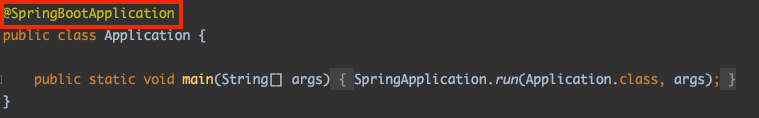
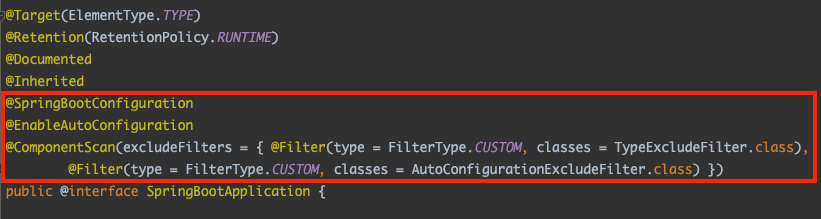

# Spring이란?

스프링 프레임워크는 Java 애플리케이션을 개발하기 위한 인프라를 제공하고 있다. 이는 DI를 포함한 여러 기능들을 제공하고 있으며 아래와 같은 많은 모듈들을 제공하고 있어 개발자들은 개발 시간을 크게줄일 수 있다.

- Spring JDBC
- Spring MVC
- Spring Security
- Spring AOP
- Spring ORM
- Spring Test

# SpringBoot란?

[스프링 부트의 공식 문서](https://spring.io/projects/spring-boot)를 보면 아래의 문장을 볼 수 있다.

> Spring Boot makes it easy to create stand-alone, production-grade Spring based Applications that you can "just run".

이 말을 해석해보면 Spring Boot를 사용하면 "그냥 실행할 수 있는" 독립적이고 상용화 수준의 Spring 기반 애플리케이션을 쉽게 만들 수 있다는 것을 알 수 있습니다.

Spring Boot는 Spring 애플리케이션을 설정하는데 필요한 작업들을 자동화하여 개발자들이 편리하게 스프링을 사용할 수 있도록 해준다. Spring Boot는 내장된 WAS(Tomcat)을 제공하기도하며 개발 환경을 편하게 구축할 수 있는 여러 의존성들을 제공하고 있다. 만약 스프링 부트가 없다면 개발자들은 스프링 프로젝트 환경 설정에 많은 시간을 소모할 것이다. 스프링 부트를 사용함으로써 개발자들은 실행 환경이나 의존성 관리 등의 인프라를 신경쓸 필요 없이 비즈니스 로직을 작성하는데 집중할 수 있다.

# Spring Framework와 Spring Boot의 차이점

## 1. Dependency 관리의 편리함

Spring Boot는 starter dependency를 제공을 하여 의존성 관리가 편리하다. 기존 Spring Framework를 사용하면 의존성간의 호환 버전을 찾아서 맞춰줘야하는 불편함이 있었다. 하지만 starter dependency가 대부분의 의존성를 관리해주어 걱정을 덜게 되었다.

### spring-boot-starter 의존성

starter dependency는 특정 기능을 제공하기 위한 의존성들의 그룹이라고 이해하면 된다. starter를 사용하면 개발자들은 간편하게 의존성을 추가할 수 있다. `spring-boot-starter-web`를 예로 들어보겠다.

우리가 Spring프레임워크를 사용해 애플리케이션을 개발하려면 pom.xml(메이븐)이나 build.gradle(그레이들)에 최소한 아래의 의존성들을 추가해줘야 한다.

```xml
<dependency>
    <groupId>org.springframework</groupId>
    <artifactId>spring-web</artifactId>
    <version>5.3.5</version>
</dependency>
<dependency>
    <groupId>org.springframework</groupId>
    <artifactId>spring-webmvc</artifactId>
    <version>5.3.5</version>
</dependency>
```

하지만 우리가 Spring Boot의 starter를 사용한다면 아래의 spring-boot-starter의존성 하나만 추가해줘도 스프링 웹 애플리케이션을 실행 시킬 수 있다.

```xml
<dependency>
    <groupId>org.springframework.boot</groupId>
    <artifactId>spring-boot-starter-web</artifactId>
    <version>2.4.4</version>
</dependency>
```

이 외에도 Spring Boot없이 테스트를 하려면 Spring Test, JUnit, Hamcrest, and Mockito등의 라이브러리를 추가해줘야 하는데 스프링 부트를 사용하면 spring-boot-starter-test를 추가해줌으로써 모든 테스트 라이브러리들이 추가되는 편리함을 경험할 수 있다.

### 스프링 부트가 제공하는 starter 의존성

- spring-boot-starter-web-services : SOAP 웹 서비스
- spring-boot-starter-web : Web, RESTful 응용프로그램
- spring-boot-starter-test : Unit testing, Integration Testing
- spring-boot-starter-jdbc : 기본적인 JDBC
- spring-boot-starter-hateoas : HATEOAS 기능을 서비스에 추가
- spring-boot-starter-security : 스프링 시큐리티를 이용한 인증과 권한
- spring-boot-starter-data-jpa : Spring Data JPA with Hibernate
- spring-boot-starter-cache : 스프링 프레임워크에 캐싱 지원 가능
- spring-boot-starter-data-rest : Spring Data REST를 사용하여 간단한 REST 서비스 노출

## 2. Configuration 설정의 편리함

Spring Framework만을 사용할 경우 dispatcher servlet, mapping을 비롯한 여러 Configuration 설정을 xml파일이나 initializer class를 통해 설정해줘야하는 불편함이 있었다. 하지만 Spring Boot에서는 이를 application.properties파일이나 application.yml파일에 간단히 설정할 수 있다.

```java
public class MyWebAppInitializer implements WebApplicationInitializer {

    @Override
    public void onStartup(ServletContext container) {
        AnnotationConfigWebApplicationContext context
          = new AnnotationConfigWebApplicationContext();
        context.setConfigLocation("com.baeldung");

        container.addListener(new ContextLoaderListener(context));

        ServletRegistration.Dynamic dispatcher = container
          .addServlet("dispatcher", new DispatcherServlet(context));

        dispatcher.setLoadOnStartup(1);
        dispatcher.addMapping("/");
    }
}

@EnableWebMvc
@Configuration
public class ClientWebConfig implements WebMvcConfigurer {
   @Bean
   public ViewResolver viewResolver() {
      InternalResourceViewResolver bean
        = new InternalResourceViewResolver();
      bean.setViewClass(JstlView.class);
      bean.setPrefix("/WEB-INF/view/");
      bean.setSuffix(".jsp");
      return bean;
   }
}
```

스프링에서 JSP웹 애플리케이션을 설정하려면 위와 같이 여러 설정들을 해야했다. 하지만 스프링 부트에서는 spring-boot-starter-web의존성을 추가하고 아래의 간단한 설정만으로 위의 코드와 같은 설정을 할 수 있다.

```java
spring.mvc.view.prefix=/WEB-INF/jsp/
spring.mvc.view.suffix=.jsp
```

또한 Spring Boot는 \***\*AutoConfiguration\*\***기능을 제공한다. 이를 통해 애플리케이션 구동에 필요한 여러 빈들을 자동으로 등록해준다.





- **@ComponentScan**
  - @Component, @Controller, @Repository, @Service라는 어노테이션이 붙어있는 객체들을 스캔해 자동으로 Bean에 등록해줍니다.
- **@EnableAutoConfiguration**
  - @ComponentScan 이후 사전에 정의한 라이브러리들을 Bean에 등록해준다. 사전에 정의한 라이브러리들은 다음 경로에서 확인할 수 있다. 하지만 사전에 정의한 라이브러리라고 전부 Bean에 등록되진 않는다.

## 3. 편리해진 배포

Spring Boot가 생기기 전에는 war파일을 생성한 후 Web Application Server(WAS)에 담아 배포를 하였다. 하지만 Spring Boot는 Tomcat, Jetty를 내장 WAS로 갖고 있기에 jar파일을 통한 간단한 배포가 가능하다.

Embed Tomcat, Jetty or Undertow directly (no need to deploy WAR files)

# Reference

- [Spring Boot 공식 문서](https://spring.io/projects/spring-boot)
- [A Comparison Between Spring and Spring Boot](https://www.baeldung.com/spring-vs-spring-boot)
- [Spring 과 Spring Boot 차이](https://velog.io/@courage331/Spring-%EA%B3%BC-Spring-Boot-%EC%B0%A8%EC%9D%B4)
- [[번역글] 스프링 vs 스프링 부트 차이 비교하기!](https://sas-study.tistory.com/274)
- [[Spring] Spring VS Spring Boot 차이점](https://programforlife.tistory.com/68)
- [[Spring Boot] 내가 설정하지 않아도 동작하는 어노테이션](https://yeonyeon.tistory.com/230)
