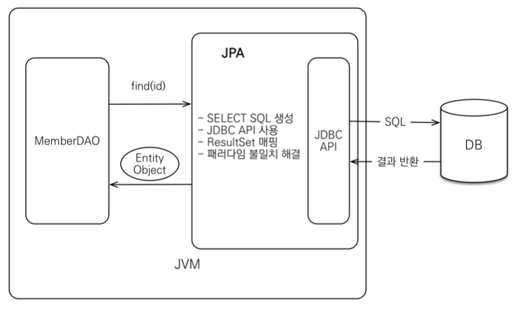
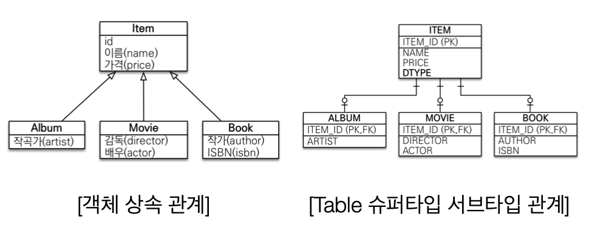

> 해당 포스트는 인프런 김영한님의 [자바 ORM 표준 JPA 프로그래밍 - 기본편](https://www.inflearn.com/course/ORM-JPA-Basic/dashboard) 강의를 기반으로 작성하였습니다.

# 1. ORM

JPA의 개념을 알고자 한다면 먼저 ORM의 개넘을 알고 넘어가야 한다.
ORM은 **Object Relational Mapping**의 약자로 **객체와 관계형 데이터베이스의 데이터를 자동으로 매핑**해주는 일을 한다. 객체지향 프로그래밍은 클래스를 사용하고 관계형 데이터베이스는 테이블을 사용하여 두 모델간에 불일치가 발생하게 된다. 이러한 문제는 ORM이 중간에서 객체간의 관계를 바탕으로 RDB와 매핑하여 불일치를 해결해줄 수 있습니다.

## 1.1. ORM의 장점

- 객체 지향적인 코드로 인해 더 직관적이고 비즈니스 로직에 더 집중할 수 있게 도와준다.
  - 선언문, 할당, 종료 같은 부수적인 코드가 없거나 급격히 줄어든다.
  - 각종 객체에 대한 코드를 별도로 작성하기 때문에 코드의 가독성을 올려준다.
  - SQL의 절차적이고 순차적인 접근이 아닌 객체 지향적인 접근으로 인해 생산성이 증가한다.
- 재사용 및 유지보수의 편리성이 증가한다.
  - ORM은 독립적으로 작성되어있고, 해당 객체들을 재활용 할 수 있다.
  - 때문에 모델에서 가공된 데이터를 컨트롤러에 의해 뷰와 합쳐지는 형태로 디자인 패턴을 견고하게 다지는데 유리하다.
  - 매핑정보가 명확하여, ERD를 보는 것에 대한 의존도를 낮출 수 있다.
- DBMS에 대한 종속성이 줄어든다.
  - 대부분 ORM 솔루션은 DB에 종속적이지 않다.
  - 종속적이지 않다는것은 구현 방법 뿐만아니라 많은 솔루션에서 자료형 타입까지 유효하다.
  - 프로그래머는 Object에 집중함으로 극단적으로 DBMS를 교체하는 거대한 작업에도 비교적 적은 리스크와 시간이 소요된다.
  - 또한 자바에서 가공할경우 equals, hashCode의 오버라이드 같은 자바의 기능을 이용할 수 있고, 간결하고 빠른 가공이 가능하다.

## 1.2. ORM의 단점

- 완벽한 ORM 으로만 서비스를 구현하기가 어렵다.
  - 사용하기는 편하지만 설계는 매우 신중하게 해야한다.
  - 프로젝트의 복잡성이 커질경우 난이도 또한 올라갈 수 있다.
  - 잘못 구현된 경우에 속도 저하 및 심각할 경우 일관성이 무너지는 문제점이 생길 수 있다.
  - 일부 자주 사용되는 대형 쿼리는 속도를 위해 SP를 쓰는등 별도의 튜닝이 필요한 경우가 있다.
  - DBMS의 고유 기능을 이용하기 어렵다. (하지만 이건 단점으로만 볼 수 없다 : 특정 DBMS의 고유기능을 이용하면 이식성이 저하된다.)
- 프로시저가 많은 시스템에선 ORM의 객체 지향적인 장점을 활용하기 어렵다.
  - 이미 프로시저가 많은 시스템에선 다시 객체로 바꿔야하며, 그 과정에서 생산성 저하나 리스크가 많이 발생할 수 있다.

# 2. JPA

## 2.1. JPA의 역사

과거에는 Java진영에서 ORM 표준으로 **EJB**라는 기술을 사용하였다. 하지만 해당 기술은 많은 인터페이스를 구현해야하여 복잡성이 높고 코드가 지저분해지며 속도가 느리다는 단점이 있었다. 이에 불만을 갖던 ‘Gavin King’은 시러스 테크놀로지스 출신 동료들과 함께 EJB2 스타일의 Entity Beans 이용을 대체할 목적으로 **Hibernate**를 개발하였다. 이후 Hibernate는 오픈소스화가 되고 좋은 성능과 많은 사람들의 사랑을 받아 EJB는 망하게 됩니다. 이에 Java 진영에서는 Hibernate를 만든 Gavin King을 영입해 Hibernate와 유사한 **JPA**를 만들게 되었다.

## 2.2. JPA란?

JPA(Java Persistence API)란 자바에서 사용하고 있는 ORM의 표준이다. JPA는 구현체가 아닌 인터페이스의 모음으로, JPA의 인터페이스를 구현한 대표적인 오픈소스로는 Hibernate, EclipseLink, DataNucleus가 있다.

> Hibernate

- JPA의 실제 구현 class를 모아둔 것이 Hibernate이다.
- JPA라는 ORM 기술 표준을 구현한 것이 Hibernate이므로, JPA를 사용하려면 개발자는 Hibernate를 사용하면 된다.
- Hibernate에서 자주 사용하는 것들을 Spring boot가 묶어서 보관하는데 그것이 Spring data jpa이다.
  >

## 2.3. JPA의 동작

### 2.3.1. 기본 구조


- JPA의 동작은 JDBC와 애플리케이션 사이에서 동작하며 개발자가 JPA를 사용하면 JPA가 JDBC API를 사용해 SQL을 호출하여 DB와 통신을 하는 방식으로 동작한다
- 개발자는 JDBC API를 사용하는 것이 아닌 JPA만을 사용한다.

### 2.3.2. 객체 저장


JPA를 사용하여 객체를 저장하고 싶을 때는 다음과 같다.

1. 개발자가 JPA에 객체를 넘긴다
2. JPA는 Member entity를 분석한다
3. JPA가 분석된 정보를 통해 Insert SQL을 생성한다.
4. JDBC API를 사용하여 SQL문을 DB에 날린다.

### 2.3.3. 객체 조회



1. 개발자가 조회하고자 하는 객체의 PK값을 JPA에 넘긴다.
2. JPA는 엔티티의 매핑 정보를 바탕으로 SELECT SQL을 생성한다.
3. JDBC API를 사용하여 SQL문을 DB에 날린다.
4. DB로부터 결과를 받아와 객체에 매핑시킨다.

## 2.4. 왜 JPA를 사용해야할까?

JPA를 사용하면 많은 이점을 얻을 수 있다. 아래의 이점을 확인해보면 왜 JPA를 사용해야하는지 알 수 있을 것이다.

### 2.4.1. SQL 중심적인 개발에서 객체 중심으로 개발

### 2.4.2. 생산성

- JPA를 사용하게되면 Java Collection을 이용해 데이터를 불러오고 추가하는 느낌으로 DB관련 작업을 수행할 수 있다. 덕분에 DB관련 작업을 하는 비용이 줄어들어 생산성이 증가한다.
- JPA를 활용한 CRUD 예시
  - 저장: `em.persist(member);`
  - 조회: `Member member = em.find(memberId);`
  - 수정: `member.setName(”수정할 값”);`
  - 삭제: `em.remove(member);`

### 2.4.3. 유지보수

JPA를 사용하지 않으면 테이블에 추가되는 값이 있을 경우, 해당 테이블에서 사용하는 모든 SQL문들을 수정해줘야 할 것이다. 하지만 JPA를 사용하면 간단히 Entity객체에 필드만 추가해주면 된다.

### 2.4.4. 패러다임의 불일치 해결

1. **JPA와 상속**

   

   다음과 같은 상속 관계에서 Album 타입의 데이터를 추가하면 어떻게 될까? 기본적으로 Java 객체지향 프로그래밍에서는 Album 객체를 생성하기만 하면 될 것이다. 하지만 DB입장에서는 Album 테이블뿐만 아니라 Item테이블에도 데이터를 생성(추가)해줘야 한다. 이러한 측면에서 객체지향 프로그래밍과 DB사이의 불일치가 발생하게 된다. 하지만 JPA를 사용하면 Album객체만을 만들고 `em.persist(Album);` 해주면 알아서 두 개의 쿼리를 만들어서 보내준다. 즉, 객체지향 프로그래밍을 할 때도 개발자는 하나의 Album객체만 만들면 되어서 둘 사이의 불일치가 해결되었다.

2. **JPA와 연관관계**

   Java에서는 다른 객체와의 연관관계를 생성하고 가져올 때, getter/setter를 사용하곤 한다. 하지만 DB에서는 단순히 getter/setter를 사용하는 것으로 끝나는 것이 아니라 foreign key를 통한 다른 테이블과 연관관계 설정 및 join을 통한 조회를 하여야한다. JPA는 개발자가 이러한 작업을 단순한 Java프로그래밍이로 할 수 있게 해준다.

- 연관관계 저장

  ```java
  member.setTeam(team);
  em.persist(member);
  ```

- 객체 그래프 탐색

  ```java
  Member member = em.find(Member.class, memberId);
  Team team = member.getTeam();
  ```

3. **JPA와 객체 그래프 탐색**

   신뢰할 수 있는 엔티티, 계층

   ```java
   class MemberRepository {
         ...
         public void process() {
             /* 직접 구현한 DAO에서 객체를 가져온 경우 */
             Member member1 = memberDAO.find(memberId);
             member1.getTeam(); // 엔티티를 신뢰할 수 없음
             member1.getOrder().getDelivery();
             /* JPA를 통해서 객체를 가져온 경우 */
             Member member2 = jpa.find(Member.class, memberId);
             member2.getTeam(); // 자유로운 객체 그래프 탐색
             member2.getOrder().getDelivery();
         }
   }
   ```

- 다른 개발자가 직접 구현한 DAO에서 데이터를 가져오는 경우 DAO에서 직접 어떤 쿼리를 날렸는지 확인하지 않는 이상, 그래프 형태의 관련된 객체들을 모두 잘 가져왔는지 테스트하지 않는 이상 알 수가 없다. 즉, 반환한 엔티티를 신뢰하고 사용할 수 없다. 하지만 JPA를 통해서 가져오는 경우 지연 로딩 전략(Lazy Loading) 사용하기에 객체 그래프를 완전히 자유롭게 탐색할 수 있게 된다.

4. **JPA와 비교하기**

   JPA는 동일한 트랜잭션에서 조회한 엔티티는 같음을 보장한다.

   ```java
   String memberId = "100";
   Member member1 = jpa.find(Member.class, memberId); // DB에서 가져옴
   Member member2 = jpa.find(Member.class, memberId); // 1차 캐시에서 가져옴
   member1 == member2; //같다.
   ```

### 2.4.5. 성능

1. **1차 캐시와 동일성 보장**

   JPA는 캐싱 기능을 실행하여 동일한 트랜잭션 내에서 동일한 엔티티를 조회하면 SQL을 다시 날리지 않고 캐싱된 값을 반환한다. 이는 많은 성능상의 이점이 있는 것은 아니지만 약간의 조회 성능의 향상은 있다.

   ```java
   String memberId = "100";
   Member member1 = jpa.find(Member.class, memberId); // DB에서 가져옴
   Member member2 = jpa.find(Member.class, memberId); // 1차 캐시에서 가져옴
   member1 == member2; //같다.
   ```

   DB Isolation Level이 Read Commit이어도 애플리케이션에서 Repeatable Read 보장한다.

2. **트랜잭션을 지원하는 쓰기 지연 (transactional write-behind)**

- insert

  JPA는 버퍼링 기능과 비슷하게 트랜잭션을 커밋하기 전까지 Insert SQL들을 모아뒀다가 JDBC BATCH SQL기능을 사용하여 한번에 SQL문을 전송한다.

  ```java
  transaction.begin();  // [트랜잭션] 시작
  em.persist(memberA);
  em.persist(memberB);
  em.persist(memberC);
  // -- 여기까지 INSERT SQL을 데이터베이스에 보내지 않는다.
  // 커밋하는 순간 데이터베이스에 INSERT SQL을 모아서 보낸다. --
  /** 2. JDBC BATCH SQL 기능을 사용해서 한번에 SQL 전송 */
  transaction.commit(); // [트랜잭션] 커밋
  https://gmlwjd9405.github.io/2019/08/04/what-is-jpa.html
  ```

- update

  Update, Delete로 인한 로우락 시간을 최소화하고 트랜잭션이 커밋되면 Update, Delete SQL을 실행하고 커밋한다.

  ```java
  transaction.begin();  // [트랜잭션] 시작
  changeMember(memberA);
  deleteMember(memberB);
  비즈니스_로직_수행();     // 비즈니스 로직 수행 동안 DB 로우 락이 걸리지 않는다.
  // 커밋하는 순간 데이터베이스에 UPDATE, DELETE SQL을 보낸다.
  /** 2. 트랜잭션 커밋 시 UPDATE, DELETE SQL 실행하고, 바로 커밋 */
  transaction.commit(); // [트랜잭션] 커밋
  ```

3. **지연 로딩 (Lazy Loading)**

- 지연로딩: 객체가 실제로 사용될 때 SQL문을 보내 데이터를 로딩한다. 이를 통해 불필요한 데이터 로딩을 줄일 수 있다.
- 즉시로딩: JOIN SQL문을 통해 연관된 객체까지 미리 조회하는 전략이다.
  - 보통 애플리케이션을 개발할 때 모두 지연로딩으로 설정한 후에, 성능 최적화가 필요할 때에 옵션을 변경하는 것을 추천한다.

### 2.4.6. 데이터 접근 추상화와 벤더 독립성

### 2.4.7. 표준

# Reference
- [자바 ORM 표준 JPA 프로그래밍 - 기본편](https://www.inflearn.com/course/ORM-JPA-Basic/dashboard)
- [[DB] ORM이란 - Heee's Development Blog](https://gmlwjd9405.github.io/2019/02/01/orm.html)
