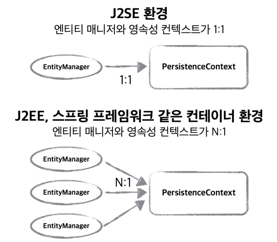
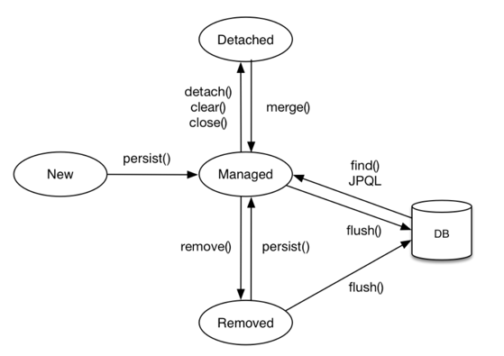
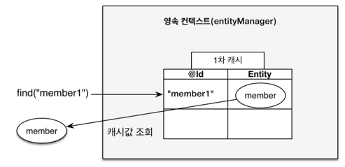
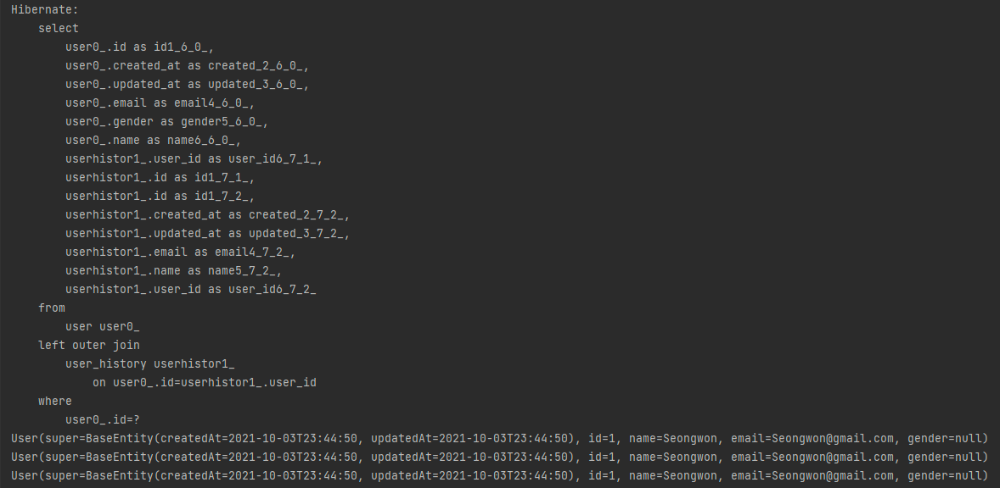
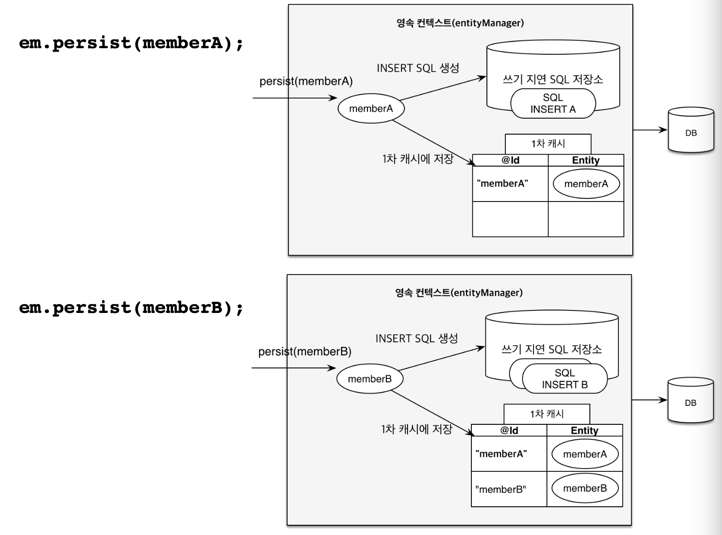
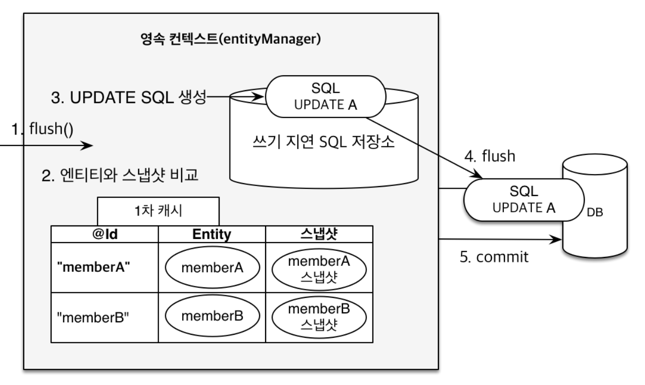

> 해당 포스트는 인프런 김영한님의 [자바 ORM 표준 JPA 프로그래밍 - 기본편](https://www.inflearn.com/course/ORM-JPA-Basic/dashboard) 강의를 기반으로 작성하였습니다.


# 1. 영속성 컨텍스트란?

영속성 컨텍스트란 JPA를 이해하는데 가장 중요한 개념이다. 이는 **엔티티를 영구 저장하는 환경**이라는 뜻을 가진 **논리적인 개념**으로 어플리케이션과 DB사이에서 객체를 보관하는 가상의 DB같은 역할을 한다. 즉, 애플리케이션에서 DB에 저장하기 전에 사용을 하는 임시 저장 공간이라고 이해를 하면 편할 것이다.

JPA를 사용하기 이전까지 우리는 데이터의 CRUD작업을 할 때, 서비스 계층에서 바로 DAO를 통해 SQL문을 날렸을 것이다. 하지만 JPA는 어째서 애플리케이션과 DB사이에 임시 저장 공간을 만들어 사용을 할까?? 그것은 영속성 컨텍스트를 사용하여 얻는 많은 이점들이 있기 때문이다. 이점에 대해서는 추후 뒤에서 자세한 이야기를 하도록 하겠다.

# 2. EntityManager, EntityManagerFactory

앞서 말한 영속성 컨텍스트에 접근하기 위해서는 EntityManager가 필요하다. EntityManager는 영속성 컨텍스트 내에서 Entity를 관리하고 있다. 이는 JPA에서 제공하고 있는 인터페이스로 SpringBean으로 등록되어 우리는 자동주입으로도 사용할 수 있다.

> Spring Data JPA에서 제공하는 Simple JPA Repository는 EntityManager를 직접적으로 사용하지 않고 감싸면서 더 많은 기능을 제공하고 있다.
> 만약 Spring JPA에서 제공하지 않는 기능을 사용하거나 특별한 이유가 있어 별도로 커스터마이징을 해야할 경우 EntityManager를 직접 받아서 처리할 수도 있다.

EntityManager에 엔티티를 저장하거나 데이터를 통해 조회를 하면 EntityManager는 영속성 컨텍스트에 엔티티를 보관하는 등의 관리를 하게 된다. 이러한 EntityManager들은 여러 스레드가 동시에 접근하면 동시성 문제가 발생하므로 스레드간에 절대로 공유를 하면 안된다.

- 동시성(Concurrency): 사용자가 체감하기에는 동시에 수행하는 거처럼 보이지만 사실 사용자가 체감할 수 없는 짧은 시간단위로 작업들을 번갈아가면서 수행되는 것이다. ex) 각 스레드들이 동시에 동작하는 거 같지만 알고 보면 스레드들이 아주 짧은 시간마다 번갈아가면서 작업을 수행하고 있는 것이다.
- 병렬(Parallelism): 우리가 생각하는 진짜 동시에 실행하는 개념을 생각하면 된다. 실제로 동시에 각각의 작업을 하는 여러 스레드들이 동시에 동작한다.

하나의 스레드에서 데이터를 수정하고 있는데 다른 스레드에서 동일한 EntityManager를 통해 데이터를 수정하는 등의 문제가 발생하면 안되기에 EntityManager는 공유되면 안된다. 그리고 이러한 EntityManager를 만들어주는 것이 바로 EntityFactory이다.

애플리케이션에는 하나의 **EntityManagerFactory**가 존재한다. 이는 디비에 접근하는 트랜잭션이 생길 때 쓰레드 별로 **Entity Manager**를 생성하여 영속성 컨텍스트에 접근하도록 해준다.

Spring에서는 EntityManager를 주입하여 사용하면 같은 트렌잭션의 범위에 있는 EntityManager는 같은 영속성 컨텍스트에 접근한다. (J2EE와 같은 스프링 프레임워크 같은 컨테이너 환경은 Entity Manager와 영속성 컨텍스트의 관계가 N:1이 가능하다. 하지만 J2SE와 같은 환경은 1:1이다.)



# 3. Entity의 생명주기



## 3.1. 비영속(new/transient)

- 영속성 컨텍스트와 전혀 관계가 없는 상태이다.
- 엔티티 객체를 생성하였지만 아직 영속성 컨텍스트에 저장하지 않은 상태를 의미한다.

```java
    //객체만 생성한 비영속상태
    User user = new User();
```

## 3.2. 영속(managed)

- 영속성 컨텍스트에 저장된 상태
- 엔티티가 영속성 컨텍스트에 의해 관리된다.
- 영속 상태가 되었다고 바로 DB에 값이 저장되지 않고 트렌젝션의 커밋 시점에 영속성 컨텍스트에 있는 정보들을 DB에 쿼리로 날리게 된다.

```java
@Autowired
private EntityManager entityManager;
// Class내에 Autowired로 EntityManager추가

    //객체만 생성한 비영속상태
    User user = new User();

    // 객체를 저장한 영속상태
    entityManager.persist(user);
```

## 3.3. 준영속(detached)

- 영속성 컨텍스트에 저장되었다가 분리되어 영속성 컨텍스트가 제공하는 기능을 사용을 못하는 상태이다.
- 엔티티를 준영속 상태로 만드려면 `entityManager.detach();`를 호출한다.

```java
    // 영속 -> 준영속
    // user엔티티를 영속성 컨텍스트에서 분리하면 준영속 상태가 된다.
    entityManager.detach(user);
    // 영속성 콘텍스트를 비우면 관리되고 있던 엔티티들은 준영속 상태가 된다. (대기 상태에 있는 변경 데이터들도 삭제)
    entityManager.clear();
    // 영속성 콘텍스트를 종료해도 관리되던 엔티티들은 준영속 상태가 된다.
   	entityManager.close();

    // 준영속 -> 영속
    // detach를 하여 준영속상태에 빠진 entity를 merge를 하면 다시 영속 상태가 된다.
    entityManager.merge(user);
```

> 준영속 상태의 특징
>
> - 1차 캐시, 쓰기 지연, 변경 감지, 지연 로딩을 포함한 영속성 컨텍스트가 제공하는 어떠한 기능도 동작하지 않는다.
> - 식별자 값을 가지고 있다.

## 3.4. 삭제(removed):

- 영속성 컨텍스트와 DB에서 해당 엔티티를 삭제하여 삭제된 상태이다.

```java
    // user엔티티를 영속성 컨텍스트와 DB에서 삭제
    entityManager.remove(user);
```

# 4. 영속성 컨텍스트의 특징/이점

## 4.1. 1차 Cache

EntityManager는 캐시 기능을 제공한다. Save 메서드와 같이 DB변경하는 메서드를 실행하였을 때 바로 DB가 업데이트 되지 않고 영속성 컨텍스트 내부에 있는 캐시를 거쳐서 DB가 업데이트되는데 해당 캐시를 1차 캐시라고 부른다. 1차 캐시는 영속 상태의 엔티티 데이터를 **Map의 형태**로 key는 id값, value는 해당 entity값을 저장하고 있다. key값이 id라서 id로 조회를 하게 되면 영속성 context에 있는 1차 cache에 entity가 있는지 확인을 해보고 값이 있다면 DB조회없이 반환한다. 만약 값이 없으면 쿼리문으로 조회를 하고 1차 cache에 저장후 반환해준다.

> 📌 id가 아닌 다른 값을 이용하여 조회를 하면 1차 cache가 적용되지 않는다.



> **1차 Cache조회의 흐름 정리**

1. 1차 캐시에서 탐색한 ID값의 엔티티를 찾는다.
   2-1. 탐색한 결과 해당 엔티티가 1차 캐시에 존재하면 값을 가져온다.
   2-2. 탐색 결과가 1차 캐시에 존재하지 않다면 DB에서 값을 조회하고 조회한 데이터를 엔티티로 생성해 1차 캐시에 저장한다. (해당 엔티티를 영속 상태로 만든다.)
2. 조회한 엔티티를 반환한다.
   >

Delete, Update와 같은 작업을 할 때도 JPA 내부적으로는 ID를 통한 조회를 많이 하게 된다. 즉, 하나의 Transactional에서 id값으로 조회하는 데이터들은 **1차 cache에 저장을 하여 관리를 함으로써 JPA의 조회 성능이 올라간다.** 하지만 애플리케이션 전체가 아니라 하나의 Transaction에서 동작하는 것이기에 엄청난 이점이 있는건 아니다.

- 1차 캐시에서 조회하는 방법

```java
// entityManager.find(엔티티 클래스 타입, 식별자 값);
User findUser = entityManager.find("User.class", "1L");
```

아래의 코드와 같이 data를 id값으로 반복적으로 찾게 되었을 때 @Transactional이 붙는다면 JPA는 데이터를 조회하며 cache에 저장을 한 후 다음 조회때는 같은 조회를 하지 않고 cache에 있는 값을 내보낸다.

```java
    @Test
    void cacheFindTest() {
        System.out.println(userRepository.findById(1L).get());
        System.out.println(userRepository.findById(1L).get());
        System.out.println(userRepository.findById(1L).get());
    }
```



위의 실행 결과를 보면 1차 캐시의 적용으로 인해 Select문으로 한번의 조회만 하였지만 3개의 결과가 나오는 것을 확인할 수 있다.

> 🚨 주의
>
> - 1차 캐시는 서로 공유하지 않고 하나의 쓰레드가 시작할때부터 끝날 때까지 잠깐 사용하는 글로벌하지 않은 캐시이다.
> - 100명 한테 요청 100개 오면, 엔티티 매니저도 100개 생기고 1차캐시도 100개 생긴다. 스레드 종료되면, 그때 다 사라진다.
> - 트랜잭션의 범위 안에서만 사용하는 굉장히 짧은 캐시 레이어이다.
> - 전체에서 쓰는 글로벌 캐시는 2차 캐시라고 한다.

## 4.2. 동일성(Identity) 보장

영속성 콘텍스트는 영속 엔티티의 동일성을 보장한다.

> ※ **동일성**은 값 뿐만 아니라 실제 인스턴스 자체가 같다는 뜻이다.

1차 캐시로 반복 가능한 읽기(REPEATABLE READ) 등급의 트랜잭션 격리 수준을 DB가 아닌 애플리케이션 차원에서 제공한다.

```java
User findUser1 = entityManager.find("User.class", "1L");
User findUser2 = entityManager.find("User.class", "1L");
System.out.print(findUser1 == findUser2) // Result: true
```

테스트를 해보면 동일성을 보장하여 Id값이 1인 user를 조회한 두번의 결과의 동일성 비교를 해본 결과 true의 결과가 나오는 것을 확인할 수 있다.

## 4.3. 트랜잭션을 지원하는 쓰기 지연(transactional write-behind)



JPA는 entity값을 변경하면 DB에 바로 업데이트 하지 않는다. 트랜젝션 내부에서 영속 상태의 entity의 값을 변경하면 INSERT SQL Query들은 DB에 바로 보내지않고 **쿼리(쓰기 지연 SQL) 저장소**에 쿼리문들을 생성해서 쌓아둔다. 쿼리 저장소에 쌓여있는 쿼리들은 entityManager의 **flush()**나 트렌젝션의 **commit**이 발생하면 보내지게 된다.

```java
	entityManager.flush();
```

- flush()는 1차 캐시를 지우지 않고 쿼리를 DB에 날려서 DB와의 싱크를 맞추는 역할을 한다. 쿼리를 보내고 난 후에 commit()을 실행한다.
- 트렌젝션을 커밋하면 flush(), commit()을 하게 된다.
  - transaction.commit() ⇒ flush + commit

## 4.4. 변경 감지(Dirty Checking)



영속성 컨텍스트는 엔티티의 수정이 일어났을 때 개발자가 영속성 컨텍스트에 따로 알려주지 않아도 알아서 변경 사항을 체크해준다. 이것을 Dirty checking이라고 한다.

1차 캐시에 entity를 저장할 때, 스냅샷 필드도 따로 저장하여 commit이나 flush를 할 때 해당 entity와 스냅샷을 비교하여 변경사항이 있으면 알아서 UPDATE SQL을 만들어서 DB에 전송한다.

> 스냅샷은 DB에서 값을 읽어올 최초 시점의 상태를 저장한다. 그 후 flush를 할 때 현재의 값과 스냅샷의 값과 비교 후 변경된 내용이 있으면 Update query를 만들어서 업데이트를 하게된다.

### 4.4.1. **Dirty Checking의 흐름**

1. 트랙잭션을 커밋하면 entityManager의 내부에서 먼저 플러시가 호출된다.
2. 엔티티와 스냅샷을 비교하여 변경된 엔티티를 찾는다.
3. 변경된 엔티티가 있으면 수정 쿼리를 생성해서 쓰기 지연 SQL 저장소에 저장한다.
4. 쓰기 지연 저장소의 SQL을 flush한다.
5. 데이터베이스 트랜잭션을 커밋한다.

# 5. 플러시 (flush)

flush는 영속성 컨텍스트의 변경 내용을 데이터베이스에 반영해주는 기능이다. flush()를 하거나 트렌젝션의 commit을 하게 된다면 Dirty checking을 통해 스냅샷과 비교하여 수정된 entity를 찾고 UPDATE Query를 만들어 쿼리 저장소에 등록한 후 쿼리 저장소에 저장된 모든 쿼리를 DB에 보내어 동기화한다. 이때 중요한 점은 영속성 컨텍스트를 비우는 것이 아니라 단순히 싱크를 맞춘다는 점을 알아둬야 한다❗️❗️❗️

## 5.1. Flush가 발생 후 동작 흐름

1. 영속성 컨텍스트의 변경을 감지한다
2. 수정된 엔티티가 존재하면 쓰기 지연 SQL저장소에 등록한다.
3. 쓰기 지연 SQL저장소의 쿼리를 데이터베이스에 전송한다.

## 5.2. 영속성 context의 값이 DB에 반영(flush)되는 경우

1. flush를 통해 개발자가 직접 반영하는 경우

- `em.flush()` 직접 호출

2. Transaction이 끝나서 해당 query가 commit되는 시점

- 트랜잭션 커밋 - 플러시 자동 호출

3. 복잡한 조회 조건에 JPQL query가 실행되는 시점(사전에 영속성 콘텍스트에 추가한 데이터들이 flush되지 않아서 DB에 업데이트 되지 않았다면 JPQL쿼리문을 수행하는데 오류 또는 잘못된 결과 반환이 발생할 수 있기에 JPQL 쿼리문을 실행하기 전에 자동으로 flush가 호출된다.)

- JPQL 쿼리 실행 - 플러시 자동 호출

## 5.3. Flush Option

JPQL을 사용하는데 쿼리문에서 사용하는 테이블들이 해당 트렌젝션의 앞부분에서 사용한 테이블들과 연관이 없다면 해당 JPQL쿼리를 수행하기 전에는 flush를 할 필요가 없게된다. 이러한 상황의 경우 커밋할 때만 플러시를 하는 해당 옵션을 사용한다. **하지만 해당 옵션을 변경하여 사용하여도 큰 이점이 없어서 기본 상태로 사용하는 것을 추천한다.**

```java
em.setFlushMode(FlushModeType.~~~)
```

- **FlushModeType.AUTO:** Default값으로 커밋이나 쿼리를 실행할 때 자동으로 Flush가 된다.
- **FlushModeType.COMMIT:** 커밋을 할 때만 flush가 된다.

---

# Reference

- [자바 ORM 표준 JPA 프로그래밍 - 기본편 - 인프런](https://www.inflearn.com/course/ORM-JPA-Basic/dashboard)

- [한 번에 끝내는 Java/Spring 웹 개발 마스터 초격차 패키지 Online - 패스트캠퍼스](https://fastcampus.co.kr/dev_online_javaend)
