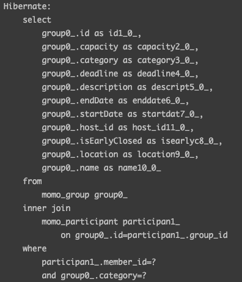

# 학습 동기

모모팀 프로젝트를 진행하며 모임 검색 및 모임 조회에 필터링을 하는 기능을 개발하게 되었다. 필터링 기능을 쉽게 생각하여 가벼운 마음으로 개발을 시작하였으나 막상 개발을 해보니 생각할 내용이 너무나도 많이 있었다.

먼저 우리의 조회 기능 조건은 다음과 같았다.

```java
큰 조회 분류
1. 전체 모임 2. 내가 참여한 모임 3. 내가 생성한 모임 4. 내가 찜한 모임

필터링 및 검색 조건
1. 특정 키워드를 포함 2. 모집 마감 모집 제외 3. 카테고리 선택 4. 마감기한이 적은 순으로 정렬
```

먼저 모임 조회를 하는 상황은 `큰 분류`와 같이 4가지 상황에서 조회를 할 수 있으며 각각의 상황에서는 `필터링 및 검색 조건`에 있는 항목을 다중선택 하여 조회를 할 수 있어야 했다. 여기서 문제가 발생하였다. 조건의 **다중 선택**이 가능하여 0개의 필터링 조건을 선택하였을 때부터 1개~N개의 조건을 선택하였을 때까지 너무 많은 검색 조합이 생긴다는 점이었다.

처음에는 검색 필터링 기능을 구현은 2가지 방법이 떠올랐다.

첫번째 방법은 DB에서 모든 모임의 정보를 읽어오고 비즈니스 로직으로 처리하는 방법이었다. 해당 방법은 비즈니스 로직을 통해 처리를 하기에 각각의 조건별로 메서드 분리를 하면 코드의 이해가 쉽고 조건의 유지보수가 쉬울 것이다. 하지만 성능을 생각했을 때는 최악의 방법이다. 개발 초기에는 문제가 없겠지만 프로그램의 사용자 수가 늘어 Group 테이블이 10억개의 데이터가 들어갔다고 생각해보면 조회를 하기 위해 항상 10억개의 데이터를 가져와서 데이터 가공을 해줘야 할 것이다. 때문에 해당 방법은 바로 배제시키고 다음 방법을 생각해봤다.

두번째 방법은 Spring Data JPA와 JPQL문들을 통해 모든 경우의 수를 만드는 것이었다. 해당 방법은 필터링 조건을 단일로 한다면 문제가 없겠지만 우리는 다중 선택이 가능하기에 모든 검색 조건을 구현하려면 총 64개의 메서드들이 필요하다. 만약 필터링 조건이 추가되게 된다면..?그러면 또 어마어마한 쿼리문의 개발이 필요할 것이다.

그러던 중 알게된 것이 JPA의 Specification이다.

# JPA Specification

## JPA Specification란?

Spring Data JPA의 Specification은 Eric Evans의 “Domain Driven Design” 책에서 나온 개념으로부터 나오게 되었다. Specification은 검색 조건을 메서드 형태로 추상화하여 Repository 인터페이스에서 해당 검색 조건을 조합하고 쿼리하기 쉽게 할 수 있는 Spring Data JPA의 기능입니다. 즉, 동적으로 쿼리를 만들 수 있도록 지원해주는 JPA의 기능이다.

명세(Specification)는 JPA에서 제공하는 Criteria를 통해 생성하고 만들어둔 여러 명세들을 조합해 하나의 동적 쿼리를 만들 수 있다.

## JPA Specification 적용하기

### 1. JpaSpecificationExecutor 인터페이스 상속하기

`Specification`을 인자로 받는 `findAll()`메서드를 사용하기 위해서는 `JpaSpecificationExecutor` 를 Repository에 상속을 해줘야 한다.

```java
import org.springframework.data.jpa.repository.JpaRepository;
import org.springframework.data.jpa.repository.JpaSpecificationExecutor;

public interface GroupRepository extends JpaRepository<Group, Long>, JpaSpecificationExecutor<Group> {
}
```

> `JpaSpecificationExecutor` 에 대해 자세히 살펴보면 아래와 같이 `JpaRepository`의 메서드들과 다르게 `Specification`을 인자로 받는 것을 알 수 있다.
>

```java
public interface JpaSpecificationExecutor<T> {

		Optional<T> findOne(@Nullable Specification<T> spec);

		List<T> findAll(@Nullable Specification<T> spec);

		...
}
```

### 2. Specification 만들기

Specification은 기본적으로 아래와 같은 구조로 이루어져 있다. 우리는 구현 하려는 조건(필터)별로 Specification을 만들어 둔다면 앞서 `JpaSpecificationExecutor` 의 상속을 통해 사용 가능해진 `findAll(Specification<T> spec);` 을 통해 where 조건문이 걸린 쿼리를 쉽게 날릴 수 있다.

> 아직까지 Specification의 이점이 무엇인지 크게 느끼지 못하였을 것이다. Specification은 하나만 있을 때는 이점을 크게 느끼지 못하며 여러개의 Specificaiton을 `and()`, `or()` 과 같은 연산으로 묶으면 비로소 이점을 느낄 수 있다.
>

```java
public interface Specification<T> {
  Predicate toPredicate(Root<T> root, CriteriaQuery<?> query,
            CriteriaBuilder builder);
}
```

앞서 말했던 조건들을 통해 구현한 Specification들은 다음과 같다.

```java
package com.woowacourse.momo.group.domain.group;

import javax.persistence.criteria.Expression;
import javax.persistence.criteria.Join;
import javax.persistence.criteria.Predicate;

import org.springframework.data.jpa.domain.Specification;
import org.springframework.stereotype.Component;

import com.woowacourse.momo.category.domain.Category;
import com.woowacourse.momo.member.domain.Member;
import com.woowacourse.momo.participant.domain.Participant;

public class GroupSpecification {

    public static Specification<Group> initialize() {
        return (root, query, criteriaBuilder) -> criteriaBuilder.conjunction();
    }

    public static Specification<Group> filterByParticipated(Member member) {
        return (root, query, criteriaBuilder) -> {
            Join<Participant, Group> groupParticipant = root.join("participants");
            return criteriaBuilder.equal(groupParticipant.get("member"), member);
        };
    }

    public static Specification<Group> filterByHosted(Member member) {
        return (root, query, criteriaBuilder) -> criteriaBuilder.equal(root.get("host"), member);
    }

    public static Specification<Group> filterByCategory(Long categoryId) {
        Category category = Category.from(categoryId);
        return (root, query, criteriaBuilder) -> criteriaBuilder.equal(root.get("category"), category);
    }

    public static Specification<Group> containKeyword(String keyword) {
        return (root, query, criteriaBuilder) -> {
            Predicate nameContainKeyword = criteriaBuilder.like(root.get("name"), "%" + keyword + "%");
            Predicate descriptionContainKeyword = criteriaBuilder.like(root.get("description"), "%" + keyword + "%");
            return criteriaBuilder.or(nameContainKeyword, descriptionContainKeyword);
        };
    }

    public static Specification<Group> excludeFinished() {
        return (root, query, criteriaBuilder) -> {
            root.join("participants");
            query.groupBy(root.get("id"));

            Expression<Long> count = criteriaBuilder.count(root.get("id"));
            Predicate isOverCapacity = criteriaBuilder.lessThan(count, root.get("capacity"));
            query.having(isOverCapacity);

            Predicate isEarlyClosed = criteriaBuilder.isFalse(root.get("isEarlyClosed"));
            Predicate isOverDeadline = criteriaBuilder.greaterThan(root.get("deadline"),
                    criteriaBuilder.currentTimestamp());
            return criteriaBuilder.and(isEarlyClosed, isOverDeadline);
        };
    }

    public static Specification<Group> orderByDeadline() {
        return (root, query, criteriaBuilder) -> {
            query.orderBy(criteriaBuilder.asc(root.get("deadline")), criteriaBuilder.desc(root.get("id")));
            return criteriaBuilder.greaterThan(root.get("deadline"), criteriaBuilder.currentTimestamp());
        };
    }

    public static Specification<Group> orderByIdDesc() {
        return (root, query, criteriaBuilder) -> {
            query.orderBy(criteriaBuilder.desc(root.get("id")));
            return criteriaBuilder.conjunction();
        };
    }
}
```

### 3. Sprcification을 통해 동적 쿼리 만들기

먼저 필터링 기능이 들어가는 모임 조회 컨트롤러 메서드와 ModelAttribute로 사용하는 DTO는 다음과 같다.

```java
@RequiredArgsConstructor
@RequestMapping("/api/groups")
@RestController
public class GroupController {
		...
		@GetMapping
    public ResponseEntity<GroupPageResponse> findGroups(@ModelAttribute GroupFindRequest groupFindRequest) {
        return ResponseEntity.ok(groupFindService.findGroups(groupFindRequest));
    }
		...
}
```

```java
@NoArgsConstructor
@Getter
@Setter
public class GroupFindRequest {

    private Integer page = 0;
    private Long category;
    private String keyword;
    private Boolean excludeFinished;
    private Boolean orderByDeadline;
}
```

컨트롤러를 보면 알 수 있듯이 요청을 Query Parameter로 받게 되고 각각의 파라미터들은 필수 조건이 없어 선택된 필터링 조건에 따라 요청이 날라올 것이다. 즉, 카테고리 조회만을 선택할 경우 `/api/groups?category=1` 으로 카테고리+키워드의 조합이면 `/api/groups?category=1&keyword=스터디` 와 같은 URL로 요청이 올 것이다. `ModelAttribute` 특성상 Setter주입을 하게 되어 파라미터에 해당되는 내용이 없으면 해당 내용은 초기화 과정이 없어 null값이 들어가게 될 것이고 우리는 이 점을 이용하여 최종 Specification을 만드는 로직을 작성하면 된다.

작성 로직은 아래와 같다. 먼저 `Specification.where`를 통해 초기 `Specification` 객체를 만들고 DTO의 필드들을 각각 순회하며 null 유무를 판단한다. null이 아닐 경우 해당 필터는 선택된 것이기에 관련 Specification을 `and()`를 통해 연결해주고 null일 경우는 넘어간다.

```java
public class GroupFindService {
		...
		public Page<Group> findAll(GroupFindRequest request) {
        Pageable pageable = PageRequest.of(request.getPage(), DEFAULT_PAGE_SIZE);
				
				Specification.where(GroupSpecification.initialize());
        if (request.getCategory() != null) {
            Category category = Category.from(request.getCategory());
            specification = specification.and(GroupSpecification.filterByCategory(category));
        }
        if (request.getExcludeFinished() != null) {
            specification = specification.and(GroupSpecification.excludeFinishedRecruitment());
        }
        if (request.getKeyword() != null) {
            specification = specification.and(GroupSpecification.containKeyword(request.getKeyword()));
        }
        if (request.getOrderByDeadline() != null) {
            specification = specification.and(GroupSpecification.orderByDeadline());
        } else {
            specification = specification.and(GroupSpecification.orderByIdDesc());
        }

        return groupRepository.findAll(specification, pageable);
    }
		...
}
```

카테고리+키워드의 조합으로 `/api/groups?category=1&keyword=스터디` 의 요청이 온 경우를 예시로 들면 `filterByCategory()`와 `containKeyword()` 가 `and()` 연산을 통해 연결되게 된다. 이렇게 만들어진 Specification을 `findAll()` 메서드에 인자로 넣어 실행한 결과 아래와 같이 우리가 원하는 조건이 포함된 쿼리가 실행됨을 확인할 수 있다.



### 4. 리펙터링

리펙터링 이전 앞의 코드를 보면 Service로직에서 각각의 필드의 null체크를 하기 위해 if문을 도배한 코드를 볼 수 있었다. 도배된 if문을 없애고 체이닝방법으로 리펙터링을 한 최종 코드는 아래와 같다.

> if문을 통한 null 체크는 각각 Specification 생성 로직에서 담당하도록 하여 Service로직은 and를 통한 체이닝 코드로 변경됐다.
>

```java
@Component
public class GroupSpecification {
		
		...
    public Specification<Group> filterByCategory(Long categoryId) {
        if (categoryId == null) {
            return (root, query, criteriaBuilder) -> criteriaBuilder.conjunction();
        }
        Category category = Category.from(categoryId);
        return (root, query, criteriaBuilder) -> criteriaBuilder.equal(root.get("category"), category);
    }

    public Specification<Group> containKeyword(String keyword) {
        if (keyword == null) {
            return (root, query, criteriaBuilder) -> criteriaBuilder.conjunction();
        }
        return (root, query, criteriaBuilder) -> {
            Predicate nameContainKeyword = criteriaBuilder.like(root.get("name"), "%" + keyword + "%");
            Predicate descriptionContainKeyword = criteriaBuilder.like(root.get("description"), "%" + keyword + "%");
            return criteriaBuilder.or(nameContainKeyword, descriptionContainKeyword);
        };
    }
		...
}
```

```java
public class GroupFindService {
		...
		private Page<Group> findGroups(Specification<Group> specification, GroupFindRequest request) {
        Pageable pageable = PageRequest.of(request.getPage(), DEFAULT_PAGE_SIZE);

        specification = specification.and(groupSpecification.filterByCategory(request.getCategory()))
                .and(groupSpecification.excludeFinished(request.getExcludeFinished()))
                .and(groupSpecification.containKeyword(request.getKeyword()))
                .and(groupSpecification.orderByDeadline(request.getOrderByDeadline()));

        return groupRepository.findAll(specification, pageable);
    }
		...
}
```

# 마치며

필터링 기능을 구현하며 동적 쿼리를 만들기 위해 JPA의 Specification을 학습 및 적용해봤다.

Specification을 통해 동적으로 쿼리를 만들며 여러개의 JQPL쿼리문을 직접 작성하지 않아 이점을 느낄 수 있었으나 사용하기 어렵고 직관적이지 못하다는 생각이 들었다. 조건이 간단한 쿼리문의 경우 별 문제가 없었으나 조건이 까다로운 Specification의 경우 코드를 작성하기도, 읽고 이해하기도 어려웠다. 그리고 사용률이 적어서인지 다른 스프링 자료들에 비하여 자료의 부족함도 느꼈다.

실제로 Specification은 실무에서 잘 사용하지 않는다고 한다. 자세한 이유는 찾지 못하였으나 아마 내가 직접 느낀 이유때문이지 않을까 싶다. 실무에서는 복잡한 쿼리에 대해서는 JPA의 Specification대신 QueryDSL을 사용한다고 한다.

# Reference
- [Spring Data JPA - Reference Documentation](https://docs.spring.io/spring-data/jpa/docs/current/reference/html/#specifications)
- [JPA Criteria로 관계 설정 없이 조인하기](https://kapentaz.github.io/jpa/JPA-Criteria%EB%A1%9C-%EA%B4%80%EA%B3%84-%EC%84%A4%EC%A0%95-%EC%97%86%EC%9D%B4-%EC%A1%B0%EC%9D%B8%ED%95%98%EA%B8%B0/#)
- [Sping Data JPA Specification 의 여러가지 활용법](https://starrybleu.github.io/development/2018/07/31/spring-data-jpa-specification.html)
- [[Spring Data JPA] 나머지 기능들](https://gksdudrb922.tistory.com/118)
