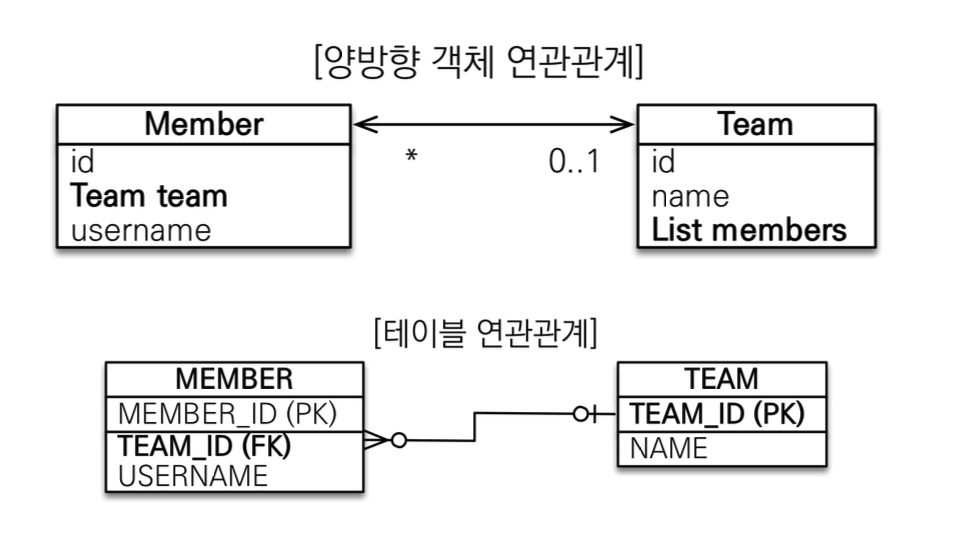
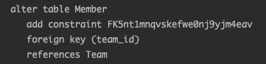
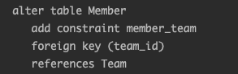
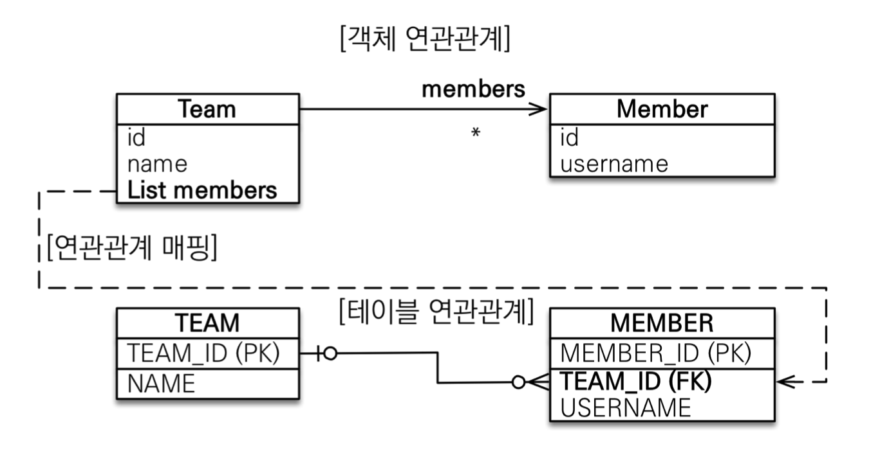
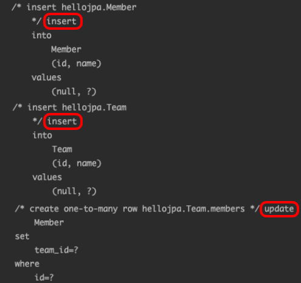
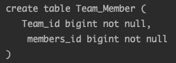
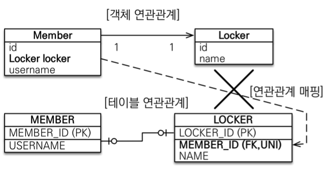
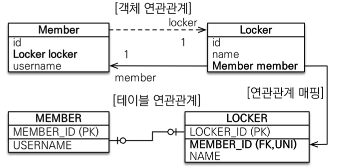

> 해당 포스트는 인프런 김영한님의 [자바 ORM 표준 JPA 프로그래밍 - 기본편](https://www.inflearn.com/course/ORM-JPA-Basic/dashboard) 강의를 기반으로 작성하였습니다.
>

# 1. 이전까지의 데이터 중심의 연관관계

JPA를 사용하기 이전 JDBC를 이용한 개발을 할 때는 아래의 코드와 같이 Member가 참여한 Team의 정보를 알기 위해 teamId를 갖는 것과 같은 데이터 중심 설계로 진행하였을 것이다.

```java
public class Member {

    private Long id;
    private String name;  
    private Long teamId;
}
```

이러한 데이터 중심 설계는 객체의 테이블 설계에 맞춘 방식이라 테이블의 외래키를 객체에 그대로 가져오고 객체를 필드로 갖는 것이 아닌 외래키 값을 필드로 갖기에 객체간의 그래프 탐색이 불가능하다.

JPA는 객체지향 프로그래밍을 통해 개발을 하기 위해 만든 ORM의 표준인 만큼 위와 같이 데이터 중심 설계가 아닌 객체지향적인 설계를 할 수 있다. JPA에서는 아래와 같이 외래키 값이 아닌 Team 객체를 갖게 되며 `member.getTeam()`을 통해 간단히 객체간의 탐색이 가능하게 구현할 수 있다.

```java
@Entity
@Getter
@NoArgsConstructor
public class Member {

    @Id
    @GeneratedValue(strategy = GenerationType.IDENTITY)
    private Long id;
    private String name;  

    @ManyToOne
    @JoinColumn(name = "team_id")
    private Team team;
}
```

보기에는 간단해보이지만 JPA의 엔티티간 연관관계 매핑은 확실한 개념들과 주의할 점을 알아둬야 올바른 설계를 할 수 있다.

# 2. 객체와 테이블의 패러다임 불일치

데이터베이스에서의 테이블 사이의 연관관계와 DB에서의 연관관계는 다른 점이 존재한다. 테이블간의 연관관계의 경우 foreign key사용해 연관된 테이블을 찾으나 객체의 경우 참조를 통해 연관된 객체를 찾아야 한다.



더욱 자세히 설명해보자면 데이터베이스 테이블의 경우 Member에서 연관된 Team을 조회하거나 반대로 Team에서 자신과 연관된 Member를 조회하기 위해서는 `foreign key`를 이용해서 모두 조회할 수 있다. 하지만 반대로 객체는 Member 객체에서 Team객체를 알기 위해서는 Member객체에 Team을 참조하는 `Team 필드`가 존재하여야 하고 반대로 Team에서 자신과 연관된 Member를 모두 조회하기 위해서는 `List<Member>필드`가 존재하여야만 서로 조회가 가능하다. 즉, 테이블은 방향이라는 개념이 없이 foreign key 하나만으로 양방향 조회가 가능하지만 객체의 경우 각각의 참조용 필드를 만들며 단방향 연관관계 2개를 만들어야 한다.

둘 사이에는 이러한 패러다임의 불일치가 존재하여 우리는 객체간의 연관관계를 설정할 때 단방향인지, 양방향인지에 대한 **연관관계의 방향**과, 1:1, 1:N, N:1, N:M인지에 대한 **다중성**, **연관관계의 주인** 등의 많은 내용을 고려하며 객체간의 관계를 설계하여야 한다.

# 3. 연관관계 매핑 어노테이션

연관관계 매핑관련 어노테이션으로는 아래와 같은 어노테이션들이 존재한다.

- `@JoinColumn` : 외래키를 매핑할 때 사용한다.
- `@OneToOne` : 1 대1 연관관계를 매핑할 때 사용
- `@OneToMany` : 1 대 N 연관관계를 매핑할 때 사용
- `@ManyToOne` : N 대 1 연관관계를 매핑할 때 사용
- `@ManyToMany` : N 대 M 연관관계를 매핑할 때 사용

## 3.1. @JoinColumn

JoinColumn 어노테이션은 외래키를 매핑할 때 사용하는 어노테이션이다. 속성값으로는 `@Column` 어노테이션과 비슷하게 `name`, `nullable`, `insertable`, `updatable` 등의 속성들이 존재하며 추가적으로 `foreignKey` , `columnDefinition`이 존재한다. Column의 어노테이션과 중복되지 않고 JoinColumn만이 갖고 있는 `foreignKey` , `columnDefinition` 과 `name` 속성에 대해 자세히 살펴보겠다.

### 3.1.1. name

- 테이블이 외래키를 저장하느 column 명을 정하는 속성이다.

  > `@JoinColumn` 어노테이션을 사용하지 않거나 name속성을 정의하지 않을 경우 기본적으로 Column 명은 `필드명_id` 로 정의된다.


### 3.1.2. columnDefinition

외래키가 참조하는 타켓 테이블의 컬럼 이름을 설정하는 속성이다. 기본값은 타겟 테이블의 `기본키의 컬럼 이름`이다.

### 3.3.3. foreignKey

외래키 제약조건을 설정하는 속성이다.

해당 속성을 정의하지 않으면 외래키 제약조건은 아래와 같이 JPA에서 랜덤한 값으로 설정된다.



이러한 랜덤값은 추후 테이블의 제약조건을 살펴볼때 알아보기 힘들게 되는데 해당 옵션을 설정하면 개발자가 원하는 이름으로 제약조건을 설정할 수 있다. 아래와 같이 @ForeignKey 어노테이션을 통해 외래키 제약조건을 설정하면 된다.

```java
@Entity
public class Member {
    
    @Id
    @GeneratedValue(strategy = GenerationType.IDENTITY)
    private Long id;
    private String name;

    @ManyToOne
    @JoinColumn(foreignKey = @ForeignKey(name = "member_team"))
    private Team team;
}
```



## 3.2. 다중성 어노테이션

`@OneToOne`, `@OneToMany`, `@ManyToOne`, `@ManyToMany` 은 엔티티간의 1:1, 1:N, N:1, N:M 관계를 나타내기 위해 사용하는 어노테이션이다. 각각의 객체간의 관계에 맞게 어노테이션을 사용하면 되며 속성은 아래와 같다.

(연관관계 매핑에 대한 자세한 내용은 아래의 내용에서 다루겠다.)

### 3.2.1. optional

참조된 엔티티의 필수 존재 여부를 설정하는 옵션이다. 기본값은 true이며 `@JoinColumn`에서 `nullable=true`를 한 것과 동일하다. 기본값인 true를 할 때는 일반적으로 Join시에 outer join을 하게 되며 false인 경우에는 일반적으로 Inner join을 한다.

### 3.2.2. fetch

참조된 엔티티의 데이터를 가져오는 전략이다. fetch 전략으로는 `FetchType.EAGER`과 `FetchType.LAZY`가 존재한다. EAGER는 참조된 엔티티를 즉시 조회하는 전략으로 기본적으로 Join을 통해 조회한다. LAZY는 프록시를 사용하여 초기에는 참조값에 프록시 객체를 주입시키고 실제로 참조 엔티티를 사용할 때 조회를 하는 전략이다.

> `@~ToMany`의 경우 default값이 `LAZY`, `@~ToOne`의 경우 default값이 `EAGER`이다.
>

### 3.2.3. cascade

해당 엔티티와 연관된 엔티티의 상태를 제어하도록 설정하는 속성이다. 부모가 삭제되면 자식들을 모두 삭제와 같이 부모 엔티티를 기준으로 적용이 된다.

`CascadeType.ALL` : 아래의 모든 옵션을 적용한다.

`CascadeType.PERSIST` : 해당 엔티티의 `persist()` 발생 시 연관된 엔티티 모두 저장(영속화, `persist()`)한다.

`CascadeType.MERGE` : 해당 엔티티의 `merge()` 발생 시 연관된 엔티티 모두 수정하거나 저장(`merge()`)한다.

`CascadeType.REMOVE` : 해당 엔티티의 `remove()` 발생 시 연관된 엔티티 모두 삭제(`remove()`)한다.

`CascadeType.REFRESH` : 해당 엔티티의 `refresh()` 발생 시 연관된 엔티티 모두 DB로부터 다시 불러(`refresh()`)온다.

`CascadeType.DETACH` : 해당 엔티티의 `detach()` 발생 시 연관된 엔티티 모두 준 영속 상태(영속성 컨텍스트에서 삭제, `detach()`)로 바꾼다.

### 3.2.4. orphanRemoval

부모 엔티티와 연관 관계가 사라진 엔티티가 될 경우 자동으로 삭제시켜주는 속성이다. 기본값은 `false`이다.

> **부모 엔티티를 기준으로 내가 사라졌을 때, 자식을 없애겠다!!** 라는 설정이라 `@ManyTo~` 의 어노테이션에는 없는 속성이다.
>

```java
@Entity
public class Team {
    ...
    @OneToMany(mappedBy = "team", cascade = CascadeType.REMOVE, orphanRemoval = true)
    List<Member> members = new ArrayList<>();
}

@Entity
public class Member {
    ...
    @ManyToOne
    @JoinColumn(foreignKey = @ForeignKey(name = "member_team"))
    private Team team;
}
```

### 3.2.5. targetEntity

연결된 엔티티의 타입을 지정할 수 있다. 기본값으로는 해당 필드의 타입을 읽어서 사용되기에 주로 사용될 일이 없다.

```java
@Entity
public class Member {
    ...
    @ManyToOne(targetEntity = Team.class)
    private Team team;
}
```

### 3.2.6. ⭐️ mappedBy ⭐️

> `@ManyTo~` 의 어노테이션에는 없는 속성이다.
>

외래키를 관리하지 않는 엔티티에서 양방향 연관관계를 설정하는데 사용하는 속성이다. 속성의 값으로는 외래키를 관리하는 연관관계 주인 엔티티의 **외래키 필드 이름으로 설정**하면 된다.

```java
@Entity
public class Team {
    ...
    @OneToMany(mappedBy = "team")
    List<Member> members = new ArrayList<>();
}

@Entity
public class Member {
    ...
    @ManyToOne
    private Team team;
}
```

# 4. 연관관계 주인

앞서 말했듯이 데이터베이스의 테이블과 다르게 객체의 경우, 양방향 관계를 가지게 된다면 서로를 참조하는 2개의 단방향 연관관계를 만들어야 한다.  이러한 양방향 관계에서는 각각의 데이터 사이의 연관관계가 업데이트 되었을 때, 이를 관리하는 객체를 정해야한다. 즉, 외래키를 관리해주는 객체를 정해야하고 우리는 해당 객체를 연관관계의 주인이라고 부른다.

> 편의를 위해 아래의 내용에서는 연관관계의 주인이 아닌 객체를 **노예**라고 부르겠다.
>

## 4.1. 연관관계 주인 특징

연관관계 주인의 특징은 다음과 같다.

- 연관관계 주인은 외래키의 등록, 수정과 같은 관리를 담당한다.
- 주인이 아닌 객체는 데이터의 읽기만 가능하다.
- 주인은 mappedBy속성 설정을 하지 않고 노예 객체는 mappedBy 속성으로 주인을 지정해야 한다.

## 4.2. 연관관계 주인은 어떤 객체가!?

연관관계의 주인은 외래키를 관리해주는 객체라고 하였다. 그렇다면 테이블상에서 외래키를 관리해주는 객체는 어떤 객체가 될까?? 이해를 위해 먼저 아래의 사진을 살펴보겠다.


위의 관계를 보면 알 수 있듯이 Team과 Member중에 Member가 외래키를 갖는 것을 알 수 있다. 즉, DB의 입장에서 보면 외래키는 1:N과 같은 관계에서는 N이 외래키를 갖게 되며 우리는 1:N관계에서 N인 객체를 연관관계 주인으로 선택하면 된다.

## 4.3. 주의할 점!

### 4.3.1. 양방향 매핑시 연관관계 주인이 아닌 노예 객체에 값을 할당해서는 안된다.

```java
Team team = new Team();
team.setName("모모");
em.persist(team);

Member member = new Member();
member.setName("Rex");

team.getMember().add(member); // 연관관계 주인이 아닌 Team에서 필드에 Member를 추가

em.persist(member);
```

연관관계의 노예 객체는 JPA에서 탐색을 하지 않는다. 이러한 이유때문에 연관관계의 노예 객체는 읽기만 가능하고 쓰기는 불가능하다. 만약 노예 객체에 값을 할당시 주인 객체의 Team 참조값은 null이 들어갈 것이다.

그렇다고 주인 객체인 Member에서만 Team필드에 할당해줘서도 안 된다. 객체의 연관관계를 단방향으로만 설정해줄 경우 하나의 트렌잭션 내에서 flush, clear가 없는 상태로 여러 로직이 진행될 때 1차 캐시에 저장된 DB와 연결이 안 된 순수한 값들을 사용하게 되어서 노예로부터 주인의 데이터를 조회할 때 빈 List가 리턴되는 문제가 발생할 수 있다. 그리고 객체지향적으로 생각해도 양쪽에 값을 설정해주는게 맞다.

양쪽에 값을 할당해주기 위해서는 **연관관계 편의 메서드**를 생성하는 것이 좋다. 연관관계 편의 메서드는 아래와 같이 하나의 메서드에서 양쪽의 관계를 매핑해주는 메서드를 의미한다. 해당 메서드의 위치는 연관관계 주인﹒노예 중 어떤 객체에 위치하여도 상관없다.

```java
@Entity
public class Member {
    ...
    public void participate(Team team) {
        this.team = team;
        team.getMembers().add(this);
    }
}
```

### 4.3.2. 양방향 매핑시 무한 루프를 조심하여야 한다.

JPA 뿐만 아니라 기본적인 프로그래밍을 생각하여도 양방향 매핑으로 생기는 순환참조는 조심하여야 한다. 개발자는 양방향 매핑시 항상 순환참조가 없는지를 체크하며 개발을 진행하여야 한다.

대표적으로 순환참조를 조심해야할 내용은 `lombok`의 `toString()`, `JSON 생성 라이브러리`가 있다. lombok을 통해 toString을 만들 경우 내부적으로 객체간의 순환참조가 발생할 수 있다. JSON 생성 라이브러리의 경우 Controller에서 Entity를 반환할 때 발생하게 된다. 다들 알다싶이 Controller에서 Entity를 직접 반환하는 일은 피하는 것이 좋다.

# 5. 연관관계 다중성 매핑

## 5.1. 다대일  (N:1)

다대일 단방향 관계의 경우 가장 많이 사용되는 연관관계로 외래키를 N쪽에 두면 된다. 양방향 연관관계 역시 N쪽에 위치시키면 되며 양쪽을 서로 참조하도록 개발하면 된다.

```java
@Entity
public class Team { // 1
    ...
    @OneToMany(mappedBy = "team")
    List<Member> members = new ArrayList<>();
}

@Entity
public class Member { // N
    ...
    @ManyToOne
    @JoinColumn(name = "team_id")
    private Team team;
}
```

## 5.2. 일대다 (1:N)

1:N 연관관계는 실무에서 사용하는 것을 권장하지 않는 매핑 방법이다.



위의 이미지에서 객체의 연관관계에서는 Team에서는 해당 팀에 속한 멤버들을 알고 있지만 Member들은 자신이 속한 팀을 알지 못한다. 하지만 테이블에서의 연관관계는 해당 연관관계를 구현함에도 불구하고 외래키는 Team이 아닌 Member에서 갖게 되어서 객체의 설계와 DB설계를 비교하였을 때 **외래키 관리의 불일치**가 발생하게 된다. 그리고 해당 구조로 테스트를 해보면 Member객체를 `persist()`후에 Team객체에 Member객체를 넣어주고 `persist()`하게 된다면 Member 테이블에 Team_id의 값을 넣어주기 위해 Update 쿼리가 하나 더 날라가게 된다.

```java
@Entity
public class Team {
    ...
    @OneToMany
    @JoinColumn(name = "team_id")
    List<Member> members = new ArrayList<>();
}

@Entity
public class Member {
    ...
}
```

```java
Member member = new Member();
member.setName("Rex");
em.persist(member);

Team team = new Team();
team.setName("모모");
team.getMembers().add(member);
em.persist(team);
```

실제로 위의 코드를 실행하였을 때, 아래와 같이 2개의 insert 쿼리 이후 한개의 Update 쿼리가 날라가게 된다.



사실 더 많은 쿼리문이 날라가서 비효율적이긴하나 성능적으로는 큰 차이는 없다. 하지만 객체지향적인 프로그래밍을 하였을 때 사용자가 Member객체에 대한 수정을 안하고 Team객체에 대한 수정만 하였을 뿐인데 Member테이블에 변화를 주는 예상하지 못한 쿼리문은 개발자에게 혼란을 줄 수 있다. 이러한 이유 때문에 영한님은 OneToMany 단방향 매칭은 추천하지 않는다고 한다. 이러한 경우에는 유지보수를 위해 객체의 데이터 손해를 보더라도 양방향 매핑을 하던가 ManyToOne으로 단방향으로 되도록 개발하는 것이 좋다고 한다.

> 📌  `@OneToMany` 단방향 매핑의 경우 `@JoinColumn`을 꼭 사용해야한다. 그렇지 않으면 `@JoinTable`방식을 사용하요 아래와 같이 예상하지 못한 중간 테이블이 생기게 된다.
>
>
> 
>

## 5.3. 일대일 (1:1)

1:1 매핑은 전반적으로 다대일 관계와 유사하며 양방향 매핑을 할 때는 외래키를 관리하는 객체가 연관관계의 주인이 되고 반대편은 노예 객체가 되어 `mappedBy` 속성을 적용해줘야 한다.

```java
@Entity
public class Member {
    ...
    @OneToOne
    @JoinColumn(name = "card_id")
    private Card card;
}

@Entity
public class Card {
    ...
    @OneToOne(mappedBy = "card")
    private Member member;
}

```

독특한 점이라면 1:1 매핑답게 외래키를 주 테이블과 대상 테이블 어떠한 곳에 둬도 상관이 없다. 하지만 알아둬야 할 것이 있다. 데이터베이스에서 외래키의 위치는 어떠한 위치에 있어도 문제될 것이 없지만 객체의 입장에서는 외래키가 없는 테이블 객체에서의 단방향 매핑은 JPA에서 지원하지 않는다는 점이다.



구현을 한다면 해당 관계를 양방향 관계로 만들거나 외래키가 있는 테이블 객체에서의 단방향 매핑을 하도록 해야한다.

### 5.3.1 외래키 위치별 장단점

- **주 테이블에 위치한 외래키 (위 사진에서의 Member)**

  주로 접근하는 객체가 대상 객체의 참조를 가지는 것처럼 주 테이블에 외래키를 두고 대상 테이블을 찾는 방법은 객체지향 개발자들이 선호하는 방식이다. 해당 방법은 JPA의 매핑이 편리하고 주 테이블만 조회하여도 대상 테이블에 데이터가 있는지 확인이 가능하다는 장점이 있다. 단점으로는 값이 없다면 외래키에 null값이 허용된다는 점이다.

- **대상 테이블에 위치한 외래키 (위 사진에서의 Locker)**

  대상 테이블에 외래키를 위치시키는 방법은 전통적인 데이터베이스 개발자가 선호하는 방법이다. 해당 방법은 주 테이블과 대상 테이블을 1:1에서 1:N으로 변경할 때 테이블 구조를 유지할 수 있다는 확장성 측면에서 이점이 있으나 **JPA상에서는 프록시 기능의 한계로 지연로딩으로 설정을 하여도 항상 즉시로딩이 되는 문제점이 있다.**

  > 아래의 이미지의 관계를 보면 외래키를 Locker가 관리하고 있기에 Member를 조회할 경우 Locker의 존재 유무를 알기 위해 Locker 테이블을 조회하며 Locker가 있는지 찾아야 한다. 그리고 그 결과에 따라 Locker 필드에 Proxy객체를 넣을지 Null값을 넣을지 정하게 되는데 해당 과정에서 이미 Member와 Locker에 대한 쿼리를 날리게 되어서 프록시의 의미가 없어지게 된다. 그래서 지연로딩을 설정해도 즉시 로딩이 된다.
  >
  >
  > 


## 5.4. 다대다 (N:M)

다대다 방법을 위한 `@ManyToMany`는 사용을 지양해야하는 매핑 어노테이션이다. 이유는 관계형 데이터베이스와 객체의 컬렉션간의 불일치로부터 발생하게 된다. 데이터베이스의 경우 2개의 테이블로 다대다 관계를 표현할 수 없기에 다대다 관계는 연결 테이블을 통해 일대다와 다대일 관계로 풀어가야 한다. 하지만 객체의 경우 2개의 컬렉션으로 다대다 관계의 표현이 가능하다.

JPA에서는 이러한 불일치를 자동으로 연결 테이블을 만들어주며 해결하였으나 실제 실무에서 사용하는 중간 테이블은 단순 연결로 끝나는 것이 아닌 추가적인 데이터를 넣게 되는 경우가 많아 `@ManyToMany`의 사용은 지양하고 중간 연결 테이블용 엔티티를 추가하여 `@OneToMany`, `@ManyToOne`으로 풀어서 표현하는 것이 좋다.

> `@ManyToMany`를 사용한다면 중간 연결 테이블에 대한 설정을 `@JoinTable` 어노테이션을 통해 할 수 있다.
>

```java
@Entity
public class Member {
    ...
    @ManyToMany
    @JoinTable(name = "member_team")
    private List<Team> teams = new ArrayList<>();
}

@Entity
public class Team {
    ...
    @ManyToMany(mappedBy = "teams")
    List<Member> members = new ArrayList<>();
}
```

# 6. 구현 팁 📌

객체지향적으로 구현을 생각하였을 때 양방향 연관관계는 신경써야할 것이 많다. 그래서 가능하면 객체간의 관계는 단방향으로 만드는 것이 좋다. 처음에 DB 설계를 할 때는 일단 단방향 매핑으로 설계를 완료하는 것이 좋다. 그 후에 개발을 진행하며 조회 기능들을 추가할 때 반대 방향을 추가하며 필요한 경우에만 양방향을 만드는 것이 좋다.

# 📚 Reference
- [자바 ORM 표준 JPA 프로그래밍 - 기본편 - 인프런 | 강의](https://www.inflearn.com/course/ORM-JPA-Basic/dashboard)
- [JPA Relationship](https://yearnlune.github.io/java/jpa-relationship/#)
