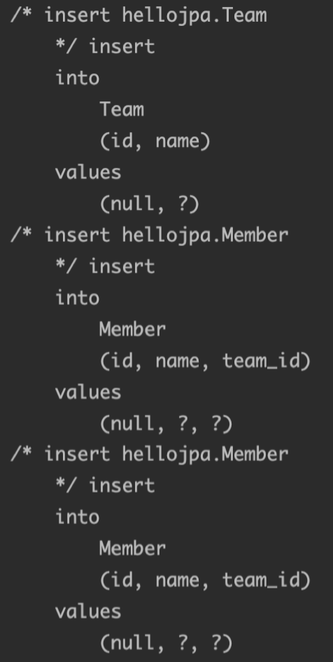
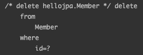

> 해당 포스트는 인프런 김영한님의 [자바 ORM 표준 JPA 프로그래밍 - 기본편](https://www.inflearn.com/course/ORM-JPA-Basic/dashboard) 강의를 기반으로 작성하였습니다.

# 1. 영속성 전이 (CASCADE)

## 1.1. 영속성 전이란?

영속성 전이를 알기 앞서 아래의 코드를 먼저 살펴보겠다. 1:N 관계인 Team과 Member 객체가 존재한다. 해당 객체를 이용하여 1개의 팀과 해당 팀에 참가하는 2명의 멤버를 만들어보겠다.

```java
@Entity
public class Team {

    @Id
    @GeneratedValue(strategy = GenerationType.IDENTITY)
    private Long id;
    private String name;

    @OneToMany(mappedBy = "team")
    private List<Member> members = new ArrayList<>();

    public void participate(Member member) {
        members.add(member);
        member.setTeam(this);
    }
}

@Entity
public class Member {

    @Id
    @GeneratedValue(strategy = GenerationType.IDENTITY)
    private Long id;

    private String name;

    @ManyToOne(fetch = FetchType.LAZY)
    @JoinColumn(name = "team_id")
    private Team team;
}
```

```java
Member member1 = new Member();
member1.setName("Rex");

Member member2 = new Member();
member2.setName("성원");

Team team = new Team();
team.setName("모모");
team.participate(member1);
team.participate(member2);

em.persist(team);
em.persist(member1);
em.persist(member2);
```

위의 코드를 보면 알 수 있듯이 1개의 팀과 2명의 회원을 영속화시키기 위해서는 `persist()` 메서드를 3번 호출하였다. 과연 persist()메서드를 3번이나 호출하는 것이 최선일까? member는 team에 속해있는데 한번에 영속화를 할 수는 없을까? 이를 해결해주는 것이 바로 영속성 전이(CASCADE)이다.

영속성 전이란 특정 엔티티를 영속 상태로 만들 때 연관된 엔티티도 함꼐 영속 상태로 변경하고 싶은 경우에 사용한다. 즉, 위의 예시 코드로 생각을 해보면 Team을 `persist()`할 때, Team과 연관이 있는 members도 모두 영속화를 해준다는 뜻이다.

그렇다면 테스트를 위해 매핑 어노테이션의 속성인 cascade 옵션을 설정해보겠다.

```java
@Entity
public class Team {

    @Id
    @GeneratedValue(strategy = GenerationType.IDENTITY)
    private Long id;
    private String name;

    @OneToMany(mappedBy = "team", cascade = CascadeType.ALL)
    private List<Member> members = new ArrayList<>();

    public void participate(Member member) {
        members.add(member);
        member.setTeam(this);
    }
}
```

Member와 Team사이의 관계에서 부모의 역할을 하는 Team엔티티의 연관관계 어노테이션에 `CascaseType.ALL`을 줬다. 과연 앞서 말한 이론대로 team만을 영속화하였을 때 member들도 모두 영속화되는지 살펴보겠다.

```java
Member member1 = new Member();
member1.setName("Rex");

Member member2 = new Member();
member2.setName("성원");

Team team = new Team();
team.setName("모모");
team.participate(member1);
team.participate(member2);

em.persist(team);
```

결과는 아래와 같이 Team만을 영속화하였음에도 불구하고 Team과 연관이 있는 Member들도 모두 영속화가 되어 DB에 저장된 것을 확인할 수 있다.



## 1.2. CASCADE 종류

- `CascadeType.ALL` : 아래의 모든 옵션을 적용한다.
- `CascadeType.PERSIST` : 해당 엔티티의 `persist()` 발생 시 연관된 엔티티 모두 저장(영속화, `persist()`)한다.
- `CascadeType.REMOVE` : 해당 엔티티의 `remove()` 발생 시 연관된 엔티티 모두 삭제(`remove()`)한다.
- `CascadeType.MERGE` : 해당 엔티티의 `merge()` 발생 시 연관된 엔티티 모두 수정하거나 저장(`merge()`)한다.
- `CascadeType.REFRESH` : 해당 엔티티의 `refresh()` 발생 시 연관된 엔티티 모두 DB로부터 다시 불러(`refresh()`)온다.
- `CascadeType.DETACH` : 해당 엔티티의 `detach()` 발생 시 연관된 엔티티 모두 준 영속 상태(영속성 컨텍스트에서 삭제, `detach()`)로 바꾼다.

> CASCADE 속성의 종류는 위와 같이 6개의 옵션이 제공되지만 `ALL`, `PERSIST`, `REMOVE`가 주로 이용된다.
>

## 1.3. 주의할 점 & Tip

- 영속성 전이는 하나의 부모가 여러 자식을 관리할 때 의미가 있다.
- 영속성 전이는 연관관계 매핑 어노테이션에 위치한 속성이라 연관관계를 매핑하는 것과 관련있다고 생각할 수 있다. 하지만 영속성 전이는 연관관계를 매핑하는 것과는 아무런 관련이 없다. 영속성 전이는 엔티티를 영속화할 때 연관된 엔티티도 함께 영속화하는 등의 편리함을 제공할뿐이다.
- 영속성 전이는 객체를 여러 공간에서 사용하는 경우에는 사용하면 안된다. 여러 공간에서 사용하는 객체에 영속성 전이를 사용할 경우, 해당 데이터가 완전히 삭제되어 다른 위치에서도 더이상 해당 데이터를 사용하지 못하는 문제가 발생할 수 있다. 그래서 영속성 전이를 사용하려면 자식 객체가 부모랑만 연관있을 때 사용해야한다.
- 사용할 조건을 정리해보면 다음과 같다.
    1. Parent와 Child의 life cycle이 동일하거나 비슷해야 한다.
    2. 자식 객체가 부모 외에 연관이 없는 단일 소유자일때 사용해야 한다.

# 2. 고아객체

## 2.1. 고아객체와 orphanRemoval

고아객체는 부모와의 연관관계가 끊어진 엔티티를 의미한다. 연관관계 매핑 어노테이션중 `@OneToMany`와 `@OneToOne`은  `orphanRemoval`이라는 속성을 통해 고아객체를 자동으로 삭제시켜줄 수 있다. 해당 옵션을 true로 설정하여 고아객체를 자동으로 삭제하는 예시 코드를 한번 보겠다.

```java
@Entity
public class Team {
    ...
    @OneToMany(mappedBy = "team", cascade = CascadeType.ALL, orphanRemoval = true)
    private List<Member> members = new ArrayList<>();
}

@Entity
public class Member {
    ...
    @ManyToOne(fetch = FetchType.LAZY)
    @JoinColumn(name = "team_id")
    private Team team;
}
```

앞서 영속성 전이에서 보았던 코드에서 `@OneToMany`에 `orphanRemoval = true` 옵션을 활성화 시킨 후에 아래의 코드를 실행해보겠다.

```java
Member member = new Member();
member.setName("Rex");

Team team = new Team();
team.setName("모모");
team.participate(member);

em.persist(team);
em.persist(member);

em.flush();
em.clear();

Team findTeam = em.find(Team.class, team.getId());
findTeam.getMembers().remove(0);
```

실행 코드상으로는 team 객체에서 member의 리스트를 가져온 후 0번 index의 값을 컬렉션에서 제거하며 연관관계만을 끊어주었다. 연결이 끊긴 Member객체는 고아객체가 되었음으로 아래와 같이 Member객체가 실제로 삭제되었다.



> 📌  예시와 같이 `orphanRemoval = true` 을 활성화시키고 컬렉션 상에서 연결을 끊어주었을 때 고아객체가 삭제되게 하려면 `cascade = CascadeType.PERSIST`를 활성화시켜줘야 한다. 영속성 전이를 활성화시키지 않고 `orphanRemoval = true` 만을 설정한다면 Team객체를 삭제할 때만 고아객체가 제거되고 위의 예시와 같이 컬렉션에서 제거하였을 때는 고아객체가 제거되지 않는다.
>

## 2.2. orphanRemoval 옵션은 언제 사용해야 할까?

`orphanRemoval = true` 도 영속성 전이와 동일하게 라이프 사이클이 동일하고 엔티티가 사용되는 곳이 본인 하나일 때만 사용하여야 한다.

## 2.3. Cascade.REMOVE와 orphanRemoval = true 차이

`Cascade.REMOVE`와 `orphanRemoval=true`는 개념적으로만 봤을 때 차이를 구분하지 못하고 헷갈릴 수 있다. 하지만 둘은 미묘하게 다른 점이 있다.

`Cascade.REMOVE`은 부모 엔티티가 삭제되었을 때 연관된 자식 엔티티들을 모두 삭제시키는 옵션이다. 하지만 부모 엔티티를 삭제하였을 때만 연속성 전이가 발동하게 되고 부모 엔티티에서 `findTeam.getMembers().remove(0);` 와 같이 자식 엔티티를 컬렉션 필드에서 제거하였을 때는 아무런 변화가 발생하지 않는다.

반면에 `orphanRemoval = true`은 부모 엔티티가 제거되었을 때와 자식 엔티티를 부모의 컬렉션 필드에서 제거하였을 때도 고아객체가 되어 해당 엔티티는 삭제가 된다.

## 2.4. Cascade.ALL + orphanRemoval = true

`Cascade.ALL`와 `orphanRemoval = true` 옵션을 모두 활성화시키면 부모 엔티티를 통해서 자식의 생명주기를 관리할 수 있다. 즉, 자식 엔티티들은 부모 엔티티를 따라 라이프 사이클을 함께하며 영속화, 제거가 되게 된다.

이는 도메인 주도 설계(DDD)의 Aggregate Root 개념을 구현할 때 유용하다.

# 📚 Reference
- [자바 ORM 표준 JPA 프로그래밍 - 기본편 - 인프런 | 강의](https://www.inflearn.com/course/ORM-JPA-Basic/dashboard)
- [알고 쓰는 Cascade(영속성 전이)](https://hongchangsub.com/jpa-cascade-2/)
- [DDD, Aggregate Root 란?](https://eocoding.tistory.com/36)
