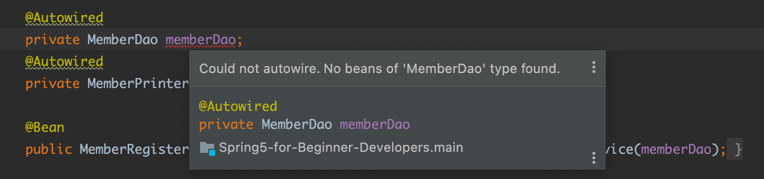

스프링에 해당 Bean들을 주입하였는데, Bean이 없어 Autowired를 할 수 없는 메시지가 나올 때가 있다.

이럴 경우 실제로 Bean 주입이 없을 수도 있으나, IntelliJ의 오류로 프로그램 실행 전에 Bean이 없다고 판단할 수도 있다.

그래서 이러한 에러가 발견될 경우, 먼저 프로그램 실행을 해보고, 그 후에 Bean이 실제로 생성되지 않았는지 확인을 해야한다.

- [참고링크](https://www.inflearn.com/questions/170577)
