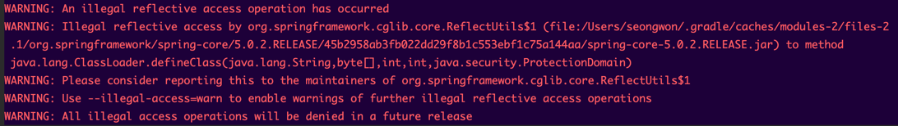
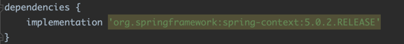
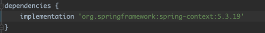

초보 웹 개발자를 위한 스프링 5 책의 내용을 학습하던 중, 아래와 같은 warning메시지가 뜨는 것을 확인했습니다.

위의 warning 메시지는 [스프링 구버전에 있는 에러](https://github.com/spring-projects/spring-framework/issues/20414) 중의 하니이다.

해당 경고문의 해결은 간단하게도 Spring Framework 5.1이상, Spring Boot 2.1이상의 버전으로 업그레이드 하면 사라진다.

5.0.2버전이었던 Spring Framework를 아래와 같이 최신버전인 5.3.19버전으로 업그레이드하니 문제가 해결되었다.

- [참고자료](https://stackoverflow.com/questions/46671472/illegal-reflective-access-by-org-springframework-cglib-core-reflectutils1)
