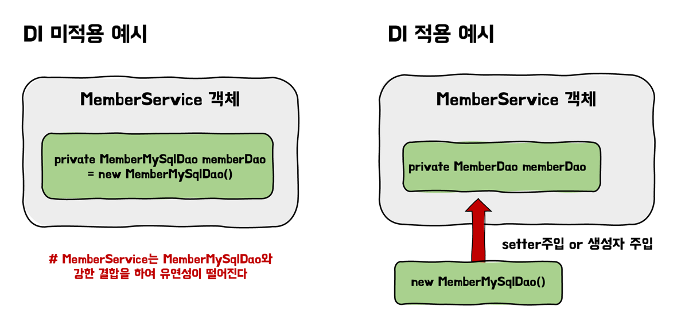

# DI (Dependency Injection)

DI는 스프링의 3대 핵심 기술 중 하나로 외부에서 두 객체 간의 관계를 결정해주는 패턴이다.
이는 객체의 관계 사이에 인터페이스를 둬서 클래스 레벨에서는 의존 관계가 고정되지 않도록 하고 런타임시에 의존 주입을 하여 결합도를 낮추고 유연성을 높여준다.

> 스프링의 3대 핵심 기술로는 IOC/DI, AOP, PSA가 있다.

## 왜 DI를 사용할까?

```java
public class MemberService {

    private final MemberMySqlDao memberSqlDao;

    public MemberService(MemberMySqlDao memberSqlDao) {
        this.memberSqlDao = memberSqlDao;
    }
    ...
}
```

다음 코드를 보면 회원 정보 관련 비즈니스 로직을 담당하는 서비스는 MySQL db를 사용하는 `MemberMySqlDao`를 사용하고 있다는 것을 알 수 있다.
이러한 클래스들에는 아래의 문제점이 있다.

### 클래스의 강한 결합 (유연성 )

`MemberService` 클래스는 `MemberMySqlDao`와 강한 결합을 하고 있다.
만약 서비스가 변경되어 MySql이 아니라 `MemberNoSqlDao`객체를 사용하게 된다면 어떻게 될까??
이럴 경우 `MemberService`의 인스턴스 변수 뿐만 아니라 생성자까지 수정해야하는 등 많은 변경이 필요하다.

### 객체가 아닌 클래스 간의 관계

`MemberService`와 `MemberMySqlDao`는 현재 객체들간의 관계가 아니라 클래스 사이의 관계를 맺고 있다.
객체들간의 관계를 맺으면 해당 객체들은 관계를 맺는 구체 클래스를 알지 못하더라도 문제가 발생하지 않는다.
하지만 `MemberService`는 어떠한가? `MemberMySqlDao` 와 객체간의 결합이 아닌 클래스간의 결합을 하고 있어 `MemberNoSqlDao` 로 변경하였을 때 문제가 발생하게 된다.

유연성이 떨어지는 이러한 문제를 해결하기 위해서는 인터페이스를 활용할 수 있다.

```java
public interface MemberDao {...}
public class MemberMySqlDao implements MemberDao{...}
public class MemberNoSqlDao implements MemberDao{...}

public class MemberService {

    private final MemberDao memberDao;

    public MemberService(MemberDao memberDao) {
        this.memberDao = memberDao;
    }

    public void setMemberDao(MemberDao memberDao) {
        this.memberDao = memberDao;
    }
    ...
}
```

MemberDao 인터페이스를 만들고 이를 구현하는 객체들을 MemberService에서 사용한다면 위의 문제점들이 해결된다.
하지만 이와 같이 구현 객체가 아닌 인터페이스를 인스턴스 변수로 갖는 경우 생성자 또는 Setter를 통해 MemberService에서 사용할 MemberDao를 넣어줘야 한다.

이와 같이 객체 내부에서가 아닌 외부에서 의존 객체를 주입시켜 주는 것을 DI라고 한다.
아래의 사진을 보면 DI를 사용하였을 때와 사용하지 않았을 때의 차이를 알 수 있다.



## 객체 조립기(Assembler)

프로그램 내에서 의존 관계들을 DI로 설정하게 된다면 실제 프로그램을 실행하는 main 코드에서는 다음과 같이 모든 의존관계 주입을 해줘야 할 것이다.

```java
public class Main {
    public static void main(String[] args) {
        MemberDao memberDao = new MemberDao();
        MemberRegisterService registerService = new MemberRegisterService(memberDao);
        ChangePasswordService changePasswordService = new ChangePasswordService(memberDao);
    }
}
```

이러한 의존관계 주입을 하나의 클래스로 만들면 어떻게 아래의 `Assembler`코드와 같이 될 것이다.

```java
public class Assembler {

    private MemberDao memberDao;
    private MemberRegisterService memberRegisterService;
    private ChangePasswordService changePasswordService;

    public Assembler() {
        memberDao = new MemberDao();
        memberRegisterService = new MemberRegisterService(memberDao);
        changePasswordService = new ChangePasswordService(memberDao);
    }

    public MemberDao getMemberDao() {
        return memberDao;
    }

    public MemberRegisterService getMemberRegisterService() {
        return memberRegisterService;
    }

    public ChangePasswordService getChangePasswordService() {
        return changePasswordService;
    }
}
```

Assembler를 사용하면 Assember객체를 하나 생성한 후, 해당 객체로부터 필요한 객체들을 꺼내쓰면 된다.

```java
public class Main {
    public static void main(String[] args) {
        private Assembler assembler = new Assembler();
        ...
        private MemberRegisterService memberRegisterService = assembler.getMemberRegisterService();
    }
}
```

## 스프링의 DI

스프링은 Assembler와 유사한 DI 기능을 제공한다.

스프링은 필요한 객체들을 스프링 컨테이너(Application Context)에 생성하고 생성한 객체에 의존을 주입하며, 생성이 된 객체들을 제공해준다.
스프링에서는 이러한 객체들을 Bean이라고 부르며, 앞서 말한바와 같이 Bean들의 생성, 소멸에 관련된 작업을 자동으로 수행해줍니다.

또한 스프링은 Bean들을 싱글톤으로 관리해주기도 한다.

# IoC (Inversion of Control, 제어의 역전)

제어의 역전이란 객체 또는 프로그램 일부에 대한 제어 권한을 컨테이너 또는 프레임워크에 넘기는 소프트웨어 공학론의 원칙중 하나이다.
말로만 들으면 잘 이해가 되지 않을 것이다.
외부 라이브러리의 사용을 예시로 들어보면, 이전까지는 우리가 라이브러리를 호출하여 사용만 하였다.
IOC를 적용한다면 우리가 라이브러리를 호출하여 사용하는 것이 아니라 외부(프레임워크)에서 우리의 코드와 라이브러리를 호출하며 프로그램의 흐름을 제어할 것이다.

스프링은 앞서 말했듯이 Bean(객체)들의 생성, 소멸에 관련된 작업을 수행해줍니다.
여기서 Bean이 생성될 때는 어떠한 객체를 주입받을지에 대한 결정들까지 스프링이 해주게 되는데 이것이 스프링의 IoC이다.

즉, DI는 스프링에서 IoC를 구현한하는데 사용하는 패턴이다.

## IOC의 장점은 아래와 같다.

- 다른 구현체로 변경하기 쉽다. (유연성 ⬆️)
- 프로그램을 모듈들로 나누기 쉽다. (객체간 결합도 ⬇️)
- 작업의 실행과 구현을 분리할 수 있다.
- 컴포넌트를 격리하거나 의존성을 mocking하는 등의 작업을 통해 테스트를 하기 쉽다.

# 정리

내용을 정리해보자면 IoC는 객체 또는 프로그램의 제어 권한을 프레임워크에 넘기는 기술이다.
스프링은 IoC를 구현하기 위해 DI를 사용고 있으며 덕분에 클래스 간의 강한 결합을 분리해준다.
스프링이 어플리케이션 실행 시점에 객체들을 생성하고 관계를 맺어주는 DI를 제공해주는 덕분에 객체들간의 결합도를 낮추고 유연성을 확보할 수 있다.

# Reference

- [Core Technologies - 1.The IoC Container](https://docs.spring.io/spring-framework/docs/current/reference/html/core.html#beans)
- [Intro to Inversion of Control and Dependency Injection with Spring](https://www.baeldung.com/inversion-control-and-dependency-injection-in-spring)
- [초보 웹 개발자를 위한 스프링5 프로그래밍 입문](https://book.naver.com/bookdb/book_detail.nhn?bid=13786861)
- [[Spring] 의존성 주입(Dependency Injection, DI)이란? 및 Spring이 의존성 주입을 지원하는 이유 (MangKyu's Diary)](https://mangkyu.tistory.com/150)
- [[Spring] DI, IoC 정리](https://velog.io/@gillog/Spring-DIDependency-Injection)
